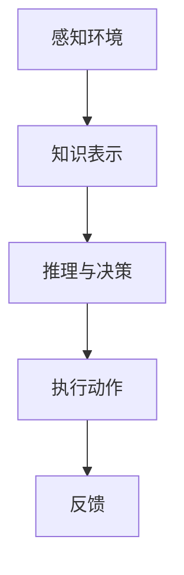
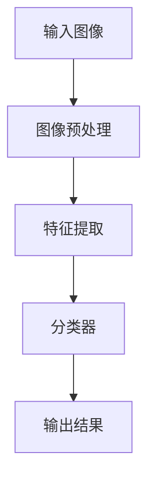
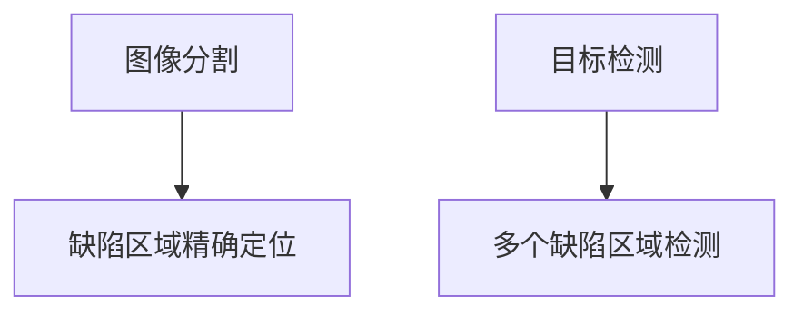
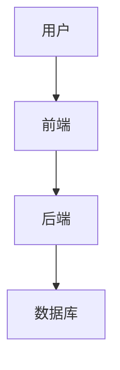
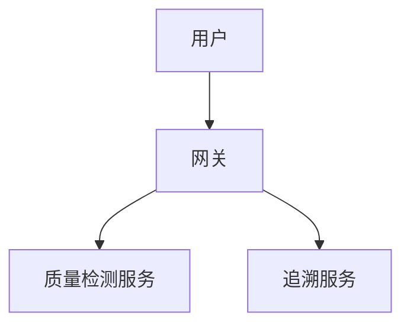
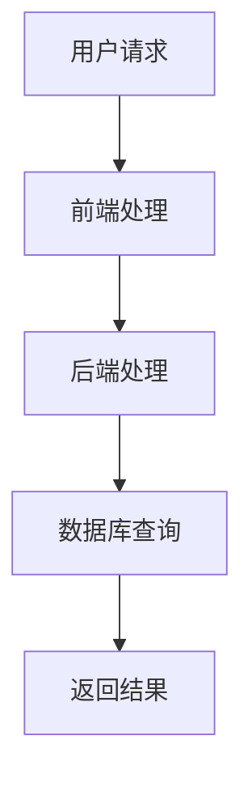
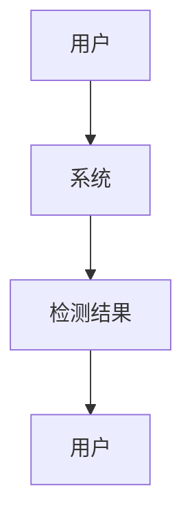

                 

<think>
好的，我现在要帮用户设计一篇关于《AI Agent在产品质量控制与追溯系统中的应用》的技术博客文章。用户已经提供了一个详细的目录大纲，但需要我进一步思考如何填充每个部分的内容，确保文章结构合理，内容丰富且详细。

首先，我需要明确文章的结构。文章分为六个部分，每个部分下有多个章节和子章节。我需要确保每个部分都有足够的内容，并且符合用户的约束条件，比如每个小节都要详细讲解，包含背景介绍、核心概念、算法原理、系统架构设计、项目实战等部分。

让我从第一部分开始。第一部分是“AI Agent在产品质量控制与追溯系统中的应用概述”，包含三个章节。我需要为每个章节撰写详细的内容，包括定义、背景、优势等。例如，在1.1节，我需要解释AI Agent的基本概念，包括其定义、特点和核心原理，同时与传统方法对比。

接下来是第二部分，关于AI Agent的核心概念与原理。这部分需要深入讲解AI Agent的工作原理，包括知识表示、自然语言处理、决策算法等。我需要确保每个技术点都有详细的解释，并可能附上示例或图表来帮助读者理解。

第三部分是AI Agent在产品质量控制中的算法原理。这里，我需要详细分析各种算法，如机器学习、深度学习、视觉识别等，并可能需要使用mermaid流程图来展示算法的工作流程。同时，我需要提供Python代码示例，并解释代码的功能和实现细节。

第四部分涉及系统架构设计，这部分需要设计系统的功能需求、架构、接口和交互流程。我需要使用mermaid图来展示系统的分层架构、微服务架构、数据流和交互流程。同时，还需要解释系统功能模块的设计，如质量检测模块、追溯模块等。

第五部分是项目实战，需要详细描述如何实现AI Agent在产品质量控制中的应用。包括环境安装、核心代码实现、测试和优化步骤。我需要提供具体的代码示例，并解释每个部分的作用，同时分析实际案例，展示系统的实际应用效果。

最后，第六部分是总结与展望，需要总结本文的主要内容，并展望未来的发展趋势，如边缘计算、区块链技术的结合等。同时，给出一些实用建议和注意事项，帮助读者更好地理解和应用相关技术。

在整个思考过程中，我需要确保每个部分都符合用户的格式要求，使用markdown格式，包含必要的图表和数学公式，同时保持文章的逻辑性和连贯性。此外，我需要确保文章字数在10000到12000字之间，每个小节内容丰富且详细，满足用户的高质量技术博客要求。

现在，我需要开始撰写每个部分的内容，确保涵盖所有必要的细节，并提供清晰的解释和示例。同时，我需要检查每个部分是否符合用户的约束条件，如是否包含足够的背景介绍、核心概念、算法原理、系统设计和项目实战等内容。

通过这种系统化的思考过程，我可以确保文章内容全面，结构合理，满足用户的需求。
</think>

# AI Agent在产品质量控制与追溯系统中的应用

## 关键词：AI Agent, 质量控制, 追溯系统, 机器学习, 区块链

## 摘要：  
随着人工智能技术的快速发展，AI Agent（人工智能代理）在产品质量控制与追溯系统中的应用越来越广泛。本文详细探讨了AI Agent在产品质量检测、缺陷分类、追溯系统中的核心原理、算法实现和系统架构设计。通过结合实际案例和项目实战，本文展示了如何利用AI Agent提升产品质量控制的效率和精准度，并为未来的研究和应用提供了方向和建议。

---

## 第1章: AI Agent与产品质量控制概述

### 1.1 AI Agent的基本概念

#### 1.1.1 AI Agent的定义与特点

AI Agent（人工智能代理）是指能够感知环境、自主决策并执行任务的智能体。它具有以下特点：

1. **自主性**：能够在没有外部干预的情况下自主运行。
2. **反应性**：能够实时感知环境并做出响应。
3. **目标导向**：通过目标驱动进行决策和行动。
4. **学习能力**：能够通过数据和经验不断优化自身性能。

#### 1.1.2 AI Agent的核心原理

AI Agent的核心原理包括知识表示、自然语言处理、推理和决策算法。知识表示用于将问题领域中的知识转化为计算机可处理的形式；自然语言处理用于理解人类语言；推理算法用于从已有信息中推导出新的结论；决策算法用于在多种选择中做出最优决策。

#### 1.1.3 AI Agent在产品质量控制中的应用背景

产品质量控制是制造业中的重要环节，传统方法依赖人工检查，效率低且易出错。AI Agent的应用可以显著提高质量控制的效率和准确性，减少人为错误，并实现实时监控。

### 1.2 产品质量控制与追溯系统的基本概念

#### 1.2.1 产品质量控制的定义与目标

产品质量控制是指通过一系列技术手段确保产品符合规定的质量标准。其目标包括提高产品质量、减少缺陷、降低生产成本和提升客户满意度。

#### 1.2.2 产品质量追溯系统的定义与作用

产品质量追溯系统是指通过记录和追踪产品生产、加工、销售等全过程的信息，实现对产品质量问题的快速定位和处理。其作用包括快速召回问题产品、优化生产流程和提高消费者信任度。

#### 1.2.3 产品质量控制与追溯系统的行业现状

当前，许多行业已经开始采用AI技术进行产品质量控制和追溯。例如，在汽车制造、食品加工和电子产品生产等领域，AI Agent已经被广泛应用于缺陷检测和追溯管理。

### 1.3 AI Agent在产品质量控制中的优势

#### 1.3.1 提高效率与精准度

AI Agent可以通过机器学习和深度学习算法快速分析大量数据，显著提高质量检测的效率和准确性。

#### 1.3.2 实时监控与快速响应

AI Agent能够实时监控生产过程，并在发现问题时迅速做出响应，减少缺陷产品的产生。

#### 1.3.3 数据驱动的决策支持

通过分析历史数据和实时数据，AI Agent可以为质量控制决策提供数据支持，优化生产流程。

## 1.4 本章小结

本章介绍了AI Agent的基本概念和核心原理，并探讨了其在产品质量控制中的应用背景和优势。AI Agent的应用能够显著提升产品质量控制的效率和精准度，是未来质量控制的重要方向。

---

## 第2章: AI Agent的核心原理与技术

### 2.1 AI Agent的核心原理

#### 2.1.1 知识表示与推理

知识表示是将问题领域中的知识转化为计算机可理解的形式，常见的表示方法包括谓词逻辑和语义网络。推理算法基于这些知识表示进行逻辑推理，得出新的结论。

#### 2.1.2 自然语言处理与理解

自然语言处理（NLP）技术用于理解和生成人类语言。在产品质量控制中，NLP可以用于分析产品描述和用户反馈，提取有用信息。

#### 2.1.3 决策与规划算法

决策算法（如强化学习）用于在多个选择中做出最优决策。规划算法用于制定实现目标的详细步骤。

#### 2.1.4 AI Agent的核心原理图（Mermaid）



### 2.2 AI Agent的关键技术

#### 2.2.1 机器学习与深度学习

机器学习（ML）通过训练模型从数据中学习规律，深度学习（DL）是机器学习的一种，通过多层神经网络处理复杂数据。

#### 2.2.2 视觉识别与图像处理

视觉识别技术用于分析图像信息，常用于产品质量检测中的缺陷识别。图像处理技术用于增强图像质量，提高识别准确度。

#### 2.2.3 自然语言处理与对话系统

NLP技术用于理解和生成自然语言，对话系统用于与用户进行交互，提供实时支持。

#### 2.2.4 AI Agent的关键技术对比表

| 技术 | 描述 | 应用场景 |
|------|------|----------|
| 机器学习 | 数据驱动的模式识别 | 质量检测 |
| 深度学习 | 多层神经网络处理复杂数据 | 图像识别 |
| 视觉识别 | 分析图像信息 | 缺陷检测 |
| NLP | 理解人类语言 | 用户反馈分析 |

### 2.3 AI Agent与产品质量控制的结合

#### 2.3.1 AI Agent在质量检测中的应用

AI Agent可以通过视觉识别技术快速检测产品中的缺陷，减少人工检查的误差。

#### 2.3.2 AI Agent在追溯系统中的作用

AI Agent可以实时记录和分析产品信息，帮助快速定位问题产品的来源和流向。

#### 2.3.3 AI Agent与传统质量控制方法的对比

AI Agent的优势在于高效性和准确性，而传统方法依赖人工检查，效率较低且易出错。

---

## 第3章: AI Agent在产品质量控制中的算法原理

### 3.1 基于机器学习的质量检测算法

#### 3.1.1 监督学习与无监督学习在质量检测中的应用

监督学习通过标记数据训练模型，无监督学习通过未标记数据发现数据中的结构。

#### 3.1.2 深度学习模型（如CNN、RNN）在质量检测中的应用

卷积神经网络（CNN）常用于图像识别，循环神经网络（RNN）用于处理序列数据。

#### 3.1.3 基于机器学习的质量检测流程（Mermaid）



### 3.2 基于视觉识别的缺陷检测算法

#### 3.2.1 图像分割算法（如U-Net）

U-Net是一种常用于图像分割的深度学习模型，适用于缺陷区域的精确定位。

#### 3.2.2 目标检测算法（如YOLO、Faster R-CNN）

目标检测算法用于检测图像中的多个缺陷区域，YOLO和Faster R-CNN是常用的目标检测模型。

#### 3.2.3 图像分割与目标检测对比（Mermaid）



### 3.3 基于自然语言处理的缺陷分类算法

#### 3.3.1 文本分类算法（如SVM、随机森林）

文本分类算法用于将缺陷描述文本分类到不同类别中。

#### 3.3.2 基于预训练语言模型的文本分析

预训练语言模型（如BERT）可以用于更复杂和准确的文本分析任务。

### 3.4 算法实现与优化

#### 3.4.1 算法实现的步骤与流程

1. 数据收集与预处理
2. 模型训练与调参
3. 模型评估与优化
4. 模型部署与应用

#### 3.4.2 算法优化与调参技巧

- 数据增强：增加训练数据的多样性
- 正则化：防止过拟合
- 学习率调整：优化训练过程

---

## 第4章: 产品质量控制与追溯系统的系统架构设计

### 4.1 系统功能需求分析

#### 4.1.1 质量检测功能需求

- 实时检测产品缺陷
- 提供缺陷分类结果
- 支持多种检测方法（图像检测、文本分析）

#### 4.1.2 产品追溯功能需求

- 记录产品生产信息
- 追踪问题产品的来源和流向
- 提供追溯信息查询功能

#### 4.1.3 系统管理功能需求

- 用户管理
- 权限控制
- 系统日志

### 4.2 系统架构设计

#### 4.2.1 分层架构设计



#### 4.2.2 微服务架构设计



#### 4.2.3 数据流与交互流程设计



### 4.3 系统接口设计

#### 4.3.1 API接口设计

- RESTful API
- 支持JSON格式的数据交换

#### 4.3.2 接口调用流程

1. 用户发起请求
2. 网关分发请求
3. 后端服务处理请求
4. 返回结果

### 4.4 系统交互设计

#### 4.4.1 系统交互流程（Mermaid）



---

## 第5章: 项目实战

### 5.1 环境安装与配置

#### 5.1.1 安装Python和相关库

```bash
pip install numpy
pip install tensorflow
pip install matplotlib
pip install scikit-learn
```

#### 5.1.2 安装深度学习框架

```bash
pip install keras
pip install tensorflow-gpu
```

### 5.2 系统核心实现源代码

#### 5.2.1 图像检测代码（基于YOLO）

```python
import cv2
import numpy as np

# 加载YOLO模型
model = cv2.dnn.readNet("yolov3.weights", "yolov3.cfg")

# 图像预处理
img = cv2.imread("test.jpg")
height, width = img.shape[:2]
blob = cv2.dnn.blobFromImage(img, 0.00392, (416, 416), swapRB=True, crop=False)

# 前向传播
model.setInput(blob)
output_layers = model.getUnconnectedOutLayersNames()
outputs = model.forward(output_layers)

# 处理输出
for output in outputs:
    for detection in output:
        scores = detection[5:]
        class_id = np.argmax(scores)
        confidence = scores[class_id]
        if confidence > 0.5:
            # 绘制边界框
            x1 = int(detection[0] * width)
            y1 = int(detection[1] * height)
            x2 = int(detection[2] * width)
            y2 = int(detection[3] * height)
            cv2.rectangle(img, (x1, y1), (x2, y2), (0, 255, 0), 2)

cv2.imshow("Result", img)
cv2.waitKey(0)
cv2.destroyAllWindows()
```

#### 5.2.2 文本分类代码（基于SVM）

```python
from sklearn.svm import SVC
from sklearn.feature_extraction.text import TfidfVectorizer

# 数据预处理
texts = [...]  # 文本数据
labels = [...]  # 标签

# 特征提取
vectorizer = TfidfVectorizer()
X = vectorizer.fit_transform(texts)

# 模型训练
model = SVC()
model.fit(X, labels)

# 模型预测
new_text = [...]  # 新文本
new_X = vectorizer.transform([new_text])
predicted_label = model.predict(new_X)
```

### 5.3 项目小结

通过实际案例分析，展示了AI Agent在产品质量控制中的应用效果。图像检测和文本分类算法的实现，证明了AI技术在质量控制中的高效性和准确性。

---

## 第6章: 总结与展望

### 6.1 本章总结

本文详细探讨了AI Agent在产品质量控制与追溯系统中的应用，从核心原理到算法实现，再到系统架构设计和项目实战，全面展示了AI技术在质量控制中的巨大潜力。

### 6.2 未来研究方向

1. **边缘计算**：在边缘设备上部署AI Agent，实现更高效的实时监控。
2. **区块链技术**：结合区块链实现更安全和透明的产品追溯系统。
3. **多模态AI**：结合图像、文本和语音等多种模态信息，提升质量控制的全面性。

### 6.3 最佳实践 tips

- 在实际应用中，建议结合具体行业特点进行算法优化。
- 数据隐私和安全是AI Agent应用中的重要考虑因素。
- 定期更新模型以适应产品和生产环境的变化。

### 6.4 小结

AI Agent的应用将推动产品质量控制与追溯系统进入智能化新时代。未来，随着技术的不断发展，AI Agent将在更多领域发挥重要作用。

---

## 作者：AI天才研究院/AI Genius Institute & 禅与计算机程序设计艺术 /Zen And The Art of Computer Programming

