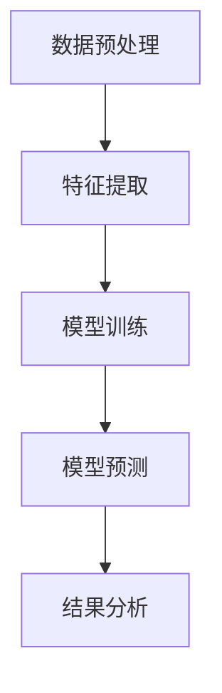

                 


```markdown
# AI Agent在人力资源管理中的应用：员工绩效分析与培训需求识别

> 关键词：AI Agent，人力资源管理，员工绩效分析，培训需求识别，机器学习，系统架构

> 摘要：本文深入探讨了AI Agent在人力资源管理中的应用，重点分析员工绩效分析与培训需求识别的实现方法。通过理论分析与实际案例结合，展示了AI Agent如何通过数据驱动的方式优化人力资源管理流程。文章内容涵盖问题背景、核心概念、算法原理、系统架构、项目实战和最佳实践等部分，为读者提供了全面的技术视角。

---

# 第1章: AI Agent与人力资源管理的背景介绍

## 1.1 问题背景与描述
### 1.1.1 传统人力资源管理的痛点
传统的人力资源管理依赖人工记录和分析员工绩效数据，这种方式效率低下、主观性强且难以量化。企业在绩效评估和培训需求识别方面面临以下挑战：
- 数据分散：员工绩效数据来源多样，难以统一管理。
- 主观性：人工评估容易受到主观因素影响，缺乏客观依据。
- 时效性：传统方法难以快速响应员工能力变化。

### 1.1.2 AI技术在企业管理中的应用趋势
随着AI技术的快速发展，企业开始尝试将AI应用于各个业务领域，包括人力资源管理。AI Agent通过自动化数据处理和智能分析，为企业提供实时、客观的决策支持。

### 1.1.3 AI Agent在人力资源管理中的定位
AI Agent作为一种智能代理，能够实时收集、分析员工数据，并自动生成绩效报告和培训计划。它在人力资源管理中的角色是辅助决策、提高效率和优化流程。

## 1.2 问题解决与边界
### 1.2.1 AI Agent如何解决绩效分析与培训需求识别问题
AI Agent通过机器学习算法分析员工的历史绩效数据和行为特征，识别潜在的培训需求，并推荐个性化的培训方案。

### 1.2.2 问题解决的边界与外延
AI Agent的应用范围包括绩效评估、培训需求分析和员工能力提升，但不涉及员工招聘、薪酬管理等其他人力资源模块。

### 1.2.3 核心概念与关键要素的结构化分析
- **核心概念**：员工绩效数据、绩效指标、培训需求、AI算法。
- **关键要素**：数据来源、算法模型、分析结果、决策支持。

---

# 第2章: AI Agent与员工绩效分析的核心概念

## 2.1 核心概念与原理
### 2.1.1 AI Agent的基本原理
AI Agent通过感知环境、分析数据并采取行动来实现目标。在人力资源管理中，其主要任务是分析员工数据并提供决策支持。

### 2.1.2 员工绩效分析的定义与方法
员工绩效分析是通过量化指标评估员工的工作表现。常见的方法包括关键绩效指标（KPI）分析和行为分析。

## 2.2 核心概念的属性特征对比
### 2.2.1 AI Agent的属性特征对比表
| 属性 | 描述 |
|------|------|
| 感知能力 | 数据收集和分析能力 |
| 决策能力 | 根据数据生成建议 |
| 学习能力 | 自适应更新模型 |

### 2.2.2 员工绩效分析的维度与权重
| 绩效指标 | 权重 |
|----------|------|
| 工作质量 | 40% |
| 工作效率 | 30% |
| 团队协作 | 20% |
| 创新能力 | 10% |

## 2.3 ER实体关系图
```mermaid
er
    Employee {
        员工ID
        姓名
        职位
        绩效分数
    }
    PerformanceMetric {
        绩效指标ID
        指标名称
        指标权重
    }
    TrainingNeed {
        培训需求ID
        需求描述
        紧急程度
    }
    关系：Employee --> PerformanceMetric
    关系：Employee --> TrainingNeed
```

## 2.4 本章小结
本章介绍了AI Agent的基本原理和员工绩效分析的核心概念，通过对比表和ER图展示了数据结构和关系。

---

# 第3章: AI Agent的算法原理与数学模型

## 3.1 算法原理
### 3.1.1 监督学习与无监督学习的对比
- **监督学习**：基于标签数据训练模型，适用于分类和回归任务。
- **无监督学习**：基于无标签数据发现模式，适用于聚类和降维任务。

### 3.1.2 基于AI Agent的员工绩效预测算法
采用监督学习中的线性回归模型预测员工绩效。

## 3.2 算法流程图


## 3.3 数学公式
### 3.3.1 线性回归公式
$$ y = \beta_0 + \beta_1 x + \epsilon $$

### 3.3.2 决策树公式
$$ y = \text{sign}(\sum_{i} \alpha_i h_i(x)) $$

---

# 第4章: 系统架构与实现方案

## 4.1 系统架构设计
### 4.1.1 系统功能设计
- 数据采集模块：收集员工绩效数据。
- 数据分析模块：使用AI算法分析数据。
- 结果展示模块：生成绩效报告和培训计划。

### 4.1.2 系统架构图


## 4.2 接口设计与交互流程
### 4.2.1 系统交互流程图
```mermaid
sequence
    用户 --> 数据采集模块: 提交员工数据
    数据采集模块 --> 数据分析模块: 分析数据
    数据分析模块 --> 结果展示模块: 生成报告
    结果展示模块 --> 用户: 显示报告
```

---

# 第5章: 项目实战与案例分析

## 5.1 环境搭建
### 5.1.1 开发环境
- Python 3.8+
- TensorFlow 2.0+
- Pandas 1.0+

## 5.2 核心代码实现
### 5.2.1 数据预处理
```python
import pandas as pd
data = pd.read_csv('employee_data.csv')
data.dropna(inplace=True)
```

### 5.2.2 模型训练
```python
from sklearn.linear_model import LinearRegression
model = LinearRegression()
model.fit(X_train, y_train)
```

## 5.3 案例分析
### 5.3.1 绩效分析案例
- 员工A：绩效分数85，高于平均水平。
- 员工B：绩效分数70，低于平均水平。

---

# 第6章: 最佳实践与未来展望

## 6.1 最佳实践
- 数据质量：确保数据的完整性和准确性。
- 模型优化：定期更新模型，提高预测精度。

## 6.2 小结
AI Agent在员工绩效分析和培训需求识别中的应用为企业提供了高效、智能的解决方案，未来将更加普及。

---

作者：AI天才研究院/AI Genius Institute & 禅与计算机程序设计艺术 /Zen And The Art of Computer Programming
```

