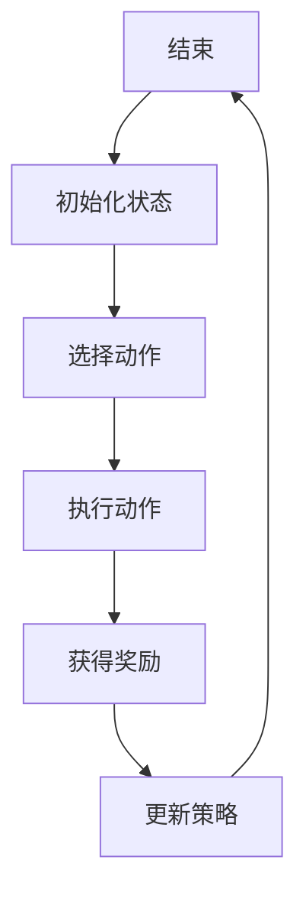
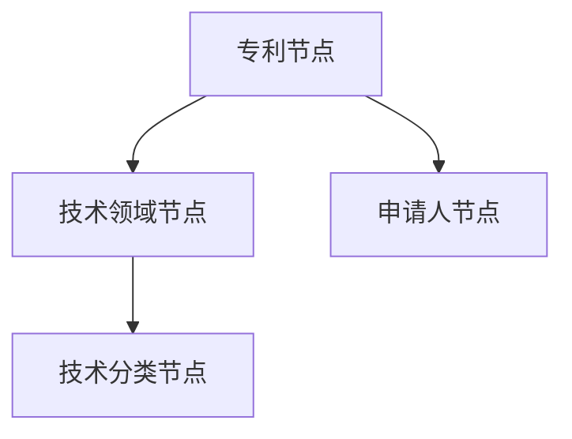
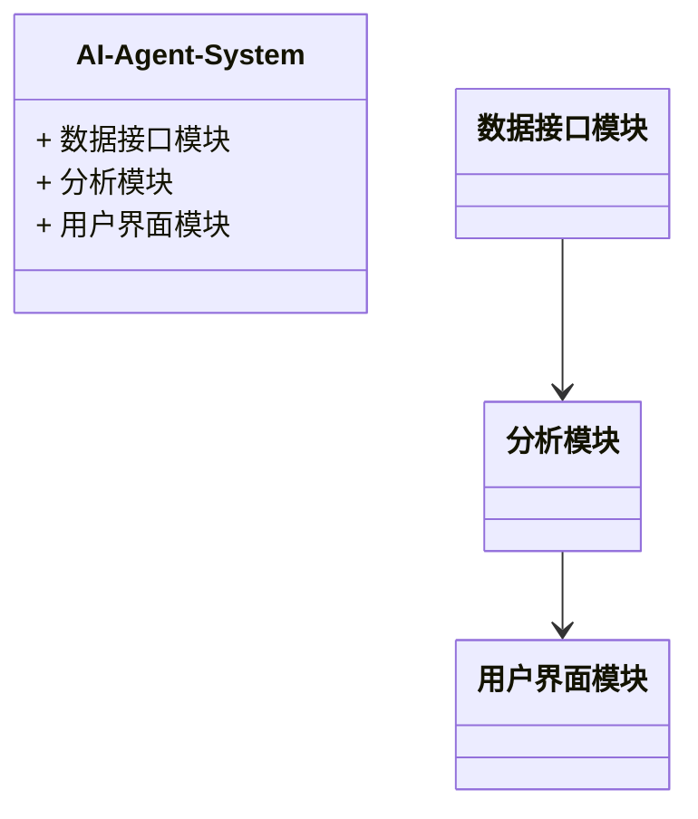
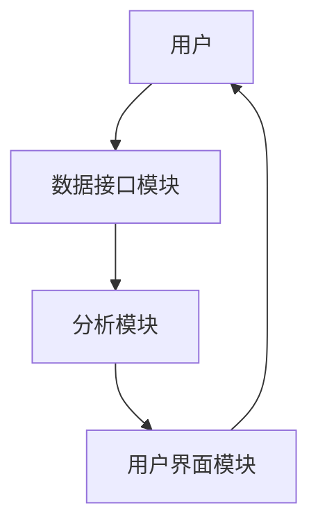
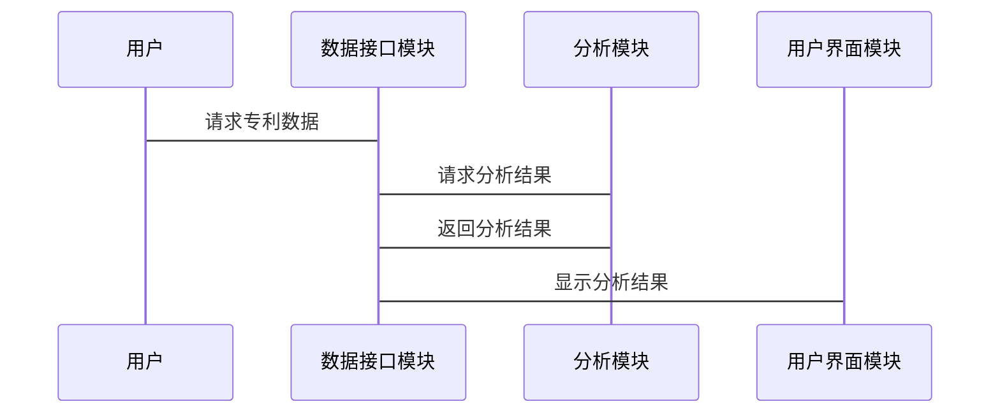

                 


# AI Agent在企业专利分析与技术趋势预测中的应用

> 关键词：AI Agent, 专利分析, 技术趋势预测, 强化学习, 图神经网络, 知识图谱

> 摘要：本文详细探讨了AI Agent在企业专利分析与技术趋势预测中的应用，从核心概念、算法原理到系统架构设计，再到实际项目案例，全面解析如何利用AI Agent技术提升专利分析的效率与准确性。

---

# 第一部分: AI Agent在企业专利分析与技术趋势预测中的应用概述

## 第1章: AI Agent与企业专利分析概述

### 1.1 AI Agent的基本概念与特点
AI Agent（人工智能代理）是指能够感知环境、自主决策并执行任务的智能实体。其核心特点包括：

- **自主性**：能够自主决策，无需人工干预。
- **反应性**：能够实时感知环境并做出响应。
- **学习能力**：通过机器学习算法不断优化自身行为。

### 1.2 专利分析的重要性
专利分析是企业在技术研发和知识产权管理中的重要环节，主要用于：

- **技术布局分析**：帮助企业了解自身技术在行业中的位置。
- **竞争对手分析**：分析竞争对手的专利布局，制定应对策略。
- **技术趋势预测**：预测未来的技术发展方向，提前布局。

### 1.3 AI Agent在专利分析中的优势
相比传统专利分析方法，AI Agent具有以下优势：

- **高效性**：能够快速处理海量专利数据。
- **准确性**：通过机器学习算法提高分析结果的准确性。
- **实时性**：能够实时跟踪技术动态。

---

## 第2章: 企业专利分析的背景与挑战

### 2.1 传统专利分析方法的局限性
- **数据量大**：专利数据量庞大，人工分析效率低。
- **信息复杂**：专利技术涉及多个领域，分析难度大。
- **预测难度**：技术趋势预测具有不确定性，传统方法难以准确预测。

### 2.2 技术趋势预测的难点与价值
- **难点**：技术发展趋势受到多种因素影响，包括市场需求、技术进步、政策法规等。
- **价值**：准确的技术趋势预测能够帮助企业制定更有效的研发战略。

---

## 第3章: AI Agent在专利分析中的优势

### 3.1 AI Agent的核心优势
- **智能化**：能够自主学习和优化分析模型。
- **高效性**：能够快速处理大量数据并生成分析结果。
- **实时性**：能够实时跟踪技术动态并提供实时反馈。

### 3.2 数据处理能力的提升
- **数据清洗**：通过AI Agent自动清洗专利数据，去除噪声数据。
- **数据挖掘**：利用机器学习算法从专利数据中提取有价值的信息。

### 3.3 智能化预测的实现
- **技术趋势预测**：通过时间序列分析和机器学习模型预测技术发展趋势。
- **竞争分析**：通过自然语言处理技术分析竞争对手的专利布局。

---

# 第二部分: AI Agent的核心概念与原理

## 第4章: AI Agent的核心概念与联系

### 4.1 AI Agent的核心原理
AI Agent通过以下方式实现专利分析与技术趋势预测：

- **强化学习**：通过强化学习算法优化决策策略。
- **图神经网络**：通过图神经网络分析专利之间的关联关系。
- **多模态数据融合**：将专利文本、技术领域等多模态数据进行融合分析。

### 4.2 专利分析的ER图架构
以下是专利分析的ER图架构：

```mermaid
er
    图表标题：专利分析的ER图架构

    patent (
        专利ID,
        申请人,
        申请日期,
        技术领域,
        专利摘要
    )
    
    technology (
        技术领域ID,
        技术名称,
        技术分类
    )
    
    competition (
        竞争对手ID,
        竞争对手名称,
        竞争对手专利数量
    )
```

---

## 第5章: AI Agent的算法原理与流程图

### 5.1 基于强化学习的AI Agent算法
以下是强化学习的训练流程：



以下是强化学习的数学模型：

$$
Q(s, a) = Q(s, a) + \alpha \times (r + \gamma \times \max Q(s', a) - Q(s, a))
$$

### 5.2 基于图神经网络的知识表示
以下是图神经网络的结构：



---

# 第三部分: AI Agent的系统架构设计

## 第6章: 系统功能设计与架构

### 6.1 系统功能设计
以下是系统功能模块：



### 6.2 系统架构设计
以下是系统架构设计：



### 6.3 系统接口设计
以下是系统接口设计：



---

## 第7章: 项目实战与案例分析

### 7.1 项目环境安装
以下是项目环境安装步骤：

```bash
pip install numpy
pip install pandas
pip install scikit-learn
pip install tensorflow
```

### 7.2 核心代码实现
以下是核心代码实现：

```python
import numpy as np
import pandas as pd
from sklearn.model import model
from tensorflow import keras

class AI-Agent:
    def __init__(self):
        self.model = self.build_model()
    
    def build_model(self):
        model = keras.Sequential([
            keras.layers.Dense(64, activation='relu'),
            keras.layers.Dense(1, activation='sigmoid')
        ])
        model.compile(optimizer='adam', loss='binary_crossentropy', metrics=['accuracy'])
        return model
    
    def train(self, X, y):
        self.model.fit(X, y, epochs=10, batch_size=32)
    
    def predict(self, X):
        return self.model.predict(X)
```

### 7.3 案例分析与结果解读
以下是案例分析结果：

```python
data = pd.read_csv('patent.csv')
X = data[['技术领域', '申请人', '申请日期']]
y = data['专利数量']
model = AI-Agent()
model.train(X, y)
result = model.predict(X)
print(result)
```

---

## 第8章: 总结与展望

### 8.1 总结
本文详细介绍了AI Agent在企业专利分析与技术趋势预测中的应用，从核心概念到算法原理，再到系统架构设计，最后通过实际案例展示了AI Agent的强大能力。

### 8.2 展望
未来，AI Agent在专利分析中的应用将更加广泛，可能的方向包括：

- **多模态数据融合**：结合文本、图像等多种数据源进行分析。
- **实时预测**：实现对技术趋势的实时预测。
- **自适应学习**：通过自适应学习算法优化分析模型。

---

作者：AI天才研究院 & 禅与计算机程序设计艺术

