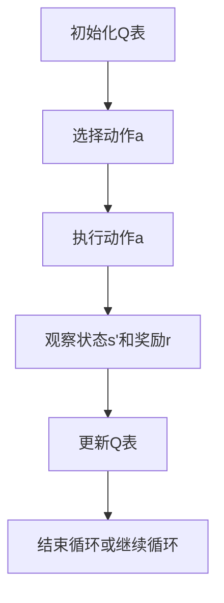
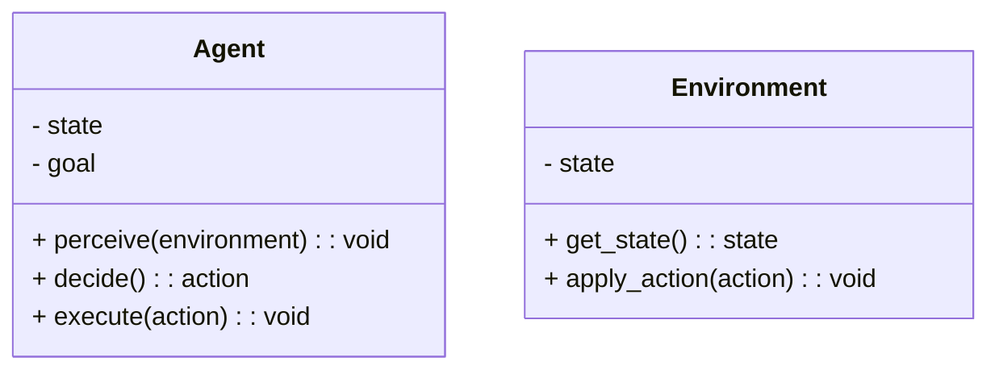

                 


# AI Agent在企业产品创新与概念验证中的应用

> 关键词：AI Agent，企业产品创新，概念验证，算法原理，系统架构设计

> 摘要：AI Agent作为一种智能化的解决方案，正在企业的产品创新和概念验证中发挥着越来越重要的作用。本文将从AI Agent的基本概念出发，探讨其在企业中的应用场景，分析其算法原理和系统架构设计，并通过实际案例展示其在产品创新中的应用。同时，本文还将总结最佳实践，为企业的技术决策者和开发人员提供有益的参考。

---

# 第1章: AI Agent概述

## 1.1 AI Agent的基本概念

### 1.1.1 AI Agent的定义与特点

AI Agent，即人工智能代理，是指能够感知环境并采取行动以实现目标的智能实体。与传统软件不同，AI Agent具备自主性、反应性、目标导向性和社会性等特征。它能够根据环境反馈动态调整行为，从而更高效地解决问题。

### 1.1.2 AI Agent与传统AI的区别

AI Agent与传统AI（如专家系统）的区别在于其自主性和反应性。传统AI依赖于预定义的规则和知识库，而AI Agent能够主动感知环境并做出实时决策。这种区别使得AI Agent在动态变化的商业环境中更具灵活性和适应性。

### 1.1.3 AI Agent在企业中的应用前景

在企业中，AI Agent可以应用于产品推荐、客户支持、流程优化等领域。通过AI Agent，企业能够更快速地响应客户需求，优化产品设计，降低运营成本。AI Agent的应用前景广阔，尤其是在数字化转型的过程中，其价值将更加凸显。

---

## 1.2 AI Agent的核心概念与问题背景

### 1.2.1 问题背景与问题描述

随着市场竞争的加剧，企业需要更快地将创新产品推向市场。传统的瀑布模型和敏捷开发模式在应对快速变化的市场需求时显得力不从力。AI Agent的引入，能够通过自动化决策和实时反馈，加速产品创新和验证过程。

### 1.2.2 问题解决方法与边界

AI Agent通过智能感知和自主决策，能够快速响应市场变化和客户需求。其边界包括数据来源的限制、算法的泛化能力以及系统的可解释性等。在实际应用中，需要明确AI Agent的能力范围和适用场景。

### 1.2.3 核心概念的结构与要素组成

AI Agent的核心结构包括感知模块、决策模块和执行模块。感知模块负责收集环境数据，决策模块基于数据制定策略，执行模块则将策略转化为具体行动。这种结构使得AI Agent能够形成一个完整的决策闭环。

---

# 第2章: AI Agent的核心概念与联系

## 2.1 核心概念的原理分析

### 2.1.1 AI Agent的组成部分

AI Agent由感知层、决策层和执行层组成。感知层通过传感器或API获取环境数据，决策层基于数据进行分析和决策，执行层则将决策结果转化为具体行动。

### 2.1.2 AI Agent与相关技术的对比

| 技术         | 特点                           | 与AI Agent的关系                  |
|--------------|--------------------------------|-----------------------------------|
| 传统AI       | 基于规则和知识库，缺乏自主性   | AI Agent的自主性和反应性更强     |
| 机器学习     | 通过数据训练模型，不具备自主性 | AI Agent结合机器学习模型进行决策 |
| 机器人流程自动化（RPA） | 模拟人类操作，缺乏智能性     | AI Agent具备更强的智能决策能力   |

### 2.1.3 核心概念的属性特征

AI Agent的核心属性包括：自主性、反应性、目标导向性和社会性。自主性使其能够独立决策，反应性使其能够实时响应环境变化，目标导向性使其始终围绕特定目标行动，社会性则使其能够在团队中协同工作。

---

## 2.2 AI Agent的实体关系图

以下是一个AI Agent在企业中的实体关系图：

```mermaid
er
actor: 客户
    name
    email
    purchase_history

agent: AI Agent
    agent_id
    target_goal
    current_state

environment: 市场环境
    market_trend
    competition_data

action: 行动
    action_id
    action_type
    timestamp
```

该图展示了AI Agent如何与客户、市场环境等实体交互，完成目标。

---

## 2.3 本章小结

本章详细介绍了AI Agent的核心概念，分析了其组成部分、与相关技术的对比，以及其实体关系图。这些内容为后续章节的算法原理和系统架构设计奠定了基础。

---

# 第3章: AI Agent的算法原理

## 3.1 算法原理概述

AI Agent的决策过程通常基于强化学习、监督学习或无监督学习。本文以强化学习为例，介绍其算法原理。

---

## 3.2 强化学习算法原理

### 3.2.1 强化学习的基本概念

强化学习是一种通过试错机制来优化决策策略的方法。AI Agent通过与环境交互，获得奖励或惩罚，从而调整行为以最大化累计奖励。

### 3.2.2 Q-learning算法的数学模型

Q-learning算法的目标是找到最优策略π，使得在每个状态s下，π(s)是使Q值最大的动作a。数学模型如下：

$$ Q(s,a) = Q(s,a) + \alpha \left[r + \gamma \max Q(s',a) - Q(s,a)\right] $$

其中：
- α为学习率
- γ为折扣因子
- r为奖励

### 3.2.3 Q-learning算法的流程图

以下是一个Q-learning算法的流程图：



---

## 3.3 实际案例分析

以电商推荐系统为例，AI Agent通过强化学习算法，根据用户的浏览和点击行为，动态调整推荐策略，从而提高转化率。

---

## 3.4 本章小结

本章详细讲解了AI Agent的算法原理，特别是强化学习的数学模型和流程图。通过实际案例分析，读者可以更好地理解AI Agent在企业中的应用。

---

# 第4章: 系统分析与架构设计

## 4.1 系统架构设计

### 4.1.1 系统功能设计

AI Agent系统的主要功能包括数据采集、决策推理和行动执行。数据采集模块负责收集环境数据，决策推理模块基于数据制定策略，行动执行模块将策略转化为具体行动。

### 4.1.2 系统架构图

以下是一个AI Agent系统的架构图：



---

## 4.2 系统接口设计

### 4.2.1 API接口设计

AI Agent需要与企业系统进行交互，常见的API接口包括：
- 获取环境数据的接口
- 发送决策指令的接口
- 收集反馈信息的接口

---

## 4.3 本章小结

本章详细分析了AI Agent系统的架构设计和接口设计，展示了AI Agent如何在企业中实现集成和应用。

---

# 第5章: 项目实战

## 5.1 环境安装与配置

为了运行AI Agent系统，需要安装以下工具：
- Python 3.8+
- PyTorch
- OpenAI API

---

## 5.2 核心代码实现

以下是一个简单的AI Agent代码示例：

```python
import random

class AI-Agent:
    def __init__(self, environment):
        self.environment = environment
        self.goal = "maximize revenue"
    
    def perceive(self):
        return self.environment.get_state()
    
    def decide(self, state):
        # 简单的决策逻辑
        return random.choice(["action1", "action2", "action3"])
    
    def execute(self, action):
        self.environment.apply_action(action)
```

---

## 5.3 代码解读与分析

上述代码展示了AI Agent的基本结构。perceive方法用于感知环境，decide方法基于感知结果做出决策，execute方法将决策结果转化为具体行动。

---

## 5.4 实际案例分析

以电商推荐系统为例，AI Agent可以根据用户行为动态调整推荐策略，从而提高转化率。

---

## 5.5 本章小结

本章通过实际案例展示了AI Agent在企业中的应用，详细讲解了环境配置和代码实现过程。

---

# 第6章: 最佳实践与小结

## 6.1 最佳实践

- 明确AI Agent的目标和边界
- 选择合适的算法和工具
- 注重系统的可解释性和可维护性
- 定期优化和迭代

---

## 6.2 本章小结

本章总结了AI Agent在企业中的应用经验，提出了最佳实践建议，帮助企业在实际应用中更好地部署和优化AI Agent系统。

---

# 附录

## 附录A: 工具与资源

- Python编程语言
- PyTorch深度学习框架
- OpenAI API

---

## 附录B: 参考文献

- Russell, S., & Norvig, P. (2010). *Artificial Intelligence: A Modern Approach*.
- Sutton, R. S., & Barto, A. G. (2018). *Reinforcement Learning: An Introduction*.

---

# 作者

作者：AI天才研究院/AI Genius Institute & 禅与计算机程序设计艺术 /Zen And The Art of Computer Programming

---

通过以上内容，读者可以全面了解AI Agent在企业产品创新与概念验证中的应用，从基础概念到实际应用，逐步深入，掌握其在企业中的价值和实现方法。

