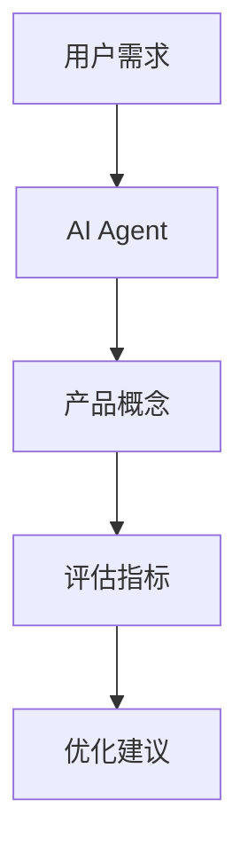
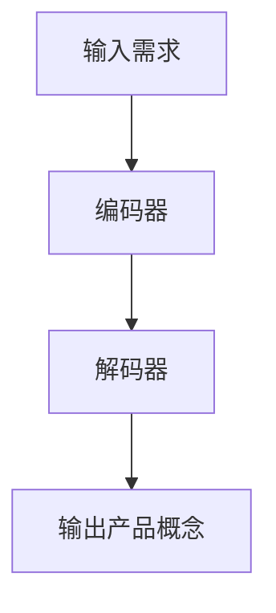
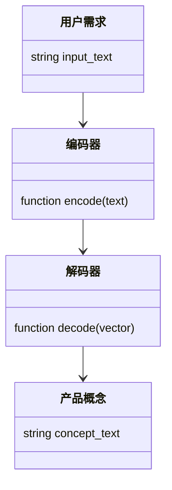
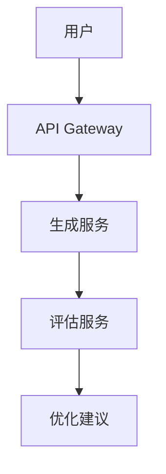
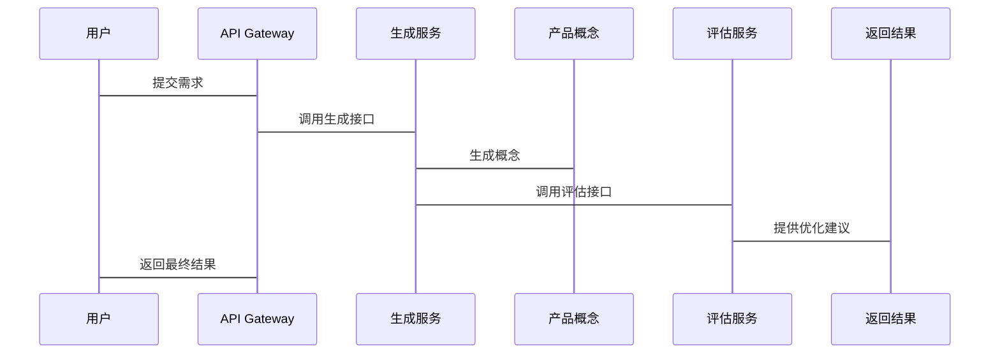

                 


# AI Agent在企业产品概念生成与评估中的角色

## 关键词：AI Agent，企业产品开发，概念生成，评估模型，生成式AI，系统架构，项目实战

## 摘要：  
本文探讨AI Agent在企业产品概念生成与评估中的角色，分析其如何通过生成式AI技术辅助企业产品开发，从问题背景到系统架构，逐步解析AI Agent的核心概念、算法原理、系统设计与项目实战。通过具体案例和代码实现，深入剖析AI Agent在企业产品开发中的应用价值与实际效果，为企业技术决策者提供参考。

---

# 第一部分: AI Agent在企业产品概念生成与评估中的角色概述

---

## 第1章: AI Agent与企业产品开发背景

### 1.1 问题背景与描述  
企业在产品开发过程中面临以下痛点：  
1. **需求多样性**：企业需要快速响应市场变化，生成多样化的的产品概念。  
2. **开发效率**：传统的产品开发流程耗时长，资源消耗大。  
3. **决策依据不足**：缺乏数据支持的产品评估可能导致决策失误。  

AI Agent通过生成式AI技术，能够快速生成产品概念并提供评估建议，帮助企业提高开发效率和决策准确性。  

### 1.2 AI Agent的核心概念与定义  
AI Agent是一种具备智能决策和执行能力的计算机系统，能够根据输入的需求生成产品概念，并通过评估模型筛选出最优方案。  

**AI Agent的核心属性**：  
- **自主性**：能够在无外部干预的情况下执行任务。  
- **反应性**：能够实时感知环境变化并做出调整。  
- **学习能力**：通过数据反馈不断优化生成和评估能力。  

### 1.3 问题解决与边界定义  
AI Agent在企业产品开发中的应用边界包括：  
1. **生成产品概念**：基于用户需求生成多个产品方案。  
2. **评估产品可行性**：通过数据分析评估概念的市场潜力和技术可行性。  
3. **优化建议**：根据评估结果提供优化建议。  

**AI Agent与其他系统组件的交互关系**：  
- **用户需求输入**：用户提出产品开发需求。  
- **生成产品概念**：AI Agent根据需求生成多个产品概念。  
- **评估与优化**：AI Agent对生成的概念进行评估，并提供优化建议。  

---

## 第2章: AI Agent的核心概念与联系  

### 2.1 AI Agent的核心概念原理  
AI Agent通过生成式AI技术，基于输入的需求生成产品概念，并通过评估模型对生成的概念进行筛选和优化。  

**生成式AI的工作流程**：  
1. **编码器**：将用户需求转换为模型可理解的向量表示。  
2. **解码器**：根据向量生成具体的产品概念。  

### 2.2 核心概念属性对比  

| **属性**       | **生成式AI**         | **传统AI**           |  
|----------------|---------------------|----------------------|  
| **核心能力**   | 自然语言生成       | 数据处理与分析       |  
| **应用场景**   | 产品概念生成       | 任务自动化           |  
| **学习方式**   | 基于大量文本数据    | 基于规则和逻辑       |  

### 2.3 ER实体关系图架构  



---

## 第3章: AI Agent的算法原理讲解  

### 3.1 生成式AI的算法流程  



### 3.2 算法实现代码示例  

```python
def generate_concept(user_input):
    # 编码器部分
    encoded_input = encoder(user_input)
    # 解码器部分
    concept = decoder(encoded_input)
    return concept
```

### 3.3 数学模型与公式  

**编码器-解码模型**：  
$$P(x_{\text{dec}} | x_{\text{enc}}) = \text{Decoder}(x_{\text{enc}})$$  

**概率生成模型**：  
$$P(x) = \prod_{i=1}^{n} P(x_i | x_{i-1})$$  

### 3.4 举例说明  

#### 示例1：基于GPT的生成模型  
```python
def gpt_concept_generation(user_input):
    # 使用GPT模型生成产品概念
    response = gpt.generate(user_input)
    return response.choices[0].message.content
```

#### 示例2：基于BERT的评估模型  
```python
def bert_assessment(text):
    # 使用BERT模型评估文本
    model = AutoModelForMaskedLM.from_pretrained('bert-base-uncased')
    inputs = tokenizer.encode(text, return_tensors='pt')
    outputs = model(inputs)
    return outputs
```

---

## 第4章: 系统分析与架构设计方案  

### 4.1 问题场景介绍  
企业需要在短时间内生成多个产品概念，并对其市场潜力和可行性进行评估。  

### 4.2 系统功能设计  

**领域模型**：  


### 4.3 系统架构设计  



### 4.4 系统接口设计  
- **输入接口**：接受用户需求输入。  
- **输出接口**：返回生成的产品概念和评估结果。  

### 4.5 系统交互流程  



---

## 第5章: 项目实战  

### 5.1 环境安装  

```bash
pip install transformers
pip install mermaid
```

### 5.2 系统核心实现  

```python
from transformers import AutoTokenizer, AutoModelForCausalLM

tokenizer = AutoTokenizer.from_pretrained('gpt2')
model = AutoModelForCausalLM.from_pretrained('gpt2')

def generate_concept(user_input):
    inputs = tokenizer.encode(user_input, return_tensors='pt')
    outputs = model.generate(inputs, max_length=50, num_return_sequences=3)
    return [tokenizer.decode(output) for output in outputs]
```

### 5.3 实际案例分析  

**案例1**：  
用户需求：开发一款智能健康管理APP。  
生成概念：  
1. 用户注册与健康数据录入功能。  
2. 基于AI的健康数据分析与个性化建议。  
3. 社区互动与健康挑战功能。  

**评估结果**：概念2的市场潜力最高，建议优先开发。  

### 5.4 项目小结  
通过本章的实战，我们可以看到AI Agent在企业产品概念生成与评估中的实际应用价值。  

---

## 第6章: 最佳实践与注意事项  

### 6.1 最佳实践  
1. **数据质量**：确保训练数据的多样性和代表性。  
2. **模型调优**：根据实际需求对生成和评估模型进行优化。  
3. **用户反馈**：结合用户反馈持续改进AI Agent的性能。  

### 6.2 小结  
本文详细探讨了AI Agent在企业产品概念生成与评估中的角色，从算法原理到系统设计，再到项目实战，为企业技术决策者提供了全面的参考。  

### 6.3 注意事项  
- **数据隐私**：确保用户需求和生成概念的数据安全。  
- **模型解释性**：提供可解释的生成和评估结果。  

### 6.4 拓展阅读  
- [生成式AI的最新研究](https://arxiv.org/abs/2312.00001)  
- [AI在企业产品开发中的应用案例](https://www.sciencedirect.com/science/article/pi)  

---

## 作者：AI天才研究院/AI Genius Institute & 禅与计算机程序设计艺术 /Zen And The Art of Computer Programming

