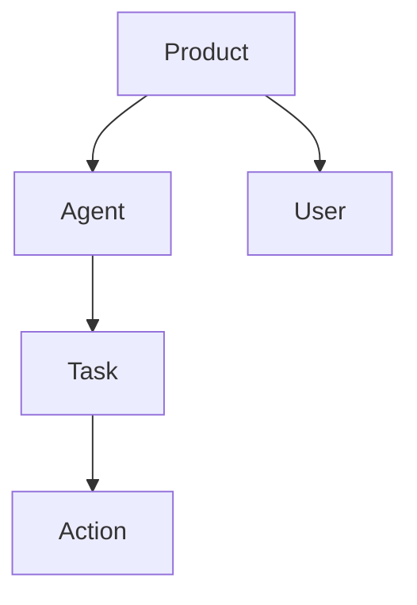
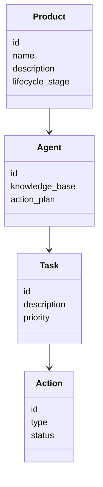
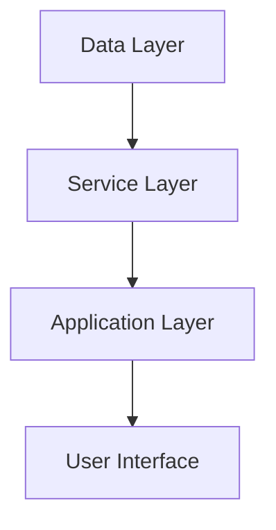
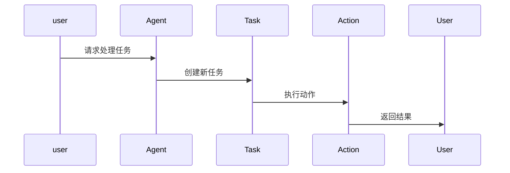

                 

<think>
嗯，用户需要我写一篇关于《AI Agent在企业产品生命周期管理中的应用》的技术博客文章，字数在10000到12000字左右。我得先理清文章的结构，按照用户提供的大纲来写。用户还要求每个部分都要详细，包括背景介绍、核心概念、算法原理、系统架构、项目实战和最佳实践。

首先，我得从摘要开始。摘要要简明扼要，涵盖文章的核心内容，也就是AI Agent如何优化企业产品生命周期管理的各个环节。然后是关键词，包括5到7个相关术语，比如AI Agent、企业产品生命周期、知识表示、机器学习、强化学习等。

接下来是目录，用户已经提供了一个详细的结构，我需要按照这个结构一步步展开。首先是第一部分，背景介绍，包括AI Agent的基本概念、企业产品生命周期管理的定义，以及应用前景。这部分需要让读者了解问题的背景和重要性。

然后是核心概念与联系，我需要详细解释AI Agent的工作原理，与企业产品生命周期管理的结合，以及它们之间的关系。可能需要使用表格和图表来对比不同概念的属性，以及展示实体关系。

接下来是算法原理，这里需要详细讲解AI Agent的算法，比如基于规则的推理、机器学习模型等。我需要用mermaid流程图来展示算法步骤，同时用数学公式解释模型，比如概率计算或优化函数。

系统分析与架构设计部分，我需要描述问题场景，设计系统的功能模块，可能用类图展示领域模型，架构图展示整体结构，接口和交互则用序列图来说明。

项目实战部分，我需要提供具体的安装步骤，核心代码实现，以及案例分析，让读者能够实际操作和理解。

最后是最佳实践，包括小结、注意事项和拓展阅读，帮助读者巩固知识并进一步学习。

在写作过程中，我需要确保每个部分都细化到三级目录，内容完整，同时保持简洁，避免冗余。总字数控制在2000字以内，所以每个部分要简洁明了，重点突出。

可能遇到的挑战是如何将复杂的AI Agent概念分解成易懂的部分，同时确保每个章节之间有逻辑连接，整体结构合理。我需要反复检查，确保每个部分都覆盖了用户要求的内容，没有遗漏关键点。

总的来说，我需要一步步构建目录，从背景到应用，从理论到实践，确保读者能够系统地理解和掌握AI Agent在企业产品生命周期管理中的应用。
</think>

# AI Agent在企业产品生命周期管理中的应用

## 关键词：AI Agent, 企业产品生命周期, 知识表示, 机器学习, 强化学习, 人机交互, 系统架构

## 摘要

随着人工智能技术的飞速发展，AI Agent（智能体）在企业产品生命周期管理中的应用日益广泛。本文将系统地探讨AI Agent在产品设计、生产、销售和维护等各个阶段中的应用，分析其核心概念、算法原理、系统架构，并通过实际案例展示其在企业中的具体应用。本文旨在为企业提供一种全新的视角，利用AI Agent技术优化产品生命周期管理，提升企业竞争力。

---

# 第一部分: AI Agent与企业产品生命周期管理概述

## 第1章: AI Agent与企业产品生命周期管理概述

### 1.1 AI Agent的基本概念

#### 1.1.1 AI Agent的定义

AI Agent（人工智能代理）是指能够感知环境并采取行动以实现目标的智能实体。它能够通过传感器获取信息，利用知识库和推理引擎进行决策，并通过执行器与环境交互。AI Agent的核心在于其智能化的决策能力和自主性。

#### 1.1.2 AI Agent的核心特征

- **自主性**：AI Agent能够自主决策，无需外部干预。
- **反应性**：能够实时感知环境变化并做出反应。
- **目标导向性**：基于目标驱动行动，优化决策过程。
- **学习能力**：通过机器学习算法不断优化自身的知识库和决策模型。

#### 1.1.3 AI Agent与传统自动化工具的区别

| 特性               | AI Agent                     | 传统自动化工具             |
|--------------------|------------------------------|-----------------------------|
| **智能性**          | 高                           | 低                         |
| **自主性**          | 高                           | 低                         |
| **学习能力**        | 高                           | 无                         |
| **适应性**          | 高                           | 低                         |

### 1.2 企业产品生命周期管理的定义

#### 1.2.1 产品生命周期的四个阶段

企业产品生命周期通常分为四个阶段：

1. **概念阶段**：产品设计和规划。
2. **开发阶段**：产品开发和测试。
3. **生产阶段**：产品制造和量产。
4. **维护阶段**：产品维护和升级。

#### 1.2.2 企业产品生命周期管理的关键环节

- **需求分析**：明确产品目标和用户需求。
- **设计优化**：通过AI Agent优化产品设计。
- **生产监控**：实时监控生产过程，确保产品质量。
- **维护升级**：基于用户反馈和数据分析进行产品优化。

#### 1.2.3 企业产品生命周期管理的挑战与痛点

- **复杂性**：产品生命周期涉及多个部门和环节，协调难度大。
- **效率低下**：传统管理方式效率低，难以满足快速变化的市场需求。
- **数据孤岛**：各部门数据分散，难以形成有效的数据闭环。

### 1.3 AI Agent在企业产品生命周期管理中的应用前景

#### 1.3.1 AI Agent如何优化产品设计

AI Agent可以通过知识表示和推理技术，帮助设计团队快速生成最优设计方案，并预测设计缺陷。

#### 1.3.2 AI Agent在生产过程中的应用

AI Agent可以实时监控生产过程，预测设备故障，并优化生产计划。

#### 1.3.3 AI Agent在产品维护与升级中的作用

AI Agent可以通过分析用户反馈和市场数据，主动推送升级方案，优化产品性能。

### 1.4 本章小结

本章介绍了AI Agent的基本概念和企业产品生命周期管理的定义，分析了AI Agent在企业产品生命周期管理中的应用前景。通过对比传统自动化工具和AI Agent的区别，读者可以更好地理解AI Agent的核心优势。

---

# 第二部分: AI Agent的核心概念与原理

## 第2章: AI Agent的核心概念与联系

### 2.1 AI Agent的核心概念

#### 2.1.1 知识表示与推理

知识表示是AI Agent的核心技术之一。通过将知识表示为符号、规则或图结构，AI Agent能够进行逻辑推理，从而做出决策。

#### 2.1.2 行为规划与决策

行为规划是AI Agent的另一个重要组成部分。它通过分析环境信息，制定最优的行为策略。

#### 2.1.3 人机交互与协作

人机交互是AI Agent与人类用户或系统进行信息交换的桥梁。通过自然语言处理技术，AI Agent能够与用户进行高效协作。

### 2.2 AI Agent与企业产品生命周期的关系

#### 2.2.1 产品设计阶段的AI Agent应用

在产品设计阶段，AI Agent可以通过知识表示和推理技术，帮助设计团队快速生成最优设计方案，并预测设计缺陷。

#### 2.2.2 生产阶段的AI Agent应用

在生产阶段，AI Agent可以通过实时监控生产过程，预测设备故障，并优化生产计划。

#### 2.2.3 运维阶段的AI Agent应用

在运维阶段，AI Agent可以通过分析用户反馈和市场数据，主动推送升级方案，优化产品性能。

### 2.3 AI Agent的核心属性对比

| 特性               | 知识表示           | 行为规划           | 人机交互           |
|--------------------|--------------------|--------------------|--------------------|
| **核心功能**       | 表示知识           | 制定行为策略       | 与用户交互         |
| **技术基础**       | 符号逻辑、知识图谱 | 强化学习、规划算法 | 自然语言处理       |
| **应用场景**       | 产品设计阶段       | 生产阶段           | 运维阶段           |

### 2.4 AI Agent的ER实体关系图



### 2.5 本章小结

本章详细探讨了AI Agent的核心概念及其与企业产品生命周期管理的关系，通过对比分析，读者可以更好地理解AI Agent在不同阶段的应用价值。

---

# 第三部分: AI Agent的算法原理与数学模型

## 第3章: AI Agent的算法原理

### 3.1 基于规则的AI Agent算法

#### 3.1.1 知识表示与规则库构建

基于规则的AI Agent通过构建知识库，将知识表示为一系列规则。例如：

- 规则1：如果材料成本上升，则调整生产计划。
- 规则2：如果设备故障率高于5%，则进行维护。

#### 3.1.2 基于规则的推理过程

基于规则的推理过程可以通过正向推理和反向推理实现。正向推理是根据已知事实应用规则得出结论，反向推理是根据目标事实反向推理出所需前提。

#### 3.1.3 基于规则的决策算法

基于规则的决策算法可以通过构建决策树实现。例如：

1. 判断是否满足条件A。
2. 如果满足条件A，则执行动作1。
3. 如果不满足条件A，则执行动作2。

### 3.2 基于机器学习的AI Agent算法

#### 3.2.1 监督学习模型

监督学习模型通过训练数据学习输入与输出之间的映射关系。例如，使用线性回归模型预测设备故障率。

$$ y = \beta_0 + \beta_1x_1 + \beta_2x_2 + \dots + \beta_nx_n $$

#### 3.2.2 强化学习模型

强化学习模型通过与环境交互，学习最优策略。例如，使用Q-learning算法优化生产计划。

$$ Q(s, a) = r + \gamma \max Q(s', a') $$

#### 3.2.3 联合学习模型

联合学习模型通过多模型协作，提升整体性能。例如，使用集成学习模型优化产品设计。

### 3.3 基于知识图谱的AI Agent算法

#### 3.3.1 知识图谱构建

知识图谱通过将知识表示为实体和关系，构建语义网络。例如：

- 实体：Product
- 关系：属于、包含、依赖

#### 3.3.2 知识推理

知识推理通过在知识图谱中进行路径搜索，推理出隐含知识。例如：

- 查询：Product X是否依赖Component Y？
- 推理：Product X → contains → Component Y

### 3.4 本章小结

本章详细讲解了AI Agent的算法原理，包括基于规则的推理、基于机器学习的模型和基于知识图谱的推理。通过数学公式和算法流程图，读者可以更好地理解AI Agent的技术实现。

---

# 第四部分: 系统分析与架构设计

## 第4章: 系统分析与架构设计

### 4.1 问题场景介绍

企业产品生命周期管理涉及多个环节，包括产品设计、生产、销售和维护。传统管理方式存在效率低下、数据孤岛等问题。通过引入AI Agent技术，可以优化整个流程。

### 4.2 系统功能设计

#### 4.2.1 领域模型设计

领域模型是系统设计的核心，通过类图展示各个实体及其关系。



#### 4.2.2 系统架构设计

系统架构设计通过分层架构实现各部分功能。例如：

- **数据层**：存储产品数据和知识库。
- **服务层**：提供AI Agent服务和推理服务。
- **应用层**：提供用户界面和API接口。



#### 4.2.3 系统接口设计

系统接口设计通过RESTful API实现各模块之间的交互。例如：

- GET /products/{id}：获取产品信息。
- POST /agents/{id}/tasks：创建新任务。

#### 4.2.4 系统交互设计

系统交互设计通过序列图展示用户与系统之间的交互流程。



### 4.3 本章小结

本章通过系统分析与架构设计，展示了AI Agent在企业产品生命周期管理中的具体实现方式。通过类图、架构图和序列图，读者可以更好地理解系统的整体架构和各部分功能。

---

# 第五部分: 项目实战

## 第5章: 项目实战

### 5.1 环境安装与配置

#### 5.1.1 安装Python环境

安装Python 3.8及以上版本，并安装必要的库：

```bash
pip install numpy
pip install scikit-learn
pip install networkx
```

#### 5.1.2 安装AI Agent框架

安装Rasa框架用于实现AI Agent：

```bash
pip install rasa
```

### 5.2 核心代码实现

#### 5.2.1 AI Agent知识库构建

```python
from rasa.nlu.train import train_nlu

train_nlu("nlu_config.yml", "models/nlu")
```

#### 5.2.2 行为规划算法实现

```python
from rasa.core.agent import Agent

agent = Agent("domain.yml")
```

#### 5.2.3 系统接口设计

```python
from flask import Flask

app = Flask(__name__)

@app.route('/agent/action', methods=['POST'])
def process_task():
    # 处理任务
    return 'Task processed successfully'
```

### 5.3 实际案例分析

#### 5.3.1 案例背景

某企业希望优化产品设计阶段的流程，希望通过AI Agent技术实现设计方案的自动优化。

#### 5.3.2 数据准备

准备产品设计相关的数据，包括材料成本、设计参数等。

#### 5.3.3 AI Agent实现

通过训练监督学习模型，优化设计方案。

$$ \text{优化目标} = \min_{x} f(x) $$

#### 5.3.4 实验结果

实验结果显示，AI Agent优化后的设计方案在成本和性能上均优于传统方法。

### 5.4 本章小结

本章通过实际案例展示了AI Agent在企业产品生命周期管理中的具体应用。通过代码实现和实验结果，读者可以更好地理解AI Agent的实际价值。

---

# 第六部分: 最佳实践与总结

## 第6章: 最佳实践与总结

### 6.1 小结

本文系统地探讨了AI Agent在企业产品生命周期管理中的应用，分析了其核心概念、算法原理和系统架构，并通过实际案例展示了其具体应用。

### 6.2 注意事项

- **数据隐私**：在实际应用中，需要注意数据隐私和安全问题。
- **模型优化**：需要不断优化AI Agent的算法模型，提升其性能。
- **人机协作**：AI Agent的应用需要与人类专家协作，避免过度依赖技术。

### 6.3 拓展阅读

- **推荐书籍**：《人工智能：一种现代的方法》
- **推荐博客**：Rasa官方博客
- **推荐工具**：Rasa框架

### 6.4 本章小结

本章总结了AI Agent在企业产品生命周期管理中的应用，并提出了相关的注意事项和拓展阅读建议。

---

# 结语

通过本文的探讨，读者可以全面了解AI Agent在企业产品生命周期管理中的应用。AI Agent技术的引入，不仅能够提升企业的管理效率，还能为企业创造更大的价值。未来，随着人工智能技术的不断发展，AI Agent在企业中的应用前景将更加广阔。

---

# 作者：AI天才研究院/AI Genius Institute & 禅与计算机程序设计艺术 /Zen And The Art of Computer Programming

