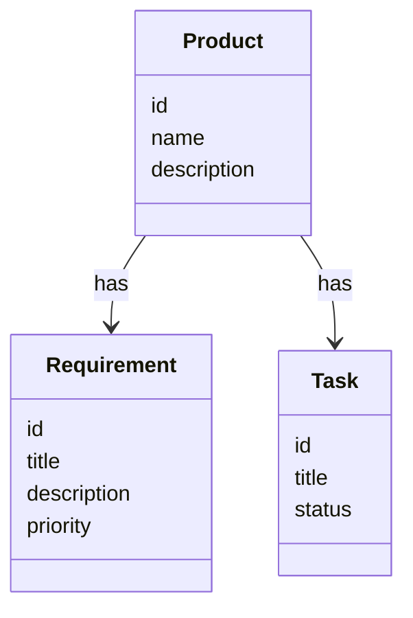
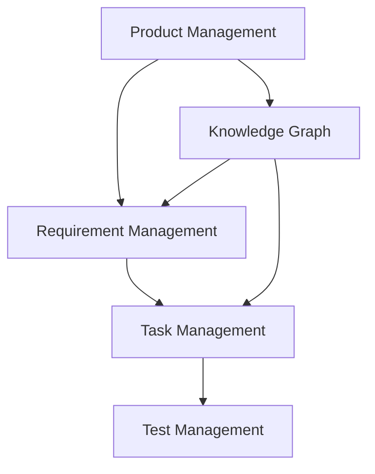
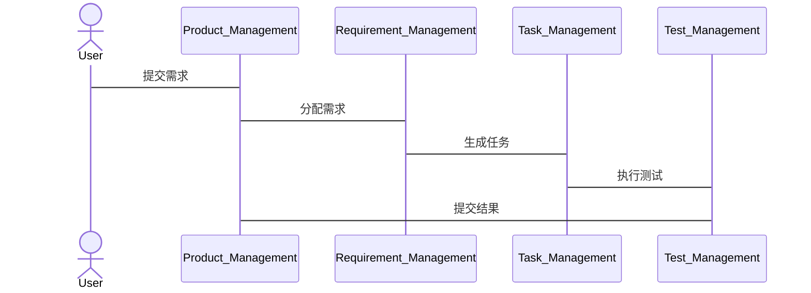

                 

<think>
好，我需要撰写一篇关于《AI Agent在企业产品生命周期管理中的应用》的技术博客文章。首先，我应该理解AI Agent和企业产品生命周期管理的基本概念，以及它们之间的关系。

接下来，我需要明确文章的结构。根据用户提供的大纲，文章分为几个部分：概述、核心概念、应用场景、算法原理、系统架构、项目实战和最佳实践等。每个部分都需要详细展开，确保内容全面且逻辑清晰。

在核心概念部分，我需要解释AI Agent的原理，比如强化学习和知识图谱，以及它们如何在企业产品生命周期管理中应用。这部分可能需要使用mermaid图来展示算法流程和系统架构。

系统架构设计是关键，我需要绘制领域模型的类图和系统架构图，展示各个模块之间的关系。同时，系统接口和交互流程也需要用mermaid图来说明，这样读者可以更直观地理解系统的工作方式。

在项目实战部分，我需要提供实际案例，包括环境安装、核心代码实现和案例分析。这不仅能让读者了解理论知识，还能通过实践加深理解。

最后，总结和最佳实践部分需要回顾全文，强调AI Agent的优势和应用前景，同时给出一些实用的建议，帮助读者在实际工作中更好地应用这些技术。

总的来说，我需要一步步分析，确保每个部分都详细且准确，同时保持语言的专业性和逻辑的连贯性。这不仅有助于读者理解，也能提升文章的整体质量。
</think>

# AI Agent在企业产品生命周期管理中的应用

## 关键词：AI Agent，企业产品生命周期管理，强化学习，知识图谱，系统架构

## 摘要：AI Agent（人工智能代理）作为一种智能系统，能够通过感知环境、自主决策和执行任务来优化企业产品生命周期管理。本文深入探讨了AI Agent在产品需求管理、设计开发、质量控制和发布运营等关键环节的应用，结合强化学习和知识图谱等技术，分析了其在提高效率、降低风险和增强决策能力方面的重要作用。文章还详细介绍了AI Agent的算法原理、系统架构设计以及实际项目中的应用案例，为读者提供了全面的视角和深入的技术解析。

---

# 第1章: AI Agent与企业产品生命周期管理概述

## 1.1 什么是AI Agent
### 1.1.1 AI Agent的定义
AI Agent（人工智能代理）是一种智能系统，能够感知环境、自主决策并执行任务，以实现特定目标。它具备感知、推理、学习和执行能力，能够在动态环境中适应变化。

### 1.1.2 AI Agent的核心特征
- **自主性**：能够独立执行任务，无需外部干预。
- **反应性**：能够实时感知环境并做出反应。
- **主动性**：能够主动采取行动以实现目标。
- **社会性**：能够与其他系统或人类进行交互和协作。

### 1.1.3 AI Agent与传统软件的区别
传统的软件程序通常需要明确的指令和规则来执行任务，而AI Agent能够通过学习和推理，适应复杂多变的环境，并做出自主决策。

## 1.2 企业产品生命周期管理概述
### 1.2.1 产品生命周期的定义
产品生命周期是指产品从构思、设计、生产、销售到报废的整个过程。它包括需求管理、设计开发、生产制造、市场销售和售后服务等多个阶段。

### 1.2.2 产品生命周期管理的关键环节
- **需求管理**：收集和分析客户需求，确定产品功能和优先级。
- **设计开发**：设计产品架构，开发功能模块。
- **生产制造**：生产产品并进行质量控制。
- **市场销售**：推广产品，满足市场需求。
- **售后服务**：提供技术支持和客户反馈处理。

### 1.2.3 企业产品生命周期管理的挑战
- **复杂性**：产品生命周期涉及多个环节，协调和管理难度大。
- **不确定性**：市场需求变化快，环境复杂多变。
- **效率低下**：传统管理方式依赖人工操作，效率较低。

## 1.3 AI Agent在企业产品生命周期管理中的应用价值
### 1.3.1 提高效率
AI Agent能够自动化处理重复性任务，如需求分析和测试用例生成，从而提高管理效率。

### 1.3.2 降低风险
通过实时监控和预测分析，AI Agent能够及时发现潜在风险，降低产品失败的可能性。

### 1.3.3 增强决策能力
AI Agent能够基于历史数据和实时信息，提供数据驱动的决策支持，帮助企业在复杂环境中做出最优选择。

## 1.4 本章小结
本章介绍了AI Agent的定义和核心特征，以及企业产品生命周期管理的关键环节和挑战。同时，阐述了AI Agent在提高效率、降低风险和增强决策能力方面的应用价值。

---

# 第2章: AI Agent的核心概念与原理

## 2.1 AI Agent的核心概念
### 2.1.1 知识表示
知识表示是AI Agent理解世界的基础。通过知识图谱等技术，AI Agent能够将领域知识表示为结构化的数据，以便进行推理和决策。

### 2.1.2 逻辑推理
逻辑推理是AI Agent基于知识和规则，从已知事实中推导出新结论的能力。它能够帮助AI Agent做出合理决策。

### 2.1.3 自然语言处理
自然语言处理技术使AI Agent能够理解和生成人类语言，从而与人类用户或系统进行有效交互。

## 2.2 AI Agent的原理
### 2.2.1 状态空间
状态空间是AI Agent所处环境的所有可能状态的集合。AI Agent通过感知环境，确定当前状态，并选择下一步动作。

### 2.2.2 动作选择
动作选择是AI Agent基于当前状态和目标，选择最优动作的过程。它通常涉及强化学习算法，以最大化奖励函数。

### 2.2.3 环境交互
环境交互是AI Agent与外部环境进行互动的过程。通过执行动作，AI Agent能够改变环境状态，并获得反馈信息。

## 2.3 AI Agent与知识图谱的关系
### 2.3.1 知识图谱的定义
知识图谱是一种结构化的知识表示形式，由实体和关系组成，能够描述现实世界中的复杂关系。

### 2.3.2 知识图谱在AI Agent中的应用
知识图谱为AI Agent提供了丰富的领域知识，支持其进行推理和决策。例如，在产品需求管理中，AI Agent可以通过知识图谱快速理解客户需求并生成需求文档。

### 2.3.3 知识图谱的构建与管理
知识图谱的构建需要从文本中抽取实体和关系，并通过本体论进行标准化。知识图谱的管理则涉及数据更新和版本控制。

## 2.4 本章小结
本章详细介绍了AI Agent的核心概念，包括知识表示、逻辑推理和自然语言处理，并解释了AI Agent的原理和与知识图谱的关系。

---

# 第3章: AI Agent在企业产品生命周期中的应用场景

## 3.1 产品需求管理
### 3.1.1 需求收集与分析
AI Agent可以通过自然语言处理技术，从客户反馈和市场报告中提取需求信息，并进行分类和优先级排序。

### 3.1.2 需求优先级排序
AI Agent可以根据项目目标和资源限制，利用强化学习算法对需求进行优先级排序，确保关键需求优先处理。

### 3.1.3 需求变更管理
在需求变更时，AI Agent能够自动分析变更对项目的影响，并生成变更计划，确保变更顺利实施。

## 3.2 产品设计与开发
### 3.2.1 设计方案生成
AI Agent可以基于知识图谱和设计规范，自动生成设计方案，并提供多种备选方案供开发团队选择。

### 3.2.2 开发任务分配
AI Agent可以根据开发人员的技能和项目需求，自动分配任务，并监控开发进度，确保项目按时完成。

### 3.2.3 开发进度监控
通过实时监控开发进度，AI Agent能够及时发现开发中的问题，并提供改进建议，确保项目顺利进行。

## 3.3 产品质量管理
### 3.3.1 测试用例生成
AI Agent可以根据需求规格说明书自动生成测试用例，并执行自动化测试，提高测试效率和质量。

### 3.3.2 缺陷分析与修复
AI Agent可以利用自然语言处理技术分析缺陷报告，自动分类缺陷并生成修复建议，帮助开发人员快速解决问题。

### 3.3.3 质量报告生成
AI Agent可以自动生成产品质量报告，包括测试结果、缺陷统计和改进建议，为后续开发提供参考。

## 3.4 产品发布与运营
### 3.4.1 发布计划制定
AI Agent可以根据市场反馈和资源情况，制定最优的发布计划，确保产品顺利发布。

### 3.4.2 用户反馈收集
AI Agent可以通过社交媒体和用户评价，实时收集用户反馈，并分析用户满意度，为产品优化提供依据。

### 3.4.3 运营数据分析
AI Agent可以对运营数据进行分析，识别市场趋势和用户行为模式，并提供数据驱动的运营策略，帮助企业在竞争中占据优势。

## 3.5 本章小结
本章详细探讨了AI Agent在产品需求管理、设计开发、质量控制和发布运营等关键环节中的应用场景，并展示了其在提高效率、降低风险和增强决策能力方面的巨大潜力。

---

# 第4章: AI Agent的算法原理与数学模型

## 4.1 强化学习算法
### 4.1.1 状态空间表示
状态空间表示是强化学习的基础。AI Agent通过感知环境，确定当前状态，并选择下一步动作。

### 4.1.2 动作选择策略
动作选择策略是AI Agent基于当前状态和目标，选择最优动作的过程。它通常涉及Q-learning算法，以最大化奖励函数。

### 4.1.3 奖励机制设计
奖励机制是强化学习的核心。AI Agent通过执行动作获得奖励或惩罚，从而学习最优策略。

## 4.2 知识图谱构建算法
### 4.2.1 实体识别与抽取
实体识别与抽取是知识图谱构建的第一步，通过自然语言处理技术从文本中提取实体。

### 4.2.2 关系抽取与推理
关系抽取与推理是通过分析文本中的关系，构建实体之间的联系，并进行逻辑推理。

### 4.2.3 知识融合与优化
知识融合与优化是将多个来源的知识进行整合，并通过冲突检测和消解，优化知识图谱的质量。

## 4.3 算法实现的数学模型
### 4.3.1 强化学习的数学公式
强化学习的核心是Q-learning算法，其数学公式为：
$$ Q(s,a) = Q(s,a) + \alpha (r + \gamma \max Q(s',a') - Q(s,a)) $$
其中，\( Q(s,a) \) 是当前状态 \( s \) 和动作 \( a \) 的价值函数，\( \alpha \) 是学习率，\( r \) 是奖励，\( \gamma \) 是折扣因子，\( Q(s',a') \) 是下一个状态的最大价值函数。

### 4.3.2 知识图谱的表示学习
知识图谱的表示学习可以通过嵌入技术，将实体和关系映射到低维向量空间。例如，TransE模型的数学公式为：
$$ \text{score}(h, r, t) = ||e_h + e_r - e_t||_2^2 $$
其中，\( e_h \)、\( e_r \) 和 \( e_t \) 分别是头实体、关系和尾实体的嵌入向量。

## 4.4 本章小结
本章详细介绍了AI Agent中常用的强化学习算法和知识图谱构建算法，并通过数学公式展示了其原理和实现方法。

---

# 第5章: AI Agent的系统架构设计

## 5.1 系统架构概述
AI Agent的系统架构通常包括感知层、推理层和执行层。感知层负责与环境交互，推理层进行逻辑推理，执行层负责任务执行。

## 5.2 领域模型设计
领域模型是AI Agent的核心，用于描述企业产品生命周期管理中的实体和关系。通过绘制类图，可以清晰地展示领域模型的结构。




## 5.3 系统架构设计
系统架构设计需要考虑模块化和可扩展性。通过绘制架构图，可以展示系统的各个模块及其交互关系。




## 5.4 系统接口设计
系统接口设计需要明确各模块之间的接口和数据流。例如，需求管理模块需要与产品管理模块进行数据交互。




## 5.5 本章小结
本章通过领域模型和系统架构图，展示了AI Agent在企业产品生命周期管理中的系统设计，并明确了各模块之间的交互关系。

---

# 第6章: AI Agent的项目实战

## 6.1 项目背景
某企业希望利用AI Agent优化其产品生命周期管理流程，提高效率和产品质量。

## 6.2 环境安装
项目需要安装Python 3.8及以上版本，以及相关库如TensorFlow、Keras和networkx。

## 6.3 核心代码实现
### 6.3.1 需求管理模块
```python
class RequirementManager:
    def __init__(self):
        self.requirements = []
    
    def add_requirement(self, requirement):
        self.requirements.append(requirement)
    
    def sort_requirements(self):
        self.requirements.sort(key=lambda x: x.priority)
```

### 6.3.2 任务管理模块
```python
class TaskManager:
    def __init__(self):
        self.tasks = []
    
    def assign_task(self, task, developer):
        task.developer = developer
    
    def execute_task(self, task):
        task.status = "completed"
```

### 6.3.3 测试管理模块
```python
class TestManager:
    def __init__(self):
        self.tests = []
    
    def generate_test_cases(self, requirement):
        # 根据需求生成测试用例
        pass
    
    def execute_tests(self):
        # 执行测试并生成报告
        pass
```

## 6.4 项目小结
本章通过实际案例展示了AI Agent在企业产品生命周期管理中的应用，详细介绍了项目环境的安装和核心代码的实现。

---

# 第7章: 最佳实践与注意事项

## 7.1 最佳实践
- **数据质量**：确保输入数据的准确性和完整性，以提高AI Agent的性能。
- **模型更新**：定期更新AI Agent的模型和知识库，以适应环境变化。
- **人机协作**：AI Agent应与人类专家协作，而非完全替代人类。

## 7.2 注意事项
- **隐私保护**：在处理企业数据时，需注意隐私保护和数据安全。
- **错误处理**：设计完善的错误处理机制，确保系统在异常情况下仍能稳定运行。
- **性能优化**：优化算法和系统架构，提高AI Agent的执行效率。

## 7.3 本章小结
本章总结了AI Agent在企业产品生命周期管理中的最佳实践和注意事项，帮助读者更好地应用这些技术。

---

# 作者：AI天才研究院/AI Genius Institute & 禅与计算机程序设计艺术 /Zen And The Art of Computer Programming

---

# 摘要：AI Agent（人工智能代理）是一种智能系统，能够通过感知环境、自主决策和执行任务来优化企业产品生命周期管理。本文深入探讨了AI Agent在产品需求管理、设计开发、质量控制和发布运营等关键环节的应用，结合强化学习和知识图谱等技术，分析了其在提高效率、降低风险和增强决策能力方面的重要作用。文章还详细介绍了AI Agent的算法原理、系统架构设计以及实际项目中的应用案例，为读者提供了全面的视角和深入的技术解析。

