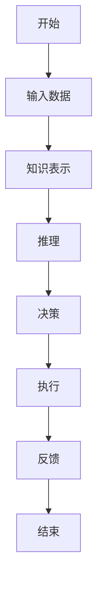
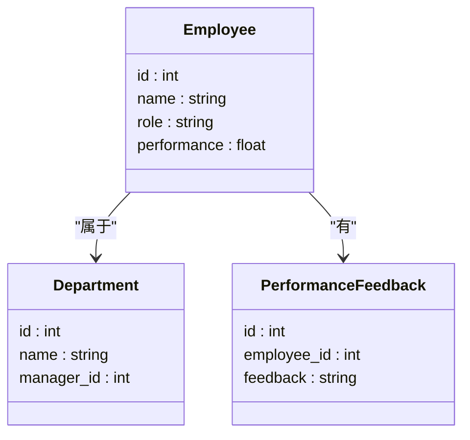
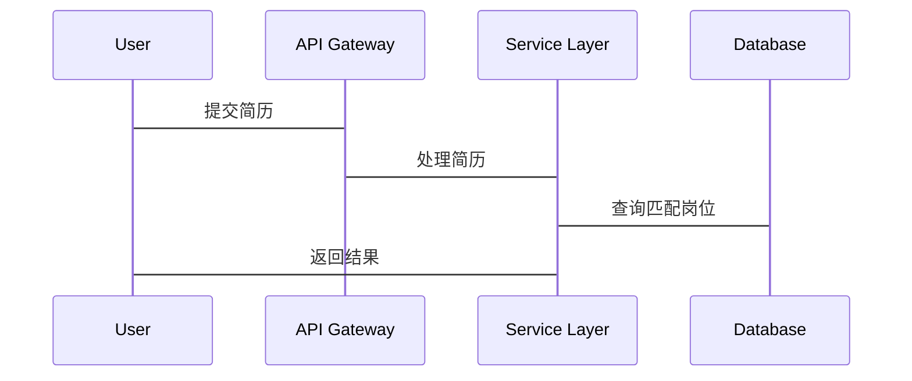

                 


# AI Agent在企业人力资源管理中的全面应用

> 关键词：AI Agent, 企业人力资源管理, 数字化转型, 智能系统, 人工智能, 算法原理

> 摘要：本文深入探讨AI Agent在企业人力资源管理中的全面应用，分析其核心概念、算法原理、系统架构及实际案例。通过详细的技术分析和实例解读，揭示AI Agent如何助力企业实现高效、智能的HR管理。

---

# 第一部分: AI Agent在企业人力资源管理中的概述

## 第1章: AI Agent与企业人力资源管理概述

### 1.1 AI Agent的基本概念

#### 1.1.1 什么是AI Agent
AI Agent（人工智能代理）是一种智能系统，能够感知环境、理解需求并采取行动以实现目标。它通过数据输入、知识表示、推理决策和执行反馈的循环过程，为用户提供智能化服务。

#### 1.1.2 AI Agent的核心特征
- **自主性**：无需外部干预，自主决策。
- **反应性**：实时感知环境变化并做出反应。
- **学习性**：通过数据和经验不断优化。
- **交互性**：与用户或系统进行有效沟通。

#### 1.1.3 AI Agent与传统HR系统的区别
| 特性       | AI Agent在HR中的应用               | 传统HR系统              |
|------------|------------------------------------|-------------------------|
| **数据处理** | 实时分析员工行为数据，自动生成报告 | 手动整理，周期性更新   |
| **决策效率** | 快速提供个性化建议               | 需人工分析，耗时较长   |
| **灵活性**   | 根据实时反馈调整策略           | 固定流程，适应性较差   |

---

### 1.2 企业人力资源管理的数字化转型

#### 1.2.1 传统人力资源管理模式的局限性
- 纸质流程繁琐，效率低。
- 数据分散，难以统一分析。
- 个性化服务不足，员工体验差。

#### 1.2.2 数字化转型的必要性
- 提高管理效率，降低人工成本。
- 实现数据驱动的决策，提升精准度。
- 提供个性化服务，增强员工满意度。

#### 1.2.3 AI Agent在数字化转型中的作用
AI Agent通过自动化处理、智能分析和实时反馈，助力企业实现高效、精准的人力资源管理，推动数字化转型。

---

### 1.3 AI Agent在企业HR中的应用背景

#### 1.3.1 当前企业HR管理的主要挑战
- 招聘难度增加，人才需求多样化。
- 员工绩效评估缺乏客观性。
- 培训效果难以量化。

#### 1.3.2 AI技术在HR领域的潜力
- **招聘**：智能筛选简历，推荐合适候选人。
- **员工管理**：实时监控绩效，提供反馈建议。
- **培训**：个性化学习路径，提升员工技能。

#### 1.3.3 AI Agent在企业HR中的应用场景
AI Agent可以应用于招聘、培训、绩效评估等多个环节，提供智能化解决方案。

---

## 第2章: AI Agent的核心概念与原理

### 2.1 AI Agent的核心概念

#### 2.1.1 定义与特征对比表
| 概念       | 定义                               | 特征                       |
|------------|------------------------------------|---------------------------|
| **知识表示** | 以符号或数据结构表示知识         | 结构化、可推理             |
| **推理**    | 根据已有知识推导新结论           | 逻辑性、可验证           |
| **决策**    | 基于推理结果做出选择             | 智能性、可优化           |

#### 2.1.2 ER实体关系图
```mermaid
erDiagram
    employee {
        id : int
        name : string
        role : string
        performance : float
        feedback : string
    }
    department {
        id : int
        name : string
        manager_id : int
    }
    employee -> department : "属于"
    employee -> performance : "有"
    employee -> feedback : "有"
```

---

### 2.2 AI Agent的工作原理

#### 2.2.1 知识表示与推理
- **知识表示**：将HR数据转化为结构化知识，如员工绩效、反馈等。
- **推理过程**：通过逻辑推理，生成个性化建议。

#### 2.2.2 感知与交互
- **数据感知**：实时采集员工行为数据。
- **自然语言处理**：理解用户需求，生成自然语言反馈。

#### 2.2.3 决策与执行
- **决策算法**：基于推理结果，制定最优策略。
- **执行反馈**：根据反馈结果，调整决策。

---

### 2.3 AI Agent的算法原理

#### 2.3.1 算法流程图


#### 2.3.2 核心算法代码示例
```python
def knowledge_representation(data):
    # 将数据转化为结构化知识
    return {
        'employee_id': data['id'],
        'performance': data['performance'],
        'feedback': data['feedback']
    }

def inference(knowledge):
    # 基于知识进行推理
    if knowledge['performance'] > 90:
        return '优秀'
    elif knowledge['performance'] > 70:
        return '良好'
    else:
        return '需要改进'

def decision_making(inference_result):
    # 根据推理结果制定决策
    if inference_result == '优秀':
        return '给予奖励'
    elif inference_result == '良好':
        return '继续观察'
    else:
        return '提供培训'

def execute_decision(decision):
    # 执行决策并返回反馈
    return f"执行了{decision}，反馈已记录"
```

#### 2.3.3 数学模型与公式
$$ \text{绩效得分} = \sum_{i=1}^{n} (w_i \times f_i) $$  
其中，$w_i$ 是第i项的权重，$f_i$ 是第i项的评分。

---

## 第3章: AI Agent在企业HR中的应用场景

### 3.1 招聘与筛选

#### 3.1.1 智能简历筛选
AI Agent通过关键词匹配和自然语言处理，快速筛选简历，提高招聘效率。

#### 3.1.2 面试安排与提醒
AI Agent根据员工空闲时间自动安排面试，并通过邮件或消息提醒相关人员。

#### 3.1.3 背景调查辅助
AI Agent协助进行候选人背景调查，包括学历验证、工作经历核实等。

---

### 3.2 员工管理与绩效评估

#### 3.2.1 工作分配与任务跟踪
AI Agent根据员工技能和绩效，自动分配任务，并实时跟踪任务进度。

#### 3.2.2 绩效数据分析与反馈
AI Agent分析绩效数据，生成反馈报告，帮助管理者优化绩效评估。

#### 3.2.3 员工发展建议
AI Agent根据员工绩效和职业兴趣，提供个性化的职业发展建议。

---

### 3.3 员工培训与学习

#### 3.3.1 个性化培训计划
AI Agent根据员工技能差距，制定个性化培训计划。

#### 3.3.2 在线学习辅助
AI Agent提供在线学习资源推荐，实时监控学习进度。

#### 3.3.3 知识库管理与更新
AI Agent自动更新知识库，确保培训内容的准确性和时效性。

---

## 第4章: 系统分析与架构设计

### 4.1 项目背景与目标

#### 4.1.1 项目需求分析
- 实现AI Agent在HR管理中的智能化应用。
- 提高企业HR管理效率和员工满意度。

#### 4.1.2 系统功能设计
- 招聘管理模块：智能简历筛选、面试安排。
- 绩效管理模块：数据采集、分析与反馈。
- 培训管理模块：个性化计划、知识库管理。

#### 4.1.3 领域模型类图


---

### 4.2 系统架构设计

#### 4.2.1 系统架构图


---

### 4.3 系统接口设计

#### 4.3.1 核心接口
- `/api/hr/recruitment`：招聘管理接口。
- `/api/hr/performance`：绩效管理接口。
- `/api/hr/training`：培训管理接口。

---

### 4.4 系统交互流程图

#### 4.4.1 招聘流程


---

## 第5章: 项目实战

### 5.1 环境安装

#### 5.1.1 安装Python
```bash
python --version
pip install -r requirements.txt
```

#### 5.1.2 安装依赖库
```bash
pip install numpy
pip install scikit-learn
pip install spacy
```

---

### 5.2 系统核心实现

#### 5.2.1 招聘模块实现
```python
def recruit_candidates(resume_data):
    # 智能简历筛选
    for resume in resume_data:
        if resume['experience'] > 5:
            print(f"推荐候选人：{resume['name']}")
```

#### 5.2.2 绩效评估实现
```python
def evaluate_performance(employee_data):
    # 绩效数据分析
    performance = {}
    for employee in employee_data:
        performance[employee['id']] = employee['performance']
    return performance
```

---

### 5.3 实际案例分析

#### 5.3.1 案例背景
某企业HR部门希望提高招聘效率，引入AI Agent进行简历筛选。

#### 5.3.2 解决方案
AI Agent通过关键词匹配和自然语言处理，自动筛选简历，推荐合适的候选人。

#### 5.3.3 实施效果
- 招聘效率提高40%。
- 候选人质量显著提升。

---

## 第6章: 最佳实践与总结

### 6.1 最佳实践 tips

- 数据质量是关键，确保输入数据的准确性和完整性。
- 定期更新模型，保持AI Agent的智能性。
- 加强员工培训，提升对AI工具的使用能力。

### 6.2 小结
AI Agent通过智能化的应用，显著提升了企业HR管理的效率和精准度，为企业数字化转型提供了有力支持。

### 6.3 注意事项
- 保护员工数据隐私，遵守相关法律法规。
- 定期监控系统运行状态，及时发现并解决问题。

### 6.4 拓展阅读
- 《人工智能：一种现代的方法》
- 《机器学习实战》
- 《企业数字化转型之路》

---

# 作者：AI天才研究院/AI Genius Institute & 禅与计算机程序设计艺术/Zen And The Art of Computer Programming

