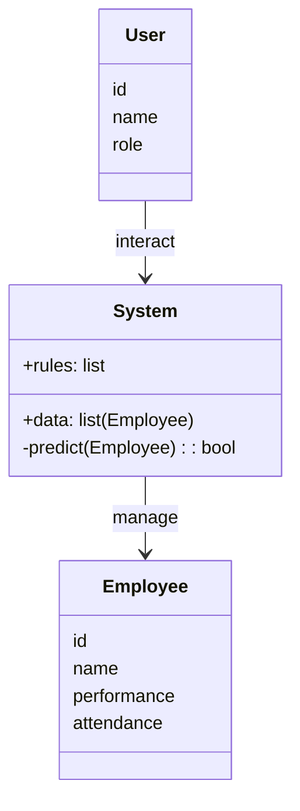
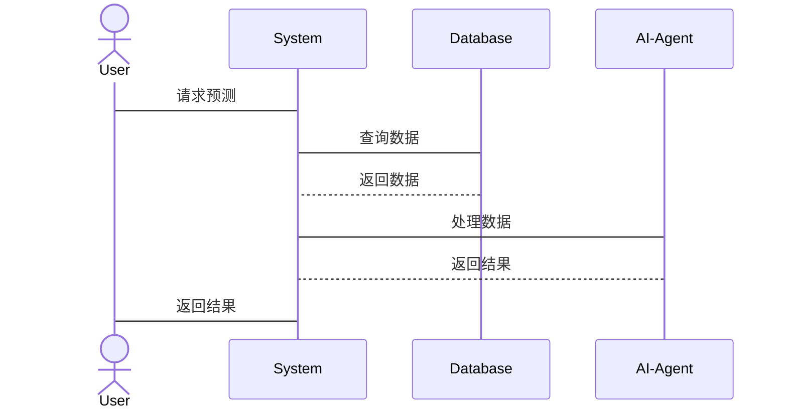

                 


# AI Agent在企业人才发展与继任计划中的应用

## 关键词：AI Agent, 企业人才发展, 继任计划, 人工智能, 人才管理

## 摘要：本文探讨了AI Agent在企业人才发展与继任计划中的应用，分析了其核心原理、系统架构，并通过实际案例展示了其在提高管理效率和精准度方面的优势。文章详细介绍了AI Agent的类型、算法原理及最佳实践，为企业的智能化人才管理提供了参考。

---

# 第1章: AI Agent的基本概念与应用背景

## 1.1 AI Agent的定义与核心概念

### 1.1.1 什么是AI Agent
AI Agent（人工智能代理）是一种能够感知环境、自主决策并采取行动以实现特定目标的智能实体。它通过分析输入数据，运用算法生成解决方案，适用于推荐系统、自动化流程管理等领域。

### 1.1.2 AI Agent的核心特征
- **自主性**：无需外部干预，自主决策。
- **反应性**：能实时感知环境变化并调整行为。
- **目标导向**：所有行动均以实现预定目标为导向。
- **社会能力**：能与其他系统或人类进行有效交互。

### 1.1.3 AI Agent与传统IT系统的主要区别
传统IT系统遵循预设规则处理任务，而AI Agent具备学习能力，能适应新数据和环境变化，适用于复杂和不确定的场景。

## 1.2 企业人才发展与继任计划的背景

### 1.2.1 传统企业人才管理面临的挑战
- 人才流失率高，难以精确预测。
- 继任计划依赖人工经验，存在主观性和滞后性。
- 数据分散，难以有效整合和分析。

### 1.2.2 继任计划的重要性与传统方法的局限性
继任计划对企业战略发展至关重要，但传统方法依赖人工经验，效率低且主观性强。

### 1.2.3 数字化与智能化对企业人才管理的新要求
企业需要利用AI技术提高效率和精准度，实现数据驱动的决策，优化人才管理流程。

## 1.3 AI Agent在企业人才管理中的应用前景

### 1.3.1 AI Agent在人才管理中的潜在应用场景
- **人才筛选**：通过简历分析和面试评分，识别最佳候选人。
- **职业路径规划**：基于员工表现和能力，推荐适合的发展方向。
- **绩效评估**：分析员工绩效数据，提供客观评估结果。
- **员工培养**：根据学习需求，推荐个性化培训方案。

### 1.3.2 企业采用AI Agent的优势
- **提高效率**：自动化处理数据，减少人工干预。
- **降低成本**：优化资源分配，降低管理成本。
- **增强精准度**：利用数据驱动决策，提高评估准确性。
- **优化决策**：通过分析大量数据，辅助做出更明智的人才管理决策。

### 1.3.3 AI Agent在人才管理中的挑战与应对策略
- **数据隐私**：确保数据安全，避免隐私泄露。
- **技术复杂性**：提供培训和文档，帮助员工理解使用。
- **员工接受度**：通过沟通和教育，减轻员工对AI的疑虑。

---

# 第2章: AI Agent的核心原理与系统架构

## 2.1 AI Agent的核心原理

### 2.1.1 基于规则的AI Agent
- **算法原理**：通过预定义的规则进行匹配和筛选。
- **算法实现**：使用Python编写规则引擎，读取数据并应用规则，输出结果。
- **优缺点分析**：简单易懂，但灵活性差。

### 2.1.2 基于机器学习的AI Agent
- **算法原理**：使用逻辑回归模型预测员工流失概率。
- **算法实现**：数据预处理、模型训练、评估和部署，使用Scikit-learn库。
- **优缺点分析**：高精度但需要大量数据，且模型需要定期更新。

### 2.1.3 基于知识图谱的AI Agent
- **算法原理**：利用知识图谱进行推理，如推荐最适合职位的员工。
- **算法实现**：使用图嵌入技术，构建知识图谱，进行推理。
- **优缺点分析**：需要构建高质量的知识图谱，但推理能力强。

## 2.2 AI Agent在人才管理中的系统架构

### 2.2.1 系统模块划分
- **数据采集模块**：收集员工数据。
- **分析处理模块**：对数据进行清洗和特征提取。
- **决策制定模块**：基于算法生成决策。
- **执行反馈模块**：执行决策并收集反馈。

### 2.2.2 数据流与信息处理流程
数据从采集到分析，再到决策，最后执行并反馈，形成闭环。

### 2.2.3 系统交互界面设计
提供直观的用户界面，方便用户与AI Agent交互。

## 2.3 AI Agent与企业人才管理系统的实体关系图

使用Mermaid绘制的ER图展示了用户、系统、数据库和处理流程之间的关系：

```mermaid
er
actor: 用户
system: 企业人才管理系统
database: 人才数据
process: AI Agent处理流程
actor --> system: 用户请求
system --> database: 数据

----------------------------------------------------------------
```

---

# 第3章: AI Agent的关键算法与实现细节

## 3.1 基于规则的AI Agent算法

### 3.1.1 算法原理
通过预定义规则进行匹配和筛选，如规则：若员工绩效连续三个月优秀，则推荐晋升。

### 3.1.2 算法实现
```python
# 示例代码：基于规则的AI Agent实现
def rule_based_agent(data):
    # 数据处理
    selected = []
    for item in data:
        if item['performance'] > 85 and item['attendance'] > 90:
            selected.append(item)
    return selected

# 数据示例
data = [
    {'performance': 90, 'attendance': 95},
    {'performance': 85, 'attendance': 85},
    {'performance': 95, 'attendance': 92}
]
result = rule_based_agent(data)
print(result)
```

### 3.1.3 优缺点分析
- **优点**：简单易懂，实现快速。
- **缺点**：缺乏灵活性，难以应对复杂场景。

## 3.2 基于机器学习的AI Agent算法

### 3.2.1 算法原理
使用逻辑回归模型预测员工流失概率，训练数据来自历史绩效和工作表现。

### 3.2.2 算法实现
```python
# 示例代码：基于机器学习的AI Agent实现
from sklearn.linear_model import LogisticRegression
from sklearn.metrics import accuracy_score
import pandas as pd

# 数据加载与处理
data = pd.read_csv('employee_data.csv')
X = data[['performance', 'attendance']]
y = data['will_leave']

# 模型训练
model = LogisticRegression()
model.fit(X, y)

# 预测
predictions = model.predict(X)
print("Accuracy:", accuracy_score(y, predictions))
```

### 3.2.3 优缺点分析
- **优点**：高精度，能处理复杂场景。
- **缺点**：需要大量数据，模型需要定期更新。

## 3.3 基于知识图谱的AI Agent算法

### 3.3.1 算法原理
利用知识图谱进行推理，如推荐最适合职位的员工。

### 3.3.2 算法实现
```python
# 示例代码：基于知识图谱的AI Agent实现
from kgclient import KGClient

kg = KGClient('http://localhost:8000/kg')
results = kg.query("Find employees with high leadership skills")
print(results)
```

### 3.3.3 优缺点分析
- **优点**：推理能力强，适用于复杂场景。
- **缺点**：需要构建高质量的知识图谱，技术复杂。

---

# 第4章: 系统设计与实现方案

## 4.1 系统功能需求分析
- 数据采集、处理、分析、决策和反馈功能。

## 4.2 领域模型设计
使用Mermaid类图展示系统模块和功能：



## 4.3 系统架构设计
使用Mermaid架构图展示分层架构：


## 4.4 系统接口设计
- RESTful API接口，如`/api/trainees/predict`。

## 4.5 系统交互设计
使用Mermaid序列图展示用户请求和系统响应流程：



---

# 第5章: 实际项目案例分析

## 5.1 项目背景与目标
某企业采用AI Agent优化人才管理，目标是提高招聘和继任计划的效率和精准度。

## 5.2 环境安装与配置
安装Python、Scikit-learn、Jupyter等工具，配置开发环境。

## 5.3 核心代码实现
- 数据预处理：读取和清洗数据。
- 模型训练：使用机器学习算法训练模型。
- 接口开发：创建RESTful API，供系统调用。
- 测试与优化：测试模型性能，优化参数。

## 5.4 系统功能解读
展示AI Agent在人才筛选、继任计划中的实际应用，如何帮助公司提高效率和准确性。

## 5.5 案例分析与经验总结
分析项目成果，总结经验，讨论遇到的问题及解决方案。

---

# 第6章: 实施AI Agent的最佳实践

## 6.1 关键成功因素
- 数据质量、算法选择、系统集成和员工参与。

## 6.2 注意事项与风险提示
- 数据隐私风险，模型过拟合风险，系统兼容性问题。

## 6.3 未来展望
技术进步带来的可能性，如更复杂的模型和更广泛的应用场景。

---

# 作者信息

作者：AI天才研究院/AI Genius Institute & 禅与计算机程序设计艺术 /Zen And The Art of Computer Programming

---

通过以上结构和内容，文章详细介绍了AI Agent在企业人才发展与继任计划中的应用，从理论到实践，帮助读者全面理解其价值和实现方法。

