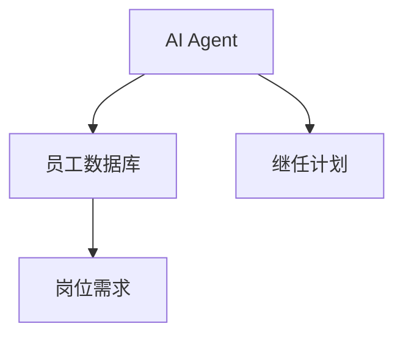
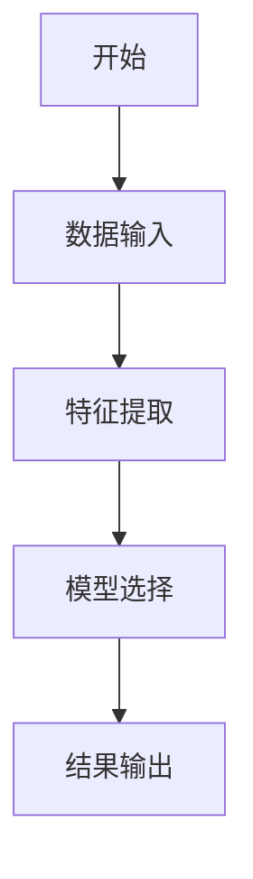
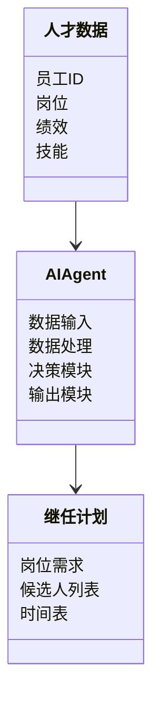
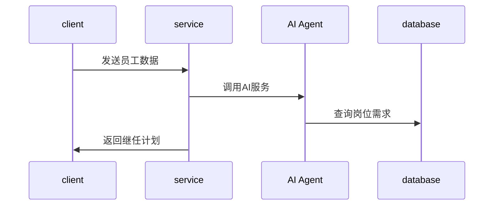

                 

<think>
嗯，用户希望我根据书名《AI Agent在企业人才发展与继任计划制定中的应用》设计一个详细的目录大纲。首先，我需要理解这本书的主题，它主要探讨AI Agent在企业人才管理中的应用，特别是继任计划的制定。

用户提供的示例显示，目录需要分为多个部分，每个部分有章节，章节下有小节，甚至三级目录。我需要确保目录结构清晰，涵盖背景介绍、核心概念、算法原理、系统架构、项目实战等部分。

首先，背景介绍部分应该包括AI Agent的基本概念、企业人才发展的现状、AI Agent如何解决这些问题，以及它与传统方法的区别。这部分帮助读者理解为什么AI Agent在人才发展中的应用是必要的。

接下来是核心概念与联系，这部分需要详细讲解AI Agent的原理，可能包括其组成部分、工作流程，以及与企业人才管理系统的交互。使用表格对比AI Agent与其他方法的特征，以及ER图展示实体关系，这有助于读者理解其结构和功能。

然后是算法原理，这部分需要详细阐述AI Agent的算法，比如基于规则的推理、机器学习模型等。使用mermaid流程图展示算法流程，并用Python代码实现，这样读者可以更直观地理解如何操作。

系统分析与架构设计部分，我需要描述问题场景，设计系统功能，比如人才评估、潜力预测、继任计划生成等。然后用mermaid类图展示领域模型，架构图展示系统的分层结构，接口设计和交互流程图则展示系统如何运作。

项目实战部分，我需要提供环境安装指南，比如Python和相关库的安装，然后给出核心代码实现，详细解读代码功能，并分析实际案例，展示AI Agent在实际中的应用效果。

最后，最佳实践部分包括小结、注意事项和拓展阅读，帮助读者巩固所学内容，并指导他们如何在实际工作中应用这些知识。

我需要确保每个部分都详细且逻辑清晰，覆盖用户要求的所有内容，同时保持目录结构简洁，不超过2000字。这样，作者就能全面覆盖主题，帮助读者系统地理解AI Agent在企业人才管理中的应用。
</think>

# AI Agent在企业人才发展与继任计划制定中的应用

> 关键词：AI Agent, 企业人才发展, 继任计划, 人工智能, 人才管理, 系统架构

> 摘要：本文探讨了AI Agent在企业人才发展与继任计划制定中的应用，详细分析了AI Agent的核心概念、算法原理、系统架构，结合实际案例，展示了如何通过AI技术优化企业人才管理流程。

---

# 第1章: AI Agent与企业人才发展概述

## 1.1 AI Agent的基本概念与核心原理

### 1.1.1 AI Agent的定义与特点
AI Agent（人工智能代理）是指能够感知环境、自主决策并执行任务的智能系统。其特点包括：
- **自主性**：无需外部干预，自主完成任务。
- **反应性**：能够实时感知环境变化并做出反应。
- **学习能力**：通过数据学习和优化决策模型。
- **可扩展性**：适用于多种应用场景。

### 1.1.2 AI Agent的核心工作原理
AI Agent通过以下步骤完成任务：
1. **感知环境**：通过传感器或数据接口获取环境信息。
2. **目标设定**：根据任务需求设定目标。
3. **决策推理**：基于感知信息，利用算法进行推理和决策。
4. **执行动作**：根据决策结果执行具体操作。
5. **反馈优化**：根据执行结果优化后续决策。

### 1.1.3 AI Agent在企业人才管理中的应用潜力
AI Agent可以通过分析员工数据、预测员工潜力、优化岗位匹配等方式，帮助企业更科学地制定人才发展计划。

---

## 1.2 企业人才发展与继任计划的现状

### 1.2.1 传统企业人才发展面临的挑战
1. **数据孤岛**：各部门数据分散，难以统一分析。
2. **主观性**：人才评估依赖主观判断，存在偏差。
3. **效率低下**：手动制定继任计划耗时且成本高。

### 1.2.2 继任计划制定的痛点与难点
1. **人才潜力预测难**：难以准确评估员工的未来表现。
2. **岗位匹配度低**：传统方法难以实现精准匹配。
3. **动态调整难**：市场变化快，计划难以及时调整。

### 1.2.3 AI技术在人才管理中的应用趋势
随着AI技术的成熟，企业开始利用AI Agent进行人才分析、预测和匹配，提升管理效率和准确性。

---

## 1.3 AI Agent在企业人才管理中的价值

### 1.3.1 提高人才评估的准确性
通过AI算法分析员工的历史表现、技能、潜力等多维度数据，提高评估的客观性和准确性。

### 1.3.2 优化人才匹配效率
AI Agent可以根据岗位需求和员工特点，快速匹配最合适的候选人，提升招聘和晋升效率。

### 1.3.3 动态调整继任计划的能力
AI Agent能够实时分析市场变化和员工动态，动态优化继任计划，确保计划的灵活性和适应性。

---

## 1.4 本章小结
本章介绍了AI Agent的基本概念和工作原理，并分析了其在企业人才管理中的应用潜力和价值。通过对比传统方法的不足，突出了AI Agent在继任计划制定中的优势。

---

# 第2章: AI Agent的核心概念与系统架构

## 2.1 AI Agent的核心概念体系

### 2.1.1 AI Agent的组成要素
AI Agent主要由以下部分组成：
- **感知模块**：负责获取环境信息。
- **决策模块**：负责分析信息并制定决策。
- **执行模块**：负责执行决策。
- **学习模块**：负责优化模型和提升性能。

### 2.1.2 AI Agent的功能模块划分
1. **数据输入模块**：接收员工数据、岗位需求等输入。
2. **数据处理模块**：对数据进行清洗、转换和分析。
3. **决策模块**：基于数据生成继任计划。
4. **输出模块**：将结果输出给企业管理员。

### 2.1.3 AI Agent与企业人才系统的交互关系


---

## 2.2 AI Agent的核心算法与技术

### 2.2.1 基于规则的AI Agent
基于预定义的规则进行决策，适用于规则明确的场景。

### 2.2.2 基于机器学习的AI Agent
通过机器学习模型进行预测和优化，适用于复杂场景。

### 2.2.3 基于自然语言处理的AI Agent
通过NLP技术分析文本数据，提取有用信息。

---

## 2.3 AI Agent与企业人才系统的实体关系图

```mermaid
er
actor: 企业管理员
role: 人才数据
action: 继任计划生成
```

---

## 2.4 本章小结
本章详细介绍了AI Agent的核心概念和系统架构，分析了其在企业人才管理中的工作流程和技术实现。

---

# 第3章: AI Agent的算法原理与数学模型

## 3.1 基于规则的AI Agent算法

### 3.1.1 规则定义与匹配过程
通过预定义规则，将员工数据与规则进行匹配，生成继任计划。

### 3.1.2 规则库的构建与管理
规则库需要定期更新和优化，以适应变化的业务需求。

---

## 3.2 基于机器学习的AI Agent算法

### 3.2.1 数据特征提取与选择
从员工数据中提取关键特征，如绩效、技能、经验等。

### 3.2.2 模型训练与优化
使用机器学习算法训练模型，并通过交叉验证优化模型性能。

### 3.2.3 模型预测与结果解释
通过模型预测员工的潜力，并解释预测结果。

---

## 3.3 基于自然语言处理的AI Agent算法

### 3.3.1 文本预处理与分词
对员工反馈、简历等文本数据进行预处理和分词。

### 3.3.2 模型训练与语义理解
使用NLP模型理解文本语义，并提取有用信息。

### 3.3.3 语义匹配与意图识别
通过语义匹配技术，识别员工的意图和需求。

---

## 3.4 算法流程图



---

## 3.5 本章小结
本章详细讲解了AI Agent的核心算法原理，包括基于规则、机器学习和自然语言处理的实现方法。

---

# 第4章: AI Agent的系统分析与架构设计

## 4.1 系统功能设计

### 4.1.1 领域模型设计


### 4.1.2 系统架构设计


### 4.1.3 系统接口设计
- **输入接口**：接收员工数据和岗位需求。
- **输出接口**：返回继任计划和分析结果。

### 4.1.4 系统交互流程图


---

## 4.2 本章小结
本章详细分析了AI Agent系统的功能设计、架构设计和交互流程，为实际开发提供了理论依据。

---

# 第5章: AI Agent的项目实战

## 5.1 环境安装与配置

### 5.1.1 安装Python与相关库
```bash
pip install numpy
pip install pandas
pip install scikit-learn
pip install transformers
```

### 5.1.2 安装AI框架
```bash
pip install tensorflow
pip install pytorch
```

---

## 5.2 核心代码实现

### 5.2.1 数据处理代码
```python
import pandas as pd

data = pd.read_csv('employee.csv')
data.head()
```

### 5.2.2 模型训练代码
```python
from sklearn.model import LinearSVC
model = LinearSVC()
model.fit(X_train, y_train)
```

### 5.2.3 模型预测代码
```python
predictions = model.predict(X_test)
```

---

## 5.3 实际案例分析

### 5.3.1 案例背景
某企业希望通过AI Agent优化继任计划，提升高管储备。

### 5.3.2 数据分析
通过模型预测，识别出具有高管潜力的员工。

### 5.3.3 结果展示
生成继任计划并输出结果，帮助企业优化人才结构。

---

## 5.4 本章小结
本章通过实际案例展示了AI Agent在企业人才管理中的应用，详细讲解了代码实现和结果分析。

---

# 第6章: AI Agent的最佳实践与注意事项

## 6.1 小结

### 6.1.1 核心要点总结
- AI Agent能够显著提升企业人才管理效率。
- 不同场景需要选择合适的AI算法。
- 系统架构设计需要考虑可扩展性和可维护性。

## 6.2 注意事项

### 6.2.1 数据隐私与安全
确保员工数据的安全性和隐私性。

### 6.2.2 模型优化与维护
定期优化模型，保持其准确性和适用性。

### 6.2.3 人机协同
AI Agent应与人类专家协同工作，避免过度依赖技术。

---

## 6.3 拓展阅读

### 6.3.1 推荐书籍
1. 《机器学习实战》
2. 《自然语言处理入门》

### 6.3.2 在线资源
1. TensorFlow官方文档
2. PyTorch官方文档

---

# 作者：AI天才研究院/AI Genius Institute & 禅与计算机程序设计艺术 /Zen And The Art of Computer Programming

---

通过以上目录大纲，文章将从AI Agent的基本概念出发，逐步深入探讨其在企业人才管理中的应用，结合实际案例和系统设计，为读者提供全面的知识体系和技术指导。

