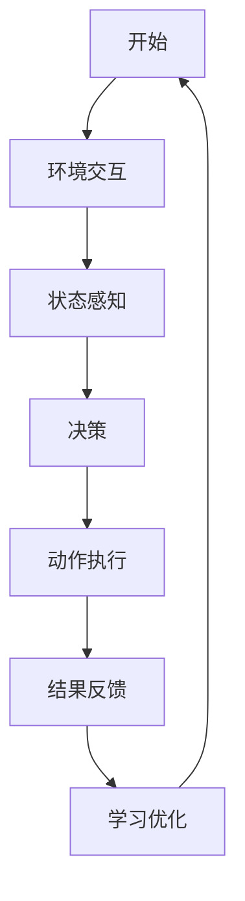
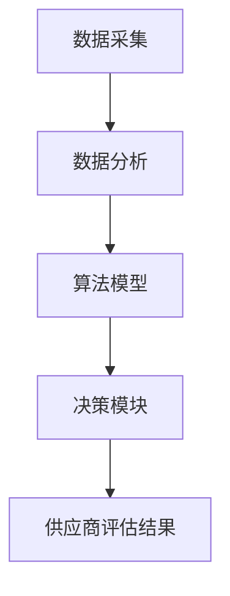

                 


---

# AI Agent在企业供应商管理与评估中的应用

> **关键词**：AI Agent, 企业供应商管理, 人工智能, 供应商评估, 供应链优化

> **摘要**：随着人工智能技术的快速发展，AI Agent（人工智能代理）在企业供应商管理与评估中的应用日益广泛。本文将详细探讨AI Agent的核心概念、算法原理、系统架构设计以及在供应商筛选、评估与监控等环节中的具体应用场景。通过理论分析与实际案例结合，本文旨在为企业提供一种高效、智能的供应商管理解决方案，助力企业优化供应链管理，提升整体运营效率。

---

## 目录

### 第一部分: AI Agent在企业供应商管理与评估中的应用概述

#### 第1章: AI Agent与企业供应商管理概述

##### 1.1 AI Agent的基本概念

- 1.1.1 AI Agent的定义与特点
  - 智能性：能够感知环境并自主决策
  - 反应性：实时响应环境变化
  - 学习性：通过数据反馈不断优化自身行为

- 1.1.2 AI Agent的核心技术与实现原理
  - 数据采集与处理
  - 算法与模型设计
  - 行为优化与执行

- 1.1.3 企业供应商管理的基本概念与流程
  - 供应商筛选、评估、监控与优化

##### 1.2 AI Agent在企业供应商管理中的应用背景

- 1.2.1 传统供应商管理的局限性
  - 人工成本高
  - 数据处理效率低
  - 评估结果主观性较强

- 1.2.2 AI技术对企业供应商管理的提升作用
  - 提高数据处理效率
  - 实现精准评估与预测
  - 优化供应链整体效率

- 1.2.3 当前企业供应商管理中的主要挑战
  - 数据质量与完整性问题
  - 算法模型的可解释性
  - 系统集成与实施难度

##### 1.3 本章小结
  - 总结AI Agent在企业供应商管理中的重要性与应用前景

---

### 第二部分: AI Agent的核心概念与原理

#### 第2章: AI Agent的核心概念与原理

##### 2.1 AI Agent的核心概念

- 2.1.1 感知层: 数据采集与处理
  - 数据来源：供应商历史数据、实时市场数据等
  - 数据预处理：清洗、特征提取与标准化

- 2.1.2 决策层: 算法与模型
  - 监督学习与无监督学习的对比分析
  - 强化学习在供应商评估中的应用

- 2.1.3 执行层: 行为优化
  - 动作规划与执行
  - 反馈机制与结果评估

##### 2.2 AI Agent的核心原理

- 2.2.1 监督学习与强化学习的对比分析
  - 监督学习：基于已有数据进行预测
  - 强化学习：通过试错优化决策策略

- 2.2.2 基于强化学习的AI Agent算法流程图



- 2.2.3 AI Agent的数学模型与公式

  - 2.2.3.1 监督学习的数学模型

  $$ y = f(x) $$

  - 2.2.3.2 强化学习的数学模型

  $$ Q(s, a) = r + \gamma \max_{a'} Q(s', a') $$

##### 2.3 本章小结
  - 深入理解AI Agent的核心概念与算法原理

---

### 第三部分: AI Agent在企业供应商管理中的应用场景

#### 第3章: 供应商筛选与评估中的AI Agent应用

##### 3.1 供应商筛选的AI Agent实现

- 3.1.1 数据采集与预处理
  - 数据来源：供应商资质、历史交易数据、市场反馈等
  - 数据预处理：去噪、特征选择与标准化

- 3.1.2 基于机器学习的供应商评分模型
  - 线性回归模型：用于预测供应商评分
  - 决策树模型：用于分类供应商风险等级

- 3.1.3 供应商筛选的流程优化
  - 筛选标准的自动化设置
  - 多目标优化：综合考虑质量、成本与交货周期

##### 3.2 供应商评估的AI Agent实现

- 3.2.1 基于强化学习的供应商评估模型
  - 状态空间：供应商历史表现、市场环境变化
  - 动作空间：供应商评估等级的动态调整

- 3.2.2 供应商评估的动态优化
  - 实时数据更新与模型再训练
  - 评估结果的可视化展示与反馈

##### 3.3 供应商监控的AI Agent实现

- 3.3.1 基于实时数据流的供应商监控
  - 数据流处理：供应商绩效的实时跟踪
  - 异常检测：识别潜在风险

- 3.3.2 供应商绩效的预测与预警
  - 时间序列分析：预测供应商未来表现
  - 预警机制：提前通知潜在问题

##### 3.4 本章小结
  - 展示AI Agent在供应商筛选、评估与监控中的具体应用

---

### 第四部分: AI Agent的算法与系统架构设计

#### 第4章: 算法与系统架构设计

##### 4.1 算法设计

- 4.1.1 监督学习算法在供应商评估中的应用
  - 线性回归模型：预测供应商评分
  - 支持向量机（SVM）：分类供应商风险等级

- 4.1.2 强化学习算法在供应商优化中的应用
  - Q-Learning算法：优化供应商选择策略

##### 4.2 系统架构设计

- 4.2.1 系统功能模块划分
  - 数据采集模块：收集供应商数据
  - 数据分析模块：处理与建模
  - 决策模块：生成供应商评估结果

- 4.2.2 系统架构图



##### 4.3 本章小结
  - 详细阐述算法设计与系统架构实现

---

### 第五部分: 项目实战与总结

#### 第5章: 项目实战

##### 5.1 项目背景与目标

- 5.1.1 项目背景
  - 某企业供应商管理效率低下的问题

- 5.1.2 项目目标
  - 实现基于AI Agent的供应商评估系统

##### 5.2 系统实现

- 5.2.1 环境配置
  - 安装Python、TensorFlow、Keras等工具

- 5.2.2 核心代码实现

  ```python
  import tensorflow as tf
  from tensorflow.keras import layers

  model = tf.keras.Sequential([
      layers.Dense(64, activation='relu'),
      layers.Dense(1, activation='sigmoid')
  ])
  model.compile(optimizer='adam', loss='binary_crossentropy')
  model.fit(X_train, y_train, epochs=10, batch_size=32)
  ```

- 5.2.3 系统功能实现
  - 供应商数据输入
  - 自动评估与结果输出

##### 5.3 案例分析

- 5.3.1 案例背景
  - 某企业供应商数量众多，管理复杂

- 5.3.2 实施效果
  - 提高评估效率，降低人工成本

##### 5.4 本章小结
  - 总结项目实施过程与实际效果

---

### 第六部分: 总结与展望

#### 第6章: 总结与展望

##### 6.1 本章总结

- 回顾全文，总结AI Agent在企业供应商管理中的应用价值

##### 6.2 未来展望

- 可能的优化方向：算法优化、系统集成与扩展

##### 6.3 最佳实践 tips

- 数据质量的重要性
- 系统可解释性的提升
- 人员培训与技能提升

##### 6.4 本章小结
  - 展望未来发展方向，提出改进建议

---

### 作者信息

**作者：AI天才研究院/AI Genius Institute & 禅与计算机程序设计艺术 /Zen And The Art of Computer Programming**

---

**全文结束**

