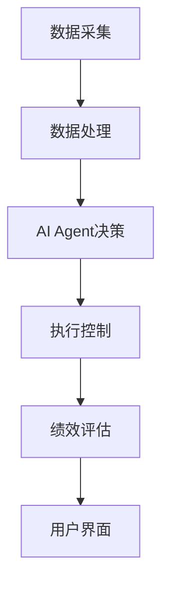
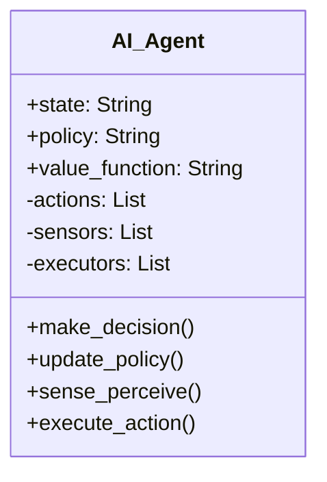
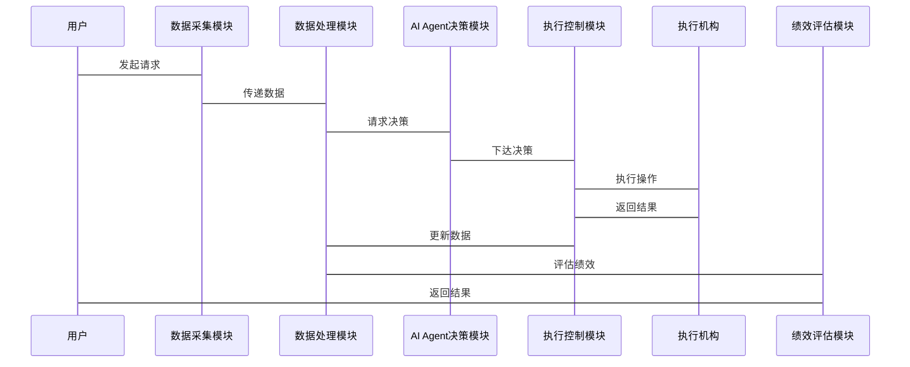

                 


# AI Agent在企业供应链管理中的应用

## 关键词：AI Agent, 供应链管理, 人工智能, 企业优化, 智能决策

## 摘要：本文深入探讨了AI Agent技术在企业供应链管理中的应用，分析了其在供应链优化、库存管理、物流调度等关键环节中的作用，结合具体算法和系统架构设计，展示了如何通过AI Agent提升供应链的智能化水平和运营效率。文章内容涵盖AI Agent的核心原理、算法实现、系统架构、项目实战等多个方面，为企业应用AI Agent提供了理论和实践的双重指导。

---

## 第1章 AI Agent与企业供应链管理的背景

### 1.1 AI Agent的基本概念

AI Agent（人工智能代理）是指能够感知环境并采取行动以实现目标的智能实体。它通过传感器获取信息，利用推理能力做出决策，并通过执行器与环境交互。AI Agent可以是软件程序，也可以是硬件设备，广泛应用于自动化控制、智能推荐、机器人等领域。

#### 1.1.1 AI Agent的定义与特点
- **定义**：AI Agent是一种能够感知环境、自主决策并执行任务的智能系统。
- **特点**：
  - 自主性：无需外部干预，自主完成任务。
  - 反应性：能够实时感知环境并做出反应。
  - 目标导向性：所有行为都围绕实现特定目标展开。
  - 学习能力：通过数据和经验不断优化自身行为。

#### 1.1.2 AI Agent的核心要素与分类
- **核心要素**：
  - 知识表示：如何存储和处理信息。
  - 感知机制：获取环境信息的方式。
  - 决策机制：基于信息做出决策的算法。
  - 执行机制：将决策转化为实际行动。
- **分类**：
  - 按智能级别：简单反射型、基于模型型、目标驱动型。
  - 按应用场景：软件代理、物理代理、人机协作代理。

#### 1.1.3 AI Agent在企业中的应用现状
- **现状**：AI Agent在企业中的应用已逐渐普及，尤其是在自动化流程、智能监控、个性化服务等领域。
- **典型案例**：智能客服、自动化交易系统、智能物流调度。

---

### 1.2 企业供应链管理的概述

供应链管理（Supply Chain Management, SCM）是企业为了满足客户需求，对供应商、制造商、分销商、零售商等环节进行计划、组织和控制的管理过程。

#### 1.2.1 供应链管理的基本概念
- **定义**：供应链管理是指在企业内外部流程中，协调和优化资源、信息、服务的流动，以实现客户需求的满足。
- **关键环节**：
  - 供应商管理：选择和评估供应商，确保原材料供应。
  - 生产计划：制定生产计划，协调生产资源。
  - 库存管理：监控库存水平，避免过剩或短缺。
  - 物流管理：优化运输路线，降低成本。
  - 客户服务：确保订单交付，提升客户满意度。

#### 1.2.2 供应链管理的关键环节与流程
- **关键环节**：
  - 需求预测：基于历史数据和市场分析，预测未来的需求。
  - 计划制定：制定生产、采购和物流计划。
  - 执行控制：监控执行过程，及时调整偏差。
  - 绩效评估：评估供应链的整体表现，找出改进点。
- **流程图**：
  ```mermaid
  graph TD
    A[客户] --> B[订单处理]
    B --> C[库存检查]
    C --> D[采购或生产]
    D --> E[物流运输]
    E --> F[交付客户]
    F --> G[反馈]
    G --> A
  ```

#### 1.2.3 供应链管理的挑战与优化方向
- **挑战**：
  - 数据孤岛：各部门间信息不共享，导致效率低下。
  - 需求波动：市场变化快，预测准确性低。
  - 复杂性：涉及多个环节和参与者，协调困难。
- **优化方向**：
  - 数字化：利用信息技术整合数据，提高透明度。
  - 智能化：引入AI技术，优化决策过程。
  - 柔性化：增强供应链的适应能力，快速响应变化。

---

### 1.3 AI Agent在供应链管理中的应用背景

#### 1.3.1 供应链管理中的痛点与需求
- **痛点**：
  - 数据碎片化：信息分散，难以有效利用。
  - 响应速度慢：传统供应链反应迟钝，难以应对紧急情况。
  - 成本高：库存积压或短缺导致成本增加。
- **需求**：
  - 实时监控：快速获取和处理数据。
  - 自动化决策：减少人为干预，提高效率。
  - 智能预测：准确预测需求，优化库存管理。

#### 1.3.2 AI Agent如何解决供应链问题
- **解决方案**：
  - **实时监控**：AI Agent通过传感器实时采集数据，快速识别问题。
  - **自动化决策**：基于实时数据和历史信息，AI Agent能够快速做出最优决策。
  - **智能预测**：利用机器学习算法，AI Agent可以准确预测市场需求和供应情况。

#### 1.3.3 供应链智能化的发展趋势
- **趋势**：
  - 智能化：AI Agent广泛应用于供应链的各个环节。
  - 数字化：数据驱动决策，提高供应链透明度。
  - 柔性化：供应链更加灵活，能够快速适应市场变化。

---

## 第2章 AI Agent在供应链管理中的核心概念与联系

### 2.1 AI Agent的核心原理

#### 2.1.1 AI Agent的感知与决策机制
- **感知机制**：
  - 传感器：用于采集环境数据，如温度、压力、位置等。
  - 数据处理：对采集到的数据进行预处理和分析。
- **决策机制**：
  - 状态识别：根据当前状态判断下一步行动。
  - 行为选择：基于预设规则或机器学习模型选择最优行为。
  - 执行反馈：根据执行结果调整后续决策。

#### 2.1.2 AI Agent的学习与自适应能力
- **学习机制**：
  - 监督学习：基于标注数据进行训练，提升预测准确性。
  - 强化学习：通过试错机制，不断优化决策策略。
  - 半监督学习：结合标注和非标注数据，提高学习效率。
- **自适应能力**：
  - 动态调整：根据环境变化自动优化参数。
  - 知识更新：持续学习新知识，保持决策的准确性。

#### 2.1.3 AI Agent的多智能体协作
- **协作机制**：
  - 通信协议：定义各智能体之间的通信规则。
  - 协作任务分配：根据任务需求分配资源。
  - 协作决策：多个智能体共同制定最优策略。
- **案例**：智能物流系统中，多个AI Agent协同工作，优化运输路线。

---

### 2.2 供应链管理中的关键概念

#### 2.2.1 供应链的结构与角色
- **结构**：
  - 供应商：提供原材料或服务。
  - 制造商：负责生产产品。
  - 分销商：负责产品的分销。
  - 零售商：直接面对客户。
  - 客户：最终消费者。
- **角色对比表**：
  | 角色   | 职责                 | 关键指标             |
  |--------|----------------------|--------------------|
  | 供应商  | 提供原材料或服务     | 交货及时性、质量     |
  | 制造商  | 组织生产             | 成本、效率           |
  | 分销商  | 分配产品             | 库存周转率、覆盖范围 |
  | 零售商  | 销售产品             | 销量、客户满意度     |
  | 客户    | 购买产品             | 满意度、忠诚度       |

#### 2.2.2 供应链的优化目标与评价指标
- **优化目标**：
  - 最小化成本：降低采购、生产、物流成本。
  - 最大化效率：缩短生产周期，提高交付速度。
  - 提升灵活性：快速响应市场变化，调整供应链策略。
- **评价指标**：
  - 总成本（Total Cost）：包括采购、生产、物流等费用。
  - 交货时间（Delivery Time）：从订单到交付的时间。
  - 库存周转率（Inventory Turnover）：库存的流动性。
  - 客户满意度（Customer Satisfaction）：客户对产品和服务的满意程度。

#### 2.2.3 供应链中的信息流与决策链
- **信息流**：
  - 数据来源：传感器、数据库、外部系统。
  - 数据处理：清洗、分析、建模。
  - 决策输出：生成行动计划。
- **决策链**：
  - 数据输入：收集相关信息。
  - 数据处理：分析数据，识别问题。
  - 决策制定：基于分析结果制定策略。
  - 执行反馈：监控执行效果，调整决策。

---

### 2.3 AI Agent与供应链管理的结合

#### 2.3.1 AI Agent在供应链管理中的应用场景
- **需求预测**：基于历史销售数据和市场趋势，预测未来的需求。
- **库存优化**：根据需求预测和供应商情况，优化库存水平。
- **物流调度**：动态调整运输路线，减少运输成本。
- **供应商选择**：基于供应商的历史表现和能力，选择最优供应商。

#### 2.3.2 AI Agent与供应链流程的深度融合
- **采购环节**：
  - 自动化采购：AI Agent根据需求和市场情况，自动下单采购。
  - 供应商评估：基于历史数据和实时表现，评估供应商的可靠性和成本效益。
- **生产环节**：
  - 生产计划优化：AI Agent根据市场需求和生产能力，制定最优生产计划。
  - 故障预测：通过传感器数据，预测设备故障，提前安排维护。
- **物流环节**：
  - 路径优化：AI Agent动态调整运输路线，避开拥堵路段，降低运输成本。
  - 资源分配：根据订单需求和运输能力，合理分配物流资源。

#### 2.3.3 AI Agent在供应链管理中的价值体现
- **提高效率**：通过自动化决策和实时监控，减少人为干预，提高决策效率。
- **降低成本**：优化库存管理和物流调度，降低运营成本。
- **提升灵活性**：快速响应市场变化，调整供应链策略，增强供应链的适应能力。

---

## 第3章 AI Agent在供应链管理中的算法原理

### 3.1 基于强化学习的AI Agent算法

#### 3.1.1 强化学习的基本原理
- **定义**：强化学习是一种通过试错机制，学习策略以最大化累积奖励的算法。
- **核心要素**：
  - 状态（State）：环境的当前情况。
  - 行动（Action）：智能体采取的动作。
  - 奖励（Reward）：环境对智能体行为的反馈。
  - 策略（Policy）：智能体选择动作的概率分布。
  - 价值函数（Value Function）：评估某个状态下采取某个动作的价值。

#### 3.1.2 在供应链管理中的应用
- **案例**：智能库存管理。
  - **状态**：当前库存水平、需求预测、供应商交货时间。
  - **行动**：增加订单、减少订单、保持现状。
  - **奖励**：库存成本降低，订单满足率提高。

#### 3.1.3 算法实现步骤与代码示例
- **实现步骤**：
  1. 初始化参数：设定学习率、折扣因子等。
  2. 状态感知：通过传感器获取当前状态。
  3. 行为选择：基于策略选择动作。
  4. 执行动作：采取行动，观察环境反馈。
  5. 奖励计算：根据反馈更新奖励。
  6. 策略更新：基于奖励更新策略参数。
- **代码示例**：
  ```python
  import numpy as np

  # 初始化参数
  learning_rate = 0.1
  discount_factor = 0.99

  # 状态空间和动作空间
  states = ['low', 'medium', 'high']
  actions = ['order_up', 'order_down', 'no_change']

  # 初始化价值函数
  value_function = {state: 0 for state in states}

  # 强化学习循环
  for episode in range(1000):
      current_state = 'medium'  # 假设当前状态为中等库存
      action = 'order_up'  # 选择增加订单
      next_state = 'high'  # 假设执行后库存变为高
      reward = 10  # 假设获得奖励10

      # 更新价值函数
      value_function[current_state] += learning_rate * (reward + discount_factor * value_function[next_state] - value_function[current_state])

      # 更新策略
      # 简化策略更新，假设动作选择概率与价值函数相关
      pass  # 简化示例，实际策略更新更复杂

  print(value_function)
  ```

#### 3.1.4 优势分析
- **优势**：
  - 适用于动态环境，能够快速适应变化。
  - 能够处理复杂的决策问题，找到全局最优解。

---

### 3.2 基于监督学习的AI Agent算法

#### 3.2.1 监督学习的基本原理
- **定义**：监督学习是基于标注数据，训练模型进行预测或分类。
- **核心要素**：
  - 特征（Feature）：输入数据的属性。
  - 标签（Label）：对应的正确答案。
  - 模型（Model）：学习特征与标签之间的关系。
  - 损失函数（Loss Function）：衡量预测值与真实值的差异。
  - 优化算法（Optimizer）：调整模型参数以最小化损失。

#### 3.2.2 在供应链预测中的应用
- **案例**：需求预测。
  - **输入数据**：历史销售数据、市场趋势、季节性因素。
  - **输出结果**：未来需求预测。

#### 3.2.3 算法实现步骤与代码示例
- **实现步骤**：
  1. 数据准备：收集和整理相关数据。
  2. 特征工程：选择和处理特征。
  3. 模型训练：基于训练数据训练模型。
  4. 模型评估：使用测试数据评估模型性能。
  5. 预测部署：将模型应用于实际数据，生成预测结果。
- **代码示例**：
  ```python
  import pandas as pd
  from sklearn.linear_model import LinearRegression
  from sklearn.metrics import mean_squared_error

  # 数据准备
  data = pd.DataFrame({
      'month': [1,2,3,4,5],
      'demand': [100, 150, 200, 180, 220]
  })

  # 特征工程
  X = data[['month']]
  y = data['demand']

  # 模型训练
  model = LinearRegression()
  model.fit(X, y)

  # 模型评估
  predictions = model.predict(X)
  mse = mean_squared_error(y, predictions)
  print(f'Mean Squared Error: {mse}')

  # 预测部署
  new_month = 6
  predicted_demand = model.predict([[new_month]])
  print(f'_predicted demand for month {new_month} is {predicted_demand[0]:.2f}')
  ```

#### 3.2.4 优势分析
- **优势**：
  - 训练简单，适合处理有明确标签的数据。
  - 可解释性强，便于分析预测结果。

---

### 3.3 基于图神经网络的AI Agent算法

#### 3.3.1 图神经网络的基本原理
- **定义**：图神经网络是一种处理图结构数据的深度学习模型。
- **核心要素**：
  - 图结构：节点之间的关系。
  - 节点特征：每个节点的属性。
  - 边权重：节点之间关系的强度。
- **工作原理**：
  - 通过聚合邻居节点的信息，逐步传播信息，最终生成节点表示。
  - 基于节点表示进行分类或回归。

#### 3.3.2 在供应链网络优化中的应用
- **案例**：供应商网络优化。
  - **输入数据**：供应商之间的关系、供应商的绩效数据。
  - **输出结果**：优化后的供应商网络结构。

#### 3.3.3 算法实现步骤与代码示例
- **实现步骤**：
  1. 数据准备：构建供应商关系图。
  2. 模型训练：基于图数据训练图神经网络。
  3. 模型评估：评估模型在测试数据上的表现。
  4. 应用部署：将模型应用于实际数据，优化供应商网络。
- **代码示例**：
  ```python
  import tensorflow as tf
  from tensorflow.keras import layers

  # 数据准备
  # 假设供应商关系图表示为边的列表，例如：[(0,1), (1,2), (2,3), ...]

  # 图神经网络模型
  class GraphNN(tf.keras.Model):
      def __init__(self):
          super(GraphNN, self).__init__()
          self.embedding = layers.Embedding(input_dim=10, output_dim=32)
          self.gcn_layer = layers.GraphConvolution(filters=16, kernel_size=2)
          self.dense = layers.Dense(1, activation='sigmoid')

      def call(self, inputs):
          x = self.embedding(inputs)
          x = self.gcn_layer(x)
          x = self.dense(x)
          return x

  # 模型训练
  model = GraphNN()
  model.compile(optimizer='adam', loss='binary_crossentropy')
  model.fit(x_train, y_train, epochs=10, batch_size=32)

  # 预测部署
  predictions = model.predict(x_test)
  ```

#### 3.3.4 优势分析
- **优势**：
  - 能够处理复杂的网络结构，捕捉节点之间的关系。
  - 适用于非结构化数据，提升模型的泛化能力。

---

## 第4章 AI Agent在供应链管理中的系统架构与设计

### 4.1 供应链管理系统的整体架构

#### 4.1.1 系统的功能模块划分
- **功能模块**：
  - 数据采集模块：采集供应链各环节的数据。
  - 数据处理模块：清洗、转换和分析数据。
  - AI Agent决策模块：基于数据做出决策。
  - 执行控制模块：将决策转化为实际操作。
  - 绩效评估模块：评估系统运行效果。

#### 4.1.2 系统的层次结构设计
- **层次结构**：
  - **感知层**：通过传感器和接口采集数据。
  - **数据层**：存储和管理数据。
  - **决策层**：AI Agent进行分析和决策。
  - **执行层**：执行决策，调整供应链运作。
  - **展示层**：用户界面展示系统运行状态。

#### 4.1.3 系统的可扩展性与灵活性
- **可扩展性**：支持新增模块和功能扩展。
- **灵活性**：能够快速适应市场变化和业务需求。

---

### 4.2 供应链管理系统的架构设计

#### 4.2.1 系统架构图


#### 4.2.2 系统接口设计
- **接口类型**：
  - 数据接口：与传感器、数据库交互。
  - 用户接口：供用户查看和控制系统。
  - 外部系统接口：与供应商、客户等外部系统交互。

#### 4.2.3 系统交互流程
- **流程描述**：
  1. 数据采集模块通过传感器采集供应链各环节的数据。
  2. 数据处理模块对数据进行清洗、转换和分析，生成可供决策的特征。
  3. AI Agent决策模块基于分析结果，制定最优决策。
  4. 执行控制模块根据决策生成行动计划，控制执行机构执行。
  5. 绩效评估模块监控执行过程，评估系统运行效果，并将结果反馈给AI Agent决策模块进行优化。

---

## 第5章 AI Agent在供应链管理中的项目实战

### 5.1 项目背景与目标

#### 5.1.1 项目背景
- **行业背景**：当前供应链管理面临的需求预测不准确、库存积压、物流成本高等问题。
- **项目目标**：通过引入AI Agent技术，优化供应链管理流程，降低运营成本，提高效率。

#### 5.1.2 项目介绍
- **项目名称**：智能供应链优化系统。
- **项目目标**：
  - 实现需求预测的准确性。
  - 优化库存管理，降低库存成本。
  - 动态调整物流路线，提高交付效率。

---

### 5.2 系统功能设计

#### 5.2.1 领域模型设计


#### 5.2.2 系统架构设计


#### 5.2.3 系统接口设计
- **接口列表**：
  - 传感器接口：与温度、压力等传感器交互。
  - 数据库接口：与订单、库存等数据库交互。
  - 用户接口：供用户查看系统状态和控制参数。
- **接口交互流程**：
  1. 传感器采集数据，通过传感器接口传入系统。
  2. 数据处理模块接收数据，进行清洗和分析。
  3. AI Agent决策模块基于处理后的数据，制定决策。
  4. 执行控制模块接收决策，控制执行机构执行。
  5. 执行结果反馈给绩效评估模块，评估系统运行效果。

#### 5.2.4 系统交互流程


---

## 第6章 总结与展望

### 6.1 最佳实践 Tips

- **数据质量**：确保数据的准确性和完整性，数据是AI Agent决策的基础。
- **模型选择**：根据具体场景选择合适的算法，避免盲目使用高级算法。
- **系统集成**：确保AI Agent与现有系统无缝集成，减少数据孤岛。
- **持续优化**：定期评估系统运行效果，根据反馈优化模型和系统设计。

### 6.2 小结

通过本文的详细讲解，我们了解了AI Agent在企业供应链管理中的重要应用。从核心概念到算法实现，再到系统设计和项目实战，AI Agent展示了其在提升供应链效率、降低成本和优化决策方面的巨大潜力。

### 6.3 注意事项

- **数据隐私**：在处理供应链数据时，需注意数据隐私和安全问题。
- **系统稳定性**：确保AI Agent系统的稳定运行，避免因系统故障影响供应链运作。
- **人机协作**：AI Agent应与人类专家协同工作，避免完全依赖机器决策。

### 6.4 拓展阅读

- **推荐书籍**：
  - 《供应链管理：原理、策略与实践》
  - 《人工智能：一种现代的方法》
- **推荐博客**：
  - AI Agent在供应链管理中的最新研究和应用案例。
  - 图神经网络在供应链优化中的应用。

---

## 作者：AI天才研究院/AI Genius Institute & 禅与计算机程序设计艺术 /Zen And The Art of Computer Programming

---

通过本文的详细分析，我们不仅了解了AI Agent在供应链管理中的理论基础，还通过具体案例和系统设计展示了其实际应用。希望本文能为企业的供应链优化提供有价值的参考和指导。

