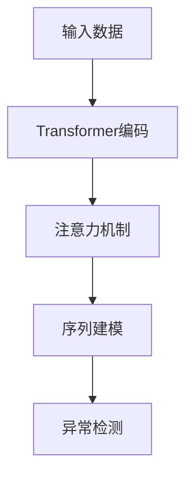
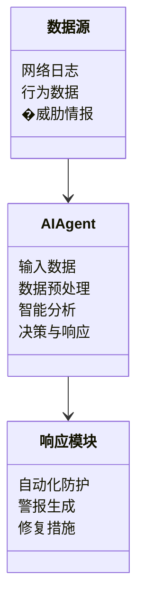
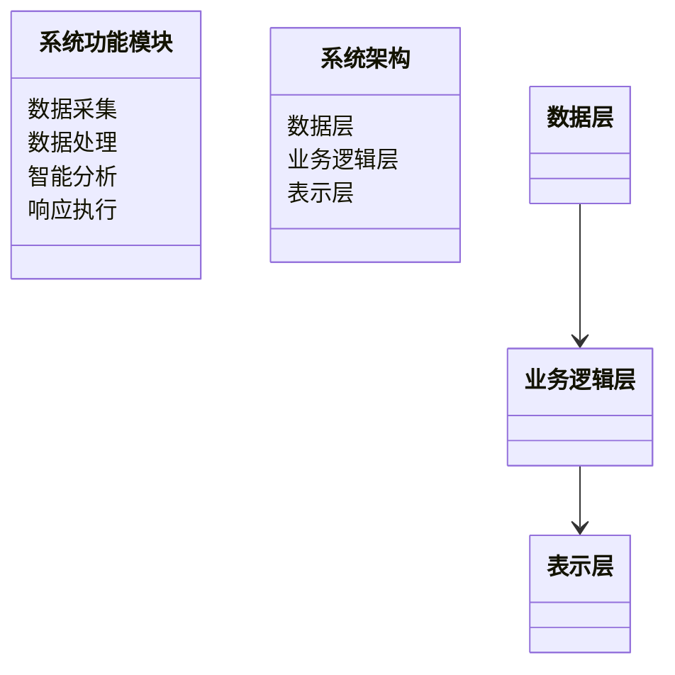

                 

<think>
好的，我现在要帮用户完成一个技术博客文章的撰写，主题是《AI Agent在企业信息安全威胁检测与响应中的前沿应用》。首先，我需要仔细分析用户的需求，确保我理解所有要求。

用户希望文章结构清晰，逻辑紧凑，语言专业，同时包含大量技术细节。我注意到用户已经提供了一个详细的大纲，分为六个章节，每个章节都有明确的主题和小节。这意味着我需要按照这个大纲逐步展开内容，确保每一部分都详尽且深入。

首先，我需要明确每个章节的核心内容。第一章是背景介绍，涵盖AI Agent的基本概念、企业信息安全的现状和挑战，以及AI Agent在安全中的应用优势。这里，我应该确保定义清晰，问题描述透彻，同时突出AI的优势。

接下来是第二章，重点讲解AI Agent的核心概念和原理。这里可能需要详细的技术分析，包括数学模型和算法。我需要使用mermaid图和latex公式来展示这些内容，确保读者能够理解复杂的原理。

第三章和第四章分别讨论威胁检测和响应策略。我需要在这两章中详细讲解具体的算法，如基于Transformer的模型，以及强化学习的应用。这部分内容需要包含数学公式和代码示例，帮助读者更好地理解和应用。

第五章是系统设计部分，涉及系统架构、接口设计和交互流程。我需要绘制类图和序列图，展示系统的各个模块及其交互方式。这部分内容需要逻辑清晰，结构合理，便于读者理解系统的整体运作。

最后，第六章是总结与展望，回顾整个内容，并讨论未来的研究方向。我需要确保总结部分简洁有力，同时为读者提供进一步的学习和研究方向。

在整个撰写过程中，我必须注意以下几点：首先，确保每一部分都包含足够的技术细节，比如数学模型、算法流程图和代码示例。其次，语言要专业但不失清晰，避免过于晦涩。最后，确保文章结构完整，各章节之间有良好的衔接。

在实际撰写时，我可能会遇到一些挑战。例如，如何将复杂的数学模型用简单的语言解释清楚，或者如何在有限的篇幅内详细讲解系统架构设计。这时候，我需要合理安排内容，使用图表和代码示例来辅助说明，同时保持逻辑的连贯性。

总之，我需要按照用户提供的大纲，逐步展开每一部分的内容，确保技术细节的准确性，同时保持文章的可读性和专业性。这将帮助读者全面理解AI Agent在企业信息安全中的应用，并为他们提供实用的技术指导。
</think>

# AI Agent在企业信息安全威胁检测与响应中的前沿应用

关键词：AI Agent, 企业信息安全, 威胁检测, 威胁响应, 智能安全

摘要：随着企业信息安全威胁的日益复杂化和智能化，传统的安全防护手段已难以应对新型威胁的挑战。本文深入探讨了AI Agent在企业信息安全领域的前沿应用，从AI Agent的基本概念、核心原理到其在威胁检测与响应中的具体实现进行了系统性分析。文章结合实际案例和数学模型，详细阐述了基于AI Agent的安全威胁检测与响应技术，为企业的信息安全防护提供了新的思路和解决方案。

---

## 第1章: AI Agent与企业信息安全概述

### 1.1 AI Agent的基本概念
AI Agent（人工智能代理）是指能够感知环境、自主决策并执行任务的智能体。它通过数据驱动的方式，结合机器学习、自然语言处理、图神经网络等技术，具备以下特点：
- **自主性**：能够独立感知环境并执行任务。
- **反应性**：能够实时响应环境中的变化。
- **学习能力**：通过数据和经验不断优化自身的性能。

### 1.2 企业信息安全的核心问题
企业在信息安全方面面临的主要挑战包括：
- **复杂性**：企业网络环境复杂，攻击面广泛。
- **智能化**：攻击者使用AI技术进行高级持续性威胁（APT）攻击。
- **实时性**：传统安全防护手段难以实现快速响应。

### 1.3 AI Agent在企业安全中的应用前景
AI Agent在企业信息安全中的应用前景广阔，特别是在威胁检测与响应领域。通过AI Agent的智能化特性，企业可以实现：
- **实时威胁检测**：快速识别潜在威胁。
- **智能响应**：根据威胁的性质和影响范围，自适应地采取响应措施。
- **数据驱动防护**：利用历史数据和实时数据优化安全策略。

---

## 第2章: AI Agent的核心概念与原理

### 2.1 AI Agent的核心概念
AI Agent在企业信息安全中的核心概念包括：
- **数据驱动**：AI Agent通过分析大量数据来识别异常行为。
- **智能分析**：利用机器学习、深度学习等技术进行威胁分析。
- **自适应响应**：根据威胁的动态变化，实时调整防护策略。

### 2.2 AI Agent的工作原理
AI Agent的工作流程如下：
1. **数据采集**：从企业网络、日志、行为数据等来源获取信息。
2. **特征提取**：通过数据预处理提取关键特征。
3. **智能分析**：利用机器学习模型进行异常检测和关联分析。
4. **决策与响应**：基于分析结果，采取相应的防护措施。

### 2.3 AI Agent的数学模型与算法
AI Agent的数学模型主要包括：
- **异常检测模型**：基于深度学习的异常检测模型，如Transformer架构。
- **关联分析模型**：基于图神经网络的关联分析模型。
- **响应策略模型**：基于强化学习的响应策略模型。

---

## 第3章: 基于AI Agent的安全威胁检测技术

### 3.1 威胁检测的核心技术
- **基于Transformer的异常检测**：通过序列建模发现异常行为。
- **基于自然语言处理的威胁情报分析**：利用NLP技术分析威胁情报。
- **基于图神经网络的关联分析**：识别跨设备和事件的关联性。

### 3.2 基于Transformer的威胁检测模型

### 3.3 威胁检测的数学模型与公式
异常检测的数学模型如下：
$$
P(x) = \frac{1}{(2\pi)^{n/2}|\Sigma|^{1/2}}} \cdot \exp\left(-\frac{1}{2}(x-\mu)^T \Sigma^{-1}(x-\mu)\right)
$$

---

## 第4章: 基于AI Agent的安全威胁响应策略

### 4.1 威胁响应的核心技术
- **基于强化学习的响应策略**：通过强化学习优化响应决策。
- **基于知识图谱的决策支持**：利用知识图谱进行威胁分析和决策。
- **基于反馈机制的自适应响应**：根据反馈优化响应策略。

### 4.2 威胁响应的数学模型与算法
强化学习的响应策略如下：
$$
Q(s,a) = r + \gamma \max_{a'} Q(s',a')
$$

### 4.3 威胁响应的系统架构设计

---

## 第5章: 基于AI Agent的安全威胁检测与响应系统设计

### 5.1 系统设计目标与需求分析
系统设计目标包括：
- 实现实时威胁检测
- 提供智能响应策略
- 支持数据驱动的优化

### 5.2 系统功能设计

---

## 第6章: 总结与展望

### 6.1 总结
本文详细探讨了AI Agent在企业信息安全威胁检测与响应中的应用，通过数学模型、算法和系统设计的分析，展示了AI Agent在安全防护中的巨大潜力。

### 6.2 未来展望
未来的研究方向包括：
- 更高效的异常检测算法
- 更智能的响应策略
- 更 robust 的AI Agent设计

---

作者：AI天才研究院/AI Genius Institute & 禅与计算机程序设计艺术 /Zen And The Art of Computer Programming

