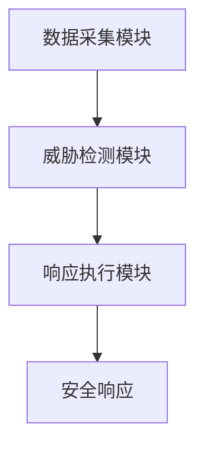
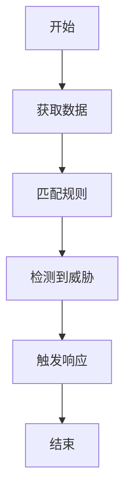
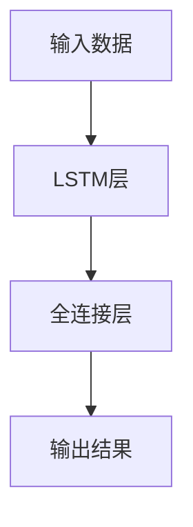
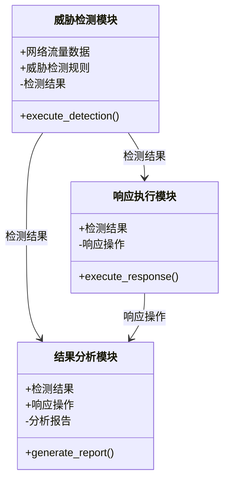
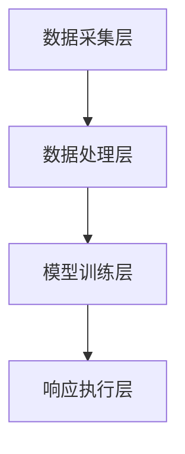

                 


# AI Agent在企业信息安全威胁检测与响应中的应用

## 关键词：AI Agent, 企业信息安全, 威胁检测, 响应执行, 深度学习, 统计学习, 系统架构

## 摘要

随着企业信息安全威胁的日益复杂化和智能化，传统的威胁检测与响应方法已经难以应对新型威胁的挑战。AI Agent作为一种智能化的信息安全解决方案，能够通过学习和推理，实时检测和响应安全威胁。本文详细探讨了AI Agent在企业信息安全中的应用，从核心概念、技术原理到系统架构，再到项目实战，全面分析了AI Agent在威胁检测与响应中的优势和实现方法。通过本文的阐述，读者可以深入了解AI Agent如何在企业信息安全领域发挥关键作用。

---

## 第一部分：背景介绍

### 第1章：AI Agent与企业信息安全概述

#### 1.1 AI Agent的基本概念

AI Agent（人工智能代理）是一种能够感知环境、自主决策并执行任务的智能实体。它结合了机器学习、自然语言处理和推理技术，能够在复杂环境中完成特定任务。AI Agent的核心特点包括：

- **智能性**：能够通过数据学习，识别模式并做出决策。
- **自主性**：能够在没有人工干预的情况下执行任务。
- **适应性**：能够根据环境变化动态调整行为。

在企业信息安全领域，AI Agent的主要作用是实时监控网络流量、识别异常行为并执行响应操作。例如，AI Agent可以通过分析日志数据，发现潜在的安全威胁并自动触发防御机制。

#### 1.2 企业信息安全威胁检测与响应的背景

随着企业数字化转型的深入，信息安全威胁变得越来越复杂。传统的基于规则的威胁检测方法依赖于预定义的规则，难以应对新型威胁的多样性。而AI Agent通过学习和推理，能够识别未知威胁，显著提高了威胁检测的准确性。

企业信息安全威胁检测与响应的核心目标是快速发现威胁并采取有效措施，以最小化潜在损失。然而，传统方法在以下方面存在局限性：

- **响应速度**：基于规则的系统无法快速适应新的威胁模式。
- **检测精度**：传统方法容易产生误报或漏报。
- **复杂性**：面对海量数据和复杂场景，传统方法难以高效处理。

AI Agent通过结合机器学习和实时分析，能够克服这些局限性，为企业提供更高效、更智能的安全解决方案。

---

## 第二部分：核心概念与技术原理

### 第2章：AI Agent的核心概念与技术原理

#### 2.1 AI Agent的核心概念

AI Agent在企业信息安全中的应用主要依赖于以下三种技术原理：

1. **基于规则的威胁检测**：通过预定义的规则和模式匹配，识别已知威胁。
2. **统计学习**：利用机器学习算法，从历史数据中学习威胁特征，识别潜在威胁。
3. **深度学习**：通过神经网络模型，自动提取数据中的高层次特征，识别复杂威胁。

下表对比了三种技术的优缺点：

| 技术原理   | 优点                               | 缺点                               |
|------------|------------------------------------|------------------------------------|
| 基于规则   | 实现简单，易于解释                | 无法检测未知威胁                   |
| 统计学习   | 能够识别未知威胁，适应性较强      | 对数据质量和数量要求较高           |
| 深度学习   | 能够提取复杂特征，识别高度隐蔽威胁 | 计算资源消耗大，实现复杂           |

#### 2.2 AI Agent的技术架构

AI Agent的技术架构包括以下几个关键模块：

1. **数据采集模块**：负责收集企业网络中的日志、流量和行为数据。
2. **威胁检测模块**：通过机器学习模型分析数据，识别潜在威胁。
3. **响应执行模块**：根据检测结果，触发相应的安全响应措施，如隔离异常设备或阻止恶意流量。

下图展示了AI Agent的技术架构图（Mermaid）：



---

## 第三部分：算法原理与数学模型

### 第3章：AI Agent的算法原理

#### 3.1 基于规则的威胁检测算法

基于规则的威胁检测是一种简单但有效的方法。其核心思想是通过预定义的规则匹配数据中的异常行为。例如，检测未经授权的访问尝试可以通过匹配特定的IP地址或用户行为模式。

**算法流程图（Mermaid）**：



**Python代码示例**：

```python
def detect_threat(logs, rules):
    for log in logs:
        for rule in rules:
            if log matches rule:
                return True
    return False
```

**数学模型与公式**：

基于规则的检测可以通过逻辑回归模型进行分类。设`y`为威胁标签（1表示威胁，0表示正常），`x_i`为输入特征，模型可以表示为：

$$ P(y=1|x) = \frac{1}{1 + e^{-\beta x}} $$

其中，$\beta$是模型参数。

#### 3.2 统计学习与深度学习算法

统计学习方法包括聚类和分类算法，用于识别数据中的异常模式。深度学习模型（如LSTM）则能够捕捉数据中的时间序列特征，适用于检测复杂威胁。

**LSTM模型结构（Mermaid）**：



**数学模型与公式**：

LSTM的长短期记忆单元可以表示为：

$$ f_t = \sigma(W_f \cdot [h_{t-1}, x_t] + b_f) $$
$$ i_t = \sigma(W_i \cdot [h_{t-1}, x_t] + b_i) $$
$$ o_t = \sigma(W_o \cdot [h_{t-1}, x_t] + b_o) $$
$$ c_t = f_t \cdot c_{t-1} + i_t \cdot tanh(W_c \cdot [h_{t-1}, x_t] + b_c) $$
$$ h_t = o_t \cdot tanh(c_t) $$

---

## 第四部分：系统分析与架构设计

### 第4章：系统架构与设计

#### 4.1 项目背景与目标

本项目旨在开发一个基于AI Agent的企业信息安全威胁检测与响应系统。系统的目标是实现对网络流量的实时监控，快速检测威胁并执行响应操作。

#### 4.2 系统功能设计

系统功能设计包括以下模块：

1. **威胁检测模块**：负责分析网络流量，识别潜在威胁。
2. **响应执行模块**：根据检测结果，执行相应的安全措施。
3. **结果分析模块**：记录检测结果和响应操作，供后续分析。

下图展示了系统功能设计的领域模型（Mermaid类图）：



#### 4.3 系统架构设计

系统架构设计包括以下几个部分：

1. **数据采集层**：负责采集网络流量数据。
2. **数据处理层**：对数据进行预处理和特征提取。
3. **模型训练层**：训练机器学习模型，识别威胁。
4. **响应执行层**：根据检测结果，执行安全响应。

下图展示了系统架构设计（Mermaid架构图）：



---

## 第五部分：项目实战

### 第5章：AI Agent在企业安全中的实战应用

#### 5.1 环境安装

项目实战需要以下环境：

- **操作系统**：Linux/Windows
- **编程语言**：Python 3.8+
- **框架**：TensorFlow/PyTorch
- **工具**：Jupyter Notebook
- **数据集**：企业网络日志数据

#### 5.2 核心代码实现

以下是威胁检测模块的核心代码示例：

```python
import tensorflow as tf
from tensorflow.keras import layers

# 定义LSTM模型
def build_model(input_shape):
    model = tf.keras.Sequential()
    model.add(layers.LSTM(64, input_shape=input_shape))
    model.add(layers.Dense(1, activation='sigmoid'))
    model.compile(loss='binary_crossentropy', optimizer='adam', metrics=['accuracy'])
    return model

# 训练模型
model = build_model((max_length, features))
model.fit(X_train, y_train, epochs=10, batch_size=32)
```

#### 5.3 代码解读与分析

上述代码定义了一个基于LSTM的深度学习模型，用于分类正常流量和异常流量。模型通过训练数据学习流量特征，能够在测试阶段识别潜在威胁。

#### 5.4 实际案例分析

以下是一个实际案例分析：

1. **数据采集**：采集企业网络的流量日志。
2. **数据预处理**：提取特征并归一化。
3. **模型训练**：使用LSTM模型训练威胁检测模型。
4. **威胁检测**：实时监控网络流量，识别异常行为。
5. **响应执行**：触发安全措施，如断开异常设备的网络连接。

---

## 第六部分：总结与展望

### 6.1 总结

本文详细探讨了AI Agent在企业信息安全威胁检测与响应中的应用。通过分析AI Agent的核心概念、技术原理和系统架构，展示了其在提高威胁检测精度和响应速度方面的优势。项目实战部分通过具体案例，验证了AI Agent的实际应用价值。

### 6.2 注意事项与最佳实践

- **数据质量**：确保训练数据的多样性和代表性。
- **模型更新**：定期更新模型以应对新型威胁。
- **系统监控**：实时监控系统性能，及时优化配置。

### 6.3 未来展望

随着AI技术的不断发展，AI Agent在企业信息安全中的应用前景广阔。未来的研究方向包括：

- 更高效的威胁检测算法。
- 更智能的响应策略。
- 更强大的跨平台兼容性。

---

## 作者

作者：AI天才研究院/AI Genius Institute & 禅与计算机程序设计艺术 /Zen And The Art of Computer Programming

---

以上是《AI Agent在企业信息安全威胁检测与响应中的应用》的完整目录大纲和文章内容。

