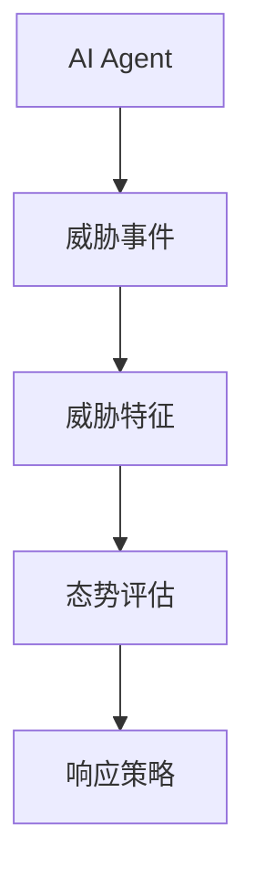
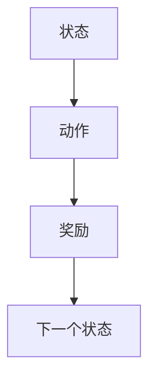
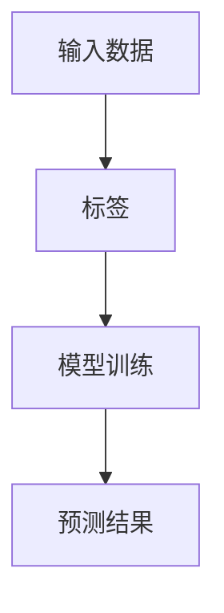
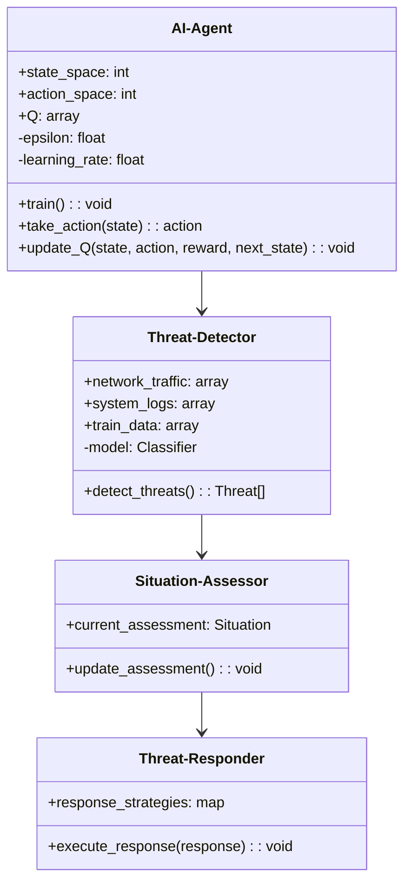
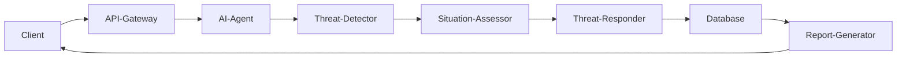
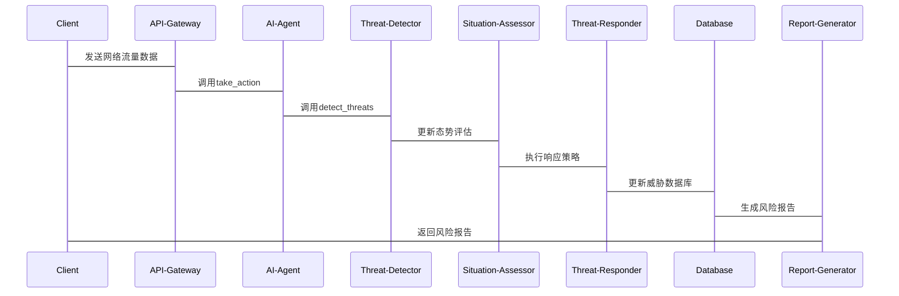

                 


# AI Agent在企业信息安全态势感知与威胁响应中的应用

> 关键词：AI Agent, 企业信息安全, 威胁响应, 态势感知, 机器学习, 安全架构

> 摘要：本文探讨了AI Agent在企业信息安全态势感知与威胁响应中的应用，分析了其核心概念、算法原理、系统架构，并通过实际案例展示了其在威胁检测与响应中的潜力。

## 第1章: 引言

### 1.1 问题背景

#### 1.1.1 企业信息安全面临的挑战
- 随着数字化转型的加速，企业面临的安全威胁日益复杂和多样化。
- 攻击者利用零日漏洞、高级持续性威胁（APT）等手段对企业发起攻击。
- 传统基于规则的安全解决方案难以应对动态变化的威胁。

#### 1.1.2 问题描述
- 企业需要实时监控网络安全状态，快速识别和响应潜在威胁。
- 威胁 actors 的行为模式复杂，传统安全工具难以有效检测和应对。
- 需要一种智能化、自动化的方法来提升安全响应效率。

#### 1.1.3 AI Agent的作用
- AI Agent能够通过机器学习算法实时分析网络流量，识别异常行为。
- 能够基于历史数据和实时信息动态调整安全策略，实现主动防御。
- 提供实时的态势感知能力，帮助企业在攻击发生前进行有效防御。

### 1.2 问题解决

#### 1.2.1 AI Agent的核心能力
- 自适应学习能力：能够根据新的威胁信息不断优化自身的检测和响应能力。
- 多目标决策能力：在复杂的网络环境中，能够同时关注多个威胁指标，并做出最优决策。
- 自主响应能力：在检测到威胁后，能够自动采取措施，如隔离受感染设备、阻止恶意流量等。

#### 1.2.2 基于AI Agent的威胁检测与响应
- 利用自然语言处理（NLP）技术分析安全日志，识别潜在威胁。
- 通过强化学习（Reinforcement Learning）优化威胁响应策略。
- 实现从威胁检测到响应的自动化流程，减少人工干预。

#### 1.2.3 实时态势感知与决策支持
- 提供实时的安全态势可视化，帮助企业安全团队快速理解当前安全状态。
- 基于AI Agent的分析结果，生成风险评估报告，指导企业的安全策略调整。
- 支持决策者在面对复杂威胁时做出更明智的决策。

### 1.3 边界与外延

#### 1.3.1 AI Agent的适用范围
- 主要适用于需要实时监控和快速响应的网络环境。
- 适用于处理海量数据，需要自动化决策的场景。
- 可应用于企业内部网络、云环境以及物联网（IoT）等不同场景。

#### 1.3.2 与其他安全技术的关系
- 与传统的基于规则的安全工具相辅相成。
- 与安全信息和事件管理（SIEM）系统集成，提升整体安全能力。
- 与入侵检测系统（IDS）和入侵防御系统（IPS）协同工作，形成多层次的安全防护体系。

#### 1.3.3 应用中的潜在风险与挑战
- 数据隐私和安全问题：AI Agent需要处理大量敏感数据，如何确保数据安全是一个重要挑战。
- 模型训练数据的质量：如果训练数据中存在偏见或不完整，可能导致AI Agent做出错误决策。
- 操纵风险：攻击者可能通过操控输入数据影响AI Agent的决策，导致安全系统误判。

### 1.4 概念结构与核心要素

#### 1.4.1 AI Agent的基本组成
- 感知模块：负责收集和分析网络流量、日志等数据，识别潜在威胁。
- 决策模块：基于感知结果，生成威胁响应策略。
- 执行模块：根据决策模块的指示，采取具体的安全措施，如阻断恶意流量、隔离受感染设备等。

#### 1.4.2 基于AI Agent的态势感知系统架构
- 数据采集层：负责收集网络流量、日志、资产信息等数据。
- 数据分析层：利用机器学习算法对数据进行分析，识别潜在威胁。
- 决策支持层：基于分析结果，生成风险评估报告，并提出应对策略。
- 响应执行层：根据决策层的指示，采取相应的安全措施。

#### 1.4.3 威胁响应机制的核心要素
- 威胁检测：准确识别潜在威胁，减少误报和漏报。
- 威胁分析：对检测到的威胁进行深入分析，理解其性质和潜在影响。
- 响应决策：基于分析结果，制定并执行相应的安全响应措施。
- 响应评估：对响应措施的效果进行评估，总结经验教训，优化未来的响应策略。

## 第2章: AI Agent的核心概念与联系

### 2.1 核心概念原理

#### 2.1.1 AI Agent的定义与分类
- AI Agent是一种能够感知环境、自主决策并采取行动的智能体。
- 根据应用场景的不同，AI Agent可以分为监督式AI Agent、无监督式AI Agent和强化学习式AI Agent。

#### 2.1.2 基于AI Agent的态势感知模型
- 分层架构：包括数据采集层、数据处理层、威胁分析层和决策层。
- 多源数据融合：整合来自不同数据源的信息，提高威胁检测的准确性。
- 实时更新：根据最新的数据和威胁情报，动态调整威胁分析模型。

#### 2.1.3 威胁响应的智能化实现
- 自动化响应：AI Agent能够根据检测到的威胁自动采取应对措施。
- 智能决策：结合上下文信息，权衡不同威胁的严重性，做出最优响应决策。
- 自适应学习：根据新的威胁信息，优化自身的检测和响应能力。

### 2.2 概念属性特征对比

#### 2.2.1 不同AI Agent的对比分析
| 特性                | 监督式AI Agent        | 无监督式AI Agent      | 强化学习式AI Agent    |
|---------------------|----------------------|----------------------|----------------------|
| 数据依赖            | 需要标记数据          | 无标记数据            | 需要环境反馈          |
| 学习目标            | 分类、回归等           | 聚类、异常检测         | 最大化累积奖励        |
| 应用场景            | 垃圾邮件分类、威胁检测 | 聚类分析、无监督威胁检测 | 自动化威胁响应、博弈对抗 |

#### 2.2.2 基于特征的威胁检测与响应
- 基于统计特征：如网络流量的异常流量检测。
- 基于行为特征：如用户行为分析，识别异常登录行为。
- 基于上下文特征：如地理位置、设备信息等，辅助威胁判断。

#### 2.2.3 实时态势感知的性能指标
- 检测准确率：正确识别威胁的能力。
- 响应延迟：从检测到响应的时间间隔。
- 系统可用性：在高负载情况下的稳定性。
- 资源消耗：系统运行的资源占用情况。

### 2.3 ER实体关系图



## 第3章: 算法原理讲解

### 3.1 算法原理

#### 3.1.1 强化学习算法



数学公式：
- 状态值函数：$$ V(s) = \max_{a} Q(s,a) $$
- 动作值函数：$$ Q(s,a) = r + \gamma \max_{a'} Q(s',a') $$
- 奖励函数：$$ r = f(s,a) $$

#### 3.1.2 监督学习算法



数学公式：
- 损失函数：$$ L = \frac{1}{n}\sum_{i=1}^{n} (y_i - \hat{y}_i)^2 $$
- 优化目标：$$ \min_{\theta} L $$

### 3.2 算法实现

#### 3.2.1 强化学习实现

```python
import numpy as np

class AI-Agent:
    def __init__(self, state_space, action_space):
        self.state_space = state_space
        self.action_space = action_space
        self.Q = np.zeros((state_space, action_space))
    
    def take_action(self, state):
        # 探索与利用策略
        if np.random.random() < 0.1:
            return np.random.randint(self.action_space)
        else:
            return np.argmax(self.Q[state])
    
    def update_Q(self, state, action, reward, next_state):
        self.Q[state, action] = reward + 0.9 * max(self.Q[next_state])
```

#### 3.2.2 监督学习实现

```python
from sklearn.linear_model import LinearRegression

model = LinearRegression()
X = [[...], [...]]  # 输入特征
y = [1, 0, 1, ...]   # 标签
model.fit(X, y)
```

### 3.3 算法对比分析

| 特性                | 监督学习                | 强化学习                |
|---------------------|------------------------|------------------------|
| 数据要求            | 需要标记数据            | 无标记数据，需要环境反馈 |
| 学习目标            | 分类、回归              | 最大化累积奖励          |
| 应用场景            | 威胁分类、异常检测      | 自动化威胁响应          |
| 优势                | 易于实现，适合模式识别  | 能够处理序列决策问题    |

## 第4章: 系统分析与架构设计

### 4.1 问题场景介绍

#### 4.1.1 网络流量监控
- 实时监控企业内网和外网的流量，识别异常行为。
- 分析流量特征，检测潜在的网络攻击行为。

#### 4.1.2 安全日志分析
- 对安全设备的日志进行收集和分析，识别异常登录行为。
- 分析用户行为模式，发现潜在的内部威胁。

### 4.2 项目介绍

#### 4.2.1 项目目标
- 实现基于AI Agent的实时威胁检测与响应系统。
- 提供态势感知能力，帮助企业安全团队快速应对威胁。

#### 4.2.2 项目范围
- 网络流量监控
- 安全日志分析
- 威胁响应自动化
- 实时态势感知

### 4.3 系统功能设计

#### 4.3.1 领域模型



#### 4.3.2 系统架构设计



### 4.4 系统接口设计

#### 4.4.1 接口列表

| 接口名称         | 输入               | 输出               |
|------------------|--------------------|--------------------|
| take_action      | state              | action             |
| update_Q         | state, action, reward, next_state | -                  |
| detect_threats  | -                  | Threat[]           |
| execute_response | response           | -                  |
| update_assessment| -                  | -                  |

#### 4.4.2 交互设计



## 第5章: 项目实战

### 5.1 环境安装

```bash
pip install numpy scikit-learn matplotlib
```

### 5.2 核心代码实现

#### 5.2.1 威胁检测模块

```python
from sklearn.ensemble import IsolationForest

# 训练模型
model = IsolationForest(n_estimators=100, random_state=42)
model.fit(X_train)

# 预测异常
y_pred = model.predict(X_test)
```

#### 5.2.2 威胁响应模块

```python
import pandas as pd
import numpy as np

def execute_response(response):
    if response == 'block':
        # 阻止恶意流量
        pass
    elif response == 'isolate':
        # 隔离受感染设备
        pass
    elif response == 'alert':
        # 发出警报
        pass

# 示例响应
execute_response('block')
```

### 5.3 代码解读与分析

- 威胁检测模块使用孤立森林算法（Isolation Forest）进行异常检测。
- 威胁响应模块根据检测结果执行相应的安全措施，如阻止恶意流量、隔离设备或发出警报。

### 5.4 实际案例分析

#### 5.4.1 案例背景
- 某企业遭受DDoS攻击，网络流量异常。
- 使用AI Agent进行实时监控和响应。

#### 5.4.2 分析与解读
- 检测模块识别出异常流量，分类为DDoS攻击。
- AI Agent根据预设策略，自动触发流量限制措施，阻止攻击。

### 5.5 项目小结

- 成功实现了基于AI Agent的实时威胁检测与响应系统。
- 系统能够在检测到威胁后，快速做出响应，减少潜在损失。
- 通过机器学习算法的不断优化，提升检测准确率和响应效率。

## 第6章: 最佳实践与小结

### 6.1 最佳实践

#### 6.1.1 小结
- 基于AI Agent的态势感知与威胁响应系统能够有效提升企业的网络安全能力。
- AI Agent通过实时分析网络流量和安全日志，帮助企业在攻击发生前做出有效防御。

#### 6.1.2 注意事项
- 数据隐私和安全问题是需要重点关注的。
- 模型的训练数据质量和多样性直接影响系统的性能。
- 需要定期更新和优化AI Agent的算法和策略，以应对新的威胁。

#### 6.1.3 拓展阅读
- 《机器学习实战》
- 《深度学习》
- 《网络安全技术》

### 6.2 作者

作者：AI天才研究院/AI Genius Institute & 禅与计算机程序设计艺术/Zen And The Art of Computer Programming

