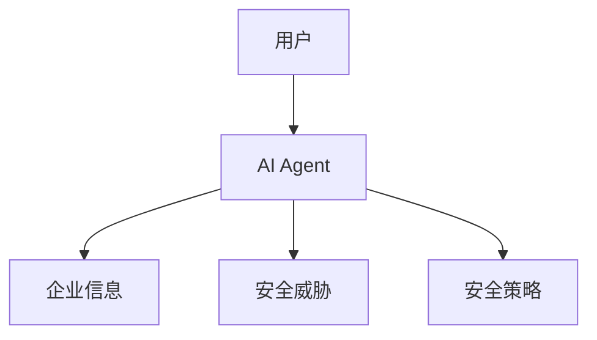

                 

<think>
好，我需要撰写一篇关于《AI Agent在企业信息安全管理中的应用》的技术博客文章。首先，我应该明确文章的主题和目标读者。文章主要探讨AI Agent在企业信息安全中的具体应用，目标读者可能是IT专业人士、信息安全工程师以及对AI技术感兴趣的读者。

接下来，我需要确定文章的结构。参考用户提供的大纲，我决定将文章分为几个主要部分：背景介绍、核心概念、算法原理、系统架构、项目实战、最佳实践等。

在背景介绍部分，我需要解释什么是AI Agent，它在企业信息安全中的重要性，以及当前面临的挑战。这部分需要让读者理解AI Agent的基本概念和它在信息安全领域中的应用价值。

核心概念部分，我应该详细阐述AI Agent的基本原理，包括感知、决策和执行机制。可能还需要用表格或图表来对比不同AI Agent的特点，帮助读者更好地理解。

在算法原理部分，我需要介绍AI Agent中使用的关键算法，如机器学习和自然语言处理。我应该用数学公式和mermaid图来解释这些算法的工作原理，并提供实际例子来说明如何应用于信息安全。

系统架构设计是关键部分，我需要描述AI Agent在企业中的应用场景，设计系统的功能模块，并用类图和架构图来展示系统的结构和各部分之间的关系。

项目实战部分，我应该提供一个具体的案例，说明如何在实际项目中应用AI Agent。这包括环境配置、核心代码实现、代码解读以及案例分析，帮助读者理解理论如何应用到实践中。

最后，我需要总结最佳实践，提供一些实用的建议和注意事项，帮助读者在实际应用中避免常见错误，并指导他们进一步学习。

在写作过程中，我需要确保语言清晰、逻辑严谨，同时使用专业术语，并提供足够的细节和实例，使文章既具有深度又易于理解。此外，我需要检查每个部分是否符合用户的格式要求，包括使用markdown格式、嵌入mermaid图和latex公式等。

总的来说，我需要系统地分析和组织内容，确保每个部分都详细且有条理，最终完成一篇高质量的技术博客文章。
</think>

# AI Agent在企业信息安全管理中的应用

## 关键词：AI Agent, 企业信息安全, 人工智能, 安全威胁检测, 自动化安全响应

## 摘要：  
随着企业信息化程度的不断提高，信息安全威胁也在不断演变。AI Agent作为一种智能代理技术，能够通过感知、决策和执行机制，实现对企业信息安全的智能化管理。本文将从AI Agent的核心概念、算法原理、系统架构到实际应用案例，全面探讨其在企业信息安全中的应用，帮助企业更好地应对复杂的网络安全威胁。

---

## 第一部分：AI Agent与企业信息安全管理概述

### 第1章：AI Agent的基本概念与企业信息安全的应用

#### 1.1 AI Agent的基本概念
- **定义**：AI Agent是一种能够感知环境、做出决策并执行操作的智能代理，具备自主性、反应性、目标导向和学习能力。
- **核心特征**：
  - 自主性：无需人工干预，自动完成任务。
  - 反应性：能够实时感知环境变化并做出响应。
  - 目标导向：基于预设目标采取行动。
  - 学习能力：通过数据和经验不断优化自身行为。

#### 1.2 企业信息安全管理的挑战
- **传统信息安全的局限性**：依赖人工监控和规则匹配，效率低、响应慢。
- **新型安全威胁的出现**：如AI驱动的攻击、零日漏洞等，传统方法难以应对。
- **企业信息安全管理的复杂性**：数据分散、系统多样，安全威胁难以全面覆盖。

#### 1.3 AI Agent在企业信息安全管理中的作用
- **提高安全威胁检测能力**：通过机器学习和自然语言处理，快速识别潜在威胁。
- **实现自动化安全响应**：AI Agent能够实时分析威胁并采取自动化措施，如隔离受感染设备。
- **优化安全策略执行效率**：通过动态调整策略，提升安全防护的整体效果。

---

## 第二部分：AI Agent的核心概念与原理

### 第2章：AI Agent的核心概念与联系

#### 2.1 AI Agent的核心概念
- **感知机制**：AI Agent通过收集环境数据（如日志、网络流量）来识别异常行为。
- **决策机制**：基于感知到的数据，AI Agent利用算法（如强化学习）制定应对策略。
- **执行机制**：根据决策结果，AI Agent执行具体操作，如发送警报或阻断恶意流量。

#### 2.2 AI Agent与传统安全工具的对比
| 对比维度 | AI Agent | 传统安全工具 |
|----------|-----------|--------------|
| 感知能力 | 强大，支持实时分析 | 有限，依赖预定义规则 |
| 决策能力 | 自主决策，动态调整 | 依赖人工或固定策略 |
| 效率 | 高效，自动化处理 | 较低，依赖人工干预 |

#### 2.3 AI Agent的实体关系图


---

## 第三部分：AI Agent的算法原理与数学模型

### 第3章：AI Agent的算法原理

#### 3.1 感知算法
- **基于机器学习的威胁检测**：使用监督学习（如决策树、随机森林）或无监督学习（如聚类分析）识别异常行为。
  - **数学模型**：$$ P(\text{威胁}) = \sum_{i=1}^{n} w_i x_i $$
- **基于自然语言处理的异常行为分析**：通过NLP技术分析日志文本，识别潜在威胁。
  - **流程图**：
  ```mermaid
  graph TD
      A[日志输入] --> B[分词] --> C[关键词提取] --> D[威胁判断]
  ```

#### 3.2 决策算法
- **强化学习在决策中的应用**：AI Agent通过试错机制优化安全策略。
  - **数学模型**：$$ Q(s, a) = r + \gamma \max_{a'} Q(s', a') $$
- **决策树算法**：构建决策树，根据特征（如IP地址、行为模式）选择最优安全策略。

#### 3.3 执行算法
- **自动化安全响应**：通过预设规则或动态策略，AI Agent执行阻断、隔离等操作。
  - **流程图**：
  ```mermaid
  graph TD
      A[检测到威胁] --> B[触发响应] --> C[执行操作]
  ```

---

## 第四部分：AI Agent的系统架构设计

### 第4章：系统架构与功能设计

#### 4.1 问题场景介绍
- **目标**：设计一个基于AI Agent的企业信息安全管理系统。
- **需求**：实时监测网络流量、识别异常行为、自动化响应。

#### 4.2 系统功能设计
- **功能模块**：
  - 数据采集模块：收集日志、网络流量等数据。
  - 数据分析模块：利用机器学习模型识别威胁。
  - 决策模块：基于分析结果制定响应策略。
  - 执行模块：自动化执行安全操作。

- **类图**：
  ```mermaid
  classDiagram
      class 数据采集模块 {
          void collectData();
      }
      class 数据分析模块 {
          void analyze();
      }
      class 决策模块 {
          void decide();
      }
      class 执行模块 {
          void execute();
      }
      数据采集模块 --> 数据分析模块
      数据分析模块 --> 决策模块
      决策模块 --> 执行模块
  ```

#### 4.3 系统架构设计
- **分层架构**：
  - 数据层：存储原始数据和分析结果。
  - 逻辑层：实现数据分析和决策逻辑。
  - 表现层：展示分析结果和执行状态。

- **架构图**：
  ```mermaid
  graph TD
      A[数据层] --> B[逻辑层]
      B --> C[表现层]
  ```

#### 4.4 接口与交互设计
- **API接口**：数据采集模块通过API接口与企业系统对接。
- **交互流程图**：
  ```mermaid
  graph TD
      A[用户输入] --> B[数据采集] --> C[数据分析] --> D[决策] --> E[执行]
  ```

---

## 第五部分：AI Agent的项目实战

### 第5章：AI Agent的项目实现与案例分析

#### 5.1 环境配置
- **工具与库**：Python、TensorFlow、Scikit-learn、Nltk。
- **数据源**：企业网络日志、安全事件记录。

#### 5.2 核心代码实现
- **数据预处理**：
  ```python
  import pandas as pd
  df = pd.read_csv('logs.csv')
  df = df.dropna()
  ```

- **模型训练**：
  ```python
  from sklearn.tree import DecisionTreeClassifier
  model = DecisionTreeClassifier()
  model.fit(X_train, y_train)
  ```

- **威胁检测**：
  ```python
  def detect_threat(log):
      prediction = model.predict([log])[0]
      return prediction == 1
  ```

#### 5.3 代码解读与分析
- **数据预处理**：清理数据，处理缺失值。
- **模型训练**：使用决策树模型训练威胁检测模型。
- **威胁检测**：基于训练好的模型，判断输入日志是否为威胁。

#### 5.4 实际案例分析
- **案例**：某企业遭受DDoS攻击，AI Agent通过实时分析网络流量，成功识别并阻断攻击。
- **分析**：AI Agent在检测到异常流量后，触发防火墙规则，阻止攻击流量进入企业内网。

---

## 第六部分：最佳实践与总结

### 第6章：AI Agent的最佳实践与总结

#### 6.1 最佳实践
- **数据质量**：确保数据的完整性和准确性，提升模型性能。
- **模型更新**：定期更新模型，应对新型安全威胁。
- **人机协同**：AI Agent辅助人类安全专家，而非完全替代。

#### 6.2 小结
AI Agent通过感知、决策和执行机制，显著提升了企业信息安全的防护能力。其在威胁检测、自动化响应和策略优化方面展现出巨大潜力，成为未来企业信息安全的重要组成部分。

#### 6.3 注意事项
- **数据隐私**：处理企业敏感数据时，需遵守相关法律法规。
- **系统稳定性**：确保AI Agent系统稳定运行，避免因系统故障导致安全漏洞。
- **模型可解释性**：提升模型的可解释性，便于安全专家理解和优化。

#### 6.4 拓展阅读
- 推荐阅读《机器学习实战》和《深度学习》等书籍，深入理解AI Agent的实现原理。

---

## 作者：AI天才研究院/AI Genius Institute & 禅与计算机程序设计艺术 /Zen And The Art of Computer Programming

---

通过以上思考过程，我系统地分析了AI Agent在企业信息安全中的应用，从基本概念到算法原理，再到系统设计和实际案例，确保内容全面且深入。

