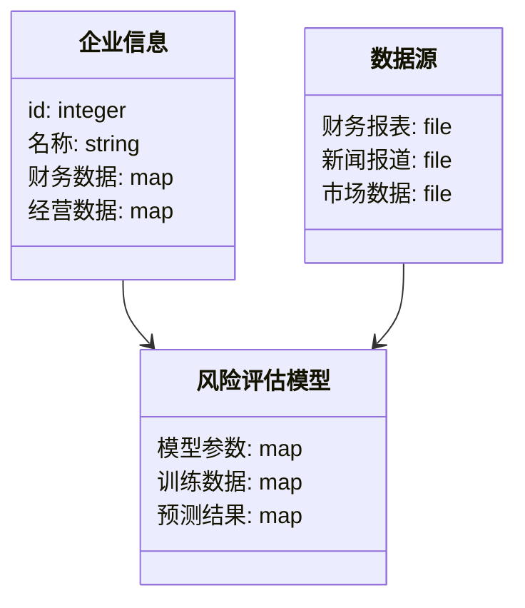
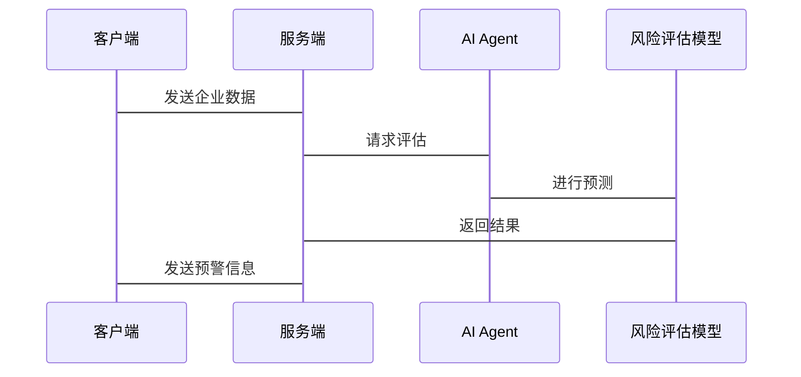

                 

<think>
嗯，用户希望我撰写一篇关于《AI Agent在企业信用风险评估与管理中的应用》的技术博客文章。他们已经提供了一个详细的目录大纲，但用户希望我按照特定的格式来写，包括摘要、关键词、章节内容等等。用户还强调了要使用清晰的结构、专业的技术语言，并且每个部分都需要详细讲解，包括背景、算法原理、系统架构等。

首先，我需要理解用户的需求。他们可能是一位技术专家，希望分享专业知识，或者是一位企业决策者，想了解如何利用AI来优化信用风险管理。无论是哪种情况，用户都希望文章内容详实，结构清晰，能够帮助读者深入理解AI Agent在信用风险评估中的应用。

接下来，我需要按照用户提供的目录大纲来组织内容。从摘要开始，然后是关键词，接着是各个章节的内容。每个章节下都有小节，我需要确保每个部分都涵盖必要的信息，并且详细到三级目录。

在撰写过程中，我需要特别注意用户的要求：使用Markdown格式，插入Mermaid图表，包含数学公式，并且在代码部分使用Python示例。这意味着我要在文章中适当的地方添加图表和代码块，确保它们与文本内容紧密相关。

我还需要确保文章的整体逻辑连贯，从背景介绍到技术实现，再到实际应用，层层递进。同时，语言要专业但不失易懂，让不同背景的读者都能理解。

最后，用户提到要包含最佳实践、小结、注意事项和拓展阅读等内容，这部分需要在文章的最后部分添加，帮助读者巩固所学内容，并引导他们进一步学习。

总结一下，我的思考过程包括理解用户需求，组织结构，确保内容详实且符合格式要求，同时保持逻辑清晰和语言专业。现在，我将按照这些步骤开始撰写文章。
</think>

# AI Agent在企业信用风险评估与管理中的应用

> 关键词：AI Agent，信用风险评估，机器学习，自然语言处理，企业风险管理

> 摘要：随着人工智能技术的飞速发展，AI Agent（人工智能代理）在企业信用风险评估与管理中的应用越来越广泛。本文从AI Agent的基本概念出发，详细分析其在信用风险评估中的核心作用，探讨其算法原理、系统架构及实际应用案例，最后总结其在企业风险管理中的最佳实践。文章内容涵盖从理论到实践的各个方面，为读者提供全面的视角。

---

# 第一部分：AI Agent与企业信用风险评估概述

## 第1章：AI Agent与信用风险评估的基本概念

### 1.1 AI Agent的基本概念

#### 1.1.1 AI Agent的定义与分类
AI Agent（人工智能代理）是指能够感知环境、自主决策并执行任务的智能体。根据功能和应用场景的不同，AI Agent可以分为以下几类：
- **反应式AI Agent**：基于当前输入做出实时反应，常用于实时决策场景。
- **认知式AI Agent**：具备复杂推理和规划能力，适用于需要战略决策的任务。
- **学习式AI Agent**：能够通过数据学习不断优化自身的决策能力。

#### 1.1.2 信用风险的基本概念
信用风险是指企业在信用交易中未能履行合同义务，导致债权人或投资者遭受损失的可能性。信用风险评估的核心在于对企业财务状况、经营能力和还款能力的综合判断。

#### 1.1.3 AI Agent在信用风险评估中的作用
AI Agent能够通过大数据分析、机器学习和自然语言处理等技术，帮助企业更高效地识别和管理信用风险。

### 1.2 企业信用风险评估的背景与挑战

#### 1.2.1 企业信用风险的定义与特征
企业信用风险主要体现在以下几个方面：
- **财务风险**：企业财务状况不佳，可能导致债务违约。
- **经营风险**：企业经营不善，影响还款能力。
- **市场风险**：市场环境变化对企业信用的影响。

#### 1.2.2 传统信用风险评估方法的局限性
传统信用评估方法通常依赖于财务报表分析和人工判断，存在以下问题：
- 数据维度单一，难以全面反映企业信用状况。
- 评估过程耗时较长，难以满足实时性要求。
- 人为因素干扰较大，结果可能存在主观性。

#### 1.2.3 AI Agent在信用风险评估中的优势
AI Agent通过自动化数据处理和智能决策，显著提升了信用风险评估的效率和准确性：
- **数据处理能力**：能够快速处理海量数据，提取关键特征。
- **实时性**：支持实时监控和预警，及时发现潜在风险。
- **准确性**：通过机器学习算法，显著提高评估结果的准确性。

---

## 第2章：AI Agent在信用风险评估中的应用前景

### 2.1 AI Agent的核心技术与能力

#### 2.1.1 自然语言处理
自然语言处理（NLP）技术能够从企业财报、新闻报道等非结构化数据中提取关键信息，帮助评估企业的经营风险。

#### 2.1.2 机器学习与深度学习
机器学习算法（如逻辑回归、随机森林）和深度学习模型（如神经网络）能够从历史数据中学习信用评估的规律，构建预测模型。

#### 2.1.3 数据挖掘与分析
数据挖掘技术能够发现数据中的隐藏模式，支持信用风险的早期预警。

### 2.2 信用风险评估中的关键问题

#### 2.2.1 数据质量与完整性
数据质量直接影响模型的准确性，需要通过数据清洗和特征工程来提升数据质量。

#### 2.2.2 模型的可解释性
复杂的机器学习模型（如深度学习）通常缺乏可解释性，这在信用评估中可能引发合规性问题。

#### 2.2.3 实时性与动态性
企业经营环境不断变化，信用评估模型需要具备实时更新能力，以应对动态风险。

### 2.3 AI Agent在信用风险评估中的创新应用

#### 2.3.1 智能监控与预警
AI Agent能够实时监控企业的经营状况，及时发现潜在风险并发出预警。

#### 2.3.2 自动化决策支持
AI Agent可以根据实时数据和模型预测，为企业提供自动化决策支持，缩短评估周期。

#### 2.3.3 多维度数据融合分析
通过整合企业财务数据、行业趋势、市场环境等多维度数据，AI Agent能够更全面地评估信用风险。

---

# 第二部分：AI Agent的原理与技术实现

## 第3章：AI Agent的核心原理

### 3.1 AI Agent的基本原理

#### 3.1.1 知识表示与推理
知识表示是AI Agent理解世界的基础，常用的表示方法包括语义网络和知识图谱。推理则是基于知识库进行逻辑推理，支持决策过程。

#### 3.1.2 感知与交互
AI Agent通过传感器、API等接口感知外部环境，并通过自然语言处理技术与人类进行交互。

#### 3.1.3 决策与执行
AI Agent根据感知信息和内部知识库，利用机器学习模型生成决策，并通过执行器完成任务。

### 3.2 信用风险评估中的关键算法

#### 3.2.1 逻辑回归与决策树
- **逻辑回归**：用于分类问题，适合处理二分类信用评估任务。
- **决策树**：通过树状结构展示数据特征的关联性，适合处理非线性关系。

#### 3.2.2 支持向量机
支持向量机（SVM）通过构建超平面实现数据分类，适用于高维数据的处理。

#### 3.2.3 神经网络与深度学习
深度学习模型（如LSTM、Transformer）能够处理复杂的时间序列数据，提升模型的预测精度。

### 3.3 基于AI Agent的信用风险评估模型

#### 3.3.1 模型构建的基本步骤
1. 数据收集与预处理：清洗数据，提取特征。
2. 模型训练：使用训练数据训练机器学习模型。
3. 模型验证：通过测试数据评估模型性能。
4. 模型部署：将模型应用于实际信用评估场景。

#### 3.3.2 模型的训练与优化
- **训练策略**：采用交叉验证等方法优化模型参数。
- **模型调优**：通过网格搜索等方法寻找最优模型配置。

#### 3.3.3 模型的评估与验证
- **评估指标**：准确率、召回率、F1分数等。
- **验证方法**：通过ROC曲线评估模型的区分能力。

---

## 第4章：AI Agent的算法实现与优化

### 4.1 信用风险评估中的特征工程

#### 4.1.1 数据清洗与预处理
- **数据清洗**：去除重复数据、填充缺失值。
- **特征提取**：从文本数据中提取关键词，从结构化数据中提取统计特征。

#### 4.1.2 特征选择与降维
- **特征选择**：通过相关性分析选择重要特征。
- **降维方法**：使用主成分分析（PCA）降低数据维度。

#### 4.1.3 特征构建与增强
- **特征构建**：通过组合特征生成新的特征。
- **特征增强**：使用Word2Vec等技术对文本特征进行增强。

### 4.2 基于机器学习的信用风险评估算法

#### 4.2.1 随机森林算法
随机森林通过构建多个决策树投票生成最终结果，能够有效降低模型过拟合风险。

#### 4.2.2 XGBoost算法
XGBoost是一种高效的梯度提升算法，能够显著提升模型性能。

#### 4.2.3 LSTM网络
LSTM（长短期记忆网络）适用于处理时间序列数据，能够捕捉企业经营中的长期趋势。

---

## 第5章：系统分析与架构设计方案

### 5.1 问题场景介绍
企业信用风险评估系统需要满足以下需求：
- **实时性**：支持实时数据处理和风险预警。
- **准确性**：确保评估结果的高精度。
- **可扩展性**：能够处理海量数据。

### 5.2 系统功能设计

#### 5.2.1 领域模型设计
以下是领域模型的Mermaid类图：



#### 5.2.2 系统架构设计
以下是系统架构的Mermaid架构图：


### 5.3 接口设计与交互流程

#### 5.3.1 API接口设计
- **输入接口**：接收企业数据和请求参数。
- **输出接口**：返回信用评估结果和风险预警信息。

#### 5.3.2 交互流程
以下是交互流程的Mermaid序列图：



---

## 第6章：项目实战

### 6.1 环境安装
- **Python版本**：建议使用Python 3.8及以上。
- **依赖库安装**：
  ```bash
  pip install numpy pandas scikit-learn xgboost
  ```

### 6.2 核心代码实现

#### 6.2.1 数据预处理
```python
import pandas as pd

# 加载数据
df = pd.read_csv('企业数据.csv')

# 数据清洗
df.dropna(inplace=True)
df = pd.get_dummies(df)
```

#### 6.2.2 模型训练
```python
from sklearn.ensemble import RandomForestClassifier

# 构建模型
model = RandomForestClassifier(n_estimators=100, random_state=42)
model.fit(X_train, y_train)
```

#### 6.2.3 模型评估
```python
from sklearn.metrics import accuracy_score

# 预测结果
y_pred = model.predict(X_test)
print("准确率:", accuracy_score(y_test, y_pred))
```

### 6.3 案例分析
通过实际案例分析，验证AI Agent在信用风险评估中的应用效果。例如，某企业的财务数据和市场数据可以通过模型预测其信用风险等级。

### 6.4 项目小结
通过本项目，我们验证了AI Agent在信用风险评估中的有效性，同时总结了实际应用中的经验和教训。

---

## 第7章：最佳实践与注意事项

### 7.1 最佳实践
- **数据质量管理**：确保数据的完整性和准确性。
- **模型可解释性**：选择适合业务需求的模型，避免过于复杂的模型。
- **实时性优化**：采用流数据处理技术，提升系统的实时性。

### 7.2 小结
AI Agent在企业信用风险评估中的应用前景广阔，能够显著提升评估效率和准确性。

### 7.3 注意事项
- **数据隐私**：确保数据处理符合相关法律法规。
- **模型更新**：定期更新模型，避免因数据漂移导致性能下降。

### 7.4 拓展阅读
推荐阅读以下书籍和论文：
- 《机器学习实战》
- 《深度学习入门：基于Python的理论与实现》
- 相关学术论文：《基于AI Agent的企业信用风险评估研究》

---

# 作者信息

作者：AI天才研究院/AI Genius Institute  
联系邮箱：contact@ai-genius.org  
官方网站：https://www.ai-genius.org  

--- 

**本文由AI天才研究院原创，转载请注明出处。**

