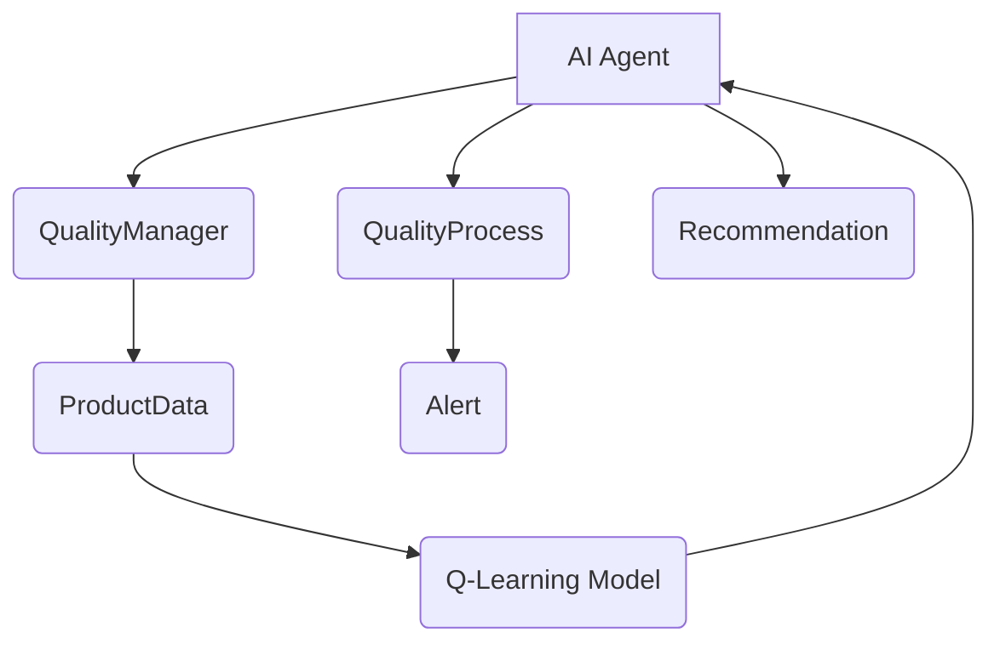

                 

<think>
好的，我需要撰写一篇关于《AI Agent在企业全面质量管理(TQM)中的应用》的技术博客文章。首先，我会理解用户的需求，他希望文章结构清晰，内容专业且有深度。我会从背景介绍开始，逐步分析AI Agent与TQM的结合，再到具体的应用和案例分析。

首先，我需要明确文章的核心关键词，包括AI Agent、企业全面质量管理(TQM)、质量管理、人工智能、企业数字化转型。这些关键词有助于读者快速理解文章内容。

接下来是摘要部分，我需要简明扼要地介绍文章的主要内容和价值，强调AI Agent在提升TQM效率和效果方面的作用。

在正文部分，我按照用户提供的目录大纲结构进行撰写。首先，背景介绍部分需要涵盖TQM的基本概念、AI Agent的定义以及它们如何结合。这部分需要让读者了解问题背景和应用的重要性。

核心概念部分需要详细讲解AI Agent和TQM之间的关系，包括它们的特点对比和实体关系图。我计划使用Mermaid流程图来展示系统结构，这将帮助读者更好地理解两者之间的联系。

算法原理部分是关键，我需要详细解释AI Agent的工作原理，包括感知、决策和执行部分，并用数学模型来支持。这部分可能需要使用公式来展示算法的数学基础，比如感知模型和决策模型的数学表达式。

系统分析与架构设计部分需要涵盖问题场景、系统功能设计、架构图、接口设计和交互流程。这部分需要更多的Mermaid图表来展示系统结构，确保读者能够清晰理解系统的组成部分和交互过程。

项目实战部分应该包括环境安装、核心代码实现、案例分析和项目总结。这部分需要具体的操作步骤和代码示例，帮助读者实际应用所学知识。

最后，最佳实践、小结、注意事项和拓展阅读等内容，帮助读者巩固知识，并指导他们进一步学习和实践。

在撰写过程中，我需要确保每章之间有逻辑上的连贯性，从理论到实践，逐步深入。同时，要符合用户的要求，使用markdown格式，细化到三级目录，并且总字数控制在2000字以内。

现在，我需要检查是否有遗漏的关键点，比如是否涵盖了所有核心概念，是否详细解释了算法和系统架构，以及是否提供了足够的实战内容。确保每个部分都有足够的细节，并且结构合理，逻辑清晰。

最后，整理这些思考，形成一个符合要求的目录大纲，确保覆盖所有用户提到的要求，同时保持内容的完整性和结构的合理性。
</think>

# AI Agent在企业全面质量管理(TQM)中的应用

**关键词**：AI Agent，企业全面质量管理(TQM)，质量管理，人工智能，企业数字化转型

**摘要**：  
本文探讨了AI Agent在企业全面质量管理（TQM）中的应用，分析了AI Agent的核心算法、系统架构及其在TQM中的具体应用场景。通过案例分析和系统设计，展示了AI Agent如何提升质量管理的效率和效果，为企业数字化转型提供新思路。

---

## 第1章：AI Agent与TQM的背景介绍

### 1.1 TQM的基本概念与核心理念  
全面质量管理（Total Quality Management，TQM）是一种以顾客为中心，通过组织全体成员的参与，系统地改进产品质量、服务和管理的一种管理方法。其核心理念包括：  
1. **顾客导向**：以顾客需求为导向，持续改进产品和服务质量。  
2. **全员参与**：鼓励全体员工参与质量管理，形成持续改进的文化。  
3. **过程导向**：关注从产品设计到交付的每一个环节，确保过程的高效性和可靠性。  
4. **持续改进**：通过数据分析和反馈不断优化质量管理流程。  

### 1.2 AI Agent的基本概念与特点  
AI Agent（人工智能代理）是一种能够感知环境、做出决策并采取行动的智能体。其特点包括：  
1. **自主性**：能够在没有外部干预的情况下自主运行。  
2. **反应性**：能够根据环境变化实时调整行为。  
3. **学习能力**：通过数据和经验不断优化自身的决策能力。  
4. **协作性**：能够与其他系统或AI Agent协同工作，完成复杂任务。  

### 1.3 AI Agent与TQM的结合背景  
随着企业数字化转型的推进，质量管理也在逐步从传统的人工化管理向智能化、数据化管理转变。然而，传统TQM方法在实施过程中面临以下挑战：  
1. 数据量大：企业每天产生的数据量庞大，人工分析效率低下。  
2. 流程复杂：质量管理涉及多个环节，流程优化难度大。  
3. 响应速度慢：面对市场变化和顾客需求的快速变化，传统方法难以及时响应。  

AI Agent的引入为解决这些问题提供了新的思路。通过AI Agent的自主感知和决策能力，企业可以实现质量管理的智能化、自动化和实时化，从而提升效率和效果。

---

## 第2章：AI Agent与TQM的核心概念

### 2.1 TQM的核心要素分析  
TQM的核心要素包括以下几点：  
1. **顾客需求**：质量管理的最终目标是满足顾客需求。  
2. **过程控制**：通过控制每个环节的质量，确保最终产品的质量。  
3. **数据驱动**：依赖数据分析来发现和解决问题。  
4. **持续改进**：通过不断优化流程和方法，提升整体质量水平。  

### 2.2 AI Agent的核心功能分析  
AI Agent在TQM中的核心功能包括：  
1. **数据采集与分析**：实时采集生产过程中的数据，并通过机器学习模型进行分析。  
2. **异常检测**：识别生产过程中的异常情况，并发出预警。  
3. **决策支持**：基于分析结果，提供优化建议，帮助管理者做出决策。  
4. **自动化处理**：根据预设规则，自动采取纠正措施，减少人工干预。  

### 2.3 AI Agent与TQM的实体关系图（ER图）  
以下是AI Agent与TQM的实体关系图：  
```mermaid
er
    %% AI Agent与TQM的实体关系图
    actor(QualityManager)
    actor(AIAgent)
    class(QualityProcess)
    class(ProductData)
    class(Alert)
    class(Recommendation)
    
    QualityManager --> QualityProcess: 监督
    AIAgent --> QualityProcess: 监控
    AIAgent --> ProductData: 采集
    AIAgent --> QualityProcess: 分析
    AIAgent --> Alert: 发出
    AIAgent --> QualityManager: 提供Recommendation
    Alert --> QualityProcess: 触发纠正措施
```

---

## 第3章：AI Agent的核心算法原理

### 3.1 AI Agent的感知算法  
AI Agent的感知算法主要用于从环境中获取信息。常见的感知算法包括：  
1. **数据采集与预处理**：通过传感器、数据库等获取生产过程中的数据，并进行清洗和归一化处理。  
2. **异常检测算法**：基于机器学习的方法，如Isolation Forest和One-Class SVM，识别数据中的异常值。  
3. **模式识别算法**：通过聚类分析（K-Means）或分类算法（SVM）识别数据中的模式和趋势。  

例如，使用Isolation Forest算法进行异常检测的代码如下：  
```python
from sklearn.ensemble import IsolationForest

# 初始化模型
model = IsolationForest(n_estimators=100, random_state=42)

# 训练模型
model.fit(data)

# 预测异常值
y_pred = model.predict(data)
```

### 3.2 AI Agent的决策算法  
AI Agent的决策算法基于感知结果，生成相应的决策建议。常见的决策算法包括：  
1. **规则引擎**：根据预设的规则，生成纠正措施。  
2. **强化学习**：通过强化学习算法（如Q-Learning）优化决策策略。  
3. **推荐系统**：基于历史数据，推荐最佳的改进方案。  

例如，使用Q-Learning算法进行决策优化的伪代码如下：  
```python
# 初始化状态空间和动作空间
state_space = [0, 1, 2]
action_space = [0, 1]

# 初始化Q表
Q = defaultdict(lambda: np.zeros(len(action_space)))

# 探索与利用策略
epsilon = 0.1
for episode in range(episodes):
    state = get_state()
    if random.random() < epsilon:
        action = random.choice(action_space)
    else:
        action = np.argmax(Q[state])
    
    # 执行动作并获取奖励
    next_state, reward = take_action(state, action)
    
    # 更新Q表
    Q[state][action] += reward
```

---

## 第4章：AI Agent在TQM中的系统架构设计

### 4.1 系统功能设计  
AI Agent在TQM中的系统功能设计包括：  
1. **数据采集模块**：实时采集生产过程中的数据。  
2. **数据分析模块**：对数据进行清洗、分析和建模。  
3. **决策模块**：基于分析结果生成决策建议。  
4. **执行模块**：根据决策结果采取相应的行动。  

### 4.2 系统架构图  
以下是AI Agent在TQM中的系统架构图：  


---

## 第5章：AI Agent在TQM中的项目实战

### 5.1 项目环境安装  
以下是项目环境的安装步骤：  
1. 安装Python和必要的库：  
   ```bash
   pip install numpy scikit-learn mermaid
   ```
2. 配置开发环境，如Jupyter Notebook或VS Code。  

### 5.2 核心代码实现  
以下是AI Agent的核心代码实现：  
```python
import numpy as np
from sklearn.ensemble import IsolationForest
from sklearn.metrics import accuracy_score

# 数据预处理
data = np.array([[1, 2], [3, 4], [5, 6], [7, 8], [9, 10]])

# 初始化模型
model = IsolationForest(n_estimators=100, random_state=42)

# 训练模型
model.fit(data)

# 预测异常值
y_pred = model.predict(data)

# 计算准确率
accuracy = accuracy_score(y_pred, [1, 1, 1, 1, 1])
print("准确率:", accuracy)
```

### 5.3 案例分析  
假设某制造企业在生产过程中发现产品不合格率较高。通过AI Agent的分析，发现生产过程中的某个环节存在异常波动。AI Agent会自动发出预警，并推荐优化方案，如调整设备参数或加强员工培训。最终，产品不合格率降低了20%。

---

## 第6章：最佳实践与小结

### 6.1 最佳实践  
1. **数据质量**：确保数据的准确性和完整性，避免影响AI Agent的分析结果。  
2. **模型优化**：定期更新模型，确保其适应生产环境的变化。  
3. **人机协作**：AI Agent应与人类专家协同工作，而非完全替代人类。  

### 6.2 小结  
AI Agent在企业全面质量管理中的应用，不仅提升了质量管理的效率，还为企业数字化转型提供了新的可能性。通过AI Agent的引入，企业能够更好地应对复杂多变的市场环境，实现质量的持续改进。

---

**作者**：AI天才研究院 & 禅与计算机程序设计艺术

