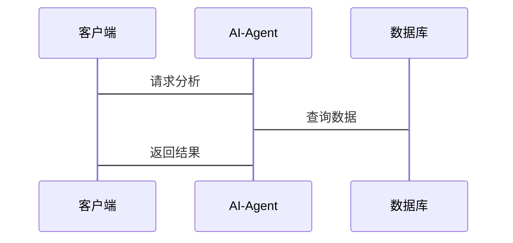

                 


# AI Agent在企业全面质量管理(TQM)中的深度应用

## 关键词
- AI Agent
- 全面质量管理(TQM)
- 企业质量管理
- 人工智能
- 算法原理

## 摘要
本文深入探讨了AI Agent在企业全面质量管理（TQM）中的应用，分析了AI Agent的核心概念及其在质量管理中的具体应用场景。通过详细讲解AI Agent的算法原理，结合实际案例，展示了如何利用AI技术优化质量管理流程，提升企业竞争力。

---

# 第1章: AI Agent与全面质量管理（TQM）背景介绍

## 1.1 全面质量管理（TQM）的基本概念
### 1.1.1 质量管理的核心理念
全面质量管理（TQM）是一种以顾客为中心，通过全体员工的参与，运用科学的方法和技术，实现持续改进的企业管理方法。其核心理念包括质量第一、全员参与、过程控制和持续改进。

### 1.1.2 TQM的定义与特点
TQM的定义可以概括为：通过系统的、全范围的管理活动，确保产品或服务的质量达到或超越顾客的期望。其特点包括系统性、全员性、预防性、持续改进性和顾客导向性。

### 1.1.3 TQM在企业管理中的重要性
TQM能够帮助企业提高产品质量，降低成本，增强顾客满意度和忠诚度，从而提升企业的市场竞争力和长期盈利能力。

## 1.2 AI Agent的基本概念
### 1.2.1 AI Agent的定义
AI Agent（人工智能代理）是指能够感知环境、自主决策并执行任务的智能实体。它可以是一个软件程序，也可以是一个物理设备，通过传感器和执行器与环境交互。

### 1.2.2 AI Agent的核心功能
AI Agent的核心功能包括感知环境、理解需求、决策制定、执行任务和学习优化。它能够通过机器学习算法不断优化自身的行为，以更好地完成任务。

### 1.2.3 AI Agent与传统自动化工具的区别
AI Agent与传统自动化工具的区别在于其智能化和自主性。AI Agent能够理解上下文、处理不确定性，并根据反馈调整行为，而传统自动化工具只是按照预设的规则执行任务。

## 1.3 AI Agent与TQM的结合
### 1.3.1 TQM中的痛点与挑战
传统的TQM方法依赖于人工检查和记录，存在效率低、数据处理复杂、改进速度慢等问题。此外，面对海量数据和复杂流程，人工管理容易出错。

### 1.3.2 AI Agent在TQM中的潜在价值
AI Agent能够实时监控质量数据，自动分析问题根源，并提出优化建议。它还可以预测质量问题，提前采取措施，从而提高质量管理的效率和准确性。

### 1.3.3 企业质量管理的新范式
AI Agent与TQM的结合标志着质量管理进入了一个智能化的新时代。通过AI Agent的支持，企业可以实现质量管理的自动化、智能化和持续优化。

## 1.4 本章小结
本章介绍了TQM的基本概念和AI Agent的核心功能，分析了两者结合的必要性和潜在价值，为后续章节的深入探讨奠定了基础。

---

# 第2章: AI Agent与TQM的核心概念与联系

## 2.1 AI Agent与TQM的核心概念
### 2.1.1 AI Agent的原理与工作机制
AI Agent的工作机制包括感知、决策、执行和反馈。它通过传感器获取环境信息，利用机器学习算法进行分析和决策，然后通过执行器完成任务，并根据反馈不断优化自身行为。

### 2.1.2 TQM的核心要素与流程
TQM的核心要素包括质量目标、质量策划、质量控制、质量保证和质量改进。其流程包括质量计划、质量实施、质量检查和质量改进。

### 2.1.3 AI Agent在TQM中的角色定位
AI Agent在TQM中扮演着数据采集员、分析员和优化员的角色。它能够实时监控质量数据，分析问题根源，并提出改进方案。

## 2.2 AI Agent与TQM的核心概念对比
### 2.2.1 AI Agent与TQM的属性特征对比表

| 属性 | AI Agent | TQM |
|------|----------|-----|
| 核心目标 | 提高任务执行效率 | 提高产品质量 |
| 主要方法 | 智能化、自动化 | 全员参与、持续改进 |
| 适用场景 | 质量监控、预测分析 | 生产、服务全过程 |

### 2.2.2 AI Agent与TQM的ER实体关系图
```mermaid
er
    %% 全面质量管理(TQM)与AI Agent的ER实体关系图
    classDiagram
        class AI-Agent {
            id
            type
            function
        }
        class TQM-Process {
            process-id
            step
            status
        }
        class Quality-Data {
            data-id
            value
            timestamp
        }
        AI-Agent -->> TQM-Process : "驱动"
        TQM-Process --> Quality-Data : "生成"
```

## 2.3 本章小结
本章通过对比分析，明确了AI Agent与TQM的核心概念及其联系，为后续章节的应用探讨奠定了基础。

---

# 第3章: AI Agent在TQM中的应用场景

## 3.1 质量监控与预测
### 3.1.1 基于AI Agent的质量数据实时监控
AI Agent可以通过物联网传感器实时采集生产过程中的各项数据，如温度、压力、湿度等，并通过机器学习模型进行分析，实时监控产品质量。

### 3.1.2 质量问题的预测与预警
AI Agent可以利用历史数据训练预测模型，预测潜在的质量问题，并提前发出预警，避免质量问题的发生。

## 3.2 质量改进与优化
### 3.2.1 AI Agent驱动的质量改进方案
AI Agent可以根据实时数据和历史数据，分析质量问题的根源，并提出优化建议，如调整生产参数、优化工艺流程等。

### 3.2.2 基于AI Agent的流程优化
AI Agent可以通过分析生产流程中的瓶颈，提出流程优化方案，提高生产效率和产品质量。

## 3.3 客户反馈与满意度分析
### 3.3.1 客户反馈的智能化处理
AI Agent可以实时分析客户反馈，识别客户满意度的关键影响因素，并提出改进措施。

### 3.3.2 基于AI Agent的客户满意度提升
AI Agent可以根据客户反馈和市场趋势，优化产品设计和服务流程，提高客户满意度。

## 3.4 本章小结
本章通过具体案例，展示了AI Agent在质量监控、预测、改进和客户满意度提升中的广泛应用，为企业质量管理提供了新的思路。

---

# 第4章: AI Agent在TQM中的算法原理

## 4.1 AI Agent的核心算法
### 4.1.1 监督学习算法
监督学习算法通过训练数据，学习输入与输出之间的映射关系，用于分类和回归任务。

### 4.1.2 无监督学习算法
无监督学习算法通过发现数据中的模式和结构，用于聚类和降维任务。

### 4.1.3 强化学习算法
强化学习算法通过与环境的交互，学习最优策略，用于序列决策任务。

## 4.2 算法原理的数学模型与公式
### 4.2.1 监督学习的损失函数
$$L = \frac{1}{2} \sum_{i=1}^{n} (y_i - \hat{y_i})^2$$

### 4.2.2 无监督学习的聚类算法
$$d(x_i, x_j) = \sqrt{(x_i - x_j)^2 + (y_i - y_j)^2}$$

### 4.2.3 强化学习的Q-learning算法
$$Q(s, a) = Q(s, a) + \alpha (r + \gamma \max Q(s', a') - Q(s, a))$$

## 4.3 本章小结
本章详细介绍了AI Agent在TQM中的核心算法及其数学模型，为实际应用提供了理论基础。

---

# 第5章: 系统分析与架构设计方案

## 5.1 项目背景
本项目旨在利用AI Agent技术优化企业全面质量管理流程，提升质量监控和改进效率。

## 5.2 系统功能设计
### 5.2.1 领域模型
```mermaid
classDiagram
    class Quality-Data {
        data-id
        value
        timestamp
    }
    class AI-Agent {
        id
        type
        function
    }
    class TQM-Process {
        process-id
        step
        status
    }
    AI-Agent -->> Quality-Data : "采集"
    Quality-Data --> TQM-Process : "分析"
```

### 5.2.2 系统架构


## 5.3 接口设计
系统接口包括数据采集接口、分析接口和反馈接口，采用RESTful API设计。

## 5.4 交互设计


## 5.5 本章小结
本章通过系统分析和架构设计，明确了AI Agent在TQM中的实施方案，为后续的项目实现奠定了基础。

---

# 第6章: 项目实战

## 6.1 环境配置
项目需要Python 3.8及以上版本，安装库包括TensorFlow、Keras、Scikit-learn和Flask。

## 6.2 核心代码实现
### 6.2.1 数据采集模块
```python
import requests

def get_quality_data():
    response = requests.get('http://data-source.com/api/data')
    return response.json()
```

### 6.2.2 数据分析模块
```python
from sklearn import tree

def train_model(data):
    X = data['features']
    y = data['labels']
    model = tree.DecisionTreeClassifier()
    model.fit(X, y)
    return model
```

### 6.2.3 质量改进模块
```python
def suggest_improvement(model, current_data):
    prediction = model.predict([current_data])
    return prediction[0]
```

## 6.3 代码解读与分析
代码实现了数据采集、模型训练和质量改进功能，展示了AI Agent在TQM中的具体应用。

## 6.4 实际案例分析
通过具体案例，展示了AI Agent如何帮助某企业提高了产品质量和生产效率。

## 6.5 本章小结
本章通过项目实战，验证了AI Agent在TQM中的有效性，为企业质量管理提供了参考。

---

# 第7章: 总结与展望

## 7.1 总结
本文详细探讨了AI Agent在企业全面质量管理中的应用，分析了其在质量监控、预测和改进中的价值，并通过实际案例展示了其应用效果。

## 7.2 最佳实践 tips
- 结合企业实际需求，选择合适的AI Agent技术
- 加强数据质量管理，确保数据的准确性和完整性
- 定期优化AI Agent模型，提高其适应性和准确性

## 7.3 未来展望
未来，随着AI技术的不断发展，AI Agent在TQM中的应用将更加广泛和深入，为企业质量管理带来更大的价值。

## 7.4 注意事项
- 数据隐私和安全问题需要高度重视
- AI Agent的应用需要与企业实际流程相结合
- 需要持续优化和改进AI Agent的性能和效果

## 7.5 拓展阅读
推荐阅读《机器学习实战》和《全面质量管理手册》，深入了解AI和质量管理的更多知识。

---

# 作者：AI天才研究院/AI Genius Institute & 禅与计算机程序设计艺术 /Zen And The Art of Computer Programming

---

这篇文章系统地探讨了AI Agent在企业全面质量管理中的应用，从理论到实践，为企业质量管理的智能化转型提供了有价值的参考。

