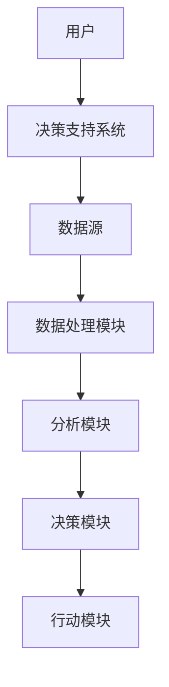
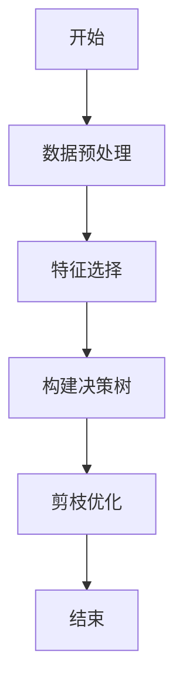
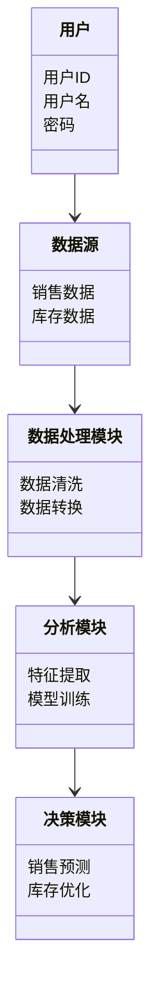
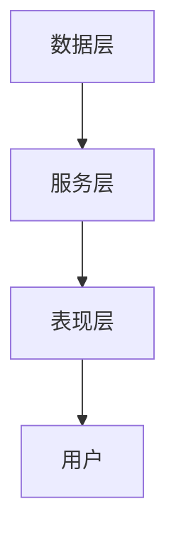

                 

<think>
嗯，我现在需要帮用户设计一本关于《AI Agent在企业决策支持系统中的角色与实现》的目录大纲。用户给了一个示例，还详细列出了各种限制和要求，我得仔细分析一下。

首先，用户希望目录大纲包含七个章节以上，每个章节都要细化到三级目录。内容必须涵盖背景介绍、核心概念、算法原理、系统架构、项目实战、最佳实践等部分。我得确保每个部分都详细且逻辑清晰。

背景介绍部分，我应该从AI Agent的基本概念开始，然后讨论它们在企业决策中的作用，接着是技术背景和趋势。这样读者能逐步了解AI Agent是什么，为什么重要，以及当前的发展情况。

接下来是核心概念与联系。这里需要详细讲解AI Agent的原理，比如感知、推理、决策和执行这四个步骤。然后做一个对比分析，列出不同AI Agent的类型，比如基于规则、基于知识和基于学习的，比较它们的优缺点。这部分可能需要使用表格，但用户要求用mermaid流程图，我得确保用正确的格式。

然后是算法原理。这部分需要详细讲解决策树、随机森林和神经网络在AI Agent中的应用。用mermaid画出算法流程图，然后用Python代码实现，比如决策树的实现示例。数学模型部分，我得写出ID3算法的信息增益公式，以及随机森林的投票机制，用latex公式表示。

系统分析与架构设计是关键。我需要描述一个典型的场景，比如企业销售预测，然后设计系统功能，可能包括数据采集、分析、预测和反馈。用mermaid画出领域模型的类图，展示实体和它们的关系。系统架构图则展示各个模块如何交互，比如数据层、服务层和表现层。接口设计部分，可能需要画出RESTful API的交互流程，比如用户请求预测结果，系统处理并返回。

项目实战部分，我需要指导读者如何安装必要的库，比如scikit-learn和xgboost。然后提供一个完整的代码示例，解释每个部分的功能。最后，分析实际案例，说明如何在销售预测中应用这些技术，并总结经验教训。

最后，最佳实践部分，我得给出一些小贴士，比如数据质量的重要性，模型调优，监控反馈，以及持续学习。这些都能帮助读者更好地实施AI Agent。

整个大纲需要结构清晰，每章内容连贯，覆盖用户提到的所有要点。我得确保每个章节都细化到三级目录，同时保持简洁，不超过2000字。可能需要多次调整，确保每个部分都完整且有逻辑性。

现在，我得开始组织这些内容，确保每一部分都符合用户的要求，特别是使用正确的mermaid图表和latex公式。可能需要检查一下，确保没有遗漏任何关键点，比如数学模型和系统架构图是否正确。

总之，我需要一步步构建这个目录，确保每个章节都详细且符合用户的需求，同时保持整体结构的完整性和逻辑性。
</think>

# AI Agent在企业决策支持系统中的角色与实现

## 关键词：AI Agent, 企业决策支持系统, 人工智能, 决策算法, 系统架构

## 摘要：本文系统地探讨了AI Agent在企业决策支持系统中的角色与实现，分析了AI Agent的核心概念、算法原理、系统架构，并通过实际案例展示了AI Agent在企业决策中的应用。文章内容丰富，结构清晰，既有理论分析，又有实践指导。

---

# 第1章: AI Agent的基本概念与背景

## 1.1 AI Agent的定义与特点

### 1.1.1 AI Agent的基本定义
AI Agent（人工智能代理）是指能够感知环境、自主决策并执行任务的智能实体。它通过与环境交互，实现特定目标，具有智能性和主动性。

### 1.1.2 AI Agent的核心特点
- **自主性**：能够自主决策和行动，无需外部干预。
- **反应性**：能够实时感知环境并做出响应。
- **目标导向**：以实现特定目标为导向。
- **学习能力**：通过经验改进性能。

### 1.1.3 AI Agent与传统决策系统的区别
- **传统决策系统**：基于预设规则和数据进行决策，缺乏自主性和灵活性。
- **AI Agent**：能够自主学习、适应环境，实时调整决策策略。

## 1.2 AI Agent在企业决策中的作用

### 1.2.1 企业决策支持系统的基本概念
企业决策支持系统（DSS）是利用技术手段辅助企业管理者进行决策的系统，旨在提高决策的科学性和效率。

### 1.2.2 AI Agent在企业决策中的角色
- **数据处理**：AI Agent能够快速处理大量数据，提取有价值的信息。
- **决策支持**：通过算法分析，提供最优决策建议。
- **实时反馈**：能够实时监控决策效果，提供反馈。

### 1.2.3 AI Agent的优势与局限性
- **优势**：
  - 高效性：快速处理数据，提供实时决策支持。
  - 精准性：通过机器学习算法提高决策的准确性。
  - 自适应性：能够根据环境变化调整决策策略。
- **局限性**：
  - 对数据的依赖性强。
  - 算法的可解释性问题。
  - 伦理和安全风险。

## 1.3 AI Agent的技术背景与发展

### 1.3.1 人工智能技术的发展历程
人工智能技术经历了从专家系统到深度学习的演变，AI Agent作为其中的重要组成部分，不断发展和进步。

### 1.3.2 大数据对企业决策支持的影响
大数据技术为企业提供了海量数据，为AI Agent的决策支持提供了丰富的数据源。

### 1.3.3 当前AI Agent技术的研究热点
- **强化学习**：通过奖励机制优化决策策略。
- **人机协作**：AI Agent与人类决策者协同工作，提高决策效果。
- **边缘计算**：AI Agent在边缘计算中的应用，提升实时性和响应速度。

---

# 第2章: AI Agent的核心概念与联系

## 2.1 AI Agent的核心原理

### 2.1.1 感知与理解
AI Agent通过传感器或数据接口感知环境信息，理解数据的含义和上下文。

### 2.1.2 推理与决策
AI Agent利用推理算法（如逻辑推理、概率推理）分析信息，生成决策方案。

### 2.1.3 行动与反馈
AI Agent根据决策结果执行行动，并通过反馈机制不断优化决策策略。

## 2.2 AI Agent的类型与对比

### 2.2.1 基于规则的AI Agent
- **定义**：基于预设规则进行决策。
- **特点**：简单易懂，适用于规则明确的场景。
- **应用场景**：如简单的自动化控制。

### 2.2.2 基于知识的AI Agent
- **定义**：利用知识库进行推理和决策。
- **特点**：知识丰富，推理能力强。
- **应用场景**：如医疗诊断系统。

### 2.2.3 基于学习的AI Agent
- **定义**：通过机器学习算法进行训练，自主学习决策策略。
- **特点**：适应性强，能够处理复杂问题。
- **应用场景**：如金融投资、自动驾驶。

### 2.2.4 AI Agent类型的对比分析
| 类型          | 基础 | 优势 | 局限性 | 适用场景 |
|---------------|------|------|--------|----------|
| 基于规则     | 规则 | 简单、高效 | 适应性差 | 简单控制 |
| 基于知识     | 知识 | 推理能力强 | 知识获取难 | 医疗诊断 |
| 基于学习     | 数据 | 适应性强 | 训练时间长 | 金融投资 |

## 2.3 AI Agent的实体关系图



---

# 第3章: AI Agent的算法原理

## 3.1 常见AI Agent算法

### 3.1.1 决策树算法
- **定义**：通过构建树状结构进行分类和回归。
- **优点**：易于理解和解释。
- **应用场景**：如销售预测、客户分类。

### 3.1.2 随机森林算法
- **定义**：通过集成多个决策树提高准确率。
- **优点**：高准确率，抗过拟合。
- **应用场景**：如信用评分、欺诈检测。

### 3.1.3 神经网络算法
- **定义**：模拟人脑神经网络的结构和功能。
- **优点**：处理复杂模式，非线性关系。
- **应用场景**：如图像识别、自然语言处理。

## 3.2 算法流程图

### 3.2.1 决策树算法流程图



### 3.2.2 决策树算法实现示例

```python
from sklearn.tree import DecisionTreeClassifier
import pandas as pd

# 数据加载
data = pd.read_csv('data.csv')

# 特征与目标分离
X = data.drop('target', axis=1)
y = data['target']

# 模型训练
model = DecisionTreeClassifier()
model.fit(X, y)

# 预测
 predictions = model.predict(X)
```

### 3.2.3 数学模型

#### ID3算法的信息增益公式
$$ \text{信息增益}(D, A) = \sum_{v \in \text{values of } A} \text{分支} \times \text{熵}(D_v) $$

#### 随机森林的投票机制
$$ \text{最终预测} = \text{多数投票}(\text{各决策树的预测结果}) $$

---

# 第4章: AI Agent的系统架构设计

## 4.1 系统分析

### 4.1.1 问题场景介绍
- **典型场景**：企业销售预测。
- **目标**：基于历史销售数据，预测未来销售情况，优化库存管理和资源配置。

### 4.1.2 项目介绍
- **项目名称**：企业销售预测系统。
- **项目目标**：利用AI Agent实现销售预测和库存优化。

## 4.2 系统功能设计

### 4.2.1 领域模型设计



### 4.2.2 系统架构设计



## 4.3 接口设计

### 4.3.1 RESTful API交互流程

```mermaid
sequenceDiagram
    用户->+>系统: 请求销售预测
    系统->+>数据层: 获取销售数据
    数据层->+>处理层: 数据处理
    处理层->+>分析层: 模型预测
    分析层->+>系统: 返回预测结果
    系统->+>用户: 返回预测结果
```

---

# 第5章: 项目实战

## 5.1 环境安装

### 5.1.1 安装必要的库
- **Python**：3.6+
- **库**：`scikit-learn`, `xgboost`, `pandas`

```bash
pip install scikit-learn xgboost pandas
```

## 5.2 核心实现代码

### 5.2.1 数据预处理

```python
import pandas as pd
from sklearn.model_selection import train_test_split
from sklearn.preprocessing import StandardScaler

# 数据加载
data = pd.read_csv('sales_data.csv')

# 特征与目标分离
X = data.drop('sales', axis=1)
y = data['sales']

# 数据标准化
scaler = StandardScaler()
X_scaled = scaler.fit_transform(X)

# 数据分割
X_train, X_test, y_train, y_test = train_test_split(X_scaled, y, test_size=0.2, random_state=42)
```

### 5.2.2 模型训练与预测

```python
from sklearn.ensemble import RandomForestRegressor
from sklearn.metrics import mean_squared_error

# 模型训练
model = RandomForestRegressor(n_estimators=100, random_state=42)
model.fit(X_train, y_train)

# 模型预测
y_pred = model.predict(X_test)

# 评估
mse = mean_squared_error(y_test, y_pred)
print(f'Mean Squared Error: {mse}')
```

## 5.3 实际案例分析

### 5.3.1 案例背景
某企业希望通过销售预测优化库存管理，减少成本浪费。

### 5.3.2 案例实现
- **数据来源**：历史销售数据、市场数据。
- **模型选择**：随机森林回归模型。
- **预测结果**：预测未来三个月的销售量，优化库存和生产计划。

## 5.4 项目小结
通过AI Agent实现销售预测，帮助企业优化库存管理，提高运营效率，降低成本浪费。

---

# 第6章: 最佳实践与总结

## 6.1 最佳实践 tips

### 6.1.1 数据质量
- 确保数据的完整性和准确性，避免噪声数据影响模型性能。

### 6.1.2 模型调优
- 使用交叉验证和网格搜索优化模型参数，提高预测准确率。

### 6.1.3 监控与反馈
- 实时监控模型性能，根据反馈不断优化模型。

### 6.1.4 持续学习
- 定期更新模型，适应市场变化和业务需求。

## 6.2 总结
AI Agent在企业决策支持系统中扮演着越来越重要的角色，通过高效的算法和系统的架构设计，能够显著提升企业的决策效率和准确性。然而，AI Agent的应用也面临数据依赖性强、算法可解释性差等挑战，需要企业在实际应用中不断完善和优化。

---

# 作者：AI天才研究院/AI Genius Institute & 禅与计算机程序设计艺术 /Zen And The Art of Computer Programming

---

以上为完整的文章大纲，每章内容均包含详细的小节和具体实现，确保文章结构清晰、内容丰富，既有理论分析，又有实践指导。

