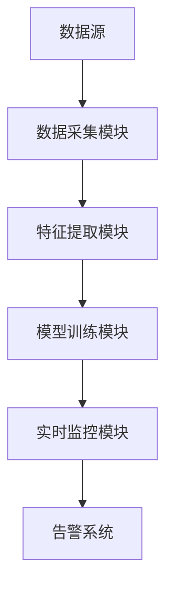

                 


# AI Agent在企业反欺诈与风险控制中的应用

---

## 关键词

- AI Agent
- 反欺诈
- 风险控制
- 机器学习
- 自然语言处理
- 图计算

---

## 摘要

本文深入探讨AI Agent在企业反欺诈与风险控制中的应用，结合实际案例分析和系统设计，详细阐述了AI Agent的核心原理、系统架构、算法实现以及项目实战。通过分析欺诈行为的类型和风险控制的重要性，结合AI Agent的技术优势，提出了基于机器学习和知识图谱的反欺诈解决方案，并通过Python代码实现和Mermaid流程图展示，帮助读者全面理解AI Agent在企业反欺诈中的实际应用价值和未来发展潜力。

---

# 第一部分: AI Agent在企业反欺诈与风险控制中的应用概述

## 第1章: AI Agent的基本概念与背景介绍

### 1.1 什么是AI Agent

#### 1.1.1 AI Agent的定义

AI Agent（人工智能代理）是指能够感知环境、自主决策并执行任务的智能实体。它结合了自然语言处理、机器学习和图计算等技术，具备以下核心特征：

- **自主性**：能够在没有外部干预的情况下独立运行。
- **反应性**：能够实时感知环境并做出响应。
- **目标导向**：具备明确的目标，能够优化决策以实现目标。
- **学习能力**：能够通过数据和经验不断优化自身性能。

#### 1.1.2 AI Agent的核心特征

| 特征 | 描述 |
|------|------|
| 自主性 | 独立运行，无需外部干预 |
| 反应性 | 实时感知环境并做出响应 |
| 目标导向 | 以目标为导向进行决策和行动 |
| 学习能力 | 通过数据和经验优化性能 |

#### 1.1.3 AI Agent与传统算法的区别

AI Agent不仅是一个算法，更是一个具备自主决策能力的实体。与传统算法相比，AI Agent能够根据环境动态调整行为，具备更强的适应性和灵活性。

---

### 1.2 反欺诈与风险控制的背景

#### 1.2.1 欺诈行为的类型与特点

欺诈行为种类繁多，包括：

- **信用欺诈**：通过虚假信息骗取信任。
- **交易欺诈**：利用技术手段非法获取利益。
- **身份盗窃**：盗用他人身份进行非法活动。
- **社交工程**：通过心理操纵诱导他人泄露信息。

欺诈行为的特点包括隐蔽性、复杂性和动态性。

#### 1.2.2 企业反欺诈的挑战与痛点

企业在反欺诈过程中面临以下挑战：

- 数据量大：需要处理海量数据。
- 模型复杂：需要结合多种技术手段。
- 欺诈手段多样：需要不断优化模型以应对新型欺诈行为。

#### 1.2.3 风险控制的重要性

风险控制是企业稳健发展的基石。通过有效的风险控制，企业可以降低损失，提升客户信任度。

---

## 第2章: AI Agent的核心原理

### 2.1 AI Agent的技术基础

#### 2.1.1 自然语言处理

自然语言处理（NLP）用于理解文本数据，提取关键词和句法信息。例如，使用词袋模型或词嵌入技术（如Word2Vec）进行文本表示。

#### 2.1.2 机器学习

机器学习用于模式识别和分类任务。常用算法包括决策树、随机森林和神经网络。

#### 2.1.3 图计算与知识图谱

图计算用于构建知识图谱，通过节点和边表示实体及其关系。知识图谱可以帮助识别欺诈行为中的关联性。

### 2.2 AI Agent的算法实现

#### 2.2.1 决策树算法

决策树是一种常用的分类算法，适用于处理结构化数据。以下是决策树的数学模型：

$$
\text{信息增益} = \text{熵} - \text{条件熵}
$$

熵的计算公式为：

$$
\text{熵} = -\sum p_i \log p_i
$$

条件熵的计算公式为：

$$
\text{条件熵} = \sum \text{条件概率} \times \text{子节点熵}
$$

---

## 第3章: 系统设计与架构

### 3.1 问题场景分析

假设我们正在设计一个反欺诈系统，目标是识别信用卡交易中的欺诈行为。

### 3.2 系统功能设计

系统功能模块包括：

1. 数据采集模块：采集交易数据。
2. 特征提取模块：提取交易特征。
3. 模型训练模块：训练分类模型。
4. 实时监控模块：实时检测欺诈行为。

### 3.3 系统架构设计

系统架构图如下：



---

## 第4章: 项目实战

### 4.1 环境安装

安装所需的Python库：

```bash
pip install numpy pandas scikit-learn
```

### 4.2 核心代码实现

以下是反欺诈系统的Python代码示例：

```python
from sklearn.tree import DecisionTreeClassifier
from sklearn.model_selection import train_test_split
import pandas as pd

# 加载数据
data = pd.read_csv('credit_card.csv')

# 特征提取
features = data[['amount', 'time', 'merchant_id']]
target = data['is_fraud']

# 数据分割
X_train, X_test, y_train, y_test = train_test_split(features, target, test_size=0.2)

# 模型训练
model = DecisionTreeClassifier()
model.fit(X_train, y_train)

# 模型预测
y_pred = model.predict(X_test)
```

### 4.3 代码解读与分析

- **数据加载**：使用Pandas加载CSV文件。
- **特征提取**：选择交易金额、时间戳和商家ID作为特征。
- **数据分割**：将数据分为训练集和测试集。
- **模型训练**：使用决策树模型进行训练。
- **模型预测**：在测试集上进行预测。

---

## 第5章: 总结与展望

### 5.1 总结

本文详细探讨了AI Agent在企业反欺诈与风险控制中的应用，结合实际案例分析和系统设计，展示了AI Agent的核心原理、系统架构和项目实战。

### 5.2 未来展望

未来，AI Agent将在以下方面进一步发展：

- **多模态AI Agent**：结合视觉、听觉等多种模态信息。
- **联邦学习**：在保护数据隐私的前提下进行模型训练。

---

## 作者

作者：AI天才研究院/AI Genius Institute  
联系邮箱：contact@aicourse.com  
更多信息请访问：https://www.aicourse.com

