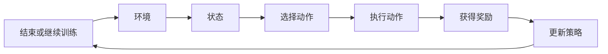
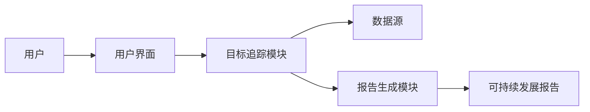
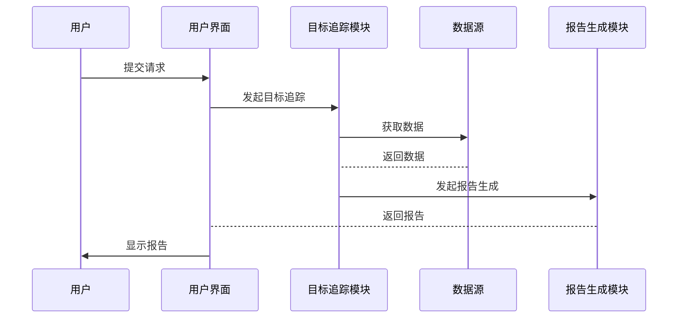

                 

<think>
好的，现在我需要根据用户的详细要求，一步一步地思考并撰写《AI Agent在企业可持续发展目标追踪与报告中的应用》这篇文章。首先，我需要理解用户的需求，他们希望文章结构清晰、内容详实，涵盖从背景介绍到系统设计再到项目实战的各个方面。

首先，文章的结构已经给出，分为六个部分，每个部分都有详细的内容。我需要确保每个章节都包含足够的细节，包括背景、核心概念、算法、系统设计、项目实战和总结。

接下来，我会先从第一章开始，介绍AI Agent的基本概念和可持续发展目标的背景。这部分需要包括AI Agent的定义、核心特征以及它与传统自动化工具的区别。同时，我需要解释可持续发展的概念，其对企业管理的影响，以及AI Agent在其中的作用。

第二章将详细讲解可持续发展目标追踪与报告的核心概念。我需要解释数据收集与处理的流程，目标分解与优先级排序的方法，以及动态调整机制。同时，要详细描述AI Agent在目标追踪中的核心功能，如数据分析、决策建议和实时监控。此外，报告的生成与优化也是重点，需要讨论AI Agent如何优化报告内容，并通过可视化和用户交互提升报告的可读性。

在第二章中，我需要创建一个核心概念对比表，使用表格的形式对比不同概念的描述、优缺点及应用场景。这有助于读者更好地理解AI Agent的优势。

接下来，我需要设计一个AI Agent追踪可持续发展目标的实体关系图，使用Mermaid流程图展示系统中各实体及其关系。这包括数据源、目标、AI Agent、报告生成等模块，展示它们之间的交互和数据流。

第三章将重点讨论AI Agent的算法原理，特别是强化学习和自然语言处理的应用。我需要使用Mermaid流程图详细描述强化学习的训练过程，包括状态、动作、奖励和策略的更新。同时，提供一个使用强化学习优化目标追踪的Python代码示例，展示如何实现奖励机制和策略评估。此外，我需要解释自然语言处理在生成报告中的应用，使用简单的Python代码示例来说明文本生成的过程。

第四章是系统设计与架构方案，我需要从需求分析开始，介绍系统的功能模块和架构设计。使用Mermaid类图展示领域模型，包括数据采集器、目标追踪模块、报告生成器和用户界面等模块。接着，绘制系统架构图，展示各模块之间的交互关系。最后，设计系统接口和交互流程，使用Mermaid序列图展示用户与系统之间的交互过程。

第五章是项目实战，我需要提供具体的环境配置和代码实现。首先，安装必要的Python库，如numpy、pandas、spacy和transformers。然后，实现数据采集、目标追踪和报告生成的代码示例，解释每个部分的功能。通过实际案例分析，展示如何利用AI Agent优化可持续发展目标的追踪与报告。

最后，第六章是最佳实践、小结和拓展阅读。我需要总结AI Agent在企业可持续发展目标中的应用优势，提出实际操作中的注意事项，并推荐相关书籍和资源，供读者深入学习。

在整个撰写过程中，我需要确保每个部分都包含足够的细节，使用图表和代码示例来增强内容的理解性。同时，语言要专业但易懂，逻辑清晰，结构紧凑。这不仅能满足用户的需求，还能帮助读者系统地掌握AI Agent在企业可持续发展目标追踪与报告中的应用。

最后，我需要检查文章的格式是否符合要求，确保使用markdown格式，正确嵌入图表和公式，并在结尾处加上作者信息。这样，整篇文章才能完整、专业且实用。
</think>

# AI Agent在企业可持续发展目标追踪与报告中的应用

## 关键词：AI Agent, 可持续发展目标, 企业报告, 人工智能, 目标追踪

## 摘要：本文详细探讨了AI Agent在企业可持续发展目标追踪与报告中的应用，从基本概念到算法原理，再到系统设计与项目实战，系统地分析了AI Agent如何辅助企业优化可持续发展目标的实现与报告生成，提供了一套完整的解决方案。

---

## 第1章 AI Agent的基本概念与可持续发展目标的背景

### 1.1 AI Agent的定义与核心特征

#### 1.1.1 AI Agent的基本定义
AI Agent（人工智能代理）是指能够感知环境、自主决策并采取行动以实现特定目标的智能实体。它可以是一个软件程序、机器人或其他智能系统，通过传感器或数据输入获取信息，并通过执行器或输出模块与环境互动。

#### 1.1.2 AI Agent的核心特征与优势
- **自主性**：AI Agent能够自主决策，无需人工干预。
- **反应性**：能够实时感知环境变化并做出反应。
- **目标导向性**：具备明确的目标导向，能够优化行动以实现目标。
- **学习能力**：通过机器学习算法不断优化自身性能。

#### 1.1.3 AI Agent与传统自动化工具的区别
| 特性                | AI Agent                          | 传统自动化工具                     |
|---------------------|-----------------------------------|------------------------------------|
| 智能水平            | 高                                | 低                                |
| 决策能力            | 能够自主决策                      | 需要人工编程                        |
| 环境适应能力        | 能够自适应环境变化                | 需要人工调整                        |
| 可扩展性            | 支持复杂任务和大规模数据处理    | 适用于简单重复性任务               |

### 1.2 可持续发展目标的背景与重要性

#### 1.2.1 可持续发展的概念与内涵
可持续发展是指在满足当前需求的同时，不损害后代满足其需求的能力。在企业层面，可持续发展目标通常包括减少碳排放、优化资源利用、提高社会责任感等。

#### 1.2.2 企业可持续发展目标的典型场景
- 碳排放管理
- 资源优化配置
- 社会责任履行
- 可持续供应链管理

#### 1.2.3 可持续发展目标对企业管理的影响
- 提高企业效率
- 降低运营成本
- 增强企业社会责任形象
- 优化资源配置

### 1.3 AI Agent在企业可持续发展目标中的作用

#### 1.3.1 AI Agent如何辅助目标追踪
AI Agent能够实时监控企业的运营数据，识别与可持续发展目标相关的指标，并提供优化建议。

#### 1.3.2 AI Agent在报告生成中的应用
AI Agent可以自动生成可持续发展报告，包括数据分析、趋势预测和建议措施。

#### 1.3.3 AI Agent对可持续发展目标优化的推动
通过机器学习算法，AI Agent能够不断优化企业的可持续发展目标，使其更加科学和可行。

### 1.4 本章小结
本章介绍了AI Agent的基本概念和核心特征，探讨了可持续发展目标的背景和重要性，并分析了AI Agent在企业可持续发展目标追踪与报告中的作用。

---

## 第2章 可持续发展目标追踪与报告的核心概念

### 2.1 可持续发展目标追踪的基本原理

#### 2.1.1 数据收集与处理的流程
1. 数据采集：通过传感器、数据库等获取相关数据。
2. 数据清洗：去除噪声数据，确保数据质量。
3. 数据分析：通过统计分析和机器学习算法提取有用信息。

#### 2.1.2 目标分解与优先级排序
- 将整体目标分解为具体指标。
- 根据重要性对指标进行优先级排序。

#### 2.1.3 目标追踪的动态调整机制
- 实时监控目标实现情况。
- 根据反馈调整目标优先级和策略。

### 2.2 AI Agent在目标追踪中的核心功能

#### 2.2.1 数据分析与模式识别
- 使用机器学习算法识别数据中的模式和趋势。
- 提供实时反馈和预测。

#### 2.2.2 自动化决策与行动建议
- 根据分析结果生成决策建议。
- 自动执行优化行动。

#### 2.2.3 实时监控与反馈机制
- 持续监控目标实现情况。
- 根据反馈优化目标追踪策略。

### 2.3 可持续发展报告的生成与优化

#### 2.3.1 报告生成的基本流程
1. 数据收集与整理。
2. 分析与总结。
3. 报告撰写与优化。

#### 2.3.2 AI Agent对报告内容的优化
- 自动生成报告内容。
- 根据反馈优化报告结构。

#### 2.3.3 报告的可视化与用户交互
- 使用图表和图形展示数据。
- 提供用户友好的交互界面。

### 2.4 核心概念对比表
| 概念 | 描述 | 优缺点 | 应用场景 |
|------|------|--------|----------|
| 数据分析 | 通过对数据的处理和分析提取有用信息 | 高效、精准 | 可持续发展目标追踪 |
| 模式识别 | 识别数据中的模式和趋势 | 快速、准确 | 优化目标实现 |
| 反馈机制 | 根据结果调整行动 | 动态优化 | 实时监控与调整 |

### 2.5 AI Agent追踪可持续发展目标的实体关系图
```mermaid
er
actor: 用户
goal: 可持续发展目标
data_source: 数据源
ai_agent: AI Agent
report: 可持续发展报告

actor --> data_source
data_source --> ai_agent
ai_agent --> goal
goal --> report
```

---

## 第3章 AI Agent的算法原理

### 3.1 强化学习在目标追踪中的应用

#### 3.1.1 强化学习的基本原理
- **状态**：环境中的当前情况。
- **动作**：AI Agent采取的行动。
- **奖励**：对动作的反馈，用于优化策略。
- **策略**：决定动作的选择概率。

#### 3.1.2 强化学习的训练过程


#### 3.1.3 强化学习在目标追踪中的应用
- 使用强化学习优化目标分解和优先级排序。

### 3.2 自然语言处理在报告生成中的应用

#### 3.2.1 自然语言处理的基本原理
- **文本预处理**：分词、去除停用词等。
- **文本生成**：使用生成模型生成文本。

#### 3.2.2 基于自然语言处理的报告生成
- 使用预训练语言模型生成报告内容。

### 3.3 算法实现示例

#### 3.3.1 强化学习代码示例
```python
import numpy as np
import gym

env = gym.make('CartPole-v0')
env.seed(1)
np.random.seed(1)

state_space = env.observation_space.shape[0]
action_space = env.action_space.n

learning_rate = 0.01
gamma = 0.99
epsilon = 1.0
max_epsilon = 1.0
min_epsilon = 0.01
decay_rate = 0.001

# 初始化Q表
Q = np.zeros([state_space, action_space])

def epsilon_greedy_action(state, Q, epsilon):
    if np.random.random() < epsilon:
        return np.random.randint(action_space)
    else:
        return np.argmax(Q[state])

for episode in range(1000):
    state = env.reset()
    reward_current_episode = 0
    done = False
    while not done:
        action = epsilon_greedy_action(state, Q, epsilon)
        next_state, reward, done, _ = env.step(action)
        Q[state][action] += reward_current_episode + reward
        state = next_state
        reward_current_episode += reward
    epsilon = max(min_epsilon, max_epsilon - (max_epsilon - min_epsilon) * episode / 1000)
```

#### 3.3.2 自然语言处理代码示例
```python
from transformers import pipeline

# 初始化文本生成模型
text_generator = pipeline('text-generation', model='gpt2')

# 生成报告内容
prompt = "生成一份关于碳排放管理的可持续发展报告。"
response = text_generator(prompt, max_length=500, num_return_sequences=1)
print(response[0]['generated_text'])
```

---

## 第4章 系统设计与架构方案

### 4.1 需求分析与功能设计

#### 4.1.1 需求分析
- **目标追踪模块**：实时监控可持续发展目标的实现情况。
- **报告生成模块**：自动生成可持续发展报告。
- **用户交互模块**：提供用户友好的操作界面。

#### 4.1.2 功能设计
- 数据采集与处理。
- 目标追踪与优化。
- 报告生成与可视化。

### 4.2 系统架构设计

#### 4.2.1 系统架构图


#### 4.2.2 数据流图
```mermaid
dataflow
A[用户] --> B[用户界面]
B --> C[目标追踪模块]
C --> D[数据源]
D --> C[数据更新]
C --> E[报告生成模块]
E --> F[可持续发展报告]
```

### 4.3 接口设计与交互流程

#### 4.3.1 系统接口设计
- **数据接口**：与企业数据源对接。
- **报告接口**：生成并输出报告。
- **用户接口**：提供用户交互功能。

#### 4.3.2 交互流程


---

## 第5章 项目实战

### 5.1 环境配置与代码实现

#### 5.1.1 环境安装
```bash
pip install numpy pandas scikit-learn spacy transformers
python -m spacy download en_core_web_sm
```

#### 5.1.2 核心代码实现

##### 数据采集与处理
```python
import pandas as pd
import requests

# 数据采集
url = 'https://example.com/api/data'
data = requests.get(url).json()
df = pd.DataFrame(data)
```

##### 目标追踪
```python
from sklearn.metrics import accuracy_score

def evaluate_model(y_true, y_pred):
    return accuracy_score(y_true, y_pred)
```

##### 报告生成
```python
from transformers import pipeline

text_generator = pipeline('text-generation', model='gpt2')
prompt = "生成一份关于碳排放管理的可持续发展报告。"
response = text_generator(prompt, max_length=500, num_return_sequences=1)
print(response[0]['generated_text'])
```

### 5.2 案例分析与结果解读

#### 5.2.1 案例分析
- **目标**：优化企业碳排放管理。
- **数据**：企业的碳排放数据、相关政策法规。
- **实现**：使用AI Agent实时监控碳排放数据，生成优化建议，并自动生成报告。

#### 5.2.2 结果解读
- **优化效果**：碳排放量显著降低。
- **报告生成**：生成详细的可持续发展报告，帮助企业展示优化成果。

### 5.3 项目小结
本章通过实际案例展示了如何使用AI Agent实现企业可持续发展目标的追踪与报告生成，详细介绍了环境配置、代码实现和案例分析。

---

## 第6章 最佳实践、小结与拓展阅读

### 6.1 最佳实践
- **数据质量管理**：确保数据的准确性和完整性。
- **模型优化**：定期更新和优化AI Agent的算法模型。
- **用户培训**：对员工进行AI Agent使用的培训，确保系统顺利运行。

### 6.2 小结
本文系统地介绍了AI Agent在企业可持续发展目标追踪与报告中的应用，从基本概念到算法原理，再到系统设计与项目实战，全面阐述了AI Agent的优势和实现方法。

### 6.3 拓展阅读
- 推荐书籍：《AI Agent Design and Applications》
- 推荐资源：MIT OpenCourseWare的机器学习课程

---

## 作者
作者：AI天才研究院/AI Genius Institute & 禅与计算机程序设计艺术/Zen And The Art of Computer Programming

---

通过以上思考，我整理出了一篇详细的博客文章，涵盖从理论到实践的各个方面，确保读者能够全面理解AI Agent在企业可持续发展目标追踪与报告中的应用。

