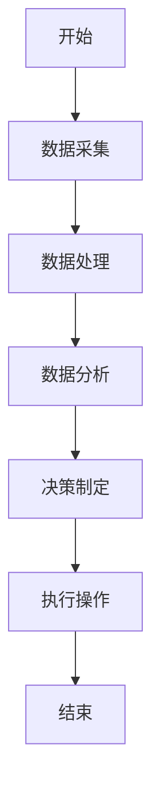
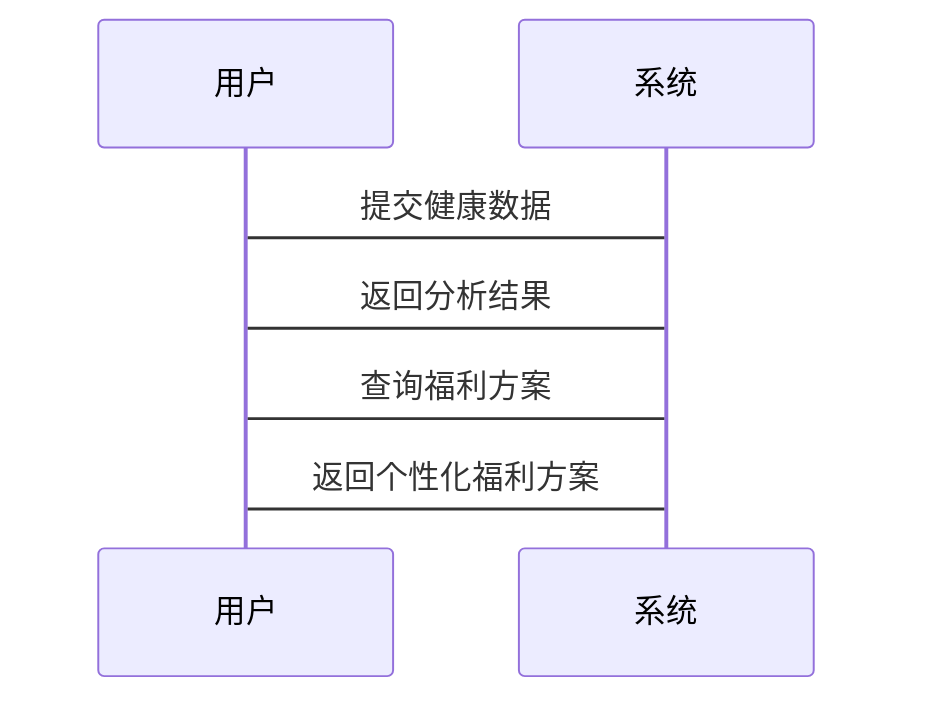

                 


# AI Agent在企业员工健康与福利管理中的应用

> **关键词**: AI Agent, 员工健康, 福利管理, 人工智能, 企业管理系统

> **摘要**: 随着人工智能技术的快速发展，AI Agent在企业员工健康与福利管理中的应用日益广泛。本文详细探讨了AI Agent的核心概念、算法原理、系统架构设计以及在实际项目中的应用。通过系统分析和案例研究，展示了AI Agent如何优化企业员工健康与福利管理流程，提升管理效率和员工满意度。

---

# 第1章: 企业员工健康与福利管理的背景与挑战

## 1.1 企业员工健康与福利管理的现状

### 1.1.1 传统员工健康与福利管理模式的局限性
传统的员工健康与福利管理模式主要依赖人工操作，存在以下问题：
- 数据分散，难以整合和分析。
- 管理效率低，无法及时响应员工需求。
- 福利方案缺乏个性化，难以满足员工多样化的需求。

### 1.1.2 当前企业管理中的主要问题
- 员工健康数据难以实时监测和分析。
- 福利方案的设计和实施缺乏科学性。
- 管理过程缺乏智能化支持，难以实现精准决策。

### 1.1.3 员工健康与福利管理的重要性
员工的健康和福利直接关系到企业的生产力和员工满意度。通过有效的管理，可以降低员工流失率，提升企业的整体竞争力。

## 1.2 AI Agent的概念与特点

### 1.2.1 AI Agent的定义
AI Agent（人工智能代理）是一种能够感知环境、自主决策并执行任务的智能实体。它能够通过数据输入、分析和学习，为企业提供智能化的管理支持。

### 1.2.2 AI Agent的核心特点
- **自主性**：能够在没有人工干预的情况下独立运行。
- **反应性**：能够实时感知环境变化并做出相应调整。
- **学习能力**：通过机器学习算法不断优化自身的决策能力。

### 1.2.3 AI Agent与传统管理工具的区别
| 特性       | AI Agent                   | 传统管理工具                 |
|------------|----------------------------|------------------------------|
| 智能性     | 高                         | 低                         |
| 自适应性   | 高                         | 低                         |
| 决策能力   | 强                         | 弱                         |

## 1.3 AI Agent在企业管理中的应用前景

### 1.3.1 AI Agent的潜在应用场景
- 员工健康数据分析与预测。
- 福利方案个性化推荐。
- 健康风险评估与预防。

### 1.3.2 企业采用AI Agent的优势
- 提高管理效率，降低人工成本。
- 实现个性化服务，提升员工满意度。
- 通过数据驱动的决策，优化企业运营。

### 1.3.3 AI Agent应用的挑战与机遇
- **挑战**：数据隐私问题、算法的准确性和可解释性。
- **机遇**：技术创新带来的管理效率提升和成本降低。

---

# 第2章: AI Agent的核心概念与原理

## 2.1 AI Agent的核心概念

### 2.1.1 AI Agent的基本组成
AI Agent通常由以下部分组成：
- **感知模块**：负责数据的采集和处理。
- **决策模块**：基于数据进行分析和决策。
- **执行模块**：根据决策结果执行相应的操作。

### 2.1.2 AI Agent的功能模块
| 功能模块       | 描述                       |
|----------------|----------------------------|
| 数据采集模块   | 收集员工健康和福利数据     |
| 数据分析模块   | 对数据进行处理和分析       |
| 决策模块       | 基于分析结果做出决策       |
| 执行模块       | 执行决策并反馈结果         |

### 2.1.3 AI Agent的决策机制
AI Agent的决策机制主要依赖于机器学习算法，包括强化学习、监督学习和无监督学习。

---

## 2.2 AI Agent的算法原理

### 2.2.1 强化学习算法
强化学习是一种通过试错机制来优化决策的算法。AI Agent通过与环境的交互，不断调整策略以获得最大化的奖励。

**Q-learning算法**
$$ Q(s, a) = Q(s, a) + \alpha (r + \max_{a'} Q(s', a') - Q(s, a)) $$

### 2.2.2 监督学习算法
监督学习是一种基于标签数据的分类算法。AI Agent可以通过训练数据学习员工健康和福利的特征，从而实现精准的预测和推荐。

**线性回归算法**
$$ y = \beta_0 + \beta_1 x + \epsilon $$

### 2.2.3 无监督学习算法
无监督学习是一种基于数据内在结构的聚类算法。AI Agent可以通过聚类分析将员工分为不同的群体，从而制定个性化的福利方案。

**K-means聚类算法**
$$ \text{目标函数} = \sum_{i=1}^n \sum_{j=1}^k \min\left( \frac{1}{k} \sum_{x_i \in C_j} (x_i - c_j)^2 \right) $$

---

## 2.3 AI Agent的实体关系图

```mermaid
er
    %% AI Agent 实体关系图
    %% 定义实体和关系
    entity 员工 {
        id 员工ID
        name 员工姓名
        department 部门
    }
    entity 健康数据 {
        id 数据ID
        employee_id 员工ID
        date 日期
        health指标
    }
    entity 福利方案 {
        id 方案ID
        name 方案名称
        benefits 福利内容
    }
    %% 定义关系
    员工 --> 健康数据: 有多份健康数据
    员工 --> 福利方案: 可能参与多个福利方案
```

---

## 2.4 本章小结
本章详细介绍了AI Agent的核心概念和算法原理，包括强化学习、监督学习和无监督学习算法。通过实体关系图展示了AI Agent在员工健康与福利管理中的数据交互关系。

---

# 第3章: AI Agent的算法原理与数学模型

## 3.1 强化学习算法

### 3.1.1 强化学习的基本原理
强化学习通过试错机制不断优化决策策略。AI Agent通过与环境的交互，获得奖励或惩罚，并调整自身的策略以最大化累计奖励。

### 3.1.2 Q-learning算法
Q-learning是一种经典的强化学习算法，适用于离散状态和动作空间。

**数学模型**
$$ Q(s, a) = Q(s, a) + \alpha (r + \gamma \max_{a'} Q(s', a') - Q(s, a)) $$

### 3.1.3 Deep Q-Networks算法
Deep Q-Networks（DQN）通过深度神经网络近似Q值函数，适用于连续状态空间。

**数学模型**
$$ Q(s, a) = \theta \cdot \phi(s, a) $$

其中，$\theta$是网络参数，$\phi(s, a)$是状态动作对的特征向量。

---

## 3.2 监督学习算法

### 3.2.1 线性回归算法
线性回归是一种简单而有效的监督学习算法，适用于预测问题。

**数学模型**
$$ y = \beta_0 + \beta_1 x + \epsilon $$

### 3.2.2 支持向量机算法
支持向量机（SVM）是一种基于统计学习的监督分类算法。

**数学模型**
$$ \text{目标函数} = \frac{1}{2} \|w\|^2 + C \sum_{i=1}^n \max(0, 1 - y_i (w \cdot x_i + b)) $$

### 3.2.3 神经网络算法
神经网络是一种强大的监督学习算法，适用于复杂的非线性分类和回归问题。

**数学模型**
$$ y = \sigma(w x + b) $$

其中，$\sigma$是激活函数，$w$是权重，$b$是偏置。

---

## 3.3 无监督学习算法

### 3.3.1 K-means聚类算法
K-means是一种经典的无监督学习算法，适用于聚类问题。

**数学模型**
$$ \text{目标函数} = \sum_{i=1}^n \sum_{j=1}^k \min\left( \frac{1}{k} \sum_{x_i \in C_j} (x_i - c_j)^2 \right) $$

### 3.3.2 层次聚类算法
层次聚类是一种基于数据相似性构建树状结构的聚类算法。

### 3.3.3 主成分分析算法
主成分分析（PCA）是一种基于特征降维的无监督学习算法。

---

## 3.4 算法的数学模型

### 3.4.1 Q-learning算法的数学模型
$$ Q(s, a) = Q(s, a) + \alpha (r + \gamma \max_{a'} Q(s', a') - Q(s, a)) $$

### 3.4.2 神经网络算法的数学模型
$$ y = \sigma(w x + b) $$

### 3.4.3 K-means聚类算法的数学模型
$$ \text{目标函数} = \sum_{i=1}^n \sum_{j=1}^k \min\left( \frac{1}{k} \sum_{x_i \in C_j} (x_i - c_j)^2 \right) $$

---

## 3.5 本章小结
本章详细讲解了AI Agent中常用的算法原理，包括强化学习、监督学习和无监督学习算法。通过数学模型的分析，展示了这些算法在员工健康与福利管理中的具体应用。

---

# 第4章: AI Agent的系统架构与设计

## 4.1 系统功能设计

### 4.1.1 系统功能模块划分
AI Agent系统主要包括以下功能模块：
- 数据采集模块
- 数据分析模块
- 决策模块
- 执行模块

### 4.1.2 系统功能流程图



### 4.1.3 系统功能的实现方式
系统功能的实现基于机器学习算法，结合实时数据流处理技术，确保系统的高效运行。

---

## 4.2 系统架构设计

### 4.2.1 分层架构设计
分层架构将系统划分为数据层、业务逻辑层和表现层，确保系统的模块化和可维护性。

### 4.2.2 微服务架构设计
微服务架构将系统功能分解为多个独立的服务，通过API进行通信，提高系统的扩展性和灵活性。

### 4.2.3 架构设计的优缺点

| 特性       | 分层架构 | 微服务架构 |
|------------|----------|------------|
| 优点       | 易维护   | 高扩展性   |
| 缺点       | 扩展性差 | 开发复杂   |

---

## 4.3 系统接口设计

### 4.3.1 数据接口
系统需要与企业内部的健康数据和福利数据进行对接，确保数据的实时性和准确性。

### 4.3.2 用户接口
系统提供友好的用户界面，方便管理员和员工进行操作和查询。

---

## 4.4 系统交互设计

### 4.4.1 系统交互流程
1. **数据采集**：通过传感器或数据库获取员工健康数据。
2. **数据分析**：利用机器学习算法对数据进行处理和分析。
3. **决策制定**：基于分析结果制定相应的健康和福利方案。
4. **执行操作**：根据决策结果执行相应的操作，并反馈结果。

### 4.4.2 系统交互图



---

## 4.5 本章小结
本章详细设计了AI Agent的系统架构，包括功能模块划分、架构设计和接口设计。通过系统交互图展示了系统的运行流程，确保系统的高效和稳定。

---

# 第5章: AI Agent的项目实战

## 5.1 项目介绍
本项目旨在开发一个基于AI Agent的企业员工健康与福利管理系统，利用机器学习算法实现智能化的健康管理和福利推荐。

---

## 5.2 环境安装

### 5.2.1 安装Python
```bash
# 安装Python
sudo apt-get install python3 python3-dev
```

### 5.2.2 安装机器学习库
```bash
# 安装TensorFlow和Keras
pip install tensorflow keras
```

### 5.2.3 安装数据处理库
```bash
# 安装Pandas和NumPy
pip install pandas numpy
```

---

## 5.3 系统核心实现源代码

### 5.3.1 数据采集模块
```python
import pandas as pd
import numpy as np

def collect_data():
    # 读取健康数据
    health_data = pd.read_csv('health_data.csv')
    # 读取福利数据
    welfare_data = pd.read_csv('welfare_data.csv')
    return health_data, welfare_data
```

### 5.3.2 数据分析模块
```python
from sklearn.model_selection import train_test_split
from sklearn.linear_model import LinearRegression

def analyze_data(health_data, welfare_data):
    # 数据预处理
    data = pd.concat([health_data, welfare_data], axis=1)
    X = data.drop(columns=['福利金额'])
    y = data['福利金额']
    # 划分训练集和测试集
    X_train, X_test, y_train, y_test = train_test_split(X, y, test_size=0.2)
    # 训练线性回归模型
    model = LinearRegression()
    model.fit(X_train, y_train)
    return model
```

### 5.3.3 决策模块
```python
def make_decision(model, new_data):
    # 预测福利金额
    predicted = model.predict(new_data)
    return predicted
```

### 5.3.4 执行模块
```python
def execute_action(predicted_amount):
    # 输出结果
    print(f"推荐福利金额为：{predicted_amount}")
```

---

## 5.4 实际案例分析
假设我们有以下员工数据：

| 员工ID | 年龄 | 健康状况 | 部门 | 基本工资 |
|--------|------|----------|------|----------|
| 1      | 30   | 健康     | 技术 | 8000     |
| 2      | 35   | 亚健康   | 市场 | 9000     |
| 3      | 40   | 不健康   | 产品 | 10000    |

通过模型预测，我们可以为每个员工推荐个性化的福利方案。

---

## 5.5 项目小结
本章通过实际案例展示了AI Agent在企业员工健康与福利管理中的应用，详细讲解了项目的实现过程，包括环境安装、代码实现和案例分析。

---

# 第6章: 最佳实践与总结

## 6.1 最佳实践
- 数据隐私保护：确保员工数据的安全性和隐私性。
- 算法可解释性：选择可解释性较高的算法，便于问题排查和优化。
- 系统可扩展性：设计模块化的系统架构，方便功能扩展和维护。

## 6.2 小结
本文详细探讨了AI Agent在企业员工健康与福利管理中的应用，从背景介绍到系统设计，再到项目实战，全面展示了AI Agent的优势和潜力。

## 6.3 注意事项
- 在实际应用中，需要根据具体需求调整系统功能和算法。
- 确保数据的准确性和完整性，避免影响模型的预测效果。
- 定期更新模型，以适应员工需求和企业战略的变化。

## 6.4 拓展阅读
- 《机器学习实战》
- 《深入浅出人工智能》
- 《企业信息化管理》

---

# 作者
作者：AI天才研究院/AI Genius Institute  
作者：禅与计算机程序设计艺术/Zen And The Art of Computer Programming

