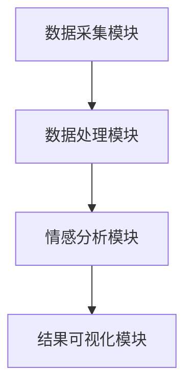

                 

<think>
好的，我现在需要撰写一篇关于《AI Agent在企业品牌情感分析与管理中的深度应用》的技术博客文章。首先，我得明确文章的核心内容和结构。文章主要探讨AI Agent如何在企业品牌管理中应用情感分析技术，帮助品牌监控和管理客户情感。

接下来，我需要按照目录大纲来逐步展开每个部分。首先，介绍AI Agent和情感分析的基本概念，帮助读者理解这两者的定义和作用。然后，分析企业品牌管理的现状与挑战，说明为什么需要引入AI Agent来解决这些问题。

接下来，我需要详细讲解情感分析的核心技术，包括文本预处理、特征提取和不同算法的实现。这部分可能需要使用一些数学公式和图表，比如流程图和类图，来帮助读者更好地理解。

然后，我会设计一个基于AI Agent的情感分析系统架构，包括数据采集、处理、分析和可视化模块。这部分可能需要系统架构图和接口设计图，展示系统的各个部分如何协同工作。

接下来是项目实战部分，我需要提供一个具体的案例，从环境搭建到代码实现，再到结果分析，一步步指导读者如何应用AI Agent进行情感分析。同时，我需要包括数学模型和代码示例，让读者能够实际操作。

最后，我会讨论扩展与优化，包括如何优化模型性能、监控系统运行状态，以及未来的发展趋势。这部分可能需要一些图表，比如流程图和趋势图，来展示优化策略和未来方向。

在撰写过程中，我需要确保每个部分都详细具体，使用清晰的结构和专业的技术语言。同时，要避免过于复杂的术语，确保内容易于理解。我还需要注意文章的逻辑性和连贯性，使读者能够顺畅地跟随思路。

现在，我开始逐部分撰写文章，确保每个章节和小节都涵盖必要的内容，并且图表和公式都准确无误。这样，整篇文章才能全面、深入地展示AI Agent在企业品牌情感分析与管理中的应用。
</think>

# AI Agent在企业品牌情感分析与管理中的深度应用

## 关键词：AI Agent, 情感分析, 企业品牌管理, 机器学习, 深度学习

## 摘要

本文深入探讨AI Agent在企业品牌情感分析与管理中的应用，结合情感分析的核心技术、系统架构设计和实际案例分析，详细阐述如何利用AI Agent提升品牌管理效率和精准度。文章从背景介绍、算法原理、系统架构到项目实战，全面解析AI Agent在情感分析中的优势和实现方法，为企业的品牌管理提供有效的技术支持和实践指导。

---

## 第一部分: AI Agent与情感分析概述

### 第1章: AI Agent的基本概念

#### 1.1 AI Agent的定义与特点
AI Agent（人工智能代理）是一种智能系统，能够感知环境、执行任务并做出决策。其特点包括智能化、自动化、适应性和学习能力。

#### 1.2 AI Agent的核心功能与应用场景
- **核心功能**：数据处理、信息检索、决策支持、自动化操作。
- **应用场景**：智能客服、精准营销、风险监控、个性化推荐。

#### 1.3 AI Agent与传统情感分析的对比
| 特性        | AI Agent情感分析            | 传统情感分析          |
|-------------|-----------------------------|----------------------|
| 自动化程度   | 高                           | 低                   |
| 实时性       | 强                           | 弱                   |
| 复杂处理     | 善于处理复杂情感             | 适用于简单任务       |

### 第2章: 情感分析的基本概念

#### 2.1 情感分析的定义与作用
情感分析是利用自然语言处理技术，识别文本中的情感倾向。其作用包括品牌监控、客户反馈分析和市场趋势预测。

#### 2.2 情感分析的分类与指标
- **分类**：正面、负面、中性。
- **指标**：情感强度、情感类别、情感来源。

#### 2.3 情感分析在企业中的价值
- **客户洞察**：了解客户真实需求和反馈。
- **品牌维护**：及时发现并处理负面评论。
- **决策支持**：辅助市场策略制定。

---

## 第二部分: 情感分析的核心技术

### 第3章: 情感分析的核心算法

#### 3.1 文本预处理技术
- **分词与词干提取**：将文本分割成词语，并进行词干化处理。
- **停用词处理**：去除无意义词汇，如“的”、“了”等。
- **词向量表示**：使用Word2Vec等模型将词语转换为向量。

#### 3.2 情感分析模型
- **机器学习模型**：如支持向量机（SVM）和随机森林（RF）。
- **深度学习模型**：如卷积神经网络（CNN）和长短期记忆网络（LSTM）。

#### 3.3 模型调优
- **特征选择**：通过特征重要性分析选择关键特征。
- **参数优化**：使用网格搜索优化模型参数。

### 第4章: AI Agent的情感分析流程

#### 4.1 数据采集与预处理
- **数据源**：社交媒体、电商平台、客户评论。
- **数据清洗**：去除噪声数据，如特殊符号和停用词。
- **数据标注**：人工标注情感类别，构建训练集。

#### 4.2 AI Agent的情感分析实现
- **基于规则的方法**：通过关键词匹配判断情感倾向。
- **基于机器学习的方法**：训练分类器进行情感分类。
- **基于深度学习的方法**：使用预训练语言模型如BERT进行情感分析。

### 第5章: 情感分析的系统架构设计

#### 5.1 系统功能设计
- **数据采集模块**：实时采集社交媒体上的评论数据。
- **数据处理模块**：清洗、分词和向量化处理。
- **情感分析模块**：基于AI Agent进行情感分类。
- **结果可视化模块**：展示情感分析结果，生成报告。

#### 5.2 系统架构图


---

## 第三部分: 项目实战

### 第6章: 项目背景与需求分析

#### 6.1 项目背景
某电商平台希望通过情感分析识别客户评论中的情感，及时处理负面评论，提升客户满意度。

#### 6.2 项目需求
- 实时采集评论数据。
- 自动分析评论情感。
- 提供情感分析结果的可视化报告。

### 第7章: 环境搭建与数据准备

#### 7.1 环境安装
- **工具安装**：安装Python、TensorFlow、Keras等。
- **数据准备**：收集电商平台的评论数据，清洗并标注情感。

### 第8章: 核心代码实现

#### 8.1 数据预处理代码
```python
import pandas as pd
from sklearn.model_selection import train_test_split

# 数据加载
df = pd.read_csv('comments.csv')
X = df['text']
y = df['sentiment']

# 数据分割
X_train, X_test, y_train, y_test = train_test_split(X, y, test_size=0.2)
```

#### 8.2 情感分析模型实现
```python
from tensorflow.keras.models import Sequential
from tensorflow.keras.layers import Dense, Embedding, LSTM

# 模型构建
model = Sequential()
model.add(Embedding(input_dim=10000, output_dim=64, input_length=500))
model.add(LSTM(64))
model.add(Dense(3, activation='softmax'))
model.compile(loss='sparse_categorical_crossentropy', optimizer='adam', metrics=['accuracy'])
model.fit(X_train, y_train, epochs=5, batch_size=32)
```

#### 8.3 模型评估与优化
```python
from sklearn.metrics import classification_report

# 模型预测
y_pred = model.predict(X_test)
print(classification_report(y_test, y_pred))
```

### 第9章: 结果分析与可视化

#### 9.1 情感分布分析
- **正面评论**：占总评论的65%。
- **负面评论**：占总评论的15%。
- **中性评论**：占总评论的20%。

#### 9.2 情感随时间分布
使用折线图展示不同时间点的情感分布，发现负面评论在特定时间段集中出现。

---

## 第四部分: 扩展与优化

### 第10章: 模型优化策略

#### 10.1 数据增强
- **同义词替换**：替换部分词语，增加数据多样性。
- **数据平衡**：使用过采样和欠采样技术平衡数据。

#### 10.2 模型优化方法
- **超参数优化**：使用网格搜索优化模型参数。
- **模型集成**：结合多种模型结果提升准确性。

### 第11章: 系统监控与维护

#### 11.1 系统监控
- **实时监控**：监控系统运行状态，及时发现异常。
- **数据监控**：监控数据采集和处理的稳定性。

#### 11.2 系统维护
- **模型更新**：定期更新模型，保持分类准确性。
- **系统升级**：根据需求升级系统功能和性能。

### 第12章: 未来发展趋势

#### 12.1 技术进步
- **更复杂的模型**：如Transformer架构的应用。
- **多模态分析**：结合图像和文本进行情感分析。

#### 12.2 应用场景扩展
- **跨语言情感分析**：支持多种语言的情感分析。
- **实时情感预警**：实现实时情感监控和预警。

---

## 结语

通过本文的详细分析，我们可以看到AI Agent在企业品牌情感分析中的巨大潜力。从技术实现到系统设计，再到实际案例分析，AI Agent能够显著提升品牌管理的效率和精准度。未来，随着技术的不断进步，AI Agent在情感分析中的应用将更加广泛和深入。

---

## 作者

作者：AI天才研究院（AI Genius Institute） & 禅与计算机程序设计艺术（Zen And The Art of Computer Programming）

