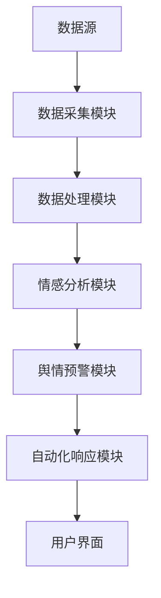
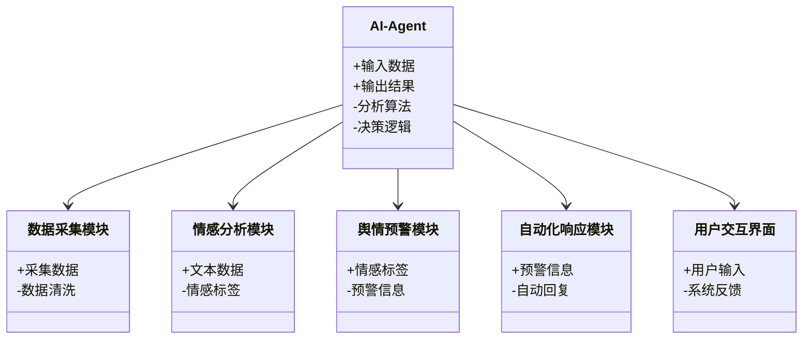
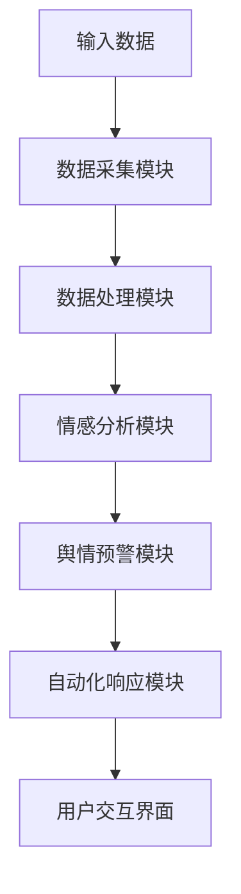
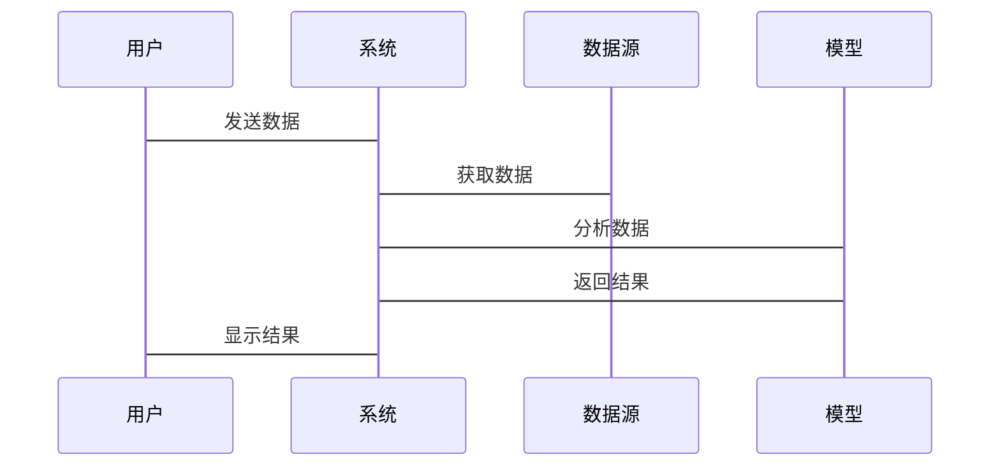

                 


# AI Agent在企业品牌管理与口碑监控中的应用

## 关键词：AI Agent，品牌管理，口碑监控，自然语言处理，机器学习，企业级系统

## 摘要：  
随着企业品牌竞争的日益激烈，如何高效管理和监控品牌形象与市场口碑成为企业的重要课题。AI Agent作为一种智能化的解决方案，能够通过自然语言处理、机器学习等技术，帮助企业实现自动化、智能化的品牌管理与口碑监控。本文将详细探讨AI Agent在企业品牌管理中的应用，包括其核心原理、系统架构、算法实现以及实际案例，为企业提供可操作的参考。

---

## 第一部分: AI Agent与企业品牌管理概述

### 第1章: AI Agent与企业品牌管理概述

#### 1.1 什么是AI Agent
##### 1.1.1 AI Agent的定义与核心概念
AI Agent（人工智能代理）是指能够感知环境、自主决策并执行任务的智能系统。在企业品牌管理中，AI Agent可以通过自然语言处理、机器学习等技术，帮助企业实时监控市场口碑、分析消费者情绪，并提供智能化的管理建议。其核心概念包括：
- **自主性**：能够自主决策和行动。
- **反应性**：能够实时感知环境变化并做出响应。
- **目标导向性**：基于预设目标执行任务。

##### 1.1.2 AI Agent的基本特征与分类
- **基本特征**：
  - 数据驱动：依赖数据进行决策。
  - 智能性：具备学习和推理能力。
  - 适应性：能够根据环境变化自适应调整。
- **分类**：
  - 基于规则的AI Agent。
  - 基于机器学习的AI Agent。
  - 基于知识图谱的AI Agent。

##### 1.1.3 AI Agent与传统品牌管理工具的区别
传统的品牌管理工具依赖人工分析和统计方法，效率低、覆盖面有限。而AI Agent可以通过大数据分析、实时监控和自动化响应，显著提升品牌管理的效率和精准度。例如：
- **数据处理能力**：传统工具通常只能处理结构化数据，而AI Agent能够处理非结构化数据（如文本、图像）。
- **实时性**：AI Agent可以实时监控市场动态，而传统工具通常需要人工定期更新数据。
- **智能化**：AI Agent能够自主学习和优化，而传统工具需要人工调整。

#### 1.2 企业品牌管理的现状与挑战
##### 1.2.1 传统品牌管理的局限性
- 数据分散：品牌信息分布在社交媒体、新闻、论坛等多个平台，传统工具难以全面覆盖。
- 数据量大：海量数据导致人工分析效率低下。
- 反应滞后：传统工具通常需要人工定期更新，难以实现实时监控。

##### 1.2.2 当今市场环境对企业品牌管理的新要求
- **实时性**：要求品牌管理能够实时响应市场变化。
- **精准性**：需要精准分析消费者情绪和市场趋势。
- **智能化**：要求系统具备自主学习和优化能力。

##### 1.2.3 AI Agent在品牌管理中的潜在价值
- **提升效率**：AI Agent可以快速处理大量数据，显著提升品牌管理效率。
- **精准分析**：通过自然语言处理和机器学习，AI Agent能够精准分析消费者情绪和市场趋势。
- **实时响应**：AI Agent可以实时监控市场动态，并快速做出响应。

#### 1.3 口碑监控的重要性
##### 1.3.1 口碑监控的定义与范围
口碑监控是指通过收集、分析和评估消费者对企业或产品的评价，了解品牌在市场中的形象和声誉。其范围包括社交媒体、论坛、新闻、 reviews 等多个渠道。

##### 1.3.2 口碑对品牌价值的影响
- **正面口碑**：能够提升品牌知名度和美誉度。
- **负面口碑**：可能导致品牌信誉受损，影响销售和市场份额。
- **口碑的传播性**：口碑可以通过社交媒体快速传播，影响广泛。

##### 1.3.3 现有口碑监控工具的不足
- **数据分散**：传统工具难以覆盖所有渠道。
- **分析滞后**：无法实现实时监控和分析。
- **缺乏智能化**：难以精准分析消费者情绪和市场趋势。

#### 1.4 AI Agent在口碑监控中的应用前景
##### 1.4.1 AI Agent如何提升口碑监控效率
- **自动化数据采集**：AI Agent可以自动采集社交媒体、论坛等渠道的数据。
- **实时分析**：通过自然语言处理和机器学习，AI Agent可以实时分析消费者情绪。
- **自动化响应**：AI Agent可以自动发布回应，提升品牌形象。

##### 1.4.2 基于AI Agent的口碑监控的优势
- **高效性**：AI Agent可以快速处理大量数据，提升监控效率。
- **精准性**：通过自然语言处理和机器学习，AI Agent能够精准分析消费者情绪和市场趋势。
- **智能化**：AI Agent可以自主学习和优化，提升监控效果。

##### 1.4.3 未来发展趋势与挑战
- **技术进步**：随着自然语言处理和机器学习技术的进步，AI Agent在口碑监控中的应用将更加广泛。
- **数据隐私**：如何保护消费者数据隐私将成为一个重要挑战。
- **系统集成**：如何将AI Agent与其他企业系统（如CRM、ERP）集成，提升整体效率。

---

## 第二部分: AI Agent的核心原理与技术基础

### 第2章: AI Agent的核心原理与技术基础

#### 2.1 AI Agent的核心原理
##### 2.1.1 自然语言处理（NLP）基础
自然语言处理（NLP）是AI Agent实现口碑监控的核心技术之一。通过NLP，AI Agent可以理解并分析消费者在社交媒体、论坛等渠道发布的文本内容，提取情感、主题等信息。

##### 2.1.2 机器学习与深度学习简介
机器学习是一种通过数据训练模型，使其能够从数据中学习规律并做出预测的技术。深度学习是机器学习的一种，通过多层神经网络模型，能够处理复杂的非结构化数据。

##### 2.1.3 AI Agent的决策机制
AI Agent的决策机制包括数据采集、数据处理、模型训练、预测与反馈等步骤。通过这些步骤，AI Agent可以基于实时数据做出最优决策。

#### 2.2 AI Agent的关键技术
##### 2.2.1 文本挖掘与情感分析
- **文本挖掘**：通过自然语言处理技术，从文本中提取有用的信息。
- **情感分析**：通过分析文本的情感倾向，判断消费者对品牌或产品的评价是正面、负面还是中性。

##### 2.2.2 实体识别与关系抽取
- **实体识别**：识别文本中的实体（如人名、地名、组织名等）。
- **关系抽取**：识别实体之间的关系（如“苹果公司推出新产品”）。

##### 2.2.3 自动回复与对话系统
通过自然语言处理和机器学习技术，AI Agent可以实现自动回复和对话系统，与消费者进行实时互动，提升品牌形象。

#### 2.3 AI Agent与企业品牌管理的结合点
##### 2.3.1 数据采集与处理
AI Agent可以通过爬虫技术采集社交媒体、论坛等渠道的数据，并通过数据清洗、特征提取等技术，为后续分析提供高质量的数据。

##### 2.3.2 情感分析与舆情预警
通过情感分析技术，AI Agent可以实时监控市场口碑，发现潜在的舆情风险，并及时发出预警。

##### 2.3.3 自动化响应与客户互动
AI Agent可以通过自动回复系统，与消费者进行实时互动，提升客户满意度和品牌形象。

---

### 第3章: AI Agent在口碑监控中的系统架构

#### 3.1 系统整体架构设计
##### 3.1.1 数据采集模块
数据采集模块负责从社交媒体、论坛等渠道采集数据，包括文本、图片、视频等。

##### 3.1.2 数据处理与分析模块
数据处理与分析模块负责对采集的数据进行清洗、特征提取、情感分析等处理，提取有用的信息。

##### 3.1.3 智能决策模块
智能决策模块基于分析结果，生成舆情预警、自动化响应等决策。

##### 3.1.4 用户交互界面
用户交互界面是用户与系统交互的界面，用户可以通过该界面查看监控结果、配置系统参数等。

#### 3.2 系统功能模块详细设计
##### 3.2.1 数据源管理
数据源管理模块负责管理系统的数据来源，包括社交媒体、新闻网站、论坛等。

##### 3.2.2 情感分析模型
情感分析模型负责对文本进行情感分析，判断消费者评价是正面、负面还是中性。

##### 3.2.3 舆情预警机制
舆情预警机制负责监控市场口碑，发现潜在的舆情风险，并及时发出预警。

##### 3.2.4 自动化响应系统
自动化响应系统负责根据分析结果，自动发布回应，提升品牌形象。

#### 3.3 系统架构图


---

### 第4章: AI Agent的算法实现与数学模型

#### 4.1 情感分析算法
##### 4.1.1 基于词袋模型的情感分析
词袋模型是一种简单的文本表示方法，将文本表示为单词的集合，不考虑单词的顺序。

##### 4.1.2 基于词嵌入的情感分析
词嵌入是一种将单词表示为向量的技术，常用的技术包括Word2Vec、GloVe等。

##### 4.1.3 基于深度学习的情感分析
深度学习模型（如LSTM、BERT）可以更精准地分析文本情感。

#### 4.2 情感分析的数学模型
##### 4.2.1 词袋模型
$$ f(x) = \sum_{i=1}^{n} w_i x_i $$
其中，$w_i$是第$i$个词的权重，$x_i$是第$i$个词的出现次数。

##### 4.2.2 词嵌入模型
$$ E(w) = \text{embedding}(w) $$
其中，$E(w)$是单词$w$的向量表示。

##### 4.2.3 深度学习模型
深度学习模型（如LSTM）通过多层神经网络，能够捕捉文本的情感信息。

---

## 第三部分: AI Agent的系统分析与架构设计方案

### 第3章: 系统分析与架构设计方案

#### 3.1 项目介绍
本项目旨在开发一个基于AI Agent的企业品牌管理与口碑监控系统，通过自然语言处理和机器学习技术，帮助企业实现智能化的品牌管理。

#### 3.2 系统功能设计
##### 3.2.1 领域模型（mermaid类图）


#### 3.3 系统架构设计（mermaid架构图）


#### 3.4 系统接口设计
系统接口包括数据接口、算法接口和用户接口。数据接口负责与数据源交互，算法接口负责与机器学习模型交互，用户接口负责与用户交互。

#### 3.5 系统交互设计（mermaid序列图）


---

## 第四部分: 项目实战

### 第4章: 项目实战

#### 4.1 环境安装
需要安装Python、机器学习库（如scikit-learn、TensorFlow）、自然语言处理库（如NLTK、spaCy）等。

#### 4.2 系统核心实现源代码
以下是一个简单的基于Python的情感分析模型实现：

```python
import nltk
from sklearn.feature_extraction.text import TfidfVectorizer
from sklearn.svm import SVC

# 数据预处理
corpus = ["This product is great!", "I hate this service.", "The quality is excellent."]

# 特征提取
vectorizer = TfidfVectorizer()
X = vectorizer.fit_transform(corpus)

# 模型训练
model = SVC()
model.fit(X, [1, -1, 1])

# 预测
test_sentence = "The customer service is terrible."
test_vector = vectorizer.transform([test_sentence])
prediction = model.predict(test_vector)
print(prediction)
```

#### 4.3 代码应用解读与分析
上述代码实现了基于TF-IDF和SVM的情感分析模型。首先，使用TF-IDF提取文本特征，然后使用SVM进行分类。测试句子的情感被预测为负面。

#### 4.4 实际案例分析和详细讲解剖析
以某品牌为例，分析如何通过AI Agent实现品牌管理与口碑监控。例如，当社交媒体上出现负面评论时，AI Agent可以自动识别并发出预警，同时生成自动回复，提升品牌形象。

#### 4.5 项目小结
通过本项目，我们可以看到AI Agent在企业品牌管理与口碑监控中的巨大潜力。通过自然语言处理和机器学习技术，AI Agent可以帮助企业实现智能化的品牌管理。

---

## 第五部分: 最佳实践、小结、注意事项、拓展阅读

### 第5章: 最佳实践

#### 5.1 最佳实践
- **数据隐私保护**：在处理消费者数据时，必须遵守相关法律法规，保护数据隐私。
- **系统集成**：将AI Agent与企业现有的CRM、ERP等系统集成，提升整体效率。
- **持续优化**：定期更新模型和算法，提升系统性能和准确性。

#### 5.2 小结
通过本文的探讨，我们可以看到AI Agent在企业品牌管理与口碑监控中的重要价值。AI Agent不仅可以提升品牌管理的效率和精准度，还能帮助企业实现智能化的市场监控和响应。

#### 5.3 注意事项
- **数据质量**：数据质量直接影响分析结果，必须确保数据的准确性和完整性。
- **模型优化**：定期优化模型，提升系统性能和准确性。
- **用户隐私**：在处理用户数据时，必须遵守相关法律法规，保护用户隐私。

#### 5.4 拓展阅读
- **相关书籍**：《自然语言处理实战》、《机器学习实战》。
- **技术博客**：查阅相关技术博客，了解最新的技术动态和应用案例。

---

## 作者：AI天才研究院/AI Genius Institute & 禅与计算机程序设计艺术 /Zen And The Art of Computer Programming

