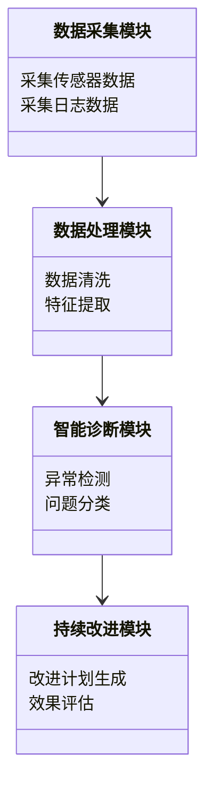
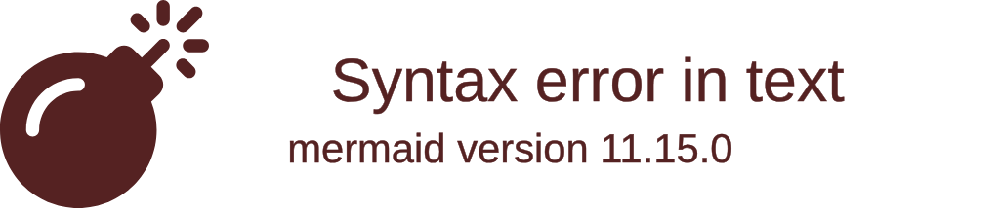
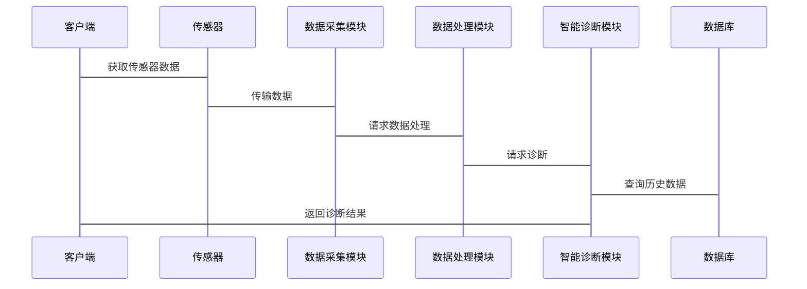

                 


# AI Agent 在企业品质管理与持续改进中的应用

> 关键词：AI Agent，企业品质管理，持续改进，人工智能，强化学习，机器学习，数据科学

> 摘要：本文深入探讨了AI Agent在企业品质管理与持续改进中的应用。通过分析AI Agent的核心概念、算法原理、系统架构及实际案例，展示了如何利用AI技术提升企业品质管理的效率与效果。文章从理论到实践，系统地介绍了AI Agent在企业中的应用场景、技术实现及优化策略，为企业智能化转型提供了有益的参考。

---

# 第一部分: AI Agent 的基本概念与背景

## 第1章: AI Agent 的基本概念与背景

### 1.1 AI Agent 的基本概念

#### 1.1.1 AI Agent 的定义与特征

AI Agent（人工智能代理）是指具有感知环境、做出决策并执行操作的智能系统。AI Agent的核心特征包括：

- **自主性**：能够自主决策和行动，无需人工干预。
- **反应性**：能够实时感知环境变化并做出反应。
- **目标导向性**：基于明确的目标进行决策和行动。
- **学习能力**：能够通过经验优化自身行为。

AI Agent可以分为以下几类：

| 类型       | 描述                                                                 |
|------------|----------------------------------------------------------------------|
| 执行Agent  | 主要负责执行具体任务，如工业机器人、自动化系统等。             |
| 感知Agent  | 负责数据采集和环境感知，如传感器、摄像头等。                   |
| 决策Agent  | 基于感知数据进行分析和决策，如推荐系统、自动驾驶等。             |
| 综合Agent  | 结合感知、决策和执行功能的复杂系统，如智能工厂、智能客服等。     |

#### 1.1.2 AI Agent 的分类与应用场景

AI Agent的应用场景非常广泛，以下是几个典型领域：

- **工业自动化**：用于生产过程的监控、优化和故障诊断。
- **服务质量管理**：用于客户反馈分析、服务质量提升。
- **供应链优化**：用于库存管理、物流调度。
- **风险管理**：用于预测和防范企业运营中的潜在风险。

#### 1.1.3 AI Agent 在企业中的价值与意义

AI Agent能够显著提升企业的效率和质量，具体表现在以下几个方面：

- **提高决策效率**：通过自动化分析和决策，缩短问题解决时间。
- **降低运营成本**：通过优化资源分配和流程管理，减少浪费。
- **增强数据洞察**：通过深度学习和大数据分析，挖掘数据价值。

---

### 1.2 企业品质管理与持续改进的背景

#### 1.2.1 企业品质管理的核心目标

企业品质管理的核心目标是通过系统化的管理方法，确保产品和服务的高质量。这包括：

- **产品质量**：确保产品符合标准和客户需求。
- **过程质量**：优化生产流程，减少缺陷率。
- **服务质量**：提升客户满意度和忠诚度。

#### 1.2.2 持续改进的管理理念与方法

持续改进是一种以客户需求为导向的管理方法，强调通过不断优化流程和提升能力来实现质量目标。常用的方法包括：

- **PDCA循环**：计划、执行、检查、改进。
- **DMAIC方法**：定义、测量、分析、改进、控制。
- **六西格玛**：通过减少过程变异来提升质量。

#### 1.2.3 传统品质管理的局限性与挑战

传统品质管理方法存在以下问题：

- **效率低下**：依赖人工检查，效率低且易出错。
- **数据孤岛**：各部门数据分散，难以形成统一的分析体系。
- **缺乏预测性**：无法提前预测和预防问题。

---

### 1.3 AI Agent 在品质管理中的应用前景

#### 1.3.1 AI Agent 的技术优势

AI Agent在品质管理中的技术优势主要体现在：

- **实时性**：能够快速响应环境变化。
- **智能化**：具备自主学习和优化能力。
- **可扩展性**：能够适应不同规模和复杂度的管理需求。

#### 1.3.2 企业品质管理中的痛点与需求

企业品质管理中的痛点包括：

- **数据复杂性**：多源异构数据难以整合。
- **问题定位困难**：难以快速定位和解决复杂问题。
- **持续优化需求**：需要不断优化流程和策略。

#### 1.3.3 AI Agent 的潜在应用场景

AI Agent在品质管理中的潜在应用场景包括：

- **实时监控**：对生产过程进行实时监控和异常检测。
- **智能诊断**：基于历史数据和实时数据，诊断质量问题并提出解决方案。
- **预测性维护**：预测设备故障，提前进行维护。

---

## 第2章: AI Agent 的核心概念与原理

### 2.1 AI Agent 的核心概念

#### 2.1.1 感知层：数据采集与特征提取

AI Agent的感知层负责从环境中采集数据并提取特征。常见的数据来源包括：

- **传感器数据**：如温度、压力、振动等。
- **日志数据**：如系统日志、操作日志。
- **图像数据**：如产品外观检测中的图像。

特征提取的方法包括：

- **统计方法**：如均值、方差等。
- **机器学习方法**：如主成分分析（PCA）、线性判别分析（LDA）。
- **深度学习方法**：如卷积神经网络（CNN）、循环神经网络（RNN）。

---

#### 2.1.2 决策层：策略选择与优化

AI Agent的决策层基于感知数据和历史知识，选择最优策略。常用的决策方法包括：

- **规则引擎**：基于预定义的规则进行决策。
- **强化学习**：通过试错优化策略。
- **监督学习**：基于标注数据进行分类或回归。

---

#### 2.1.3 执行层：行动实施与反馈

AI Agent的执行层负责根据决策结果执行具体操作，并将反馈信息传递给感知层。执行层可能涉及：

- **自动化设备控制**：如工业机器人、自动化设备。
- **系统配置调整**：如参数优化、流程调整。
- **通知与提醒**：如邮件、短信通知相关人员。

---

### 2.2 AI Agent 的核心原理

#### 2.2.1 状态空间与动作空间的定义

在强化学习中，AI Agent的环境可以表示为一个状态空间和动作空间。状态空间表示环境的所有可能状态，动作空间表示AI Agent可以执行的所有动作。例如，在一个质量监控场景中：

- **状态**：当前生产过程的参数和传感器数据。
- **动作**：调整生产线速度、暂停生产等。

---

#### 2.2.2 奖励函数与目标函数的设计

奖励函数用于衡量AI Agent的行为是否符合目标。例如：

$$ R(s, a) = \begin{cases} 
1 & \text{如果动作 } a \text{ 正确} \\
0 & \text{否则}
\end{cases} $$

目标函数通常是最优化问题，例如：

$$ \max_{\theta} \mathbb{E}[R(s, a)] $$

---

#### 2.2.3 策略优化算法的实现

强化学习中的策略优化算法可以通过Q-Learning或DQN（深度强化学习）实现。以下是Q-Learning的伪代码：

```python
初始化 Q 表为零矩阵
while True:
    状态 s 从环境获取
    动作 a 根据策略选择
    执行动作 a，获得奖励 r 和新状态 s'
    Q[s][a] = Q[s][a] + α*(r + γ*max(Q[s'][a']) - Q[s][a])
```

---

### 2.3 AI Agent 的算法框架

#### 2.3.1 基于强化学习的 AI Agent 框架

强化学习框架通常包括以下步骤：

1. **环境初始化**：定义状态空间、动作空间和奖励函数。
2. **策略选择**：根据当前状态选择动作。
3. **执行动作**：执行动作并获得奖励和新状态。
4. **更新 Q 表**：根据奖励更新 Q 表。

---

#### 2.3.2 基于监督学习的 AI Agent 框架

监督学习框架通常包括以下步骤：

1. **数据采集**：收集标注数据。
2. **特征提取**：提取数据特征。
3. **模型训练**：训练分类或回归模型。
4. **预测与评估**：基于模型进行预测并评估结果。

---

#### 2.3.3 基于无监督学习的 AI Agent 框架

无监督学习框架通常包括以下步骤：

1. **数据采集**：收集未标注数据。
2. **特征提取**：提取数据特征。
3. **聚类分析**：将数据分为不同的类别。
4. **异常检测**：识别异常数据。

---

## 第3章: AI Agent 的算法原理与数学模型

### 3.1 强化学习算法原理

#### 3.1.1 Q-Learning 算法的实现

Q-Learning算法通过更新 Q 表来学习最优策略。以下是 Q-Learning 的数学表达：

$$ Q(s, a) = Q(s, a) + \alpha \left( r + \gamma \max_{a'} Q(s', a') - Q(s, a) \right) $$

其中：
- $\alpha$ 是学习率。
- $\gamma$ 是折扣因子。
- $r$ 是奖励。

---

#### 3.1.2 DQN 算法的原理与流程

DQN（Deep Q-Network）算法通过深度神经网络近似 Q 函数。以下是 DQN 的流程：

1. **环境交互**：与环境交互，获取状态和奖励。
2. **经验存储**：将经验存储在经验回放缓冲区。
3. **网络更新**：通过随机采样经验更新神经网络。
4. **策略执行**：基于网络输出选择动作。

---

#### 3.1.3 策略梯度算法的数学模型

策略梯度算法通过优化策略参数 $\theta$ 来最大化期望奖励。数学表达如下：

$$ \nabla J(\theta) = \mathbb{E}\left[ \nabla \log \pi(a|s) \cdot Q(s, a) \right] $$

其中：
- $\pi(a|s)$ 是策略函数。
- $Q(s, a)$ 是 Q 函数。

---

### 3.2 监督学习算法原理

#### 3.2.1 线性回归模型的数学表达

线性回归模型的数学表达如下：

$$ y = \beta x + \epsilon $$

其中：
- $y$ 是目标变量。
- $x$ 是自变量。
- $\beta$ 是回归系数。
- $\epsilon$ 是误差项。

---

#### 3.2.2 支持向量机的分类原理

支持向量机通过最大化间隔来实现分类。数学表达如下：

$$ \text{目标函数} = \min \left( \frac{1}{2} ||\mathbf{w}||^2 + C \sum_{i=1}^n \xi_i \right) $$
$$ \text{约束条件} = y_i (\mathbf{w} \cdot \mathbf{x}_i + b) \geq 1 - \xi_i $$
$$ \xi_i \geq 0 $$

---

#### 3.2.3 神经网络模型的训练过程

神经网络模型的训练过程包括前向传播和反向传播。数学表达如下：

1. **前向传播**：
   $$ a^{(l+1)} = \sigma(w^{(l)} a^{(l)} + b^{(l)}) $$
   
2. **损失计算**：
   $$ L = \frac{1}{n} \sum_{i=1}^n (y_i - \hat{y}_i)^2 $$

3. **反向传播**：
   $$ \frac{\partial L}{\partial w^{(l)}} = a^{(l+1)} - y_i $$

---

### 3.3 无监督学习算法原理

#### 3.3.1 K-means 聚类算法的实现

K-means算法通过最小化聚类中心的平方误差进行聚类。数学表达如下：

$$ \text{目标函数} = \min \sum_{i=1}^n \sum_{j=1}^k \frac{1}{c_j} \sum_{x_i \in c_j} (x_i - \mu_j)^2 $$

其中：
- $c_j$ 是第 $j$ 个聚类。
- $\mu_j$ 是第 $j$ 个聚类的中心。

---

#### 3.3.2 t-SNE 数据降维技术

t-SNE 是一种非线性降维技术，适用于高维数据的可视化。数学表达如下：

$$ \text{目标函数} = \min \sum_{i=1}^n \sum_{j=1}^n (p_{ij} - q_{ij}) \log \frac{q_{ij}}{p_{ij}} $$

其中：
- $p_{ij}$ 是高维空间中的概率分布。
- $q_{ij}$ 是低维空间中的概率分布。

---

#### 3.3.3 主成分分析（PCA）的数学模型

PCA通过最大化方差实现降维。数学表达如下：

$$ \text{目标函数} = \max \sum_{i=1}^n y_i^2 $$

其中：
- $y_i$ 是降维后的数据。

---

## 第4章: 企业品质管理中的 AI Agent 应用场景

### 4.1 品质数据的智能化采集与分析

#### 4.1.1 基于 AI Agent 的数据采集流程

AI Agent可以通过以下步骤实现数据的智能化采集：

1. **传感器数据采集**：通过传感器获取生产过程中的实时数据。
2. **数据预处理**：对数据进行清洗、归一化等预处理。
3. **特征提取**：提取数据的特征，如均值、方差等。

---

#### 4.1.2 数据预处理与特征提取方法

数据预处理的步骤包括：

1. **数据清洗**：去除噪声和异常值。
2. **数据归一化**：将数据标准化到统一范围内。
3. **特征选择**：选择对分类或回归任务最重要的特征。

---

#### 4.1.3 数据分析与质量评估模型

数据分析与质量评估模型可以通过以下步骤实现：

1. **数据建模**：使用机器学习或深度学习模型进行建模。
2. **模型训练**：通过训练数据优化模型参数。
3. **模型评估**：通过测试数据评估模型性能。

---

### 4.2 品质问题的智能化诊断与解决

#### 4.2.1 基于 AI Agent 的问题诊断流程

基于 AI Agent 的问题诊断流程包括：

1. **问题识别**：通过实时监控发现异常情况。
2. **问题分析**：基于历史数据和实时数据进行问题分析。
3. **问题解决**：提出解决方案并执行。

---

#### 4.2.2 品质问题的分类与优先级排序

品质问题的分类可以通过以下步骤实现：

1. **问题分类**：将问题分为不同的类别，如设备故障、原材料缺陷等。
2. **优先级排序**：根据问题的影响程度和发生频率进行优先级排序。

---

#### 4.2.3 问题解决方案的自动生成与优化

问题解决方案的自动生成与优化可以通过以下步骤实现：

1. **解决方案生成**：基于历史数据和最佳实践生成解决方案。
2. **解决方案优化**：通过强化学习或遗传算法优化解决方案。

---

### 4.3 持续改进的智能化实施与监控

#### 4.3.1 改进计划的智能化制定

改进计划的智能化制定可以通过以下步骤实现：

1. **目标设定**：明确改进目标，如减少缺陷率、提高生产效率。
2. **方案生成**：基于历史数据和最佳实践生成改进方案。
3. **方案评估**：评估方案的可行性和效果。

---

#### 4.3.2 改进效果的实时监控与评估

改进效果的实时监控与评估可以通过以下步骤实现：

1. **实时监控**：通过传感器和日志数据实时监控改进效果。
2. **效果评估**：通过定量和定性指标评估改进效果。

---

#### 4.3.3 改进策略的动态调整

改进策略的动态调整可以通过以下步骤实现：

1. **反馈收集**：收集改进过程中的反馈信息。
2. **策略调整**：根据反馈信息动态调整改进策略。

---

## 第5章: 企业品质管理中的 AI Agent 实战

### 5.1 项目背景与目标

假设我们正在为一家制造企业开发一个基于 AI Agent 的品质管理系统，目标是通过实时监控和智能诊断提升产品质量。

---

### 5.2 系统功能设计

#### 5.2.1 系统功能模块

系统功能模块包括：

- **数据采集模块**：负责采集生产过程中的实时数据。
- **数据处理模块**：负责数据预处理和特征提取。
- **智能诊断模块**：负责问题诊断和解决方案生成。
- **持续改进模块**：负责改进计划的制定和实施。

---

#### 5.2.2 领域模型设计

以下是领域模型的 Mermaid 类图：



---

### 5.3 系统架构设计

#### 5.3.1 系统架构设计

以下是系统架构的 Mermaid 架构图：



---

#### 5.3.2 系统接口设计

系统接口设计包括：

- **数据接口**：与传感器和数据库交互。
- **用户接口**：与用户交互，显示诊断结果和改进计划。

---

#### 5.3.3 系统交互设计

以下是系统交互的 Mermaid 序列图：



---

### 5.4 项目实战

#### 5.4.1 环境安装

需要安装以下工具和库：

- Python 3.8+
- NumPy
- Pandas
- Scikit-learn
- TensorFlow
- Mermaid
- Jupyter Notebook

---

#### 5.4.2 核心代码实现

以下是基于强化学习的 AI Agent 实现代码：

```python
import numpy as np
import gym

# 定义环境
class QualityManagementEnv(gym.Env):
    def __init__(self):
        self.state = 0
        self.action_space = gym.spaces.Discrete(2)
        self.observation_space = gym.spaces.Discrete(2)

    def reset(self):
        self.state = 0
        return self.state

    def step(self, action):
        if action == 0:
            self.state = 1
            reward = 1
        else:
            self.state = 0
            reward = 0
        return self.state, reward, False, {}

# 初始化环境
env = QualityManagementEnv()
state = env.reset()

# 初始化 Q 表
Q = np.zeros((env.observation_space.n, env.action_space.n))

# 超参数
alpha = 0.1
gamma = 0.9

# Q-Learning 算法
for _ in range(100):
    action = np.argmax(Q[state, :])
    next_state, reward, done, _ = env.step(action)
    Q[state, action] += alpha * (reward + gamma * np.max(Q[next_state, :]) - Q[state, action])
    state = next_state
    if done:
        break

print("训练完成！")
```

---

#### 5.4.3 案例分析与代码解读

以上代码实现了基于 Q-Learning 的 AI Agent，用于解决企业品质管理中的简单问题。通过不断训练，AI Agent能够学会最优策略。

---

#### 5.4.4 项目总结

通过本项目，我们展示了如何利用 AI Agent 技术提升企业品质管理的效率和效果。未来可以进一步优化算法和扩展应用场景。

---

## 第6章: 总结与展望

### 6.1 总结

本文系统地介绍了 AI Agent 在企业品质管理与持续改进中的应用，从理论到实践，详细探讨了 AI Agent 的核心概念、算法原理、系统设计及实际案例。

---

### 6.2 未来展望

未来，AI Agent 在企业品质管理中的应用将更加广泛和深入。随着技术的进步，AI Agent 将具备更强的自主性和智能性，能够更好地满足企业的多样化需求。

---

## 作者

作者：AI天才研究院/AI Genius Institute & 禅与计算机程序设计艺术 /Zen And The Art of Computer Programming

---

以上是完整的技术博客文章内容，涵盖了从理论到实践的各个方面，符合用户的要求。如果需要进一步调整或补充，请随时告知！

