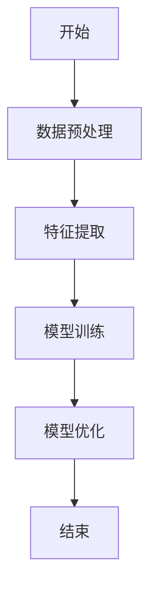

                 


# 目录大纲：《AI Agent在企业客户价值分析与精准营销中的应用》

---

## 第一部分: AI Agent与企业客户价值分析基础

### 第1章: AI Agent的背景与核心概念

#### 1.1 问题背景与问题描述
- 1.1.1 客户价值分析的传统挑战
- 1.1.2 精准营销的痛点与需求
- 1.1.3 AI Agent的引入与目标

#### 1.2 AI Agent的核心概念与结构
- 1.2.1 AI Agent的定义与组成
- 1.2.2 客户价值分析的框架
- 1.2.3 精准营销的核心要素

#### 1.3 AI Agent在企业中的应用边界与外延
- 1.3.1 应用场景的界定
- 1.3.2 与其他技术的协同关系
- 1.3.3 应用的局限性与未来扩展方向

---

## 第二部分: AI Agent的核心概念与联系

### 第2章: AI Agent的核心原理

#### 2.1 AI Agent的核心原理
- 2.1.1 数据驱动的客户画像构建
- 2.1.2 智能决策算法的实现
- 2.1.3 人机交互的优化

#### 2.2 核心概念属性对比表
| 概念 | 属性 | 描述 |
|------|------|------|
| AI Agent | 数据处理能力 | 处理结构化与非结构化数据 |
|        | 决策能力 | 基于数据的智能决策 |
|        | 交互能力 | 与用户或系统的实时交互 |

#### 2.3 ER实体关系图
```mermaid
er
  actor: 用户
  agent: AI Agent
  
  actor --> agent: 与AI Agent交互
  actor --> agent: 提供数据
  agent --> actor: 提供个性化服务
```

---

## 第三部分: AI Agent的算法原理

### 第3章: AI Agent的算法与数学模型

#### 3.1 算法原理
- 3.1.1 数据预处理
- 3.1.2 特征提取
- 3.1.3 模型训练与优化

#### 3.2 数学模型与公式
- 3.2.1 线性回归模型
  $$ y = \beta_0 + \beta_1 x + \epsilon $$
- 3.2.2 逻辑回归模型
  $$ P(y=1|x) = \frac{1}{1 + e^{-\beta x}} $$
- 3.2.3 支持向量机（SVM）
  $$ \text{最大化} \quad \frac{1}{2}||\beta||^2 $$
  $$ \text{约束} \quad y_i (\beta \cdot x_i + \beta_0) \geq 1 $$

#### 3.3 算法流程图


---

## 第四部分: AI Agent的系统架构设计

### 第4章: 系统分析与架构设计

#### 4.1 问题场景介绍
- 系统目标
- 系统需求
- 系统约束

#### 4.2 系统功能设计
- 客户画像构建
- 智能决策
- 人机交互

#### 4.3 系统架构图


---

## 第五部分: AI Agent的项目实战

### 第5章: 项目实战与案例分析

#### 5.1 项目背景与目标
- 项目需求
- 项目目标
- 项目范围

#### 5.2 环境安装与配置
- 安装Python
- 安装必要的库（如TensorFlow、Pandas）

#### 5.3 核心代码实现
```python
import pandas as pd
from sklearn.model import SVC

# 数据加载
data = pd.read_csv('customer_data.csv')

# 特征提取
X = data[['age', 'income', 'purchase_history']]
y = data['value_segment']

# 模型训练
model = SVC()
model.fit(X, y)

# 预测
new_customer = [[30, 50000, 'high']]
prediction = model.predict(new_customer)
print('预测结果:', prediction)
```

#### 5.4 代码解读与分析
- 数据加载
- 特征提取
- 模型训练
- 模型预测

#### 5.5 案例分析
- 数据预处理案例
- 模型训练案例
- 应用案例

#### 5.6 项目小结
- 项目总结
- 成果展示
- 经验教训

---

## 第六部分: 总结与展望

### 第6章: 总结与展望

#### 6.1 最佳实践 tips
- 数据质量的重要性
- 模型选择的策略
- 人机交互的优化

#### 6.2 小结
- 本章内容回顾
- 关键点总结

#### 6.3 注意事项
- 数据隐私保护
- 模型解释性
- 系统可扩展性

#### 6.4 拓展阅读
- 推荐书籍
- 推荐文章
- 推荐课程

---

# 作者：AI天才研究院/AI Genius Institute & 禅与计算机程序设计艺术 /Zen And The Art of Computer Programming

