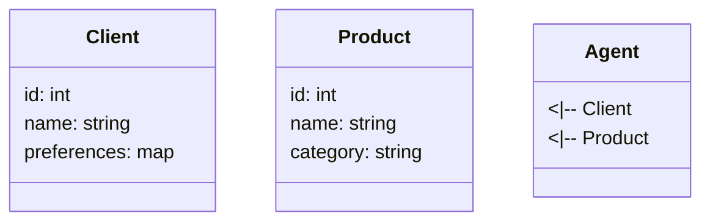
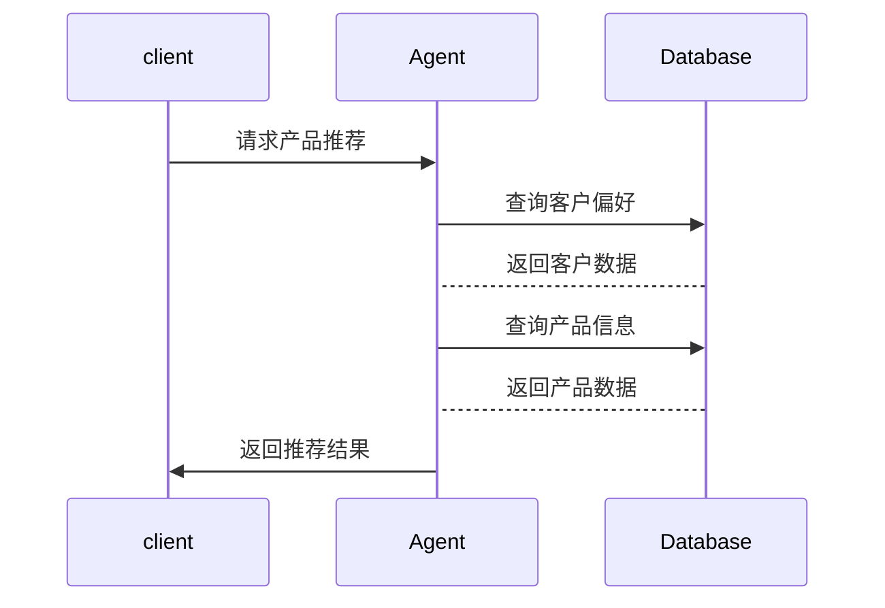

                 


# AI Agent在企业客户体验个性化中的深度应用与效果评估

> 关键词：AI Agent, 企业客户体验, 个性化服务, 人工智能, 客户体验管理, 机器学习, 个性化推荐

> 摘要：本文深入探讨了AI Agent在企业客户体验个性化中的应用，分析了其核心技术、系统架构及实际案例。通过详细讲解算法原理、系统设计和效果评估，展示了AI Agent如何提升客户体验的智能化水平。

---

## 第一部分: AI Agent 在企业客户体验中的背景与基础

### 第1章: AI Agent 的概念与背景

#### 1.1 AI Agent 的定义与核心概念

##### 1.1.1 什么是AI Agent
AI Agent（人工智能代理）是指能够感知环境、自主决策并执行任务的智能实体。它通过数据输入、模型推理和输出操作，为用户提供智能化服务。AI Agent在企业客户体验中的应用，能够实现个性化服务，提升客户满意度。

##### 1.1.2 AI Agent 的核心属性
- **自主性**：AI Agent能够在没有人工干预的情况下独立运作。
- **反应性**：能够实时感知环境变化并做出响应。
- **目标导向**：基于预设目标或学习目标，优化决策过程。
- **可扩展性**：能够处理多种任务和场景。

##### 1.1.3 企业客户体验中的AI Agent
在企业客户体验管理中，AI Agent主要用于个性化推荐、智能客服、精准营销等领域。通过分析客户行为数据，AI Agent能够提供个性化服务，提升客户满意度和忠诚度。

#### 1.2 AI Agent 的发展历程

##### 1.2.1 从传统AI到AI Agent的演进
传统AI注重规则制定和数据处理，而AI Agent则强调自主决策和目标导向。随着技术进步，AI Agent逐渐从简单的规则执行向复杂决策转变。

##### 1.2.2 AI Agent在企业中的应用演变
早期AI Agent主要用于自动化任务，如今则广泛应用于客户体验管理，如智能客服、个性化推荐等。

##### 1.2.3 当前AI Agent的技术趋势
当前，AI Agent结合了强化学习、自然语言处理和知识图谱等技术，具备更强的自主决策和学习能力。

#### 1.3 企业客户体验中的个性化需求

##### 1.3.1 客户体验的定义与重要性
客户体验是指客户在整个与企业互动过程中所感受到的体验，直接影响客户的满意度和忠诚度。

##### 1.3.2 个性化服务的核心要素
个性化服务包括精准推荐、定制化沟通、实时反馈等，能够满足客户的个性化需求，提升体验。

##### 1.3.3 AI Agent在个性化服务中的作用
AI Agent通过分析客户数据，提供个性化推荐和智能客服，帮助企业在客户体验管理中实现精准化和个性化。

### 第2章: AI Agent 的核心概念与原理

#### 2.1 AI Agent 的核心模块

##### 2.1.1 感知模块
感知模块负责收集和分析环境数据，包括客户行为数据、市场趋势等。通过这些数据，AI Agent能够理解当前环境并做出决策。

##### 2.1.2 决策模块
决策模块基于感知模块提供的数据，结合预设策略或机器学习模型，生成最优决策。决策模块的核心在于算法的选择和优化。

##### 2.1.3 执行模块
执行模块负责将决策模块生成的决策转化为具体操作，如发送推荐信息、调整营销策略等。

#### 2.2 AI Agent 的工作流程

##### 2.2.1 数据输入
AI Agent通过传感器、数据库等渠道获取环境数据。

##### 2.2.2 数据处理
数据处理模块对输入数据进行清洗、转换和分析，提取有用信息。

##### 2.2.3 决策制定
基于处理后的数据，AI Agent通过算法生成决策。

##### 2.2.4 执行操作
将决策转化为具体操作，并实时反馈执行结果。

---

## 第二部分: AI Agent 的核心技术与算法原理

### 第3章: AI Agent 的算法原理

#### 3.1 强化学习算法

##### 3.1.1 强化学习的基本原理
强化学习是一种通过试错机制优化决策的算法。AI Agent通过与环境互动，不断优化策略，以最大化预期回报。

##### 3.1.2 Q-learning算法
Q-learning是一种经典的强化学习算法，通过更新Q值表来优化决策。公式如下：

$$ Q(s, a) = r + \gamma \max_{a'} Q(s', a') $$

其中，$s$是当前状态，$a$是当前动作，$r$是奖励，$\gamma$是折扣因子，$s'$是下一个状态。

##### 3.1.3 算法实现
以下是一个简单的Q-learning算法实现示例：

```python
import numpy as np

# 初始化Q表
Q = np.zeros([state_space, action_space])

# 参数设置
alpha = 0.1
gamma = 0.9

# Q-learning算法
for episode in range(episodes):
    state = initial_state
    while not done:
        action = np.argmax(Q[state])
        next_state = get_next_state(state, action)
        reward = get_reward(state, action)
        Q[state, action] += alpha * (reward + gamma * np.max(Q[next_state, :]) - Q[state, action])
        state = next_state
```

#### 3.2 监督学习算法

##### 3.2.1 监督学习的基本原理
监督学习通过训练数据学习输入与输出之间的关系，用于分类、回归等任务。在AI Agent中，监督学习常用于预测客户行为。

##### 3.2.2 分类算法
分类算法如决策树、随机森林等，可用于客户细分和行为预测。例如，使用决策树算法预测客户是否购买某产品：

```python
from sklearn.tree import DecisionTreeClassifier

# 训练数据
X_train = ...
y_train = ...

# 训练模型
model = DecisionTreeClassifier()
model.fit(X_train, y_train)

# 预测
X_test = ...
y_pred = model.predict(X_test)
```

#### 3.3 算法选择与优化

##### 3.3.1 算法选择
根据具体场景选择合适的算法，如强化学习适用于动态环境，监督学习适用于静态数据。

##### 3.3.2 算法优化
通过参数调优、模型融合等方法提升算法性能。例如，使用网格搜索优化决策树参数：

```python
from sklearn.model_selection import GridSearchCV

# 参数网格
param_grid = {'max_depth': [2, 3, 4], 'min_samples_split': [2, 3, 4]}

# 网格搜索优化
grid_search = GridSearchCV(model, param_grid, cv=5)
grid_search.fit(X_train, y_train)

# 最佳参数
best_params = grid_search.best_params_
```

---

## 第三部分: AI Agent 的系统架构与设计

### 第4章: 系统分析与架构设计

#### 4.1 问题场景介绍
以电商企业为例，AI Agent需要处理客户咨询、推荐产品、管理订单等任务。

#### 4.2 项目介绍
本项目旨在开发一个基于AI Agent的企业客户体验管理系统，实现个性化推荐和智能客服。

#### 4.3 系统功能设计

##### 4.3.1 领域模型
领域模型展示了系统的主要实体及其关系。以下是领域模型的Mermaid类图：



#### 4.4 系统架构设计

##### 4.4.1 系统架构
以下是系统架构的Mermaid图：

```mermaid
rectangle Database {
    Customer Data
    Product Data
}
rectangle Agent {
    Perception Module
    Decision Module
    Execution Module
}
rectangle Frontend {
    User Interface
}
Agent --> Database
Agent --> Frontend
Database --> Frontend
```

#### 4.5 接口设计与交互流程

##### 4.5.1 系统接口
系统主要接口包括：
- 数据库接口：与客户和产品数据库交互。
- 用户接口：与客户进行交互，接收请求并返回结果。

##### 4.5.2 交互流程
以下是交互流程的Mermaid序列图：



---

## 第四部分: 项目实战与效果评估

### 第5章: 项目实战

#### 5.1 环境安装

##### 5.1.1 安装Python
安装Python 3.8及以上版本。

##### 5.1.2 安装依赖库
安装所需的依赖库，如scikit-learn、numpy、pandas等。

```bash
pip install scikit-learn numpy pandas
```

#### 5.2 核心代码实现

##### 5.2.1 数据预处理
对客户数据进行清洗和转换，提取特征并进行归一化处理。

```python
import pandas as pd
from sklearn.preprocessing import StandardScaler

# 加载数据
data = pd.read_csv('customer_data.csv')

# 特征选择
features = data[['age', 'gender', 'income', 'purchase_history']]

# 标签编码
from sklearn.preprocessing import LabelEncoder
le = LabelEncoder()
features['gender'] = le.fit_transform(features['gender'])

# 数据标准化
scaler = StandardScaler()
features_scaled = scaler.fit_transform(features)
```

##### 5.2.2 模型训练
使用决策树算法训练客户细分模型。

```python
from sklearn.tree import DecisionTreeClassifier
from sklearn.model_selection import train_test_split

# 划分训练集和测试集
X_train, X_test, y_train, y_test = train_test_split(features_scaled, data['target'], test_size=0.2)

# 训练模型
model = DecisionTreeClassifier()
model.fit(X_train, y_train)

# 预测
y_pred = model.predict(X_test)
```

#### 5.3 代码解读与分析

##### 5.3.1 数据预处理
数据预处理是确保模型性能的关键步骤。特征选择、编码和标准化处理有助于提高模型的准确性。

##### 5.3.2 模型训练
使用决策树算法训练客户细分模型，能够有效识别不同客户的特征，实现个性化推荐。

#### 5.4 案例分析与效果评估

##### 5.4.1 案例分析
以电商企业为例，分析AI Agent在客户推荐中的应用效果。

##### 5.4.2 效果评估
通过准确率、召回率等指标评估模型性能。例如，使用混淆矩阵和分类报告：

```python
from sklearn.metrics import classification_report, confusion_matrix

print(classification_report(y_test, y_pred))
```

---

## 第五部分: 总结与展望

### 第6章: 总结与展望

#### 6.1 总结
本文详细探讨了AI Agent在企业客户体验个性化中的应用，从核心概念、算法原理到系统架构，再到项目实战和效果评估，全面展示了其技术深度和实际价值。

#### 6.2 未来展望
随着技术进步，AI Agent在客户体验管理中的应用将更加广泛。未来的研究方向包括模型可解释性、多模态AI、实时决策优化等。

---

## 作者

作者：AI天才研究院/AI Genius Institute & 禅与计算机程序设计艺术 /Zen And The Art of Computer Programming

---

以上是完整的文章内容，涵盖了从背景介绍到系统设计、项目实战和效果评估的各个方面，确保读者能够全面理解和应用AI Agent在企业客户体验个性化中的深度应用与效果评估。

