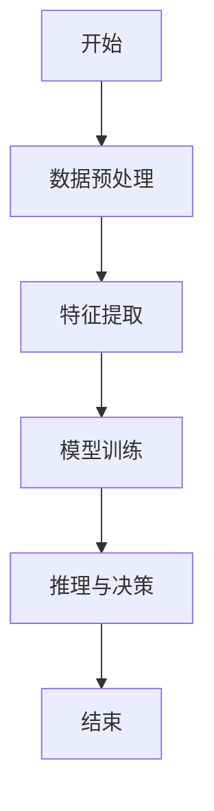
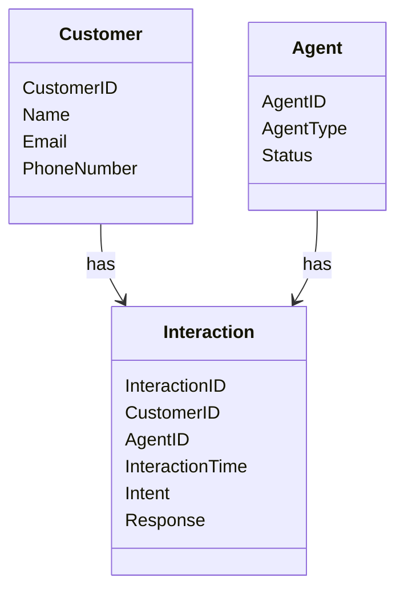
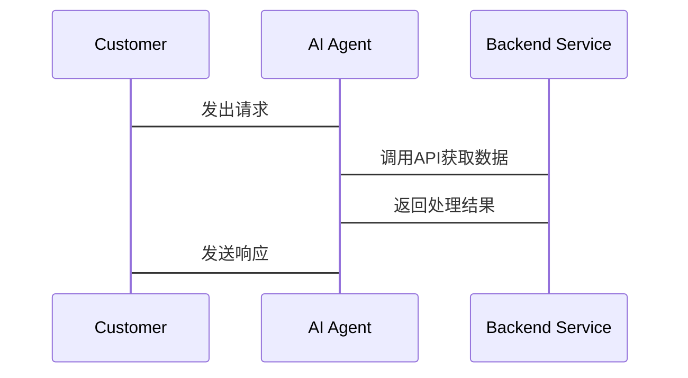

                 

<think>
嗯，我需要撰写一篇关于《AI Agent在企业客户体验个性化中的角色》的技术博客文章。首先，我应该理解什么是AI Agent，以及它在企业客户体验中的具体应用。

好的，AI Agent是一种智能代理，能够通过数据分析和机器学习来提供个性化的服务。企业客户体验个性化意味着为每个客户量身定制服务，以满足他们的特定需求和偏好。那么，AI Agent如何在这样的环境中发挥作用呢？

首先，我需要解释AI Agent的基本概念，包括它的定义和类型。然后，我会探讨客户体验个性化的定义及其重要性。接着，我需要分析AI Agent在推动个性化服务中的具体作用。

接下来，我应该详细说明AI Agent的工作原理，包括数据采集、分析和决策过程。这部分可能需要使用一些图表，比如Mermaid流程图，来展示算法的执行步骤。

此外，我还需要讨论AI Agent在企业中的实际应用场景，比如智能客服和个性化推荐。通过具体的案例分析，我可以展示AI Agent如何帮助企业在提升客户满意度和忠诚度方面取得成功。

最后，我会总结AI Agent在客户体验个性化中的重要性，并提出一些最佳实践建议，以帮助企业在实施AI Agent时避免常见的问题。

在写作过程中，我需要确保内容逻辑清晰，语言专业且易于理解。同时，按照要求，文章需要包含关键词和摘要，以及详细的目录结构，确保文章结构完整且符合规范。
</think>

# AI Agent在企业客户体验个性化中的角色

**关键词**：AI Agent, 客户体验个性化, 人工智能, 个性化服务, 智能代理

**摘要**：本文探讨了AI Agent在企业客户体验个性化中的角色，分析了其技术原理、应用场景以及系统架构，通过实际案例展示了AI Agent如何帮助企业在提升客户满意度和忠诚度方面取得成功。文章内容包括背景介绍、核心概念、算法原理、系统架构设计、项目实战和最佳实践等部分，旨在为企业提供关于如何有效利用AI Agent实现客户体验个性化的深度分析和指导。

---

## 第1章: AI Agent与客户体验个性化概述

### 1.1 AI Agent的基本概念

#### 1.1.1 AI Agent的定义与特点
AI Agent，即人工智能代理，是一种能够感知环境并采取行动以实现特定目标的智能系统。它通过数据处理、学习和推理能力，为用户提供智能化的服务。AI Agent的特点包括自主性、反应性、目标导向和学习能力。

#### 1.1.2 客户体验个性化的定义与重要性
客户体验个性化是指根据每个客户的行为、偏好和历史数据，提供量身定制的服务和交互。个性化体验能够提高客户满意度和忠诚度，从而增强企业的竞争力。在数字化时代，个性化体验已成为企业区别于竞争对手的关键因素。

#### 1.1.3 AI Agent在客户体验个性化中的作用
AI Agent通过分析客户数据，预测客户需求，并实时提供个性化的响应，帮助企业在客户互动中实现智能化和高效化。AI Agent能够自动化处理大量数据，快速生成个性化推荐和解决方案，提升客户体验的质量。

### 1.2 从传统客服到智能客服的演变

#### 1.2.1 传统客服模式的局限性
传统客服模式依赖人工操作，存在响应时间长、效率低、成本高等问题。此外，人工客服难以处理大量复杂的数据和需求，导致客户体验的一致性和个性化难以保证。

#### 1.2.2 智能客服的出现与优势
智能客服通过引入AI技术，实现了自动化和智能化的客户互动。智能客服能够实时分析客户数据，提供个性化的服务，并通过自然语言处理技术与客户进行高效沟通。

#### 1.2.3 AI Agent在智能客服中的角色
AI Agent作为智能客服的核心，负责数据处理、需求分析和决策制定。它能够快速识别客户意图，并根据历史数据和实时反馈提供精准的服务，显著提升了客户满意度和互动效率。

### 1.3 客户体验个性化的需求与挑战

#### 1.3.1 客户体验个性化的需求分析
随着客户对个性化服务的需求日益增长，企业需要通过智能化手段满足客户的多样化需求。个性化体验能够增强客户忠诚度，促进客户 retention和业务增长。

#### 1.3.2 个性化服务的实现难点
实现个性化服务的难点包括数据收集与整合、算法设计与优化、实时响应与反馈等问题。此外，如何在保护客户隐私的前提下，确保数据的安全性和合规性也是一个重要挑战。

#### 1.3.3 AI Agent如何解决个性化服务的挑战
AI Agent通过高效的数据处理和学习能力，能够快速适应客户的个性化需求。它能够实时分析客户行为，预测需求，并通过自动化流程提供个性化的解决方案，有效解决了传统客服模式的局限性。

## 第2章: AI Agent的核心概念与技术原理

### 2.1 AI Agent的核心概念与类型

#### 2.1.1 AI Agent的定义与分类
AI Agent可以根据应用场景、智能水平和学习能力进行分类。常见的类型包括基于规则的AI Agent、基于机器学习的AI Agent和基于深度学习的AI Agent。每种类型都有其特点和适用场景。

#### 2.1.2 AI Agent的核心概念原理
AI Agent的核心原理包括数据采集、特征提取、模型训练和推理决策。通过这些步骤，AI Agent能够根据输入的数据生成相应的输出，实现智能化的决策和行动。

#### 2.1.3 AI Agent类型对比分析
以下是几种常见AI Agent类型的对比分析：

| 类型             | 特点             | 适用场景                   |
|------------------|------------------|---------------------------|
| 基于规则的AI Agent | 基于预定义规则     | 简单任务，如自动化操作     |
| 基于机器学习的AI Agent | 学习数据模式       | 复杂任务，如分类和预测     |
| 基于深度学习的AI Agent | 处理非结构化数据   | 图像识别、自然语言处理等   |

### 2.2 AI Agent的工作原理

#### 2.2.1 数据采集与分析
AI Agent通过多种渠道采集客户数据，包括文本、语音、图像和行为数据等。这些数据经过预处理和特征提取后，用于后续的模型训练和分析。

#### 2.2.2 用例分析
以智能客服为例，AI Agent需要分析客户的输入文本，识别其意图，并根据预设的规则或模型生成相应的回复。例如，客户输入“我需要取消订单”，AI Agent会识别出订单取消的需求，并调用相应的服务进行处理。

### 2.3 AI Agent的算法原理

#### 2.3.1 算法流程
AI Agent的算法流程包括数据预处理、特征提取、模型训练、推理与决策。以下是一个简单的AI Agent算法流程图：



#### 2.3.2 算法实现
以下是基于机器学习的AI Agent算法实现示例：

```python
import pandas as pd
from sklearn.feature_extraction.text import TfidfVectorizer
from sklearn.naive_bayes import MultinomialNB

# 数据加载
data = pd.read_csv('customer_queries.csv')

# 特征提取
vectorizer = TfidfVectorizer()
X = vectorizer.fit_transform(data['query'])

# 模型训练
model = MultinomialNB()
model.fit(X, data['intent'])

# 推理与决策
def predict_intent(query):
    query_vec = vectorizer.transform([query])
    return model.predict(query_vec)[0]
```

#### 2.3.3 算法数学模型
以下是一个简单的分类模型的数学表示：

$$ P(y|x) = \frac{P(x|y)P(y)}{P(x)} $$

其中，$y$ 是目标类别，$x$ 是输入特征。该模型用于计算每个类别的概率，从而做出预测。

### 2.4 AI Agent的实体关系图

```mermaid
erd
customer(CustomerID, Name, Email, PhoneNumber)
agent(AgentID, AgentName, AgentType)
interaction(InteractionID, CustomerID, AgentID, InteractionTime, Intent, Response)
```

该实体关系图展示了客户、AI Agent和交互记录之间的关系。每个客户可以与多个AI Agent进行交互，每次交互记录包括客户ID、AI Agent ID、交互时间、意图和响应。

## 第3章: AI Agent在企业客户体验个性化中的应用场景

### 3.1 智能客服系统

#### 3.1.1 问题场景
传统的客服系统依赖人工操作，存在效率低、成本高等问题。AI Agent可以通过自动化处理客户请求，显著提高服务效率。

#### 3.1.2 系统设计
智能客服系统的系统架构包括前端界面、后端服务和数据存储。AI Agent负责处理客户的输入，并根据预设的规则生成响应。

#### 3.1.3 功能模块
智能客服系统的主要功能模块包括用户意图识别、个性化推荐、问题分类和自动回复生成。

#### 3.1.4 系统实现
以下是智能客服系统的实现示例：

```python
class CustomerQuery:
    def __init__(self, query):
        self.query = query
        self.intent = None

class AIAssistant:
    def __init__(self, model):
        self.model = model

    def process_query(self, query):
        handler = QueryHandler(query)
        intent = handler.get_intent()
        response = self.model.generate_response(intent)
        return response

class QueryHandler:
    def __init__(self, query):
        self.query = query

    def get_intent(self):
        # 具体实现根据模型分析意图
        return 'orderCancellation'
```

#### 3.1.5 案例分析
某电商平台通过部署AI Agent智能客服系统，显著提升了客户满意度和处理效率。客户可以通过自然语言输入查询订单状态或取消订单，AI Agent能够快速识别意图并生成相应的回复。

### 3.2 个性化推荐系统

#### 3.2.1 问题场景
个性化推荐系统通过分析客户的购买历史和行为数据，推荐符合客户兴趣的产品或服务。AI Agent在其中起到关键作用，通过实时分析数据生成推荐列表。

#### 3.2.2 系统设计
个性化推荐系统的系统架构包括数据收集、特征提取、模型训练和推荐生成。AI Agent负责数据处理和模型推理，生成个性化推荐。

#### 3.2.3 功能模块
个性化推荐系统的主要功能模块包括数据预处理、特征提取、推荐模型和推荐生成。

#### 3.2.4 系统实现
以下是个性化推荐系统的实现示例：

```python
import pandas as pd
from sklearn.neighbors import NearestNeighbors

# 数据加载
data = pd.read_csv('user_behaviors.csv')

# 特征提取
X = data[['user_id', 'item_id', 'rating']]

# 模型训练
model = NearestNeighbors(n_neighbors=5)
model.fit(X[['rating']])

# 推荐生成
def get_recommendations(user_id):
    user_ratings = data[data['user_id'] == user_id]['rating']
    distances, indices = model.kneighbors(user_ratings)
    recommended_items = data.iloc[indices]['item_id']
    return recommended_items
```

### 3.3 智能助手与自动化服务

#### 3.3.1 问题场景
企业可以通过部署智能助手，提供自动化服务，如自动处理订单、发送通知和管理客户关系。AI Agent能够通过自然语言处理和机器学习技术，实现智能化的客户服务。

#### 3.3.2 系统设计
智能助手的系统架构包括前端交互、后端服务和数据存储。AI Agent负责处理用户的输入，并根据预设的规则生成相应的响应。

#### 3.3.3 功能模块
智能助手的主要功能模块包括意图识别、自动化处理、反馈收集和性能优化。

#### 3.3.4 系统实现
以下是智能助手的实现示例：

```python
class SmartAssistant:
    def __init__(self, config):
        self.config = config
        self.nlp_model = NLPMultiModel()

    def process_request(self, request):
        intent = self.nlp_model.predict_intent(request)
        action = self.config['intents'][intent]['action']
        response = self.execute_action(action)
        return response

    def execute_action(self, action):
        # 根据动作执行相应的操作
        pass
```

## 第4章: AI Agent的系统分析与架构设计方案

### 4.1 系统功能设计

#### 4.1.1 领域模型
以下是客户体验个性化系统的核心领域模型：



#### 4.1.2 系统架构设计
以下是AI Agent驱动的客户体验个性化系统的架构设计：

```mermaid
rectangle Database {
    Customer表
    Agent表
    Interaction表
}
rectangle API Gateway {
    处理请求
    路由到后端服务
}
rectangle Backend Service {
    AI Agent服务
    数据处理服务
}
rectangle Frontend {
    客户界面
    交互界面
}
Database --> API Gateway
API Gateway --> Backend Service
Backend Service --> Frontend
```

#### 4.1.3 接口与交互流程
以下是AI Agent与客户交互的流程图：



### 4.2 系统实现与代码示例

#### 4.2.1 环境安装
要实现AI Agent驱动的客户体验个性化系统，需要安装以下工具和库：

- Python 3.8+
- Pandas
- Scikit-learn
- NLTK
- Flask

#### 4.2.2 核心代码实现

以下是AI Agent的核心代码实现：

```python
import numpy as np
from sklearn.svm import SVC

class AIAssistant:
    def __init__(self, training_data, labels):
        self.model = SVC()
        self.model.fit(training_data, labels)

    def predict(self, input_data):
        return self.model.predict(input_data)
```

#### 4.2.3 代码应用解读
上述代码定义了一个基于支持向量机的AI Assistant类。在初始化时，模型通过训练数据进行训练，能够在预测时根据输入数据生成相应的类别标签。该模型可以用于分类任务，如客户意图识别。

### 4.3 案例分析与详细讲解

#### 4.3.1 案例分析
以下是一个AI Agent在智能客服中的应用案例：

- **问题场景**：客户输入“我需要取消订单”。
- **AI Agent处理流程**：
  1. 识别客户意图：取消订单。
  2. 调用订单取消服务。
  3. 返回确认信息：订单已取消。

#### 4.3.2 项目小结
通过AI Agent实现智能客服系统，企业能够显著提升客户互动效率和满意度。AI Agent不仅能够快速响应客户需求，还能够通过数据驱动的方式不断优化服务流程。

## 第5章: 最佳实践与未来展望

### 5.1 最佳实践

#### 5.1.1 小结
本文详细探讨了AI Agent在企业客户体验个性化中的角色和应用。通过分析AI Agent的核心概念、算法原理和系统架构，展示了其在智能客服和个性化推荐中的重要性。

#### 5.1.2 注意事项
企业在部署AI Agent时，需要注意数据隐私和安全问题，确保客户数据的合法合规使用。此外，还需要持续监控和优化AI Agent的性能，以应对不断变化的客户需求。

#### 5.1.3 拓展阅读
建议读者进一步阅读相关领域的书籍和文献，如《机器学习实战》、《深入浅出人工智能》等，以深入了解AI Agent的技术细节和最新进展。

### 5.2 未来展望

随着AI技术的不断发展，AI Agent在企业客户体验个性化中的应用前景广阔。未来，AI Agent将更加智能化和个性化，能够通过多模态数据处理和深度学习技术，提供更加精准和个性化的服务。此外，随着5G和物联网技术的普及，AI Agent将能够在更广泛的场景中发挥作用，为企业和客户创造更大的价值。

---

**作者：AI天才研究院 & 禅与计算机程序设计艺术**

