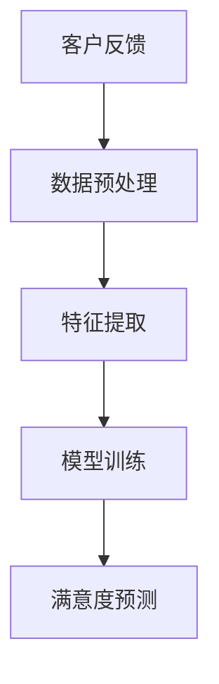
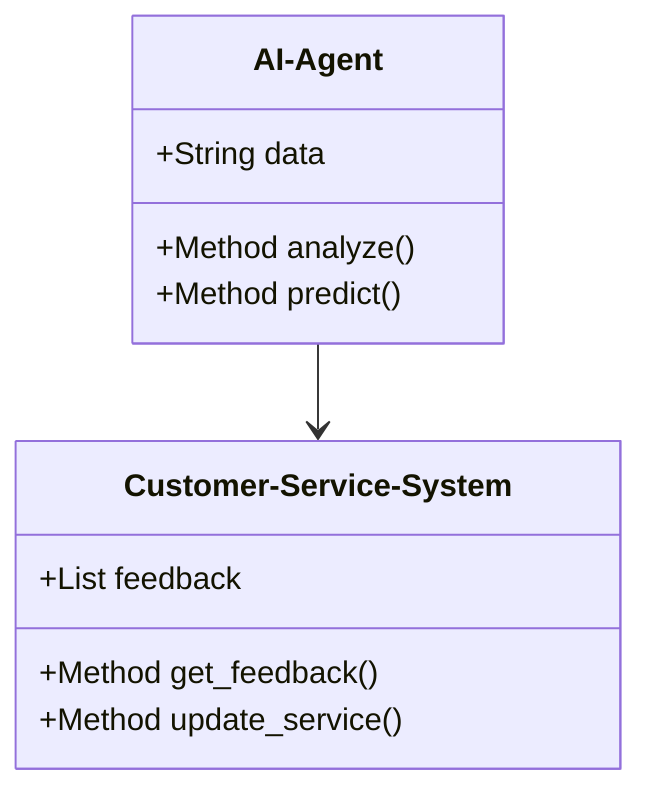
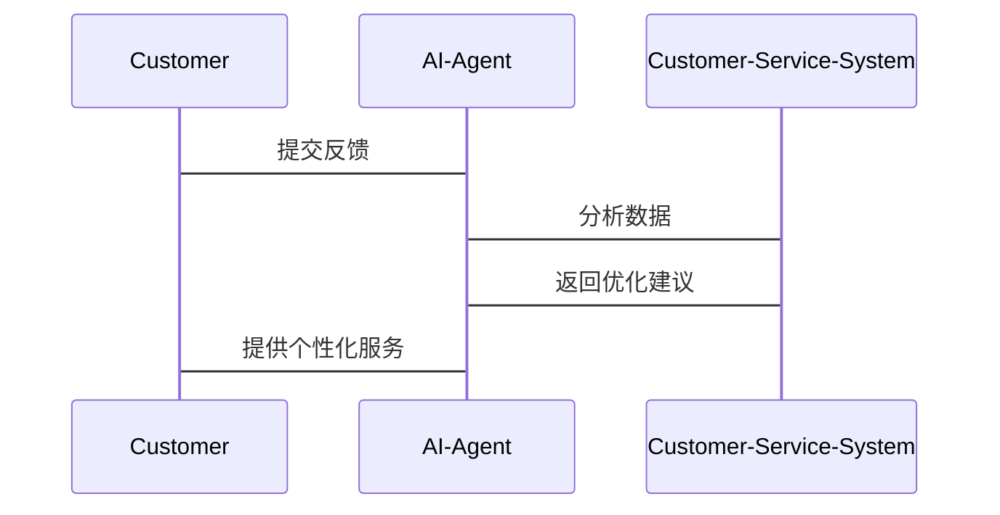

                 


```markdown
# AI Agent在企业客户服务质量监控与智能升级中的角色

> 关键词：AI Agent，客户服务质量，自然语言处理，机器学习，系统架构设计

> 摘要：本文探讨了AI Agent在企业客户服务质量监控与智能升级中的核心作用，详细分析了其算法原理、系统架构设计以及实际应用案例，为企业提升客户服务质量提供了理论和实践指导。

---

## 第一部分: AI Agent在企业客户服务质量监控与智能升级中的角色概述

### 第1章: 问题背景与核心概念

#### 1.1 问题背景
企业客户服务质量是衡量企业竞争力的重要指标。传统客服系统存在效率低、成本高、个性化不足等问题，难以满足现代客户需求。AI Agent通过智能化手段，有效提升客户服务质量，降低成本，并提供个性化服务，成为企业提升竞争力的关键技术。

#### 1.2 核心概念与定义
- **AI Agent**: 智能代理，能够感知环境并执行任务的智能系统，具备自主决策和学习能力。
- **客户服务质量**: 包括响应时间、问题解决能力、客户满意度等多维度指标。
- **AI Agent角色**: 在客户服务质量监控中，AI Agent负责数据采集、分析、预测和优化，提升服务质量。

---

## 第二部分: AI Agent的核心概念与工作原理

### 第2章: AI Agent的核心概念与工作原理

#### 2.1 AI Agent的基本原理
AI Agent通过感知环境和执行任务，实现客户服务质量监控与优化。其核心组成部分包括感知模块（数据采集与分析）、决策模块（算法与模型）、执行模块（反馈与优化）。AI Agent的工作流程包括数据采集、分析、决策和反馈。

#### 2.2 AI Agent与传统客服系统的区别
传统客服系统依赖人工操作，效率低且缺乏个性化。AI Agent通过智能化技术，实现24/7服务、个性化推荐和自动化问题解决，显著提升了客户体验和效率。

---

## 第三部分: AI Agent在企业客户服务质量监控中的应用

### 第3章: AI Agent在客户服务质量监控中的核心功能

#### 3.1 数据采集与分析
AI Agent通过多种渠道采集客户数据，包括文本、语音和行为数据。利用自然语言处理技术，分析客户反馈，识别情绪和意图，为服务质量监控提供数据支持。

#### 3.2 客户情绪分析
基于NLP技术，AI Agent能够准确识别客户情绪，预测客户满意度。通过分析负面情绪，企业可以及时采取措施，提升客户满意度。

#### 3.3 客户需求识别与预测
AI Agent利用机器学习模型，预测客户需求，优化服务流程。通过识别客户潜在需求，企业可以提供更精准的服务，提升客户满意度。

#### 3.4 客户服务流程优化
AI Agent通过分析服务流程中的瓶颈，提出优化建议，减少客户等待时间，提高服务效率。

---

## 第四部分: AI Agent的算法原理与实现

### 第4章: AI Agent的算法原理

#### 4.1 自然语言处理（NLP）算法
- **分词**: 将客户反馈文本分解为词语。
- **情感分析**: 通过词袋模型和LSTM网络，分析客户情绪。
- **意图识别**: 基于TF-IDF和机器学习模型，识别客户需求。

#### 4.2 机器学习算法
- **数据预处理**: 清洗和标注数据。
- **特征提取**: 使用TF-IDF提取文本特征。
- **模型训练**: 基于SVM或随机森林算法，训练客户满意度预测模型。

#### 4.3 算法流程图


#### 4.4 代码实现
```python
# 数据预处理
import pandas as pd
data = pd.read_csv('customer_feedback.csv')

# 特征提取
from sklearn.feature_extraction.text import TfidfVectorizer
tfidf = TfidfVectorizer()
X = tfidf.fit_transform(data['feedback'])

# 模型训练
from sklearn.svm import SVC
model = SVC()
model.fit(X, data['label'])

# 满意度预测
def predict_satisfaction(feedback):
    vec = tfidf.transform([feedback])
    return model.predict(vec)[0]
```

---

## 第五部分: AI Agent的系统架构设计

### 第5章: 系统架构设计

#### 5.1 功能模块设计


#### 5.2 系统交互流程


---

## 第六部分: 项目实战

### 第6章: 项目实战

#### 6.1 环境搭建
- **工具安装**: 安装Python、Scikit-learn、NLTK和Mermaid。
- **数据准备**: 收集客户反馈数据，清洗并标注。

#### 6.2 代码实现
```python
# 数据清洗
import re
def clean_text(text):
    return re.sub(r'\W+', ' ', text).strip()

# 情感分析
from sklearn.svm import SVC
from sklearn.metrics import accuracy_score
model = SVC()
model.fit(X_train, y_train)
print(accuracy_score(y_test, model.predict(X_test)))
```

#### 6.3 实际案例分析
通过具体案例，展示AI Agent如何分析客户反馈，预测情绪，优化服务流程，并提升客户满意度。

---

## 第七部分: 总结与展望

### 第7章: 总结与展望

#### 7.1 总结
AI Agent通过智能化技术，显著提升了企业客户服务质量。其在数据采集、情绪分析、需求预测和流程优化等方面的优势，为企业带来了更高的客户满意度和效率。

#### 7.2 展望
未来，AI Agent将与更多先进技术结合，如强化学习和深度学习，进一步提升客户服务质量。企业应积极拥抱AI技术，推动客户服务质量的持续优化。

---

## 作者：AI天才研究院

---

以上是《AI Agent在企业客户服务质量监控与智能升级中的角色》的技术博客文章，涵盖从背景介绍到系统架构设计的各个方面，结合实际案例和代码实现，为企业提供详细的指导和参考。
```

