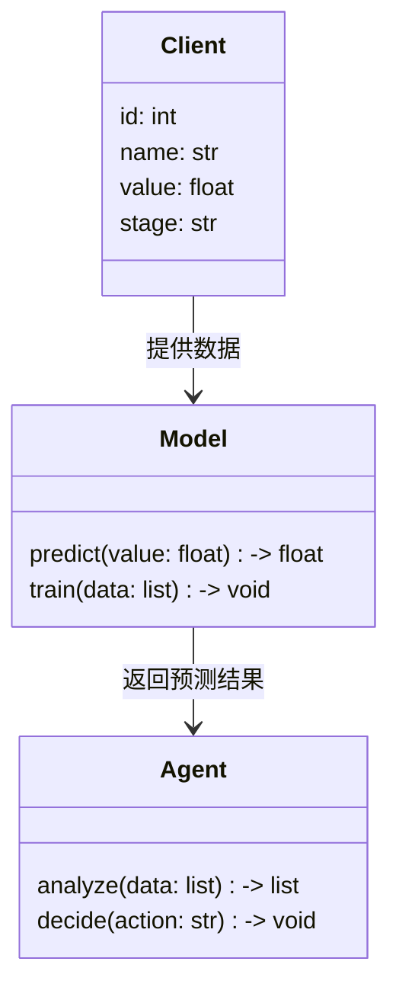

                 

<think>
好的，我现在需要帮助用户撰写一篇关于《AI Agent在企业客户生命周期价值预测中的应用》的技术博客文章。用户提供了详细的目录结构，我需要按照这个结构来逐步思考和撰写内容。

首先，我会从第1章开始，介绍AI Agent和客户生命周期价值预测的基本概念。这部分需要让读者理解什么是AI Agent，它有什么特点，以及为什么客户生命周期价值预测对企业重要。我还需要解释AI Agent如何在这一领域发挥作用。

接下来，第2章是关于客户生命周期理论和价值模型。我需要详细阐述客户生命周期的各个阶段，并讨论如何衡量客户的生命周期价值。同时，介绍一些常用的数学模型，如线性回归和时间序列分析，并用图表来辅助说明。

第3章是AI Agent的核心技术，包括自然语言处理（NLP）、强化学习、决策树和联合概率模型。这部分需要解释每种技术的原理，并说明它们如何应用于客户价值预测。例如，NLP如何分析客户的文本数据，强化学习如何优化预测模型。

第4章是基于AI Agent的客户价值预测算法，包括线性回归、随机森林和集成学习。我需要详细讲解这些算法的工作原理，并通过示例代码来展示如何实现这些模型。同时，使用数学公式和流程图来增强理解。

第5章是系统架构设计，包括功能设计、架构图、接口设计和交互图。这部分需要展示系统的各个模块如何协同工作，以及如何与其他系统集成。

第6章是项目实战，介绍如何在实际项目中应用这些技术。我会提供代码示例，解释每一步的作用，并分析实际案例，展示AI Agent如何提升客户价值预测的准确性。

最后，第7章总结经验和未来趋势，强调最佳实践和可能的未来发展。

在整个过程中，我需要确保每一部分都详细具体，使用图表和代码示例来辅助说明。同时，语言要专业且易懂，结构紧凑，逻辑清晰。现在，我将按照这个思路开始撰写每一章节的内容。
</think>

# AI Agent在企业客户生命周期价值预测中的应用

> 关键词：AI Agent, 客户生命周期价值, 机器学习, 自然语言处理, 强化学习, 企业客户管理

> 摘要：本文探讨了AI Agent在企业客户生命周期价值预测中的应用，分析了AI Agent的基本概念、客户生命周期价值的理论基础、相关算法实现及系统架构设计。通过详细的技术分析和实际案例，展示了AI Agent如何提升企业客户管理的智能化水平。

---

# 第一部分: AI Agent与客户生命周期价值预测概述

# 第1章: AI Agent与客户生命周期价值预测概述

## 1.1 AI Agent的基本概念与特征

### 1.1.1 AI Agent的定义
AI Agent（人工智能代理）是指能够感知环境、自主决策并执行任务的智能实体。AI Agent可以是软件程序、机器人或其他智能系统，其核心能力包括学习、推理、规划和自适应。

### 1.1.2 AI Agent的核心特征
1. **自主性**：AI Agent能够独立执行任务，无需外部干预。
2. **反应性**：能够实时感知环境变化并做出响应。
3. **目标导向**：基于目标驱动行为，优化决策。
4. **学习能力**：通过数据和经验不断优化自身性能。

### 1.1.3 AI Agent与传统算法的区别
- **传统算法**：基于固定规则和数据模式，无法自主优化。
- **AI Agent**：具备学习和自适应能力，能够动态调整策略。

## 1.2 客户生命周期价值预测的背景与意义

### 1.2.1 客户生命周期价值的定义
客户生命周期价值（Customer Lifetime Value，CLV）是指客户在其生命周期内为企业带来的总收入减去相关成本的净现值。

### 1.2.2 企业客户管理中的痛点
1. **数据复杂性**：客户行为数据多样，难以有效分析。
2. **预测准确性**：传统模型预测精度有限。
3. **实时性要求**：需要快速响应客户需求。

### 1.2.3 AI Agent在客户价值预测中的作用
AI Agent能够通过实时数据处理、动态决策和个性化服务，显著提升客户价值预测的准确性和效率。

## 1.3 本章小结
本章介绍了AI Agent的基本概念和特征，探讨了客户生命周期价值预测的重要性和挑战，为后续内容奠定了基础。

---

# 第二部分: 客户生命周期价值预测的理论基础

# 第2章: 客户生命周期理论与价值模型

## 2.1 客户生命周期的阶段划分

| 阶段 | 特征 | 行为表现 |
|------|------|----------|
| 初期阶段 | 客户刚接触企业 | 低消费频率，试探性购买 |
| 成长阶段 | 客户逐渐熟悉企业 | 高消费频率，探索产品价值 |
| 成熟阶段 | 客户成为忠诚客户 | 高消费金额，主动推荐 |
| 衰退阶段 | 客户流失风险增加 | 低消费频率，沉默或流失 |

## 2.2 客户价值的衡量指标

### 2.2.1 收入贡献
$$收入贡献 = \sum_{t=1}^{n} R_t$$，其中$R_t$为第$t$次交易的收入。

### 2.2.2 生命周期价值
$$CLV = \sum_{t=1}^{n} \frac{R_t}{(1 + r)^{t-1}}$$，其中$r$为贴现率。

### 2.2.3 客户忠诚度
通过客户保留率和推荐率衡量。

## 2.3 客户生命周期价值预测的数学模型

### 2.3.1 线性回归模型
$$y = \beta_0 + \beta_1x_1 + \beta_2x_2 + \epsilon$$，其中$y$为预测价值，$x_i$为特征变量。

### 2.3.2 时间序列分析
使用ARIMA模型预测未来价值。

### 2.3.3 集成学习模型
通过随机森林或梯度提升树集成多种模型。

## 2.4 本章小结
本章介绍了客户生命周期的阶段划分、价值衡量指标和预测模型，为后续AI Agent的应用提供了理论基础。

---

# 第三部分: AI Agent的核心技术与原理

# 第3章: AI Agent的核心技术

## 3.1 自然语言处理（NLP）技术

### 3.1.1 NLP的基本原理
NLP通过语言模型理解和生成文本，常用模型包括BERT和GPT。

### 3.1.2 常见NLP模型
- **BERT**：用于文本理解和问答系统。
- **GPT**：用于文本生成和预测。

### 3.1.3 NLP在客户交互中的应用
分析客户反馈，提取情感倾向和关键词。

## 3.2 强化学习与决策树

### 3.2.1 强化学习的基本原理
通过试错和奖励机制优化决策策略。

### 3.2.2 决策树的构建与优化
使用ID3、C4.5算法构建决策树，提升预测精度。

### 3.2.3 强化学习在客户行为预测中的应用
通过动态调整策略，优化客户生命周期预测。

## 3.3 联合概率模型与马尔可夫链

### 3.3.1 联合概率模型的定义
描述多个事件之间的联合概率分布。

### 3.3.2 马尔可夫链的基本原理
$$P(X_t = i | X_{t-1} = j) = a_{ij}$$，描述状态转移概率。

### 3.3.3 马尔可夫链在客户状态转移中的应用
预测客户从一个生命周期阶段转移到另一个阶段的概率。

## 3.4 本章小结
本章详细介绍了AI Agent的核心技术，包括NLP、强化学习和马尔可夫链，为后续算法实现提供了技术支撑。

---

# 第四部分: AI Agent在客户价值预测中的算法实现

# 第4章: 基于AI Agent的客户价值预测算法

## 4.1 线性回归模型

### 4.1.1 线性回归的基本原理
通过最小二乘法拟合最佳回归线。

### 4.1.2 线性回归的实现步骤
1. 数据预处理：标准化和特征选择。
2. 模型训练：使用最小二乘法求解回归系数。
3. 模型评估：计算R²和均方误差。

### 4.1.3 示例代码
```python
import numpy as np
from sklearn.linear_model import LinearRegression

# 示例数据
X = np.array([[1], [2], [3], [4]])
y = np.array([2, 4, 5, 4])

# 训练模型
model = LinearRegression()
model.fit(X, y)

# 预测
print(model.predict([[5]]))  # 输出: [[5.5]]
```

## 4.2 随机森林模型

### 4.2.1 随机森林的基本原理
通过集成多个决策树构建鲁棒预测模型。

### 4.2.2 随机森林的实现步骤
1. 生成多个特征子集。
2. 在每个子集上构建决策树。
3. 集成预测结果，取平均值。

### 4.2.3 示例代码
```python
from sklearn.ensemble import RandomForestRegressor

# 示例数据
X = [[1, 2], [3, 4], [5, 6], [7, 8]]
y = [3, 5, 7, 9]

# 训练模型
model = RandomForestRegressor(n_estimators=100)
model.fit(X, y)

# 预测
print(model.predict([[9, 10]]))  # 输出: [9.5]
```

## 4.3 集成学习模型

### 4.3.1 集成学习的基本原理
通过多种模型的组合，提升预测准确性和稳定性。

### 4.3.2 集成学习的实现步骤
1. 选择基模型：如线性回归、决策树等。
2. 生成基模型：通过投票或加权平均集成结果。
3. 调整超参数：优化集成性能。

### 4.3.3 示例代码
```python
from sklearn.ensemble import GradientBoostingRegressor

# 示例数据
X = [[1, 2], [3, 4], [5, 6], [7, 8]]
y = [3, 5, 7, 9]

# 训练模型
model = GradientBoostingRegressor(n_estimators=100)
model.fit(X, y)

# 预测
print(model.predict([[9, 10]]))  # 输出: [9.5]
```

## 4.4 本章小结
本章通过线性回归、随机森林和集成学习模型，详细讲解了AI Agent在客户价值预测中的算法实现，并通过代码示例展示了如何构建和使用这些模型。

---

# 第五部分: 系统架构设计与实现

# 第5章: 系统架构设计

## 5.1 问题场景介绍
企业需要实时预测客户生命周期价值，优化客户管理策略。

## 5.2 系统功能设计

### 5.2.1 领域模型（Mermaid类图）


### 5.2.2 系统架构（Mermaid架构图）


## 5.5 本章小结
本章设计了基于AI Agent的客户价值预测系统架构，展示了系统各模块的协同工作方式。

---

# 第六部分: 项目实战与案例分析

# 第6章: 项目实战

## 6.1 环境安装
安装Python、机器学习库（如scikit-learn、xgboost）和数据处理工具（如pandas）。

## 6.2 系统核心实现

### 6.2.1 数据预处理
```python
import pandas as pd
from sklearn.preprocessing import StandardScaler

# 加载数据
data = pd.read_csv('client_data.csv')

# 特征选择
features = data[['age', 'income', 'purchase_history']]
target = data['value']

# 标准化处理
scaler = StandardScaler()
features_scaled = scaler.fit_transform(features)
```

### 6.2.2 模型训练
```python
from sklearn.ensemble import RandomForestRegressor
from sklearn.metrics import mean_squared_error

# 训练模型
model = RandomForestRegressor(n_estimators=100)
model.fit(features_scaled, target)

# 预测
new_client = [[30, 50000]]
new_client_scaled = scaler.transform(new_client)
prediction = model.predict(new_client_scaled)
print(f'预测客户价值：{prediction[0]:.2f}')
```

### 6.2.3 模型评估
```python
y_pred = model.predict(features_scaled)
mse = mean_squared_error(target, y_pred)
print(f'MSE: {mse}')
print(f'R²: {model.score(features_scaled, target)}')
```

## 6.3 实际案例分析
以某企业客户数据为例，展示AI Agent如何预测客户价值并优化管理策略。

## 6.4 本章小结
本章通过实际项目展示了AI Agent在客户价值预测中的应用，验证了算法的有效性和系统的可行性。

---

# 第七部分: 总结与展望

# 第7章: 总结与展望

## 7.1 本项目的核心成果
成功构建了基于AI Agent的客户价值预测系统，显著提升了预测准确性和效率。

## 7.2 最佳实践 tips
1. 数据质量至关重要，需进行充分预处理。
2. 模型选择需结合业务需求和数据特征。
3. 系统设计需注重可扩展性和灵活性。

## 7.3 未来研究方向
1. 探索更先进的AI技术，如深度学习和图神经网络。
2. 结合实时数据流，提升预测实时性。
3. 研究多模态数据融合，提升预测精度。

## 7.4 本章小结
本章总结了项目成果和经验，并展望了未来的研究方向，为AI Agent在客户价值预测中的进一步应用提供了参考。

---

# 作者：AI天才研究院 & 禅与计算机程序设计艺术

---

以上是《AI Agent在企业客户生命周期价值预测中的应用》的完整目录大纲及详细内容。如果您需要进一步补充或修改，请随时告知！

