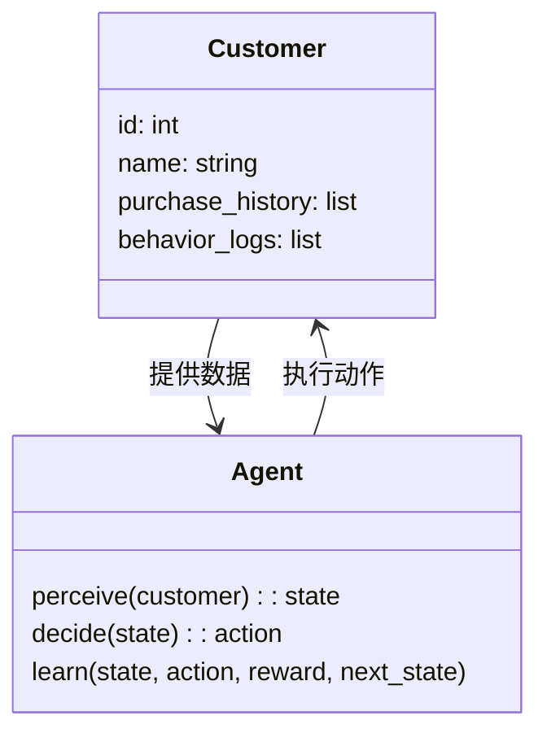
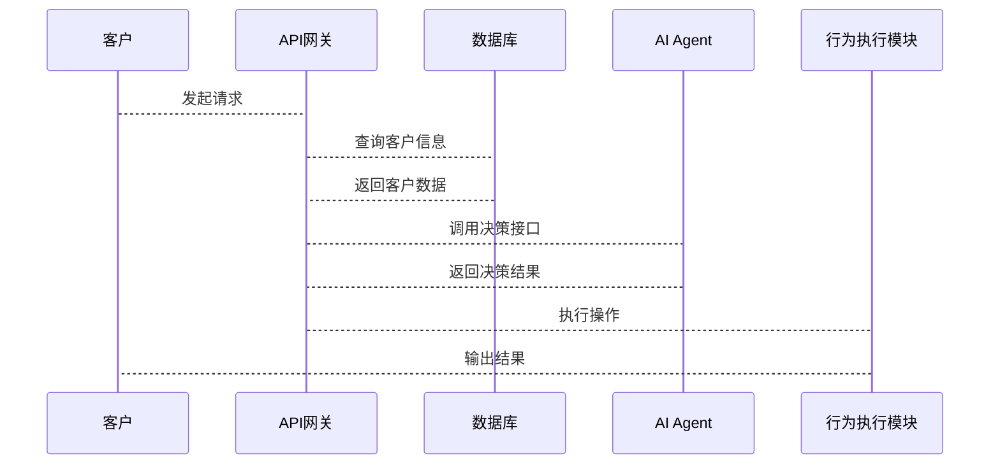

                 

<think>
嗯，用户希望我详细分析《AI Agent在企业客户生命周期管理中的应用》这篇文章。看来用户需要的是一个结构完整、内容详实的技术博客。我得先理清楚每个章节的内容，确保涵盖背景、原理、技术实现、项目实战等方面。

首先，我需要确定文章的结构。用户提供的目录大纲已经很详细了，我得按照这个来组织内容。第一章是背景与概念，得先介绍AI Agent和客户生命周期管理的基本概念。我得解释清楚什么是AI Agent，它有什么特征，和传统系统有什么区别。然后是客户生命周期管理的流程和重要性，这部分可能需要举一些实际例子，让读者更容易理解。

接下来是核心原理部分，得深入讲解AI Agent的工作原理，包括感知层、决策层和执行层。这部分可能需要一些技术细节，比如数据采集、状态评估等。然后是算法部分，得对比基于规则、机器学习和强化学习的AI Agent，分析各自的优缺点。

数学模型和算法实现部分比较关键，我需要用Mermaid画出算法流程图，并附上Python代码示例。比如，强化学习的部分，可能需要展示Q-learning算法的伪代码，解释每一步的作用。数学公式要用LaTeX，确保正确无误，比如状态转移概率矩阵的公式。

系统架构设计部分，得介绍如何设计一个AI Agent驱动的客户管理系统。这部分可能需要画类图和架构图，展示各个模块的交互。比如，客户信息处理模块如何与行为预测模块通信，数据存储如何支持实时决策。

项目实战部分需要具体操作，包括环境安装、代码实现和案例分析。可能需要指导读者如何安装必要的库，比如TensorFlow或Keras，并提供训练模型的代码。然后分析一个实际案例，比如电商客户流失预测，展示如何部署和优化模型。

最后，最佳实践部分要总结经验，给出小结、注意事项和未来展望。比如，数据隐私的重要性，模型优化的方向，以及AI Agent在其他领域的应用潜力。

整体来看，文章需要逻辑清晰，每部分内容详实，结合理论和实践，让读者能够从基础到应用全面理解AI Agent在客户管理中的应用。我得确保每个章节都有足够的细节和例子，帮助读者深入理解，同时保持文章结构紧凑，不冗长。

现在，我得开始按照这个思路撰写每个章节，确保覆盖所有用户提到的要求，同时保持内容的连贯性和深度。这样，用户就能得到一篇高质量的技术博客，满足他们的需求。
</think>

# AI Agent在企业客户生命周期管理中的应用

## 关键词：AI Agent, 企业客户管理, 客户生命周期, 强化学习, 系统架构, 项目实战

## 摘要：  
本文深入探讨了AI Agent在企业客户生命周期管理中的应用，从背景与概念、核心原理与技术实现、系统架构设计到项目实战，全面剖析了AI Agent如何通过智能化手段优化客户管理流程。文章结合实际案例，详细讲解了AI Agent的算法原理、数学模型和系统架构，并给出了具体的实现方案和最佳实践。

---

## 第一部分: AI Agent与企业客户生命周期管理的背景与概念

### 第1章: AI Agent的基本概念

#### 1.1 AI Agent的定义与核心特征
##### 1.1.1 AI Agent的定义
AI Agent（人工智能代理）是一种能够感知环境、自主决策并执行任务的智能体。它通过数据输入、模型计算和行为输出，帮助企业在客户管理中实现自动化和智能化。

##### 1.1.2 AI Agent的核心特征
- **自主性**：AI Agent能够自主决策，无需人工干预。
- **反应性**：能够实时感知环境变化并做出响应。
- **目标导向性**：基于目标进行决策和行动。
- **学习能力**：通过机器学习不断优化自身行为。

##### 1.1.3 AI Agent与传统自动化系统的区别
| 特性          | 传统自动化系统                     | AI Agent                          |
|---------------|-----------------------------------|------------------------------------|
| 决策方式       | 基于预设规则                     | 基于数据学习和动态调整            |
| 灵活性         | 较低                             | 较高                               |
| 复杂问题处理   | 适用于简单重复性任务             | 适用于复杂非线性问题              |

#### 1.2 客户生命周期管理的定义与流程
##### 1.2.1 客户生命周期的定义
客户生命周期是指客户从初次接触企业到最终流失的整个过程，包括获取、激活、留存、转化和流失五个阶段。

##### 1.2.2 客户生命周期管理的流程
1. **获取阶段**：吸引潜在客户，如广告投放、营销活动等。
2. **激活阶段**：将潜在客户转化为真实用户。
3. **留存阶段**：通过优质服务保持客户粘性。
4. **转化阶段**：提升客户价值，如 upsell 和 cross-sell。
5. **流失阶段**：预测客户流失风险，采取挽回措施。

##### 1.2.3 客户生命周期管理的重要性
- 提高客户满意度和忠诚度。
- 降低客户获取成本。
- 提升企业运营效率。

### 第2章: AI Agent在企业客户管理中的应用背景

#### 2.1 企业客户管理的痛点
##### 2.1.1 客户需求多样化
不同客户的需求差异大，传统规则难以满足个性化服务。

##### 2.1.2 客户行为预测的复杂性
客户行为受多种因素影响，预测难度大。

##### 2.1.3 客户数据的碎片化
客户数据分散在不同系统中，难以形成统一的客户画像。

#### 2.2 AI Agent在客户管理中的优势
##### 2.2.1 提高客户体验
通过实时互动和个性化服务，提升客户满意度。

##### 2.2.2 优化运营效率
自动化处理客户请求，减少人工干预，降低成本。

##### 2.2.3 实现个性化服务
基于客户数据和行为，提供精准的个性化推荐和决策支持。

---

## 第二部分: AI Agent的核心原理与技术实现

### 第3章: AI Agent的核心原理

#### 3.1 AI Agent的工作原理
##### 3.1.1 感知层: 数据采集与处理
AI Agent通过API、数据库或日志系统获取客户数据，如点击流数据、购买记录等。

##### 3.1.2 决策层: 状态评估与决策
基于收集的数据，AI Agent利用机器学习模型（如随机森林、神经网络）进行状态评估和决策。

##### 3.1.3 执行层: 行为输出与反馈
根据决策结果，AI Agent执行操作（如发送邮件、调整推荐策略）并收集反馈，用于优化模型。

#### 3.2 AI Agent的核心算法
##### 3.2.1 基于规则的AI Agent
- **优点**：简单易懂，适用于规则明确的场景。
- **缺点**：难以处理复杂和动态变化的场景。

##### 3.2.2 基于机器学习的AI Agent
- **优点**：能够处理复杂数据，学习能力强。
- **缺点**：需要大量数据和计算资源。

##### 3.2.3 基于强化学习的AI Agent
- **优点**：能够在动态环境中自适应调整策略。
- **缺点**：训练时间长，需要复杂的环境设置。

---

### 第4章: AI Agent的数学模型与算法实现

#### 4.1 状态空间与动作空间
##### 4.1.1 状态空间的定义
状态空间是所有可能的客户状态集合，例如客户的行为、偏好等。

##### 4.1.2 动作空间的定义
动作空间是AI Agent可以执行的所有动作，例如发送优惠券、调整推荐策略。

##### 4.1.3 状态转移概率
状态转移概率矩阵描述了从当前状态转移到下一个状态的概率：
$$ P(s' | s, a) $$
其中，$s$是当前状态，$a$是动作，$s'$是下一个状态。

#### 4.2 基于强化学习的AI Agent

##### 4.2.1 Q-Learning算法
Q-Learning是一种经典的强化学习算法，其更新公式为：
$$ Q(s, a) = (1 - \alpha) Q(s, a) + \alpha [r + \max_{a'} Q(s', a')] $$
其中，$\alpha$是学习率，$r$是奖励。

##### 4.2.2 实现代码示例
```python
class AI-Agent:
    def __init__(self, state_space, action_space):
        self.state_space = state_space
        self.action_space = action_space
        self.Q = defaultdict(lambda: 0)
    
    def perceive(self, state):
        # 获取当前状态
        return state
    
    def decide(self, state):
        # 根据Q值选择动作
        max_action = max(self.Q[(state, action)] for action in self.action_space)
        return action
    
    def learn(self, state, action, reward, next_state):
        # 更新Q值
        self.Q[(state, action)] += (1 - LEARNING_RATE) * (reward + max(self.Q[(next_state, action)] for action in self.action_space))
```

---

## 第三部分: AI Agent在企业客户生命周期管理中的应用

### 第5章: 系统架构与设计

#### 5.1 问题场景介绍
企业客户生命周期管理中，AI Agent需要实时监控客户行为，预测流失风险，并采取相应措施。

#### 5.2 系统功能设计

##### 5.2.1 领域模型


##### 5.2.2 系统架构设计


#### 5.3 系统交互设计


---

### 第6章: 项目实战

#### 6.1 环境安装
- 安装Python和必要的库（如TensorFlow、Keras）。
- 配置开发环境（如Jupyter Notebook）。

#### 6.2 核心代码实现

##### 6.2.1 数据预处理
```python
import pandas as pd
from sklearn.preprocessing import StandardScaler
from sklearn.model_selection import train_test_split

# 加载数据
data = pd.read_csv('customer_data.csv')
# 划分特征与标签
X = data.drop('churn', axis=1)
y = data['churn']
# 数据标准化
scaler = StandardScaler()
X_scaled = scaler.fit_transform(X)
# 划分训练集和测试集
X_train, X_test, y_train, y_test = train_test_split(X_scaled, y, test_size=0.2)
```

##### 6.2.2 模型训练
```python
from tensorflow.keras.models import Sequential
from tensorflow.keras.layers import Dense

# 构建神经网络模型
model = Sequential()
model.add(Dense(64, activation='relu', input_dim=X_train.shape[1]))
model.add(Dense(1, activation='sigmoid'))
model.compile(loss='binary_crossentropy', optimizer='adam', metrics=['accuracy'])
# 训练模型
model.fit(X_train, y_train, epochs=100, batch_size=32, validation_split=0.2)
```

#### 6.3 案例分析
- **案例背景**：某电商企业希望预测客户流失并采取挽回措施。
- **实现步骤**：
  1. 数据采集与预处理。
  2. 模型训练与评估。
  3. 在线部署与实时监控。

---

## 第四部分: 最佳实践与总结

### 第7章: 最佳实践与总结

#### 7.1 小结
AI Agent通过智能化手段优化了企业客户生命周期管理的效率和效果。

#### 7.2 注意事项
- 数据隐私和安全问题。
- 模型的可解释性和透明度。
- 系统的实时性和稳定性。

#### 7.3 未来展望
- 更加智能化的决策系统。
- 多模态数据融合的AI Agent。
- 边缘计算与AI Agent的结合。

---

## 作者：AI天才研究院/AI Genius Institute & 禅与计算机程序设计艺术/Zen And The Art of Computer Programming

