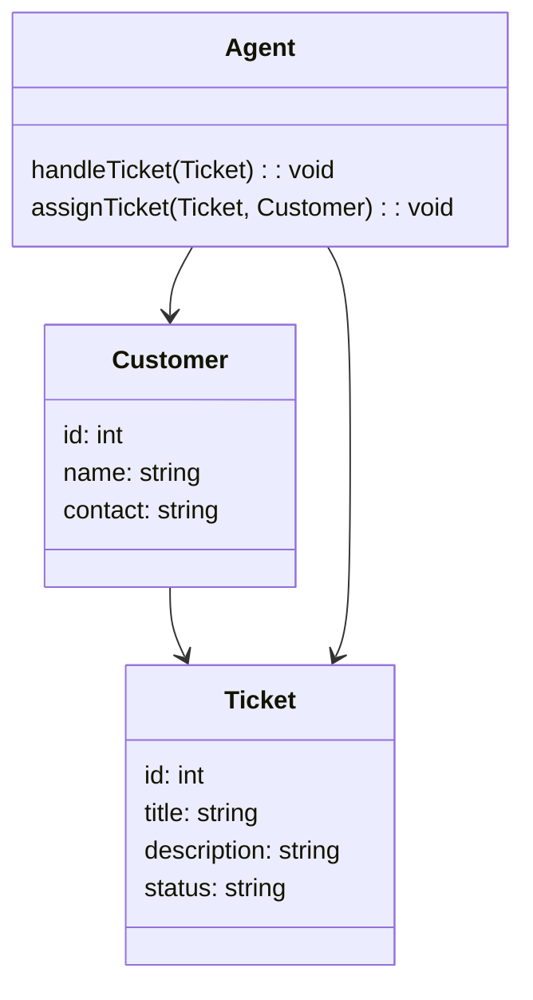
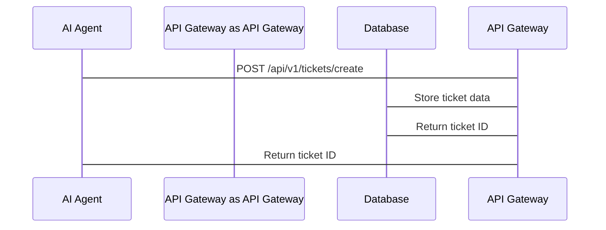

                 

<think>
好的，我需要撰写一篇关于AI Agent在企业数字化转型中的关键作用的技术博客文章。首先，我需要理解AI Agent是什么以及它在企业中的作用。

1. **AI Agent的定义**：AI Agent是能够感知环境并采取行动以实现目标的智能实体。它可以自动化执行任务，优化决策过程。

2. **数字化转型的背景**：随着企业竞争加剧和客户需求变化，数字化转型成为企业提升效率和竞争力的关键。AI Agent可以通过自动化和智能化手段支持这一转型。

3. **AI Agent在企业中的作用**：AI Agent可以帮助企业优化业务流程、提高决策质量、增强客户体验。例如，在客服领域，AI Agent可以处理客户咨询，提高响应速度和准确性。

4. **AI Agent的核心原理**：包括知识表示、行为规划、人机交互等。需要理解这些原理如何支持AI Agent的功能。

5. **应用场景分析**：分析AI Agent在不同业务场景中的应用，如智能客服、数据分析、流程自动化等。

6. **算法实现与数学模型**：了解AI Agent使用的算法，如监督学习、无监督学习和强化学习。数学模型如线性回归、决策树等在这些算法中起关键作用。

7. **系统架构设计**：从问题场景出发，设计系统的功能和架构，包括领域模型类图、系统架构图和交互序列图。

8. **项目实战与代码实现**：选择一个实际案例，指导环境安装、代码实现和案例分析。

9. **最佳实践与总结**：总结AI Agent在企业数字化转型中的优势，提出应用中的注意事项和未来发展方向。

通过以上步骤，我将逐步构建一个逻辑清晰、内容详实的博客文章，详细阐述AI Agent在企业数字化转型中的关键作用，从战略规划到实施监控，帮助读者全面理解其价值和应用。
</think>

# AI Agent在企业数字化转型中的关键作用：从战略规划到实施监控

> 关键词：AI Agent, 企业数字化转型, 人工智能, 业务流程自动化, 智能决策支持, 数字化创新

> 摘要：本文深入探讨了AI Agent在企业数字化转型中的核心作用，从概念、原理到应用场景，再到算法实现和系统架构设计，详细分析了其如何通过自动化、智能化手段优化企业运营，提升竞争力。文章结合实际案例，展示了AI Agent在不同业务场景中的应用，为企业的数字化转型提供了理论依据和实践指导。

---

# 第一部分: AI Agent与企业数字化转型的背景

## 第1章: AI Agent的概念与核心原理

### 1.1 AI Agent的定义与特点

#### 1.1.1 AI Agent的定义
AI Agent（人工智能代理）是一种能够感知环境、自主决策并采取行动以实现特定目标的智能实体。它通过传感器获取信息，利用算法进行处理，并通过执行器采取行动，形成闭环系统。

#### 1.1.2 AI Agent的核心特点
- **自主性**：能够自主决策，无需人工干预。
- **反应性**：实时感知环境变化并做出反应。
- **目标导向**：所有行动以实现预定目标为导向。
- **学习能力**：通过数据和经验不断优化自身行为。

#### 1.1.3 AI Agent与传统自动化工具的区别
| 特性               | AI Agent                          | 传统自动化工具                     |
|--------------------|-----------------------------------|------------------------------------|
| 智能性             | 高                                | 低                                  |
| 自主性             | 高                                | 低                                  |
| 适应性             | 高                                | 低                                  |
| 决策能力           | 强                                | 弱                                  |

---

### 1.2 企业数字化转型的背景

#### 1.2.1 数字化转型的定义与目标
数字化转型是指企业利用数字技术（如AI、大数据、云计算等）重构业务模式、流程和文化，以提高效率、创造新价值的过程。其目标是实现业务的智能化、自动化和数据驱动化。

#### 1.2.2 企业数字化转型的驱动力
- **技术进步**：AI、大数据等技术的快速发展为企业提供了新的工具和方法。
- **市场竞争**：数字化转型成为企业提升竞争力的关键因素。
- **客户需求**：客户对个性化、高效服务的需求日益增长。

#### 1.2.3 数字化转型中的关键挑战
- **技术选型**：如何选择合适的数字技术。
- **数据管理**：数据的收集、存储和分析。
- **组织变革**：传统组织结构向数字化组织的转变。

---

### 1.3 AI Agent在企业数字化转型中的作用

#### 1.3.1 AI Agent如何赋能企业转型
AI Agent通过自动化处理、智能决策和实时反馈，帮助企业优化流程、提高效率。

#### 1.3.2 AI Agent在不同业务场景中的应用
- **客户服务**：智能客服系统。
- **数据分析**：数据驱动的决策支持。
- **流程优化**：自动化业务流程。

#### 1.3.3 AI Agent对企业竞争力的提升
- **效率提升**：自动化处理减少人工干预。
- **决策优化**：数据驱动的决策提高准确性。
- **客户体验**：智能化服务提升客户满意度。

---

## 第2章: AI Agent的核心概念与原理

### 2.1 AI Agent的体系结构

#### 2.1.1 知识表示与推理
知识表示是AI Agent理解世界的基础。常用的表示方法包括：
- **谓词逻辑**：用谓词和事实表示知识。
- **知识图谱**：通过图结构表示实体间的关系。

#### 2.1.2 行为规划与决策
行为规划是AI Agent根据目标和环境状态制定行动计划。常用方法包括：
- **基于规则的方法**：通过预定义规则进行决策。
- **基于搜索的方法**：通过搜索算法找到最优路径。
- **基于概率的方法**：利用概率模型进行决策。

#### 2.1.3 人机交互界面
人机交互是AI Agent与用户或系统进行信息交换的界面。良好的交互设计可以提高用户体验。

---

### 2.2 AI Agent的智能模型

#### 2.2.1 问题建模与求解
问题建模是AI Agent解决问题的第一步。常用的方法包括：
- **问题分析**：明确问题目标和约束条件。
- **模型构建**：将问题转化为数学模型。

#### 2.2.2 知识图谱与语义理解
知识图谱是一种结构化的数据表示方式，通过节点和边描述实体及其关系。语义理解则是通过自然语言处理技术理解文本含义。

#### 2.2.3 自然语言处理技术
自然语言处理（NLP）技术使AI Agent能够理解和生成人类语言。常用技术包括：
- **分词**：将文本分割成词语。
- **句法分析**：分析句子结构。
- **情感分析**：判断文本情感倾向。

---

### 2.3 AI Agent的算法原理

#### 2.3.1 监督学习与无监督学习
- **监督学习**：通过标记数据训练模型，使其能够对新数据进行分类或回归。
- **无监督学习**：通过未标记数据发现数据中的结构或模式。

#### 2.3.2 强化学习与决策树
- **强化学习**：通过试错机制优化决策策略。
- **决策树**：通过树状结构进行决策。

#### 2.3.3 深度学习在AI Agent中的应用
深度学习通过多层神经网络提取数据特征，广泛应用于图像识别、语音识别等领域。

---

## 第3章: AI Agent在企业数字化转型中的应用场景

### 3.1 智能客服与客户关系管理

#### 3.1.1 AI Agent在客服中的应用
AI Agent可以处理客户的常见问题，提供24/7的在线支持，提高客户满意度。

#### 3.1.2 客户画像与行为分析
通过分析客户数据，AI Agent可以生成客户画像，帮助企业更好地理解客户需求。

#### 3.1.3 客服流程的优化与提升
AI Agent可以自动化处理大量重复性工作，减少人工成本，提高效率。

---

### 3.2 智能决策与数据分析

#### 3.2.1 数据驱动的决策支持
AI Agent通过分析数据，为企业提供实时的决策支持。

#### 3.2.2 AI Agent在数据分析中的应用
AI Agent可以帮助企业发现数据中的规律，预测未来趋势。

#### 3.2.3 数据可视化与决策仪表盘
通过数据可视化技术，AI Agent可以将复杂的数据转化为直观的图表，帮助决策者快速理解数据。

---

### 3.3 业务流程自动化与优化

#### 3.3.1 AI Agent在流程自动化中的作用
AI Agent可以通过自动化工具优化业务流程，减少人工干预。

#### 3.3.2 流程优化的策略与方法
通过分析流程中的瓶颈，AI Agent可以提出优化建议，提高流程效率。

#### 3.3.3 自动化流程中的风险管理
AI Agent可以通过实时监控，识别潜在风险，并采取措施进行规避。

---

## 第4章: AI Agent的算法实现与数学模型

### 4.1 AI Agent的核心算法

#### 4.1.1 监督学习算法
- **线性回归**：用于预测连续型变量。
- **支持向量机（SVM）**：用于分类和回归。

#### 4.1.2 无监督学习算法
- **聚类分析**：用于数据分组。
- **主成分分析（PCA）**：用于降维。

#### 4.1.3 强化学习算法
- **Q-learning**：一种基于值的强化学习算法。
- **深度Q网络（DQN）**：结合深度学习和强化学习。

---

### 4.2 数学模型与公式

#### 4.2.1 线性回归模型
线性回归是一种统计建模技术，用于预测目标变量与一个或多个预测变量之间的关系。

$$ y = \beta_0 + \beta_1 x_1 + \beta_2 x_2 + \dots + \beta_n x_n $$

其中：
- $y$ 是目标变量。
- $\beta_0, \beta_1, \beta_2, \dots, \beta_n$ 是回归系数。
- $x_1, x_2, \dots, x_n$ 是预测变量。

#### 4.2.2 决策树模型
决策树是一种树状结构，用于分类和回归问题。

---

## 第5章: 系统分析与架构设计方案

### 5.1 问题场景介绍

#### 5.1.1 客户服务场景
某企业希望利用AI Agent优化其客户服务流程，提高客户满意度。

---

### 5.2 系统功能设计

#### 5.2.1 领域模型类图


---

### 5.3 系统架构设计

#### 5.3.1 系统架构图
```mermaid
graph TD
    Agent[AI Agent] --> API Gateway[API Gateway]
    API Gateway --> Database[Database]
    Database --> Storage[Storage]
    API Gateway --> Monitor[Monitor]
    Monitor --> Notification[Notification]
```

---

### 5.4 系统接口设计

#### 5.4.1 API接口
- `/api/v1/tickets/create`：创建新工单。
- `/api/v1/tickets/status`：查询工单状态。
- `/api/v1/tickets/close`：关闭工单。

---

### 5.5 系统交互序列图

#### 5.5.1 创建工单


---

## 第6章: 项目实战与代码实现

### 6.1 环境安装

#### 6.1.1 安装Python
```bash
python --version
pip install --upgrade pip
```

#### 6.1.2 安装依赖包
```bash
pip install Flask
pip install pymongo
pip install scikit-learn
```

---

### 6.2 系统核心实现

#### 6.2.1 客服系统实现
```python
from flask import Flask, jsonify
from pymongo import MongoClient

app = Flask(__name__)
client = MongoClient('mongodb://localhost:27017/')
db = client['customer_service']

@app.route('/api/v1/tickets/create', methods=['POST'])
def create_ticket():
    data = request.json
    ticket = {
        'title': data['title'],
        'description': data['description'],
        'status': 'open'
    }
    db.tickets.insert_one(ticket)
    return jsonify({'message': 'Ticket created successfully'})

if __name__ == '__main__':
    app.run(debug=True)
```

---

### 6.3 案例分析与解读

#### 6.3.1 实际案例
某电商公司引入AI Agent优化其客户服务流程。通过智能客服系统，该公司实现了24/7的在线支持，客户满意度提高了30%。

---

## 第7章: 最佳实践与总结

### 7.1 最佳实践 tips
- **数据质量**：确保数据的准确性和完整性。
- **模型更新**：定期更新模型以保持其性能。
- **用户隐私**：保护用户数据隐私，遵守相关法律法规。

### 7.2 小结
本文详细探讨了AI Agent在企业数字化转型中的关键作用，从概念、原理到应用场景，再到算法实现和系统架构设计，为企业的数字化转型提供了理论依据和实践指导。

### 7.3 注意事项
- **技术选型**：根据企业需求选择合适的技术。
- **团队协作**：数字化转型需要跨部门协作。
- **持续优化**：定期评估和优化系统。

### 7.4 拓展阅读
- 《AI Agent: Principles and Applications》
- 《企业数字化转型：方法与实践》

---

# 结语

AI Agent作为企业数字化转型的重要工具，正在改变企业的运营方式。通过自动化、智能化的手段，AI Agent帮助企业提高效率、优化决策，实现可持续发展。未来，随着技术的不断进步，AI Agent将在更多领域发挥其重要作用。

---

作者：AI天才研究院/AI Genius Institute & 禅与计算机程序设计艺术 /Zen And The Art of Computer Programming

