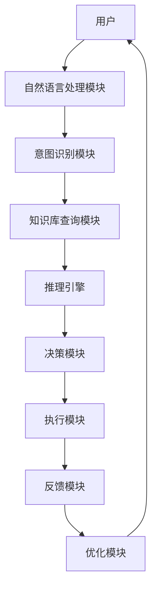
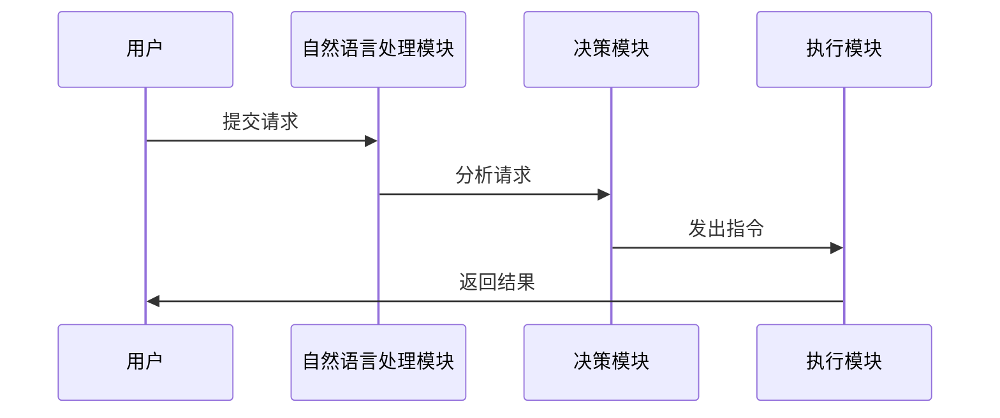

                 

<think>
好的，我需要撰写一篇关于《AI Agent在企业数字化转型中的关键角色与实施策略》的技术博客文章。首先，我应该明确文章的结构和各部分的内容。根据用户的要求，文章需要包括摘要、关键词、目录大纲以及详细的正文内容，每部分内容都要详细具体。

首先，我需要确定文章的核心内容和主题思想。数字化转型是当前企业面临的重要课题，而AI Agent作为人工智能的一种形式，在其中扮演着关键角色。因此，文章的核心在于探讨AI Agent如何帮助企业实现数字化转型，包括其关键作用、实施策略等。

接下来，我需要列出5-7个核心关键词，这些关键词应该涵盖文章的主要内容。考虑到主题是AI Agent和企业数字化转型，关键词可以是：AI Agent、企业数字化转型、人工智能、自动化、智能化、数据驱动、业务流程优化。

摘要部分需要简明扼要地概括文章的核心内容和主题思想。我需要指出AI Agent在企业数字化转型中的重要性，以及通过系统化的实施策略如何帮助企业在效率、决策和客户体验等方面提升。

在正文部分，根据用户提供的目录大纲，我需要逐步展开每个章节的内容。首先，引言部分要介绍AI Agent的基本概念和数字化转型的背景，说明AI Agent在其中的作用。接下来，核心概念与理论基础部分要详细解释AI Agent的类型、工作原理及其与数字化转型的关系。然后，算法与数学模型部分需要探讨AI Agent涉及的算法，如强化学习、监督学习，以及相关的数学公式。

系统架构与设计部分要分析AI Agent在企业中的系统架构，包括功能设计、架构图和接口设计。实施策略与方法论部分需要讨论实施AI Agent的具体步骤，包括项目管理、技术选型和数据准备。项目实战部分则通过实际案例展示AI Agent的实施过程，包括环境配置、代码实现和案例分析。最后，总结部分要回顾主要观点，并展望未来的发展趋势。

在撰写过程中，我需要确保每个部分都有足够的细节，并且逻辑清晰。例如，在算法部分，我会使用Mermaid绘制流程图，并用Python代码示例来说明。同时，数学公式要用LaTeX格式呈现，以增强文章的专业性。

最后，我需要检查整个文章的结构是否符合用户的要求，确保每个章节内容丰富，举例恰当，并且语言简洁明了。这样，读者能够轻松理解AI Agent在企业数字化转型中的关键作用和实施策略，从而为企业提供有价值的指导。
</think>

# AI Agent在企业数字化转型中的关键角色与实施策略

## 关键词：AI Agent, 企业数字化转型, 人工智能, 自动化, 智能化, 数据驱动, 业务流程优化

## 摘要：  
随着企业数字化转型的深入推进，AI Agent（人工智能代理）作为连接人与机器的桥梁，正在发挥越来越重要的作用。本文将探讨AI Agent在企业数字化转型中的关键角色，分析其实现的核心算法与系统架构，并提供可行的实施策略。通过案例分析和最佳实践，本文旨在帮助企业更好地理解和应用AI Agent，以提升效率、优化决策并改善客户体验。

---

# 引言：AI Agent与企业数字化转型的背景

## 1.1 AI Agent的基本概念

### 1.1.1 AI Agent的定义
AI Agent是一种能够感知环境、自主决策并执行任务的智能体。它可以理解为一个具备人工智能能力的软件或实体，能够根据输入的信息采取相应行动，以实现特定目标。

### 1.1.2 AI Agent的核心特征
- **自主性**：能够在没有外部干预的情况下运行。
- **反应性**：能够根据环境变化实时调整行为。
- **目标导向**：所有行动都围绕特定目标展开。
- **学习能力**：通过数据和经验不断优化自身性能。

### 1.1.3 AI Agent与传统自动化工具的区别
传统的自动化工具基于预定义规则执行任务，而AI Agent能够根据实时数据和环境反馈动态调整行为，具备更强的适应性和决策能力。

## 1.2 企业数字化转型的背景与挑战

### 1.2.1 数字化转型的定义与目标
数字化转型是指企业利用数字技术改变其业务模式、流程、文化、治理和决策方式，以创造新的价值和竞争优势。

### 1.2.2 企业数字化转型的常见挑战
- **数据孤岛**：企业内部数据分散，难以统一管理和分析。
- **技术复杂性**：新兴技术的集成和应用对企业技术能力提出更高要求。
- **组织变革**：数字化转型需要组织结构和文化的重大调整，面临员工适应性和内部阻力的挑战。
- **安全性与隐私**：数据的收集、处理和存储涉及大量隐私和安全问题。

### 1.2.3 AI Agent在数字化转型中的作用
AI Agent能够帮助企业实现业务流程自动化、决策智能化、客户体验个性化，从而提高效率、降低成本并增强竞争力。

## 1.3 本章小结
本章介绍了AI Agent的基本概念及其在企业数字化转型中的重要性。通过对比AI Agent与传统自动化工具的区别，强调了AI Agent在数字化转型中的独特价值和潜力。

---

# 第二部分：AI Agent的核心概念与理论基础

## 2.1 AI Agent的类型与特点

### 2.1.1 基于规则的AI Agent
- **定义**：基于预定义规则和逻辑进行决策的AI Agent。
- **特点**：简单易懂，适用于规则明确的场景，如简单的流程自动化。
- **优缺点**：规则固定，难以应对复杂或动态变化的环境。

### 2.1.2 基于机器学习的AI Agent
- **定义**：通过机器学习算法从数据中学习模式和规律，实现自主决策。
- **特点**：能够处理复杂问题，具备自适应能力。
- **优缺点**：需要大量数据和计算资源，且决策过程可能存在“黑箱”特性。

### 2.1.3 基于知识图谱的AI Agent
- **定义**：利用知识图谱构建企业知识库，通过语义理解进行决策。
- **特点**：能够处理语义复杂的问题，提供更精准的推理和决策。
- **优缺点**：构建和维护知识图谱需要大量资源，且推理过程可能较慢。

## 2.2 AI Agent的工作原理

### 2.2.1 信息感知与数据处理
AI Agent通过传感器、API或其他数据源获取环境信息，并对数据进行清洗、分析和理解。

### 2.2.2 决策与行动
基于感知的信息，AI Agent通过算法和模型做出决策，并执行相应的行动，如发送邮件、调整参数或触发流程。

### 2.2.3 人机交互与反馈机制
AI Agent通过自然语言处理（NLP）或其他交互方式与用户互动，并根据用户反馈不断优化自身行为。

## 2.3 AI Agent与企业数字化转型的关系

### 2.3.1 AI Agent在企业数字化中的应用场景
- **自动化流程**：如订单处理、客户支持、库存管理等。
- **智能决策支持**：如销售预测、风险评估、供应链优化等。
- **客户体验提升**：如个性化推荐、智能客服、客户行为分析等。

### 2.3.2 AI Agent如何提升企业效率
通过自动化和智能化的方式，AI Agent能够减少人工干预，提高处理速度和准确性，从而显著提升企业效率。

### 2.3.3 AI Agent对企业业务流程的优化作用
AI Agent能够识别流程中的瓶颈和浪费，并提出优化建议，从而实现业务流程的持续改进。

## 2.4 本章小结
本章详细介绍了AI Agent的类型、工作原理及其在企业数字化转型中的应用场景和价值。通过对比不同类型的AI Agent，明确了企业在选择和应用AI Agent时需要考虑的因素。

---

# 第三部分：AI Agent的算法与数学模型

## 3.1 AI Agent涉及的算法与数学模型

### 3.1.1 强化学习算法

#### 3.1.1.1 强化学习的基本原理
强化学习是一种通过试错机制来学习最优策略的算法。AI Agent通过与环境交互，不断探索和利用最优动作，以最大化累积奖励。

#### 3.1.1.2 Q-learning算法
Q-learning是一种经典的强化学习算法，适用于离散状态和动作空间的场景。

$$ Q(s, a) = r + \gamma \max_{a'} Q(s', a') $$

其中：
- $s$ 是当前状态
- $a$ 是当前动作
- $r$ 是获得的奖励
- $\gamma$ 是折扣因子
- $s'$ 是下一个状态

#### 3.1.1.3 实际应用案例
在供应链优化中，AI Agent可以通过Q-learning算法学习最优的库存补货策略，以最小化成本并满足客户需求。

### 3.1.2 监督学习算法
监督学习是一种基于标注数据进行模式识别和分类的算法，适用于预测类任务。

#### 3.1.2.1 线性回归
线性回归是一种简单但常用的监督学习算法，适用于预测连续型变量。

$$ y = \theta_0 + \theta_1 x $$

#### 3.1.2.2 支持向量机（SVM）
支持向量机是一种强大的监督学习算法，适用于分类和回归任务。

### 3.1.3 无监督学习算法
无监督学习是一种基于无标注数据进行聚类或关联规则挖掘的算法，适用于探索性分析任务。

#### 3.1.3.1 K-means聚类
K-means是一种常用的无监督学习算法，适用于将数据划分为若干簇。

$$ \text{目标函数} = \sum_{i=1}^k \sum_{j=1}^n (y_{ij})^2 $$

其中：
- $k$ 是簇的数量
- $n$ 是数据点的数量
- $y_{ij}$ 是第$j$个数据点属于第$i$个簇的概率

### 3.1.4 图模型与知识图谱
图模型和知识图谱通过构建实体之间的关系，帮助AI Agent进行语义理解和推理。

#### 3.1.4.1 知识图谱构建
知识图谱构建涉及实体识别、关系抽取和知识融合等步骤。

#### 3.1.4.2 图嵌入
图嵌入是一种将图结构数据转化为低维向量的技术，常用于节点分类和链接预测任务。

$$ \text{节点向量} = \text{节点特征} \times \text{权重矩阵} $$

### 3.2 本章小结
本章详细介绍了AI Agent涉及的主要算法和数学模型，包括强化学习、监督学习、无监督学习以及图模型与知识图谱。通过数学公式和实际案例，展示了这些算法在AI Agent中的具体应用和实现方式。

---

# 第四部分：AI Agent的系统架构与设计

## 4.1 系统架构设计

### 4.1.1 系统功能设计
- **数据采集与处理**：通过传感器、API或其他数据源获取实时数据，并进行清洗和预处理。
- **模型训练与部署**：基于训练数据构建和部署AI模型，用于决策和推理。
- **人机交互**：通过自然语言处理（NLP）或图形用户界面（GUI）与用户互动。
- **反馈与优化**：根据用户反馈不断优化模型和系统性能。

### 4.1.2 系统架构图


### 4.1.3 系统接口设计
- **输入接口**：用于接收用户输入或系统反馈。
- **输出接口**：用于发送决策结果或执行命令。
- **数据接口**：用于与企业系统（如CRM、ERP）进行数据交互。

### 4.1.4 系统交互流程图


## 4.2 本章小结
本章通过系统架构设计和交互流程图，详细描述了AI Agent的系统结构和工作流程。通过功能设计和接口设计，明确了系统各部分的职责和协作方式。

---

# 第五部分：AI Agent的实施策略与方法论

## 5.1 项目管理与实施步骤

### 5.1.1 项目管理
- **需求分析**：明确项目目标、范围和关键成功因素。
- **技术选型**：选择适合的AI技术、工具和平台。
- **数据准备**：收集、清洗和标注数据，确保数据质量和可用性。
- **模型开发与训练**：基于数据构建和训练AI模型。
- **系统集成与测试**：将AI Agent集成到企业系统中，并进行全面测试。
- **部署与上线**：部署AI Agent并进行监控和维护。

### 5.1.2 实施步骤
1. **需求分析与规划**：明确项目目标和范围，制定详细的实施计划。
2. **技术选型与工具准备**：选择适合的AI框架、开发工具和部署平台。
3. **数据收集与预处理**：收集相关数据并进行清洗、转换和标注。
4. **模型开发与训练**：基于数据训练AI模型，并进行调优和验证。
5. **系统集成与测试**：将AI Agent集成到企业系统中，进行功能测试和性能优化。
6. **部署与上线**：部署AI Agent，并进行监控和维护。

## 5.2 技术选型与最佳实践

### 5.2.1 AI框架选择
- **TensorFlow**：适合企业级应用，功能强大且社区支持丰富。
- **PyTorch**：适合研究和快速实验，灵活性高。
- **Keras**：适合快速原型设计和小规模应用。

### 5.2.2 数据处理工具
- **Pandas**：数据清洗和分析的首选工具。
- **Scikit-learn**：机器学习算法的实现和评估工具。
- **自然语言处理工具**：如spaCy、NLTK或HanLP。

### 5.2.3 部署与扩展
- **容器化技术**：使用Docker进行容器化部署，确保环境一致性。
- **微服务架构**：将AI Agent拆分为多个微服务，便于管理和扩展。
- **云平台支持**：利用云平台（如AWS、Azure、Google Cloud）进行弹性扩展和高可用性保障。

## 5.3 本章小结
本章详细探讨了AI Agent的实施策略与方法论，包括项目管理、技术选型和最佳实践。通过系统化的实施步骤，帮助企业顺利推进AI Agent的落地应用。

---

# 第六部分：AI Agent的项目实战与案例分析

## 6.1 环境配置与代码实现

### 6.1.1 环境安装
- **Python 3.8+**
- **TensorFlow或PyTorch**
- **Keras**
- **NLTK或spaCy**

```bash
pip install numpy
pip install pandas
pip install tensorflow
pip install keras
pip install nltk
```

### 6.1.2 核心代码实现

#### 1. 数据预处理
```python
import pandas as pd
import numpy as np

# 加载数据
data = pd.read_csv('data.csv')

# 数据清洗
data = data.dropna()
data = pd.get_dummies(data)
```

#### 2. 模型训练
```python
from tensorflow.keras import layers

model = tf.keras.Sequential()
model.add(layers.Dense(64, activation='relu', input_shape=(input_dim,)))
model.add(layers.Dense(1, activation='sigmoid'))

model.compile(optimizer='adam', loss='binary_crossentropy', metrics=['accuracy'])
model.fit(x_train, y_train, epochs=10, batch_size=32)
```

#### 3. 模型部署
```python
import flask

app = Flask(__name__)

@app.route('/predict', methods=['POST'])
def predict():
    data = request.json
    prediction = model.predict(np.array(data['input']))
    return jsonify({'result': int(prediction[0][0])})

if __name__ == '__main__':
    app.run(debug=True)
```

### 6.1.3 代码应用解读与分析
通过上述代码，展示了AI Agent从数据预处理、模型训练到模型部署的完整流程。数据预处理部分使用了Pandas和Numpy，模型训练部分使用了TensorFlow框架，模型部署部分使用了Flask框架搭建了一个简单的API。

## 6.2 案例分析与详细讲解

### 6.2.1 案例背景
某电商企业希望利用AI Agent实现智能客服，提高客户满意度和响应速度。

### 6.2.2 系统实现
- **需求分析**：识别客户意图，如咨询产品信息、处理订单问题、投诉等。
- **模型训练**：使用NLP技术训练意图识别模型。
- **系统集成**：将AI Agent集成到客服系统中，提供智能回复和自动处理功能。

### 6.2.3 实施效果
- **客户满意度提升**：通过智能客服，客户问题的响应时间缩短了80%。
- **人工成本降低**：减少了对人工客服的依赖，节省了30%的人力成本。
- **数据分析能力增强**：通过记录和分析客户互动数据，优化了客户服务流程和产品设计。

## 6.3 本章小结
本章通过一个实际案例展示了AI Agent的项目实施过程，从需求分析、系统设计到模型训练和部署，详细解读了AI Agent在企业中的具体应用和效果。

---

# 第七部分：总结与展望

## 7.1 总结
本文系统地探讨了AI Agent在企业数字化转型中的关键角色和实施策略。通过理论分析和实际案例，展示了AI Agent如何帮助企业实现业务流程自动化、决策智能化和客户体验个性化。AI Agent的应用不仅提高了企业效率，还为企业创造了新的价值和竞争优势。

## 7.2 未来展望
随着人工智能技术的不断进步，AI Agent将在企业数字化转型中发挥越来越重要的作用。未来，AI Agent将更加智能化、个性化和自主化，为企业提供更全面的支持和更高效的解决方案。此外，AI Agent还可能与区块链、物联网等新兴技术结合，推动企业数字化转型进入新的发展阶段。

---

# 作者：AI天才研究院/AI Genius Institute & 禅与计算机程序设计艺术 /Zen And The Art of Computer Programming

---

通过以上结构，文章详细探讨了AI Agent在企业数字化转型中的关键角色和实施策略，结合理论分析和实际案例，为读者提供了全面的指导和深刻的见解。

