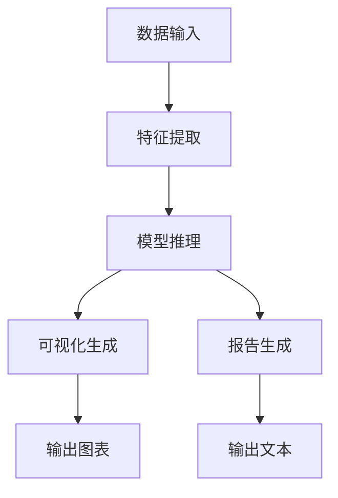
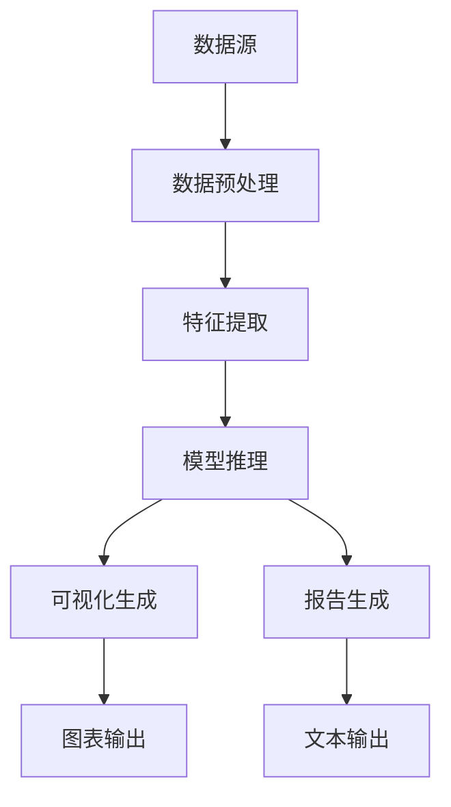
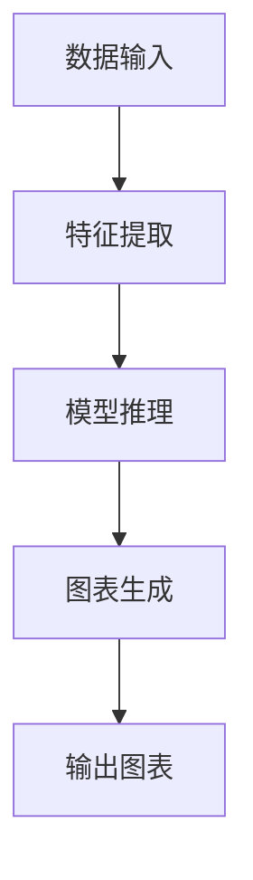
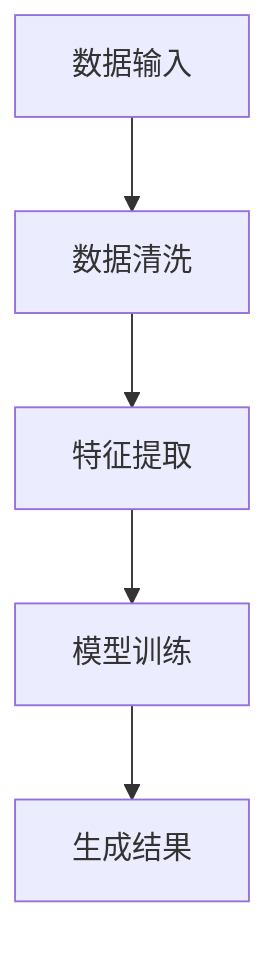
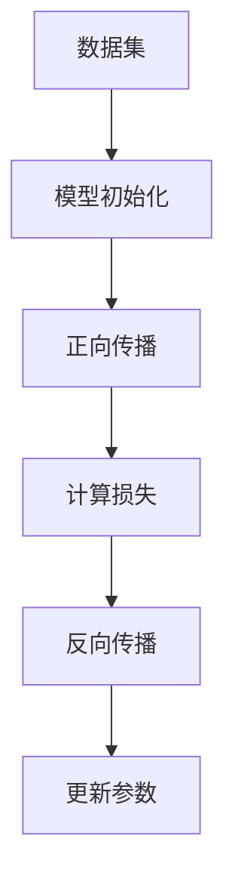
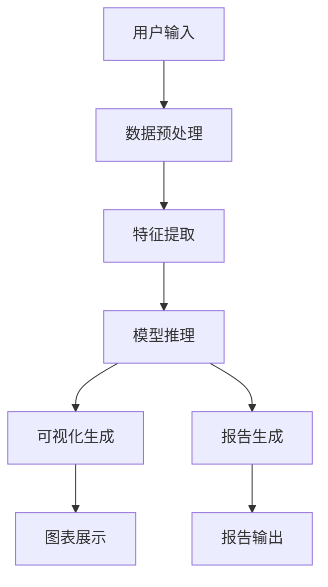

                 


# AI Agent在企业数据可视化与报告生成中的应用

> 关键词：AI Agent, 数据可视化, 报告生成, 生成式模型, 企业数据处理, 可视化系统架构

> 摘要：本文详细探讨了AI Agent在企业数据可视化与报告生成中的应用，从AI Agent的核心概念、算法原理到系统架构设计，再到实际项目实现，结合丰富案例和图表，全面解析了如何利用AI Agent技术提升企业数据处理效率与报告生成能力。

---

# 第一部分: AI Agent与企业数据可视化概述

## 第1章: AI Agent与企业数据可视化背景

### 1.1 AI Agent的基本概念与核心原理

#### 1.1.1 AI Agent的定义与核心特征
AI Agent（人工智能代理）是指具有感知环境、理解需求、执行任务能力的智能系统。其核心特征包括：
- **自主性**：无需外部干预，自主完成任务。
- **反应性**：能够实时感知环境变化并做出响应。
- **学习性**：通过数据和反馈不断优化自身能力。
- **可解释性**：生成的结果需具备可追溯性和逻辑性。

#### 1.1.2 AI Agent在企业数据处理中的作用
AI Agent在企业数据处理中的核心作用包括：
- 数据清洗与预处理：自动识别异常数据并进行清洗。
- 数据分析与洞察挖掘：通过深度学习算法发现数据中的潜在规律。
- 报告生成：基于分析结果自动生成结构化的报告文本。

#### 1.1.3 数据可视化与报告生成的背景与挑战
- **背景**：随着企业数据量的激增，传统的数据可视化工具和报告生成方式已难以满足高效、精准的需求。
- **挑战**：数据来源多样、格式复杂，且需要实时更新和动态调整。

---

### 1.2 企业数据可视化与报告生成的现状

#### 1.2.1 传统数据可视化工具与方法
- 工具：Tableau、Power BI等。
- 方法：基于图表（柱状图、折线图等）的传统可视化方式。

#### 1.2.2 企业数据报告生成的痛点与难点
- **痛点**：人工撰写报告耗时耗力，且容易出错。
- **难点**：数据量大、维度多，难以快速生成结构化的报告。

#### 1.2.3 AI Agent在数据可视化与报告生成中的价值
- 提高效率：通过自动化处理减少人工干预。
- 增强准确性：基于模型的分析结果更加客观可靠。
- 实时更新：动态调整可视化和报告内容。

---

### 1.3 本章小结
本章介绍了AI Agent的基本概念、核心特征及其在企业数据处理中的作用，重点分析了传统数据可视化与报告生成的痛点与难点，并提出了AI Agent在其中的价值。

---

# 第二部分: AI Agent的核心概念与原理

## 第2章: AI Agent的核心概念与系统架构

### 2.1 AI Agent的核心概念

#### 2.1.1 感知层：数据输入与特征提取
- 数据输入：多模态数据（文本、图像、表格）的输入方式。
- 特征提取：通过模型提取关键特征，如文本中的关键词、图像中的主体。

#### 2.1.2 决策层：模型推理与策略选择
- 模型推理：基于特征生成初步的可视化方案或报告内容。
- 策略选择：根据预设规则或反馈优化结果。

#### 2.1.3 执行层：输出生成与反馈优化
- 输出生成：生成可视化图表或报告文本。
- 反馈优化：根据用户反馈调整生成结果。

#### 2.1.4 核心概念对比表
| 比较维度 | 数据可视化 | 报告生成 |
|----------|------------|----------|
| 输入类型 | 图表数据    | 文本内容  |
| 输出形式 | 图表        | 文本      |
| 复杂度   | 中等        | 高        |

#### 2.1.5 实体关系图：AI Agent系统架构的Mermaid图


### 2.2 数据可视化与报告生成中的AI Agent架构

#### 2.2.1 数据源的多模态输入处理
- 文本、图像、表格等多种数据类型的输入。
- 使用NLP技术对文本数据进行处理。

#### 2.2.2 可视化生成模块的设计
- 图表类型选择：根据数据特点自动生成最优图表。
- 图表样式优化：动态调整颜色、布局等。

#### 2.2.3 报告自动生成与优化机制
- 内容结构化：将分析结果组织成逻辑清晰的报告。
- 语言优化：通过语言模型优化报告的表达。

#### 2.2.4 系统架构图：AI Agent的整体架构


---

### 2.3 算法原理与数学模型

#### 2.3.1 生成式模型的原理与应用
- **生成式模型**：基于概率分布生成新数据。
- **应用**：文本生成、图像生成。

#### 2.3.2 基于Transformer的生成模型
- **数学模型**：使用自注意力机制（Self-attention）。
- **公式**：
  $$ \text{Attention}(Q,K,V) = \text{softmax}\left(\frac{QK^T}{\sqrt{d_k}}\right)V $$
  
#### 2.3.3 图表生成流程图：AI Agent生成图表的流程


---

## 第3章: AI Agent的算法原理

### 3.1 生成式模型的原理与应用

#### 3.1.1 基于Transformer的生成模型
- **模型结构**：编码器-解码器架构。
- **应用**：文本生成、图像生成。

#### 3.1.2 大模型在文本生成中的应用
- 使用GPT模型生成自然语言文本。
- 通过微调（Fine-tuning）适应特定领域需求。

#### 3.1.3 图像生成与文本生成的结合
- 使用GAN（生成对抗网络）生成图像。
- 将图像与文本结合生成复合式报告。

---

### 3.2 数据可视化与报告生成的算法流程

#### 3.2.1 数据预处理与特征提取
- 数据清洗：去除无效数据。
- 特征提取：提取关键特征。

#### 3.2.2 可视化生成算法的选择
- 根据数据类型选择最优的可视化方法。

#### 3.2.3 报告自动生成的流程优化
- 内容组织：逻辑清晰。
- 语言优化：自然流畅。

---

### 3.3 算法原理的Mermaid流程图

#### 3.3.1 数据处理流程图


#### 3.3.2 模型训练流程图


---

## 第4章: 系统分析与架构设计

### 4.1 系统功能需求分析

#### 4.1.1 数据输入与预处理功能
- 数据清洗：去除无效数据。
- 数据转换：统一数据格式。

#### 4.1.2 可视化生成与展示功能
- 图表生成：根据数据生成图表。
- 图表展示：支持多种格式输出。

#### 4.1.3 报告自动生成与输出功能
- 内容生成：结构化报告生成。
- 格式优化：PDF、Word等格式输出。

---

### 4.2 系统架构设计

#### 4.2.1 领域模型设计
- **领域模型图**：
  ```mermaid
  graph TD
  A[数据源] --> B[数据预处理]
  B --> C[特征提取]
  C --> D[模型推理]
  D --> E[可视化生成]
  D --> F[报告生成]
  ```

#### 4.2.2 系统架构图


---

## 第5章: 项目实战与案例分析

### 5.1 项目实战

#### 5.1.1 环境搭建与工具安装
- 安装Python、TensorFlow、Keras等工具。

#### 5.1.2 数据可视化工具安装
- 安装Matplotlib、Seaborn等可视化库。

#### 5.1.3 AI模型训练环境搭建
- 安装深度学习框架（如TensorFlow、PyTorch）。

---

### 5.2 代码实现与案例分析

#### 5.2.1 核心代码实现
```python
import matplotlib.pyplot as plt
import numpy as np

# 示例数据
x = np.linspace(0, 10, 100)
y = np.sin(x)

# 可视化生成
plt.figure(figsize=(10, 6))
plt.plot(x, y, label='sin(x)')
plt.xlabel('x')
plt.ylabel('sin(x)')
plt.title('Sine Function Visualization')
plt.legend()
plt.show()
```

---

### 5.3 案例分析

#### 5.3.1 案例背景与数据预处理
- 数据来源：企业销售数据。
- 数据清洗：去除异常值。

#### 5.3.2 可视化生成与分析
- 生成折线图展示销售额趋势。
- 通过模型预测未来销售额。

#### 5.3.3 报告生成与优化
- 自动生成销售趋势分析报告。
- 根据用户反馈优化报告内容。

---

## 第6章: 最佳实践与总结

### 6.1 最佳实践
- **数据质量**：确保输入数据的准确性和完整性。
- **模型优化**：通过反馈不断优化模型性能。
- **用户体验**：注重生成结果的可读性和美观性。

### 6.2 小结
本文详细探讨了AI Agent在企业数据可视化与报告生成中的应用，从核心概念到系统架构，再到实际项目实现，全面解析了如何利用AI技术提升企业的数据处理能力。

---

### 6.3 注意事项
- 数据隐私：确保数据处理过程中的隐私保护。
- 模型泛化能力：避免过拟合，确保模型的泛化能力。

---

### 6.4 拓展阅读
- 《Deep Learning》：深入理解深度学习模型。
- 《Data Visualization: A Workbook for Business Professionals》：数据可视化实战技巧。

---

# 结语

通过本文的学习，读者可以全面了解AI Agent在企业数据可视化与报告生成中的应用，掌握从理论到实践的全过程，为后续的实际应用提供有力的技术支持。

---

**作者：AI天才研究院/AI Genius Institute & 禅与计算机程序设计艺术 /Zen And The Art of Computer Programming**

