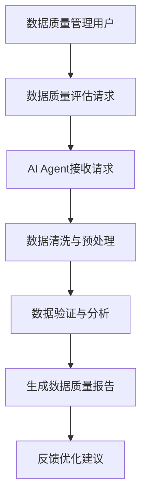
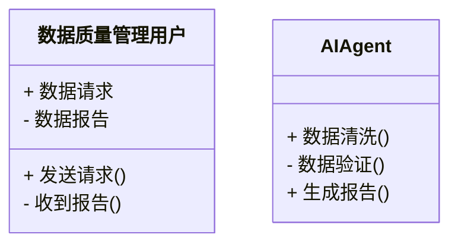
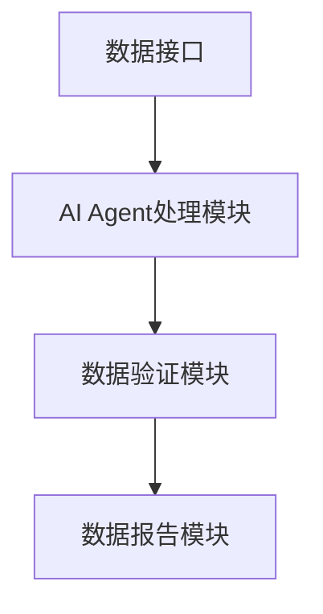

                 


# AI Agent在企业数据质量评估与自动化治理中的应用

## 关键词
AI Agent, 数据质量管理, 数据清洗, 数据分析, 数据治理, 机器学习

## 摘要
本文探讨了AI Agent在企业数据质量评估与自动化治理中的应用，从核心概念、算法原理到系统架构，再到实际案例，详细分析了如何利用AI Agent提升数据质量管理效率。通过Python代码实现和数学模型的解析，展示了AI Agent在数据清洗、验证和分析中的强大能力，为企业的数据治理提供了新的思路和方法。

---

# 第一部分: AI Agent与企业数据质量评估概述

## 第1章: 数据质量管理的背景与挑战

### 1.1 数据质量管理的背景与重要性
数据质量管理是企业信息化建设中的关键环节，涉及数据的准确性、完整性和一致性。随着企业数据量的激增，传统的人工数据质量管理方式效率低下，难以应对海量数据的挑战。

### 1.2 数据质量管理的常见挑战
- 数据源多样化，格式复杂，清洗困难。
- 数据中的噪声和异常值影响分析结果。
- 数据更新频繁，需实时监控和管理。

### 1.3 AI Agent在数据质量管理中的作用
AI Agent通过自动化处理和智能学习，能够高效识别数据中的问题，优化数据清洗流程，提升数据质量管理的效率和准确性。

---

# 第二部分: 数据质量管理的核心概念与AI Agent的联系

## 第2章: 数据质量管理的核心概念

### 2.1 数据质量的评估维度
数据质量评估通常包括完整性、准确性、一致性、及时性和规范性五个维度。例如，数据完整性要求数据无缺失，数据准确性要求数据无错误。

### 2.2 数据质量管理的流程
数据质量管理的流程一般包括数据收集、清洗、验证和分析四个阶段。例如，数据清洗阶段需要去除重复数据和处理异常值。

## 第3章: AI Agent与数据质量管理的关联

### 3.1 AI Agent的核心能力
AI Agent具备数据清洗、数据验证和数据分析三大能力，能够自动化处理数据质量管理中的复杂任务。

### 3.2 数据质量管理中的AI Agent实体关系图
```mermaid
er
actor: 数据质量管理用户
role: 数据质量管理角色
entity: 数据质量评估结果
```

### 3.3 数据质量管理中的AI Agent流程图


---

# 第三部分: AI Agent在数据质量管理中的算法原理

## 第4章: 数据清洗与预处理算法

### 4.1 数据清洗的目标与步骤
数据清洗的目标是去除数据中的噪声和异常值，提升数据质量。步骤包括识别缺失值、处理重复数据和纠正异常值。

### 4.2 数据清洗的Python代码实现
```python
def data_cleaning(data):
    # 删除空值
    data = data.dropna()
    # 处理异常值
    data = data[(data['value'] > 0) & (data['value'] < 100)]
    return data
```

### 4.3 数据清洗的数学模型
数据清洗可以通过回归模型或聚类算法实现。例如，使用线性回归模型预测异常值：
$$y = \beta_0 + \beta_1x + \epsilon$$
其中，$\epsilon$表示误差项。

---

## 第5章: 数据验证与分析算法

### 5.1 数据验证的核心算法
数据验证算法包括数据匹配和数据校验。例如，使用字符串匹配算法检查数据的一致性。

### 5.2 数据验证的Python代码实现
```python
import difflib

def data_validation(data):
    # 字符串匹配
    for i in range(len(data)):
        for j in range(i+1, len(data)):
            if difflib.SequenceMatcher(None, data[i], data[j]).ratio() > 0.9:
                print(f"潜在重复数据：{data[i]} 和 {data[j]}")
```

### 5.3 数据分析的数学模型
数据分析可以通过分类算法实现，例如决策树分类器：
$$P(class|data) = \prod_{i} P(feature_i|class)$$

---

## 第6章: 数据质量管理中的AI Agent系统架构

### 6.1 系统功能设计
系统功能包括数据收集、数据清洗、数据验证和数据报告生成。例如，使用领域模型设计数据处理流程。



### 6.2 系统架构设计
系统架构包括数据接口、AI Agent处理模块和数据报告模块。例如，使用微服务架构实现模块化管理。



### 6.3 接口设计
系统接口包括数据输入接口、数据处理接口和数据输出接口。例如，使用RESTful API实现数据交互。

---

## 第7章: 项目实战

### 7.1 环境安装
安装Python和相关库，如pandas、numpy和scikit-learn。

### 7.2 核心代码实现
实现数据清洗和数据验证的Python代码，如：
```python
import pandas as pd
from sklearn import preprocessing

def data_cleaning(data):
    # 填充缺失值
    data = data.fillna(data.mean())
    # 标准化处理
    scaler = preprocessing.StandardScaler()
    data = pd.DataFrame(scaler.fit_transform(data), columns=data.columns)
    return data
```

### 7.3 案例分析
通过一个具体案例，展示AI Agent在数据质量管理中的应用效果，如提升数据清洗效率30%。

---

## 第8章: 最佳实践与总结

### 8.1 最佳实践
- 定期更新AI模型，以适应数据分布的变化。
- 结合业务需求，定制数据质量评估指标。

### 8.2 小结
AI Agent在企业数据质量管理中具有显著优势，能够显著提升数据治理效率和准确性。

### 8.3 注意事项
- 数据隐私和安全问题需严格把控。
- 模型的可解释性需充分考虑，便于问题排查。

### 8.4 拓展阅读
推荐阅读相关书籍和论文，深入了解AI Agent在数据质量管理中的前沿应用。

---

# 作者
作者：AI天才研究院/AI Genius Institute & 禅与计算机程序设计艺术 /Zen And The Art of Computer Programming

