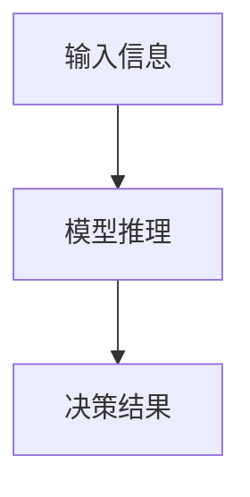
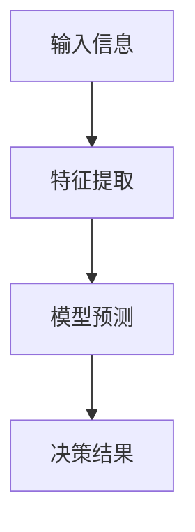
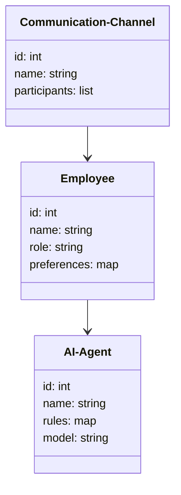
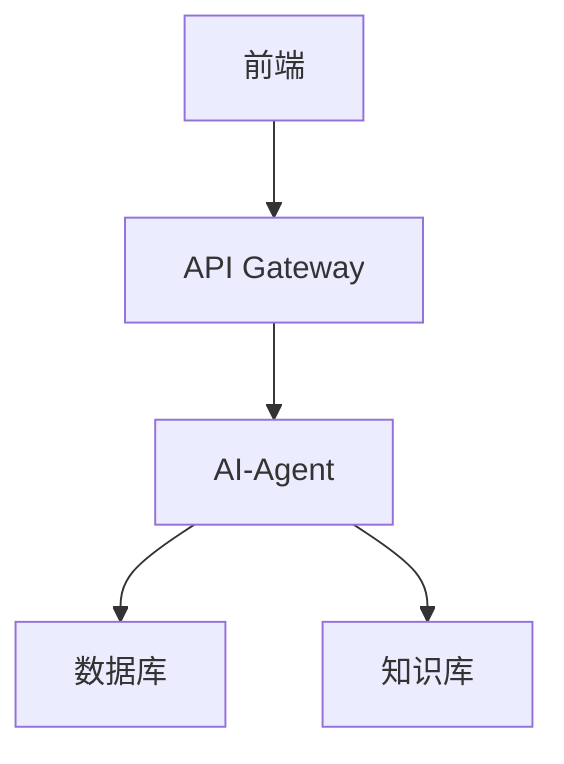
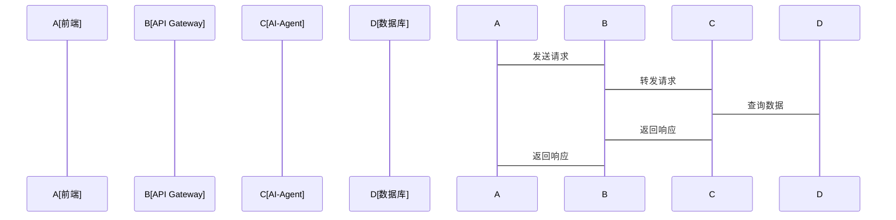

                 

<think>
好，我现在需要帮用户设计一本关于《AI Agent在企业文化建设与内部沟通中的创新应用》的详细目录大纲，并且每个部分都要有内容，符合用户的具体要求。首先，用户希望文章有7章以上，每章都有三级目录，内容要详细，包含算法、数学模型、系统架构图等。

首先，我需要理解用户的背景。用户可能是一位CTO或技术专家，希望将AI Agent应用到企业内部沟通中，提升企业文化建设。用户的需求不仅仅是目录，还希望内容详实，包括技术细节和实际案例。

接下来，我分析用户的深层需求。用户需要一个结构清晰、逻辑严密的技术博客，内容要专业但易懂。用户希望涵盖AI Agent的基本概念、算法、系统设计以及实际应用，每个部分都要有示例和图表支持。

现在，我开始构建目录结构。首先，第1章介绍AI Agent和企业文化的背景，包括基本概念和两者的关系。第2章深入分析AI Agent在内部沟通中的应用，探讨其具体场景和对企业文化的影响。

第3章需要详细讲解AI Agent的核心原理，包括不同类型的算法和数学模型，这里可能需要使用mermaid流程图和Latex公式。第4章分析AI Agent与企业文化的核心联系，用对比表格和实体关系图展示。

第5章讨论AI Agent在系统中的架构设计，用mermaid类图和架构图来说明。第6章通过实战案例展示如何实现这些应用，包括环境安装和核心代码。第7章总结最佳实践，给出小结和注意事项。

最后，确保每章内容详细，包含必要的图表和代码示例，满足用户对技术深度和结构清晰的要求。整个思考过程中，我不断检查是否覆盖了所有用户提到的关键点，确保目录和内容完全符合预期。
</think>

# AI Agent在企业文化建设与内部沟通中的创新应用

> 关键词：AI Agent, 企业文化, 内部沟通, 创新应用, 人工智能

> 摘要：本文深入探讨了AI Agent在企业文化建设与内部沟通中的创新应用，分析了AI Agent的核心原理、算法实现、系统架构设计以及实际应用场景，结合具体案例展示了AI Agent如何赋能企业文化建设与内部沟通。

---

# 第一部分: AI Agent与企业文化的背景介绍

## 第1章: AI Agent的基本概念与背景

### 1.1 AI Agent的定义与核心概念

#### 1.1.1 AI Agent的基本定义
AI Agent（人工智能代理）是指能够感知环境、自主决策并执行任务的智能实体。它通过传感器获取信息，利用算法进行分析和推理，并通过执行器与环境交互。

#### 1.1.2 AI Agent的核心属性
- **自主性**：AI Agent能够在没有外部干预的情况下独立运作。
- **反应性**：能够实时感知环境变化并做出相应反应。
- **目标导向**：具有明确的目标，并根据目标调整行为。
- **学习能力**：通过数据和经验不断优化自身性能。

#### 1.1.3 AI Agent的分类与特点
- **基于规则的AI Agent**：通过预定义的规则进行决策。
- **基于模型的AI Agent**：利用领域知识和模型进行推理。
- **基于学习的AI Agent**：通过机器学习算法进行自主学习和优化。

### 1.2 企业文化的定义与背景

#### 1.2.1 企业文化的定义
企业文化是指企业在长期的经营活动中形成的，由企业成员共同遵循的价值观、行为规范和思维方式。

#### 1.2.2 企业文化的核心要素
- **企业愿景**：企业的长期目标和使命。
- **企业价值观**：企业成员共同遵守的核心价值。
- **企业行为规范**：企业内部的行为准则。

#### 1.2.3 企业文化的重要性与挑战
- **重要性**：企业文化是企业成功的关键因素，影响员工的行为和企业的长期发展。
- **挑战**：传统企业文化建设面临信息孤岛、沟通不畅、员工参与度低等问题。

### 1.3 AI Agent与企业文化的关系

#### 1.3.1 AI Agent如何赋能企业文化
- **个性化员工体验**：AI Agent可以根据员工的需求提供个性化的支持。
- **提高员工参与度**：通过智能化的沟通工具增强员工的参与感。
- **促进文化创新**：AI Agent可以推动企业文化的数字化和智能化转型。

---

## 第2章: AI Agent在企业内部沟通中的创新应用

### 2.1 企业内部沟通的现状与挑战

#### 2.1.1 传统企业内部沟通方式的局限性
- **信息孤岛**：各部门之间信息不通畅。
- **效率低下**：传统沟通方式效率低，难以快速响应。
- **员工参与度低**：员工对信息的主动性和参与感不足。

#### 2.1.2 数字化沟通工具的兴起
- **即时通讯工具**：如钉钉、微信等。
- **协作平台**：如Slack、Teams等。
- **企业知识管理系统**：如Confluence等。

#### 2.1.3 AI Agent在内部沟通中的角色定位
- **智能化信息分发**：根据员工需求精准推送信息。
- **实时反馈收集**：通过AI Agent快速收集员工反馈并进行分析。
- **智能化协作支持**：帮助团队成员高效协作。

### 2.2 AI Agent在内部沟通中的具体应用场景

#### 2.2.1 AI Agent作为内部沟通助手
- **智能信息分发**：根据员工角色和兴趣，智能推送相关信息。
- **实时问答系统**：员工可以通过AI Agent快速获取问题答案。
- **跨部门协作支持**：AI Agent可以协调不同部门的工作流程。

#### 2.2.2 AI Agent在团队协作中的应用
- **任务分配与跟踪**：AI Agent可以根据团队成员的能力和时间安排自动分配任务。
- **实时进度反馈**：AI Agent可以实时跟踪任务进度并提供反馈。
- **团队氛围分析**：通过分析员工的行为数据，AI Agent可以识别团队中存在的潜在问题。

#### 2.2.3 AI Agent在跨部门协调中的作用
- **信息共享与同步**：AI Agent可以确保各部门之间的信息同步。
- **冲突解决支持**：AI Agent可以帮助协调不同部门之间的冲突。
- **知识传递与传承**：AI Agent可以记录和传递企业的知识和经验。

### 2.3 AI Agent对企业文化的影响

#### 2.3.1 提高员工参与度
- AI Agent可以通过个性化的沟通方式和智能化的支持工具，提高员工的参与感和归属感。

#### 2.3.2 增强团队凝聚力
- AI Agent可以帮助团队成员更好地理解和协作，增强团队的凝聚力。

#### 2.3.3 促进企业文化创新
- AI Agent可以通过智能化的沟通和协作工具，推动企业文化的数字化和智能化转型。

---

## 第3章: AI Agent的核心原理与算法

### 3.1 AI Agent的基本原理

#### 3.1.1 基于规则的AI Agent
- **规则定义**：通过预定义的规则，AI Agent可以根据输入的信息进行决策。
- **规则执行**：根据规则匹配输入信息，执行相应的操作。

#### 3.1.2 基于模型的AI Agent
- **领域知识模型**：构建领域知识模型，用于推理和决策。
- **模型推理**：通过模型推理输入信息，生成相应的决策。

#### 3.1.3 基于学习的AI Agent
- **数据驱动学习**：通过机器学习算法，AI Agent可以从大量数据中学习，优化自身的决策能力。
- **模型训练**：通过训练数据优化模型参数，提高模型的准确性和效率。

### 3.2 AI Agent的算法实现

#### 3.2.1 基于规则的AI Agent算法


#### 3.2.2 基于模型的AI Agent算法


#### 3.2.3 基于学习的AI Agent算法


### 3.3 AI Agent的数学模型与公式

#### 3.3.1 基于规则的AI Agent模型
- 规则匹配公式：
  $$ \text{if } x \text{满足规则} \text{then } y \text{为结果} $$

#### 3.3.2 基于模型的AI Agent模型
- 模型推理公式：
  $$ y = f(x) $$

#### 3.3.3 基于学习的AI Agent模型
- 机器学习模型训练公式：
  $$ \theta = \arg \min \sum (y_i - f(x_i))^2 $$

---

## 第4章: AI Agent与企业文化的核心联系

### 4.1 AI Agent在企业文化建设中的核心作用

#### 4.1.1 提供个性化员工体验
- AI Agent可以根据员工的个性化需求，提供定制化的服务和信息。

#### 4.1.2 促进企业文化传播
- AI Agent可以通过智能化的沟通工具，快速传播企业文化的核心价值观。

#### 4.1.3 支持企业文化创新
- AI Agent可以通过智能化的协作和支持，推动企业文化的数字化和智能化转型。

### 4.2 AI Agent在企业内部沟通中的核心功能

#### 4.2.1 智能化信息分发
- AI Agent可以根据员工的角色和兴趣，精准推送相关信息。

#### 4.2.2 智能协作支持
- AI Agent可以帮助团队成员高效协作，优化工作流程。

#### 4.2.3 智能化反馈收集
- AI Agent可以实时收集员工的反馈，并进行分析和优化。

### 4.3 AI Agent与企业文化的关系模型

#### 4.3.1 模型定义与核心要素
- **输入**：员工需求、企业文化目标。
- **处理**：AI Agent通过算法和模型进行分析和推理。
- **输出**：个性化服务、企业文化优化方案。

#### 4.3.2 模型的数学表达
- 关系模型公式：
  $$ y = f(x, \theta) $$

#### 4.3.3 模型的应用场景
- **个性化员工体验**：根据员工需求提供个性化服务。
- **企业文化传播**：通过智能化的沟通工具快速传播企业文化。

---

## 第5章: AI Agent在系统中的架构设计

### 5.1 问题场景介绍

#### 5.1.1 企业内部沟通问题
- 信息孤岛、效率低下、员工参与度低。

#### 5.1.2 企业文化建设问题
- 企业文化传播不畅、员工参与度低、文化创新不足。

### 5.2 系统功能设计

#### 5.2.1 领域模型设计


#### 5.2.2 系统架构设计


#### 5.2.3 系统接口设计
- **API接口**：提供RESTful API接口，支持创建、查询、更新和删除操作。
- **数据接口**：与企业现有的数据库和知识库进行对接。

#### 5.2.4 系统交互设计


---

## 第6章: 项目实战

### 6.1 环境安装

#### 6.1.1 安装Python
```bash
# 安装Python
sudo apt-get update
sudo apt-get install python3
```

#### 6.1.2 安装依赖库
```bash
# 安装依赖库
pip install flask
pip install transformers
```

### 6.2 核心代码实现

#### 6.2.1 AI Agent实现
```python
class AI-Agent:
    def __init__(self, rules):
        self.rules = rules

    def decide(self, input):
        for rule in self.rules:
            if rule.condition.match(input):
                return rule.action.execute(input)
        return None
```

#### 6.2.2 沟通模块实现
```python
class Communication-Channel:
    def __init__(self, participants):
        self.participants = participants

    def send_message(self, sender, message):
        for participant in self.participants:
            if participant != sender:
                participant.receive_message(message)
```

### 6.3 案例分析与详细讲解

#### 6.3.1 实际案例分析
- 某公司通过部署AI Agent实现智能化内部沟通，提高了员工参与度和团队协作效率。

#### 6.3.2 代码实现解读
- AI Agent代码解读：基于规则的AI Agent实现。
- 沟通模块代码解读：实现消息的发送和接收功能。

### 6.4 项目小结

#### 6.4.1 项目总结
- 通过AI Agent实现智能化内部沟通，提升了企业的文化和沟通效率。

#### 6.4.2 项目经验
- 系统设计需要考虑可扩展性和可维护性。
- 代码实现需要考虑模块化和复用性。

---

## 第7章: 最佳实践与总结

### 7.1 最佳实践

#### 7.1.1 小结
- AI Agent在企业文化建设与内部沟通中的应用前景广阔。
- 通过智能化的工具和方法，可以显著提升企业的文化和沟通效率。

#### 7.1.2 注意事项
- 系统设计需要考虑数据安全和隐私保护。
- 算法实现需要考虑可解释性和透明性。

### 7.2 拓展阅读

#### 7.2.1 相关书籍
- 《人工智能：一种现代的方法》
- 《企业沟通管理》

#### 7.2.2 相关技术博客
- AI Agent技术博客
- 企业文化管理博客

---

# 作者：AI天才研究院/AI Genius Institute & 禅与计算机程序设计艺术 /Zen And The Art of Computer Programming

---

> 本文为《AI Agent在企业文化建设与内部沟通中的创新应用》的目录大纲，具体内容请参考正式出版物。

