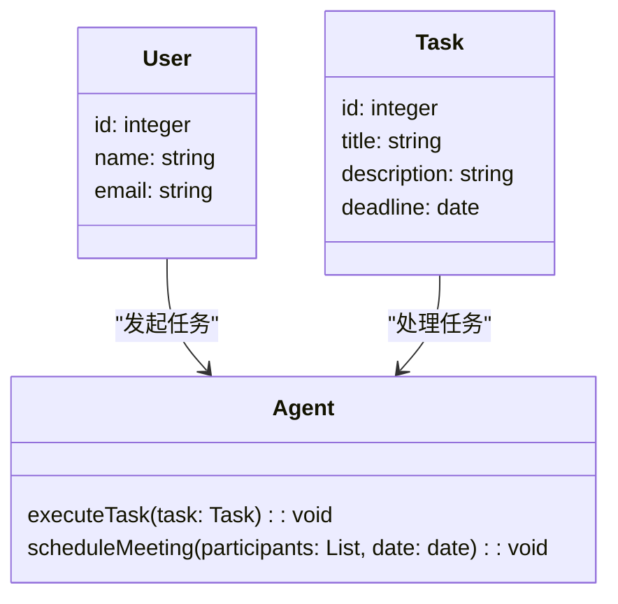
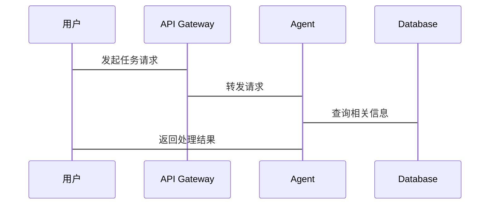

                 

<think>
好的，我将按照您的要求撰写一篇关于《AI Agent在企业智能办公中的全面应用》的技术博客文章。我会先列出文章的目录结构，再逐步填充每个部分的内容。

# AI Agent在企业智能办公中的全面应用

## 关键词：
AI Agent，企业智能办公，人工智能，自动化办公，办公效率，智能化管理

## 摘要：
随着人工智能技术的快速发展，AI Agent（人工智能代理）在企业智能办公中的应用越来越广泛。本文将从AI Agent的基本概念、核心算法、系统架构、项目实战等方面进行详细探讨，分析其在企业智能办公中的应用场景、优势和挑战。通过本文的阅读，读者可以全面了解AI Agent在企业智能办公中的工作原理和实际应用，为企业的数字化转型提供有价值的参考。

---

## 第一部分: AI Agent在企业智能办公中的背景与核心概念

### 第1章: AI Agent的基本概念与背景

#### 1.1 AI Agent的定义与特点
##### 1.1.1 AI Agent的基本定义
人工智能代理（AI Agent）是一种能够感知环境、自主决策并执行任务的智能系统。它能够通过与用户或系统的交互，完成特定的任务，如信息检索、日程管理、邮件处理等。

##### 1.1.2 AI Agent的核心特点
- **自主性**：AI Agent能够自主决策，无需人工干预。
- **反应性**：能够实时感知环境变化并做出响应。
- **目标导向**：具备明确的目标，能够为用户解决问题。
- **学习能力**：通过机器学习算法不断优化自身性能。

##### 1.1.3 AI Agent与传统办公自动化工具的区别
传统办公自动化工具（如Excel、Word）主要依赖人工操作，而AI Agent能够主动执行任务、学习和优化，具备更高的智能化和自动化能力。

#### 1.2 企业智能办公的背景与挑战
##### 1.2.1 传统办公模式的局限性
传统办公模式效率低下、资源浪费严重，且难以应对复杂多变的业务需求。

##### 1.2.2 数字化转型对企业办公的需求
企业需要通过数字化转型提高办公效率、降低成本、增强竞争力。

##### 1.2.3 AI技术在企业办公中的应用前景
AI Agent技术的应用将推动企业办公向智能化、自动化方向发展。

#### 1.3 AI Agent在企业办公中的优势
##### 1.3.1 提高办公效率
AI Agent能够快速处理大量信息，帮助员工节省时间。

##### 1.3.2 降低人工成本
通过自动化任务，减少对人工的依赖，降低企业运营成本。

##### 1.3.3 增强决策能力
AI Agent能够基于数据分析提供决策支持，帮助企业做出更明智的选择。

### 第2章: AI Agent的核心概念与工作原理

#### 2.1 AI Agent的组成与结构
##### 2.1.1 感知模块
感知模块负责接收输入数据，包括自然语言文本、语音、图像等，并将其转化为结构化的信息。

##### 2.1.2 决策模块
决策模块基于感知模块获取的信息，结合预设的规则和机器学习模型，生成决策方案。

##### 2.1.3 执行模块
执行模块负责将决策模块生成的方案转化为具体的操作，如发送邮件、安排日程等。

#### 2.2 AI Agent的工作流程
##### 2.2.1 感知阶段
AI Agent通过传感器或API接口获取环境中的数据，例如用户的输入文本或系统日志。

##### 2.2.2 决策阶段
AI Agent根据感知到的信息，结合历史数据和上下文，生成最优的决策方案。

##### 2.2.3 执行阶段
AI Agent将决策方案转化为具体的操作，例如向用户发送提醒或更新数据库。

#### 2.3 AI Agent的核心算法与技术
##### 2.3.1 自然语言处理（NLP）
自然语言处理技术用于理解和生成人类语言，使AI Agent能够理解用户的输入并生成自然的回复。

##### 2.3.2 机器学习（ML）
机器学习技术用于训练AI Agent，使其能够从数据中学习并优化决策能力。

##### 2.3.3 强化学习（RL）
强化学习技术用于提升AI Agent的自主决策能力，使其能够在复杂环境中做出最优选择。

---

## 第二部分: AI Agent的算法原理与数学模型

### 第3章: AI Agent的感知模块原理

#### 3.1 感知模块的输入与输出
##### 3.1.1 输入数据的类型与格式
- 文本数据：如用户的输入文本。
- 语音数据：如用户的语音指令。
- 图像数据：如用户的上传图片。

##### 3.1.2 输出数据的结构
- 结构化数据：如JSON格式的用户需求解析结果。

#### 3.2 感知模块的核心算法
##### 3.2.1 基于词袋模型的文本处理
词袋模型将文本表示为单词的集合，用于提取文本的关键信息。

##### 3.2.2 基于TF-IDF的关键词提取
TF-IDF（Term Frequency-Inverse Document Frequency）用于衡量关键词的重要性，从而实现关键词提取。

##### 3.2.3 基于BERT的文本表示
使用预训练的BERT模型进行文本表示，提升文本理解的准确性。

#### 3.3 感知模块的数学模型
##### 3.3.1 词袋模型的公式
$$ \text{词袋模型} = \{w_1: count_1, w_2: count_2, \ldots, w_n: count_n\} $$

##### 3.3.2 TF-IDF的计算公式
$$ \text{TF-IDF}(w, d) = \text{TF}(w, d) \times \text{IDF}(w, D) $$

其中，TF表示单词在文档中的频率，IDF表示单词在文档集合中的倒置频率。

---

### 第4章: AI Agent的决策模块原理

#### 4.1 决策模块的输入与输出
##### 4.1.1 输入数据
- 解析后的结构化数据
- 上下文信息

##### 4.1.2 输出数据
- 决策方案
- 执行指令

#### 4.2 决策模块的核心算法
##### 4.2.1 基于规则的决策
根据预设的规则生成决策方案，适用于任务明确且规则简单的场景。

##### 4.2.2 基于机器学习的决策
使用分类、回归等机器学习算法进行决策，适用于复杂场景。

##### 4.2.3 基于强化学习的决策
通过强化学习算法优化决策策略，提升决策的准确性。

#### 4.3 决策模块的数学模型
##### 4.3.1 分类算法的公式
$$ P(y|x) = \frac{P(x|y)P(y)}{P(x)} $$

其中，P(y|x)是后验概率，P(x|y)是似然概率，P(y)是先验概率，P(x)是证据概率。

---

## 第三部分: AI Agent的系统架构与设计

### 第5章: 系统分析与架构设计

#### 5.1 问题场景介绍
企业智能办公系统需要处理大量的任务，包括信息检索、日程管理、邮件处理等。

#### 5.2 系统功能设计
##### 5.2.1 领域模型设计
使用Mermaid类图展示系统中的主要实体及其关系。



##### 5.2.2 系统架构设计
使用Mermaid架构图展示系统的整体架构。

```mermaid
archi
    title AI Agent系统架构
    User
    Database
    Agent
    API Gateway
    Client
    Server
    User --> API Gateway
    API Gateway --> Agent
    Agent --> Database
    Agent --> Server
    Client --> API Gateway
```

##### 5.2.3 接口设计
定义系统的主要接口，如RESTful API。

##### 5.2.4 交互流程
使用Mermaid序列图展示系统交互流程。



---

### 第6章: 项目实战

#### 6.1 环境安装
##### 6.1.1 安装Python
安装Python 3.8及以上版本。

##### 6.1.2 安装必要的库
使用pip安装以下库：
```
pip install numpy
pip install scikit-learn
pip install transformers
pip install mermaid
```

#### 6.2 系统核心实现
##### 6.2.1 感知模块实现
实现文本处理和关键词提取功能。

```python
from sklearn.feature_extraction.text import TfidfVectorizer

text = "我们需要在周五开会"
vectorizer = TfidfVectorizer()
tfidf = vectorizer.fit_transform([text])
print(tfidf)
```

##### 6.2.2 决策模块实现
实现基于规则的决策功能。

```python
def scheduleMeeting(participants, date):
    print(f"已安排会议，参与者：{participants}，日期：{date}")

scheduleMeeting(["Alice", "Bob"], "2023-10-13")
```

#### 6.3 代码解读与分析
解释代码的功能和实现细节。

#### 6.4 实际案例分析
分析一个具体的案例，如会议安排。

#### 6.5 项目小结
总结项目的实现过程和收获。

---

## 第四部分: 最佳实践与总结

### 第7章: 最佳实践与总结

#### 7.1 最佳实践
##### 7.1.1 系统设计建议
建议在设计系统时注重模块化和可扩展性。

##### 7.1.2 开发注意事项
注意数据安全和隐私保护。

##### 7.1.3 测试与优化
定期进行系统测试和性能优化。

#### 7.2 小结
总结全文的主要内容，强调AI Agent在企业智能办公中的重要性。

#### 7.3 注意事项
提醒读者在实际应用中注意AI Agent的局限性和挑战。

#### 7.4 拓展阅读
推荐相关的书籍和资源，供读者进一步学习。

---

## 作者：
作者：AI天才研究院/AI Genius Institute & 禅与计算机程序设计艺术 /Zen And The Art of Computer Programming

---

希望这篇博客文章能够为您提供有价值的信息！如果需要进一步修改或补充，请随时告诉我。

