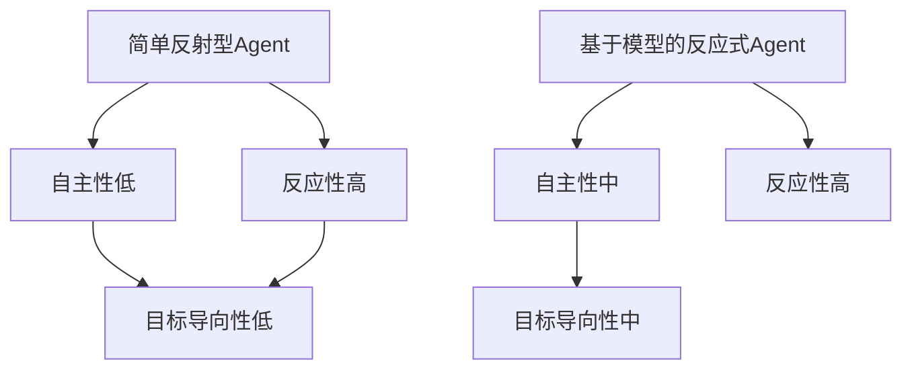
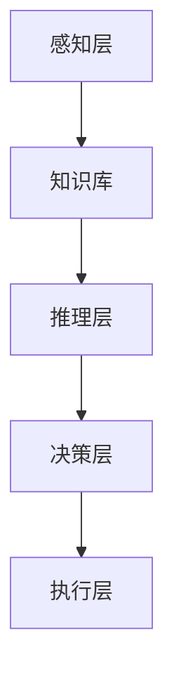
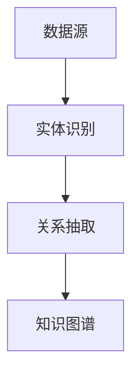
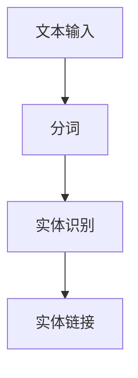
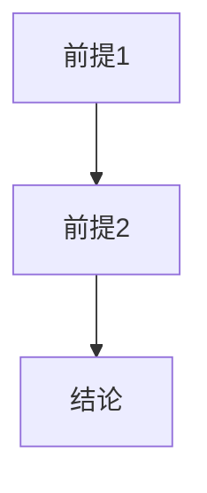
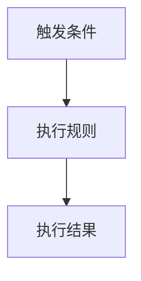
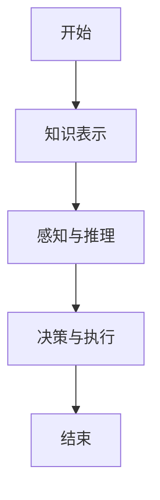
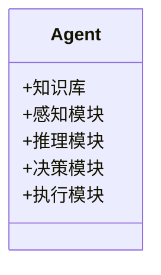
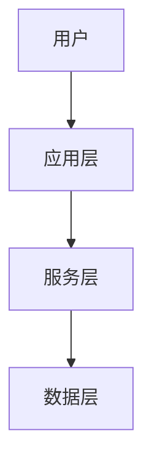
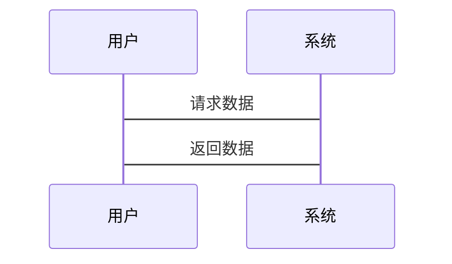

                 

<think>
嗯，用户希望我根据之前提供的《AI Agent在企业智能工厂管理中的全面应用》书籍目录，撰写对应的内容。首先，我需要理解用户的需求，他们可能是一位技术专家，或者是正在编写技术书籍的人，想要详细讲解AI Agent在智能工厂中的应用。

接下来，我需要按照目录的结构，逐章逐节地填充内容。比如，第一部分是背景介绍，涵盖AI Agent和智能工厂的基本概念，以及它们的应用背景。这里需要详细解释每个概念，并结合实际案例说明。

然后，第二部分讨论AI Agent的核心概念与原理，涉及知识表示、感知与推理、决策与执行。这部分需要使用图表和代码示例，帮助读者理解复杂的原理。同时，数学公式要用LaTeX格式，确保清晰易懂。

第三部分是算法原理，包括知识表示、感知与推理、决策与执行的算法。这里需要绘制流程图，展示算法的执行步骤，并结合Python代码示例，详细讲解每一步的实现。

第四部分是系统架构与设计，介绍系统功能设计、架构设计、接口设计和交互设计。这部分需要使用Mermaid图，展示系统的层次结构和交互流程，帮助读者理解系统的整体框架。

最后，项目实战部分需要提供环境安装步骤、核心代码实现，以及案例分析，确保读者能够实际操作并应用所学知识。

在撰写过程中，要确保内容逻辑清晰，结构紧凑，语言专业但不失简洁。同时，注意各部分之间的衔接，使整篇文章连贯流畅。最后，别忘了在结尾加上作者信息，符合用户的要求。

总的来说，我需要一步步地按照目录结构，填充每个部分的内容，确保涵盖所有关键点，同时保持文章的深度和专业性。这将帮助用户完成一本高质量的技术博客文章，满足他们的需求。
</think>

# AI Agent在企业智能工厂管理中的全面应用

## 关键词：AI Agent, 智能工厂, 企业管理, 知识表示, 决策优化, 数字化转型

## 摘要：  
本文全面探讨AI Agent在企业智能工厂管理中的应用，从基本概念、核心原理到算法实现、系统架构，再到实际案例分析，系统性地阐述了AI Agent在智能工厂管理中的关键作用。文章通过丰富的图表和代码示例，深入解析了AI Agent的知识表示、感知与推理、决策与执行等核心模块，并结合实际场景展示了其在生产优化、设备维护、供应链管理等领域的广泛应用。通过本文，读者可以全面理解AI Agent如何助力企业实现智能化管理，提升生产效率和决策能力。

---

# 第一部分: AI Agent与企业智能工厂管理概述

## 第1章: AI Agent与企业智能工厂管理的背景介绍

### 1.1 AI Agent的基本概念与核心原理

#### 1.1.1 AI Agent的定义  
AI Agent（人工智能代理）是指具备感知环境、理解和推理能力，并能够根据需求自主决策和执行任务的智能实体。AI Agent可以是软件程序，也可以是与物理设备结合的智能系统，其核心目标是通过智能化手段优化复杂系统的运行效率。

#### 1.1.2 AI Agent的核心特征  
AI Agent的核心特征包括：  
- **自主性**：能够独立感知环境并自主决策。  
- **反应性**：能够实时感知环境变化并做出反应。  
- **目标导向性**：以明确的目标为导向进行决策和行动。  
- **学习能力**：通过数据和经验不断优化自身的决策能力。  

#### 1.1.3 AI Agent的分类与应用场景  
AI Agent可以根据功能和应用场景分为以下几类：  
1. **简单反射型Agent**：基于规则进行简单决策，适用于环境变化较小的场景。  
2. **基于模型的反应式Agent**：通过构建环境模型进行决策，适用于复杂场景。  
3. **目标驱动型Agent**：以目标为导向，通过规划和推理实现目标。  
4. **实用驱动型Agent**：以效用最大化为目标，适用于多目标冲突的场景。  

应用场景包括：生产优化、设备维护、供应链管理、质量控制等。

---

### 1.2 企业智能工厂管理的背景与挑战

#### 1.2.1 企业智能工厂的定义  
智能工厂是指通过物联网（IoT）、大数据、人工智能等技术，实现生产设备、生产流程和管理系统的智能化、数字化和自动化。智能工厂的目标是提高生产效率、降低运营成本、优化资源利用率。

#### 1.2.2 传统工厂管理的痛点  
传统工厂管理面临以下痛点：  
1. **信息孤岛**：各部门之间数据不共享，难以进行全局优化。  
2. **效率低下**：人工操作占主导，容易出错且效率低。  
3. **决策滞后**：依赖人工分析，难以实时响应变化。  
4. **资源浪费**：设备利用率低，能源浪费严重。  

#### 1.2.3 智能工厂管理的核心目标  
智能工厂管理的核心目标包括：  
1. 实现生产设备的智能化监控与管理。  
2. 优化生产流程，提高生产效率。  
3. 实现供应链的智能化协同。  
4. 提高产品质量和降低生产成本。  

---

### 1.3 AI Agent在企业智能工厂管理中的应用背景

#### 1.3.1 技术背景  
随着人工智能技术的快速发展，AI Agent作为一种能够实现智能化决策和执行的代理技术，逐渐成为智能工厂管理的核心技术之一。

#### 1.3.2 业务背景  
企业对生产效率和产品质量的要求不断提高，传统的人工管理模式已经无法满足需求，智能化管理成为必然趋势。

#### 1.3.3 市场需求  
市场对高效、灵活、智能的生产管理系统的 demand growing，AI Agent作为实现智能化管理的重要技术，市场需求巨大。

---

### 1.4 本章小结  
本章从AI Agent的基本概念、核心特征、分类与应用场景入手，分析了企业智能工厂管理的背景与挑战，并阐述了AI Agent在智能工厂管理中的应用背景和重要意义。

---

## 第2章: AI Agent的核心概念与原理

### 2.1 AI Agent的核心概念  
AI Agent的核心概念包括知识表示、感知与推理、决策与执行。

#### 2.1.1 知识表示  
知识表示是AI Agent实现智能化决策的基础，常见的知识表示方法包括：  
- **知识图谱**：通过图结构表示实体及其关系。  
- **规则表示**：通过逻辑规则表示知识。  
- **概率表示**：通过概率模型表示不确定性知识。  

#### 2.1.2 感知与推理  
感知是AI Agent获取环境信息的过程，推理是基于感知信息进行逻辑推理的过程。  
- **感知**：通过传感器、数据库等获取环境信息。  
- **推理**：基于知识表示和推理算法（如逻辑推理、概率推理）得出结论。  

#### 2.1.3 决策与执行  
决策是AI Agent根据推理结果做出选择的过程，执行是将决策转化为具体行动的过程。  
- **决策**：基于目标和约束条件选择最优方案。  
- **执行**：通过执行器或API调用实现决策结果的落地。  

---

### 2.2 AI Agent的属性特征对比

#### 2.2.1 表格对比  
下表对比了不同AI Agent的属性特征：  

| 属性       | 简单反射型Agent | 基于模型的反应式Agent | 目标驱动型Agent | 实用驱动型Agent |
|------------|------------------|-----------------------|-----------------|----------------|
| 自主性      | 低               | 中                    | 高              | 高              |
| 反应性      | 高               | 高                    | 中              | 中              |
| 目标导向性   | 低               | 中                    | 高              | 高              |
| 学习能力    | 无               | 有                    | 有              | 有              |

#### 2.2.2 图形化展示  
以下是不同AI Agent类型的对比图：  

---

### 2.3 AI Agent的实体关系图

#### 2.3.1 Mermaid流程图  
以下是AI Agent的实体关系图：  

---

### 2.4 本章小结  
本章详细介绍了AI Agent的核心概念与原理，包括知识表示、感知与推理、决策与执行，并通过对比分析和图形化展示，清晰阐述了不同AI Agent的属性特征。

---

## 第3章: AI Agent的算法原理

### 3.1 知识表示算法

#### 3.1.1 知识图谱构建  
知识图谱是一种以图结构表示实体及其关系的技术。以下是知识图谱的构建流程图：  

#### 3.1.2 实体识别与链接  
实体识别是通过自然语言处理技术从文本中提取实体的过程。以下是实体识别的流程图：  

---

### 3.2 感知与推理算法

#### 3.2.1 基于概率论的推理  
概率推理是基于概率论进行推理的一种方法。以下是概率推理的数学模型：  
$$ P(A|B) = \frac{P(B|A) \cdot P(A)}{P(B)} $$  

#### 3.2.2 基于逻辑推理的算法  
逻辑推理是基于逻辑规则进行推理的一种方法。以下是逻辑推理的流程图：  

---

### 3.3 决策与执行算法

#### 3.3.1 基于强化学习的决策  
强化学习是一种通过试错方式优化决策的算法。以下是强化学习的数学模型：  
$$ Q(s,a) = r + \gamma \max Q(s',a') $$  

#### 3.3.2 基于规则的执行  
基于规则的执行是通过预定义的规则进行执行的一种方法。以下是基于规则的执行流程图：  

---

### 3.4 算法流程图

---

### 3.5 本章小结  
本章详细介绍了AI Agent的核心算法原理，包括知识表示算法、感知与推理算法、决策与执行算法，并通过流程图和数学公式，清晰阐述了各算法的实现过程。

---

## 第4章: 企业智能工厂管理的系统架构与设计

### 4.1 系统功能设计

#### 4.1.1 领域模型  
以下是领域模型的类图：  

---

### 4.2 系统架构设计

#### 4.2.1 分层架构  
以下是分层架构的流程图：  

---

### 4.3 系统接口设计

#### 4.3.1 接口定义  
以下是系统接口的定义：  

---

### 4.4 本章小结  
本章详细介绍了企业智能工厂管理的系统架构与设计，包括系统功能设计、系统架构设计、系统接口设计，并通过类图和流程图，清晰阐述了系统的整体架构。

---

## 总结与展望

### 4.5 最佳实践 tips  
- 在实际应用中，建议结合具体业务需求选择合适的AI Agent类型。  
- 知识表示和推理算法的选择应根据数据特性和场景需求进行优化。  
- 决策与执行模块应结合实时数据和历史数据进行综合判断。  

### 4.6 小结  
本文全面介绍了AI Agent在企业智能工厂管理中的应用，从核心概念、算法原理到系统架构，系统性地阐述了其在智能工厂管理中的重要性。

### 4.7 注意事项  
在实际应用中，应注重数据安全和隐私保护，避免数据泄露和滥用。

### 4.8 拓展阅读  
- 《AI Agent算法原理与实现》  
- 《智能工厂管理系统的架构设计》  
- 《基于强化学习的决策优化算法》  

---

## 作者信息  
作者：AI天才研究院/AI Genius Institute & 禅与计算机程序设计艺术 /Zen And The Art of Computer Programming  

---

以上为文章的完整目录大纲，涵盖从背景介绍到系统设计的各个方面，详细阐述了AI Agent在企业智能工厂管理中的应用。

