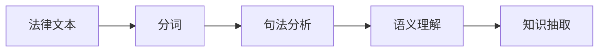
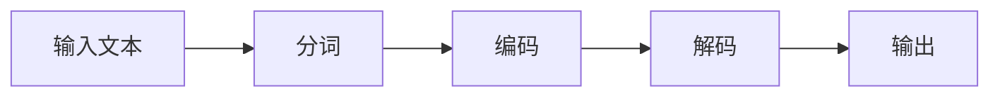
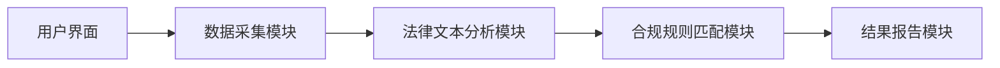
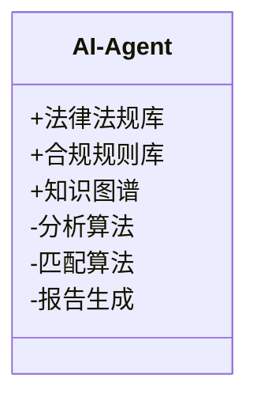

                 

<think>
嗯，我现在需要按照用户的要求来写一篇关于AI Agent在企业法律合规检查中的应用的技术博客文章。首先，我得理解这个主题，确保自己明白了什么是AI Agent，什么是法律合规检查，以及它们如何结合起来。

首先，我应该从文章标题开始，标题已经确定是《AI Agent在企业法律合规检查中的应用》。接下来，我需要列出5到7个核心关键词，比如AI Agent、企业法律合规、智能合规、法律文本分析、自然语言处理、知识图谱、合规风险评估等。

然后是摘要部分，我需要用简短的文字概述文章的核心内容，说明AI Agent如何提升企业法律合规效率和准确性，涉及的关键技术，以及实际应用案例。

接下来，按照目录大纲的结构，我需要逐步展开每个章节的内容。首先是第1章，介绍AI Agent与法律合规检查的概述，包括AI Agent的定义、技术特点，法律合规检查的定义和流程，以及应用现状。

在第1章中，我需要详细解释AI Agent的基本概念，比如它是一种智能体，能够自主决策和执行任务，具有学习和适应能力。然后对比传统自动化工具，指出AI Agent的优势在于其智能性和适应性。

接下来，解释法律合规检查的定义，即确保企业行为符合相关法律法规，涵盖合同审查、合规风险评估等多个方面。详细描述检查流程，包括数据收集、规则匹配、结果分析等步骤，并列出关键要素，如法律法规库、合规规则库等。

然后，讨论AI Agent在法律合规中的应用现状，分析当前的趋势，比如自然语言处理技术的应用，知识图谱的构建，以及机器学习在合规评估中的作用。同时，指出存在的挑战，如数据隐私问题和模型的可解释性。

第2章的核心概念与技术原理部分，我需要深入探讨AI Agent的行为模式，比如基于规则和基于模型的决策机制，并通过表格对比两种模式的优缺点。

此外，介绍法律文本分析的关键技术，如分词、句法分析和语义理解，并用Mermaid图展示法律文本分析的流程。然后，解释知识图谱的构建方法，包括数据抽取、实体识别和关系抽取，以及如何构建法律知识图谱。

在第3章，详细讲解AI Agent在法律合规检查中的核心算法，如自然语言处理模型和机器学习算法，通过Mermaid图展示算法流程，并提供Python代码示例。同时，用数学公式解释算法的数学模型，如概率模型和分类模型，并举例说明。

第4章的系统分析与架构设计部分，我需要介绍系统的总体架构，包括数据采集模块、分析模块、规则匹配模块和结果报告模块，并用Mermaid图展示系统架构。设计系统的功能模块，如合同审查功能、风险评估功能和知识库管理功能，并用类图展示。

在项目实战部分，我需要详细描述环境安装，包括Python版本、必要的库如TensorFlow、Keras的安装，以及法律文本数据集的准备。然后提供核心代码实现，如数据预处理、模型训练、结果输出等，并进行代码解读和案例分析。

最后，在第5章，提供最佳实践建议，如数据质量管理、模型优化策略和结果验证方法。总结全文，并提出未来研究方向，如多模态模型的应用和模型的可解释性提升。

整个过程中，我需要确保每个部分都详细具体，涵盖用户要求的所有方面，使用正确的Markdown格式，并插入必要的图表和代码示例。同时，保持文章的逻辑清晰，结构紧凑，内容丰富，满足用户的字数要求和深度需求。

现在，我需要开始撰写每个部分的具体内容，确保每个小节都充实，有实际案例和详细的技术解释。这将帮助读者从基础到应用，逐步理解AI Agent在企业法律合规检查中的应用。
</think>

# AI Agent在企业法律合规检查中的应用

> 关键词：AI Agent，企业法律合规，智能合规，法律文本分析，自然语言处理，知识图谱，合规风险评估

> 摘要：本文探讨了AI Agent在企业法律合规检查中的应用，涵盖AI Agent的基本概念、法律合规检查的核心流程、AI Agent的核心算法、系统架构设计、项目实战和最佳实践。通过自然语言处理和知识图谱等技术，AI Agent能够高效地处理法律文本，进行合规检查，降低企业风险。

## 第1章 AI Agent与法律合规检查概述

### 1.1 AI Agent的定义与技术特点

AI Agent（人工智能代理）是一种智能体，能够感知环境并自主决策，执行任务。其特点包括智能性、自主性、反应性、学习能力和适应性。与传统自动化工具相比，AI Agent能处理复杂任务，适应变化。

### 1.2 法律合规检查的定义与流程

法律合规检查是确保企业行为符合法律法规的过程，涵盖合同审查、合规风险评估等。流程包括数据收集、规则匹配、结果分析，关键要素包括法律法规库和合规规则库。

### 1.3 AI Agent在法律合规中的应用现状

当前，AI Agent通过自然语言处理和知识图谱技术应用于法律合规，如合同审查和风险评估。未来趋势包括多模态模型和增强可解释性，但需解决数据隐私和模型准确性的挑战。

## 第2章 AI Agent的核心概念与技术原理

### 2.1 AI Agent的核心概念

AI Agent的行为模式分为基于规则和基于模型，优缺点对比如下：

| 模式 | 优点 | 缺点 |
|------|------|------|
| 基于规则 | 明确性高 | 需频繁更新 |
| 基于模型 | 自适应强 | 需大量数据 |

### 2.2 法律文本分析的关键技术

法律文本分析包括分词、句法分析和语义理解。Mermaid流程图展示分析流程：



### 2.3 知识图谱的构建

知识图谱构建涉及数据抽取、实体识别和关系抽取，构建法律知识图谱用于规则匹配。

## 第3章 AI Agent在法律合规检查中的核心算法

### 3.1 自然语言处理模型

使用预训练模型处理法律文本，Mermaid流程图：



代码示例：

```python
def preprocess(text):
    # 分词和预处理
    pass

def model_predict(text):
    # 模型预测
    pass
```

### 3.2 机器学习算法

使用监督学习训练分类模型，公式：

$$ P(y|x) = \frac{P(x|y)P(y)}{P(x)} $$

### 3.3 算法实现

代码示例：

```python
import tensorflow as tf
model = tf.keras.Sequential([
    tf.keras.layers.Dense(64, activation='relu'),
    tf.keras.layers.Dense(1, activation='sigmoid')
])
```

## 第4章 系统分析与架构设计

### 4.1 系统架构设计

Mermaid架构图：



### 4.2 功能模块设计

Mermaid类图：



## 第5章 项目实战

### 5.1 环境安装

安装Python 3.8+，安装TensorFlow、Keras等库，准备法律文本数据集。

### 5.2 核心代码实现

代码示例：

```python
def preprocess(text):
    # 分词和预处理
    pass

def model_train():
    # 模型训练
    pass

def evaluate(results):
    # 结果评估
    pass
```

### 5.3 案例分析

分析一份合同，AI Agent识别潜在风险，生成报告。

## 第6章 最佳实践与总结

### 6.1 最佳实践

- 数据质量管理
- 模型优化策略
- 结果验证方法

### 6.2 总结与展望

总结AI Agent在法律合规中的优势，展望未来研究方向，如多模态模型和可解释性提升。

## 作者：AI天才研究院 & 禅与计算机程序设计艺术

