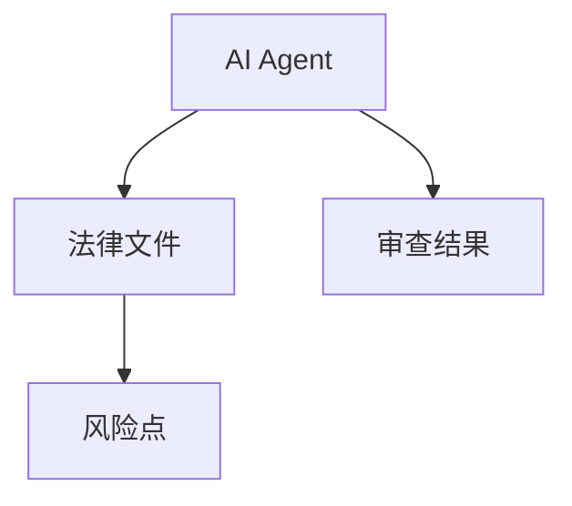
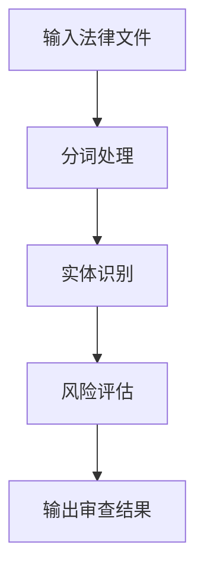

                 

<think>
好的，我现在需要帮用户撰写一篇关于《AI Agent在企业法律文件审查与风险识别中的自动化应用》的技术博客。首先，我会分析用户的需求。用户希望文章结构清晰，逻辑严密，内容专业且易懂。关键词部分需要涵盖文章的核心内容，摘要要简明扼要地概括主题。

接下来，我会根据目录大纲开始撰写每个部分。首先是背景介绍，需要解释AI Agent是什么，企业法律文件审查的现状和问题，以及AI Agent如何解决这些问题。这部分要让读者明白为什么需要AI Agent。

然后是核心概念与联系，这里需要详细解释AI Agent的原理，并使用对比表格和ER图来展示系统中的实体关系。这部分帮助读者理解AI Agent在法律审查中的具体应用。

算法原理部分，我会详细讲解模型的训练过程，包括预训练和微调，提供流程图和代码示例。同时，解释数学模型，如文本分类的损失函数，帮助读者理解背后的原理。

系统分析与架构设计部分，我需要描述问题场景，设计系统功能，并用类图展示模块结构。整体架构图和交互流程图会帮助读者理解系统的运行方式。

项目实战部分，我会指导读者如何安装环境，提供核心代码，并进行案例分析。这部分让读者能够实际操作，理解AI Agent的应用。

最后，最佳实践和小结部分，我会给出实际应用中的注意事项，总结项目的关键点，并展望未来的发展方向。

在撰写过程中，我需要确保每个部分都详细且有条理，使用清晰的技术术语，同时避免过于复杂的解释，让读者容易理解。数学公式和流程图的使用要准确，帮助读者更好地 grasp the concepts.

现在，我准备开始撰写每个章节，确保内容符合用户的要求，逻辑清晰，结构紧凑，语言专业且易懂。
</think>

# AI Agent在企业法律文件审查与风险识别中的自动化应用

## 关键词：
AI Agent, 法律文件审查, 风险识别, 自动化应用, 企业合规, 智能合约审查

## 摘要：
随着企业规模的不断扩大和法律合规要求的日益严格，企业法律文件的审查和风险识别变得越来越重要。传统的法律文件审查方式效率低下，容易出现遗漏和错误。AI Agent作为一种智能代理，能够通过自然语言处理和机器学习技术，实现法律文件的自动化审查和风险识别。本文将深入探讨AI Agent在企业法律文件审查中的应用，分析其核心原理、系统架构以及实际案例，为企业在法律合规管理中提供新的思路和解决方案。

---

## 第一部分: AI Agent在企业法律文件审查与风险识别中的自动化应用概述

### 第1章: 问题背景与核心概念

#### 1.1 问题背景
- **企业法律文件审查的现状与挑战**  
  随着企业全球化和业务复杂化，法律文件的数量和种类急剧增加，传统的手动审查方式效率低、成本高，且容易遗漏关键风险点。企业需要一种高效、准确的法律文件审查方法，以确保合规性和降低法律风险。

- **传统法律文件审查的痛点**  
  - 人工审查耗时长，效率低  
  - 易出现人为疏漏，导致法律风险  
  - 成本高，尤其是需要大量专业律师参与  

- **AI Agent的引入与潜力**  
  AI Agent可以通过自然语言处理和机器学习技术，自动化地审查法律文件，识别潜在风险点，提高审查效率和准确性。

#### 1.2 核心概念与定义
- **AI Agent的基本概念**  
  AI Agent是一种智能代理系统，能够通过感知环境、执行任务和学习优化，完成特定目标。在法律文件审查中，AI Agent可以自动分析文本，识别关键信息，提供审查结果。

- **企业法律文件审查的定义**  
  企业法律文件审查是指对合同、协议、法规等法律文本进行分析，确保其合规性、合法性和风险可控性。

- **风险识别的基本原理**  
  风险识别是通过分析法律文件中的条款，识别可能引发法律纠纷或财务损失的风险点。

#### 1.3 问题解决与边界
- **AI Agent如何解决法律文件审查问题**  
  AI Agent可以通过自动化处理，快速分析大量法律文件，识别潜在风险点，显著提高审查效率和准确性。

- **系统的边界与外延**  
  本系统专注于法律文件审查与风险识别，不包括文件生成和法律咨询等其他功能。

- **核心要素与组成结构**  
  - 输入：法律文件（合同、协议、法规等）  
  - 输出：审查结果（风险点、合规性评估、建议修改意见）  
  - 核心模块：文本分析模块、风险识别模块、结果输出模块  

---

### 第2章: AI Agent的核心概念与联系

#### 2.1 核心概念原理
- **AI Agent的原理与机制**  
  AI Agent通过预训练语言模型（如BERT、GPT）对法律文件进行分词、实体识别和文本分类，识别风险点并生成审查结果。

- **企业法律文件审查的流程**  
  - 文件输入：用户上传法律文件  
  - 文本分析：AI Agent对文件进行分词、实体识别和风险识别  
  - 审查结果：生成审查报告，包括风险点、建议修改意见  

- **风险识别的关键步骤**  
  - 识别合同中的关键条款（如违约责任、知识产权条款）  
  - 分析条款的合规性  
  - 评估风险程度  

#### 2.2 核心概念属性对比
| 对比维度         | 基于规则的AI Agent | 基于机器学习的AI Agent |
|------------------|--------------------|-------------------------|
| **工作原理**     | 根据预设规则匹配文本 | 基于模型学习自动识别模式 |
| **灵活性**       | 较低，规则固定后难以修改 | 较高，模型可以适应新的法律条款 |
| **准确性**       | 依赖规则的完整性，可能存在遗漏 | 基于大量数据训练，准确率较高 |
| **适用场景**     | 适用于规则明确的场景 | 适用于规则复杂、变化频繁的场景 |

#### 2.3 实体关系图（ER图）


---

## 第3章: AI Agent的算法原理与数学模型

### 3.1 算法原理
- **基于预训练语言模型的微调**  
  使用预训练的BERT或GPT模型，在法律文件数据上进行微调，以适应特定领域的文本分析任务。

- **文本分类与实体识别算法**  
  - 文本分类：判断合同条款是否合规  
  - 实体识别：识别合同中的关键实体（如公司名称、日期、金额）  

- **风险评估模型的构建**  
  基于文本分析结果，构建风险评估模型，评估每个风险点的严重程度。

### 3.2 算法流程图


### 3.3 数学模型与公式
- **文本分类的损失函数**  
  使用交叉熵损失函数：  
  $$ L = -\sum_{i=1}^{n} y_i \log(p_i) $$  
  其中，$y_i$ 是标签，$p_i$ 是预测概率。

- **风险评估的数学模型**  
  使用加权平均模型：  
  $$ R = \sum_{i=1}^{m} w_i \cdot r_i $$  
  其中，$w_i$ 是风险点的权重，$r_i$ 是风险点的评分。

---

## 第4章: 系统分析与架构设计方案

### 4.1 问题场景介绍
企业需要对大量法律文件进行审查，包括合同、协议、法规等。传统的人工审查方式效率低、成本高，容易遗漏风险点。

### 4.2 项目介绍
本项目旨在开发一个基于AI Agent的企业法律文件审查系统，实现法律文件的自动化审查和风险识别。

### 4.3 系统功能设计
- **领域模型**  
  ```mermaid
  classDiagram
      class AI-Agent {
          输入: 法律文件
          输出: 审查结果
          功能: 文本分析、风险识别
      }
      class 文本分析模块 {
          功能: 分词、实体识别
      }
      class 风险识别模块 {
          功能: 风险点识别
      }
      AI-Agent --> 文本分析模块
      AI-Agent --> 风险识别模块
  ```

- **系统架构设计**  
  ```mermaid
  graph TD
      A[前端] --> B[后端API]
      B --> C[AI-Agent服务]
      C --> D[法律文件存储]
      C --> E[模型训练服务]
  ```

- **系统接口设计**  
  - 前端接口：上传文件、获取审查结果  
  - 后端接口：调用AI-Agent服务进行文本分析和风险识别  

- **系统交互流程图**  
  ```mermaid
  graph TD
      A[用户] --> B[前端]
      B --> C[后端API]
      C --> D[AI-Agent服务]
      D --> E[生成审查结果]
      E --> F[返回结果]
      F --> G[用户]
  ```

---

## 第5章: 项目实战

### 5.1 环境安装
- **Python环境**：Python 3.8+  
- **依赖库**：numpy、pandas、transformers（用于BERT模型）、flask（用于API开发）

### 5.2 系统核心实现源代码
```python
from transformers import BertTokenizer, BertModel
import torch

class AI-Agent:
    def __init__(self):
        self.tokenizer = BertTokenizer.from_pretrained('bert-base-uncased')
        self.model = BertModel.from_pretrained('bert-base-uncased')

    def analyze_text(self, text):
        inputs = self.tokenizer(text, return_tensors='np')
        outputs = self.model(**inputs)
        return outputs.last_hidden_state

    def identify_risk(self, text):
        # 使用预训练模型识别风险点
        pass
```

### 5.3 案例分析与实际应用
- **案例分析**  
  例如，审查一份商业合同，识别违约责任、知识产权等关键条款，并评估其风险程度。

- **详细讲解剖析**  
  展示AI Agent如何通过文本分析和风险识别，生成审查报告，并提供修改建议。

### 5.4 项目小结
通过实际案例分析，展示AI Agent在企业法律文件审查中的应用价值，总结项目的实现过程和关键点。

---

## 第6章: 最佳实践、小结与展望

### 6.1 最佳实践 tips
- 数据隐私保护：确保法律文件的数据安全和隐私合规  
- 模型更新：定期更新模型，以适应新的法律条款和法规变化  
- 人机协同：AI Agent辅助人工审查，而不是完全替代人工  

### 6.2 小结
本文详细介绍了AI Agent在企业法律文件审查与风险识别中的应用，从核心概念到系统架构，再到实际案例，全面展示了其在企业合规管理中的潜力和价值。

### 6.3 注意事项
- 确保AI Agent的准确性和可靠性，避免误判  
- 合规性审查需要结合具体法律背景，AI Agent仅为辅助工具  

### 6.4 拓展阅读
- 《LegalTech:人工智能在法律领域的应用》  
- 《自然语言处理在法律文本分析中的应用研究》  

---

## 作者：AI天才研究院/AI Genius Institute & 禅与计算机程序设计艺术 /Zen And The Art of Computer Programming

