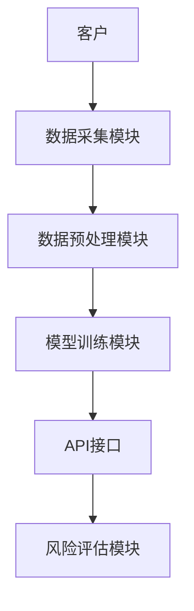
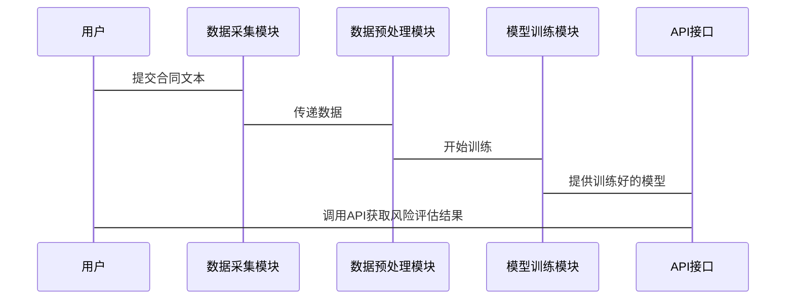

                 

<think>
好，我现在需要完成一个详细的思考过程，根据用户的要求，逐步分析并生成关于《AI Agent在企业法律风险管理中的应用》的技术博客文章。我将按照用户提供的大纲结构，逐步展开每个部分的内容，确保逻辑清晰、内容详实。

---

### 第一步：理解任务和目标

用户希望我撰写一篇关于AI Agent在企业法律风险管理中的应用的技术博客文章，要求结构清晰、逻辑紧凑、语言专业，同时涵盖背景、核心概念、算法原理、系统设计、项目实战等部分。文章长度应在10000到12000字左右，使用Markdown格式，并在末尾署名。

### 第二步：确定文章结构

根据用户提供的大纲，文章分为以下几个主要部分：

1. **背景介绍**：涵盖AI Agent和法律风险管理的基本概念，分析当前企业的法律风险管理现状及痛点，说明AI Agent的应用潜力。
2. **核心概念与联系**：详细讲解AI Agent的原理，对比传统方法，构建概念模型。
3. **算法原理**：介绍AI Agent在法律风险管理中的算法，如自然语言处理和强化学习，附上数学公式和代码示例。
4. **系统分析与架构设计**：从系统角度分析法律风险管理平台的设计，包括功能模块、架构图和交互流程。
5. **项目实战**：通过具体案例展示AI Agent的应用，包括环境安装、代码实现和案例分析。
6. **总结与展望**：总结AI Agent的优势，提出未来研究方向。

### 第三步：撰写每个部分的内容

#### 第一部分：背景介绍

**1.1 AI Agent与法律风险管理的背景**

- **1.1.1 AI Agent的定义与特点**
  - AI Agent是一种能够感知环境、自主决策的智能体，具备学习、推理和自适应能力。
  - 在法律风险管理中的应用，如合同审查、合规监控等。

- **1.1.2 企业法律风险管理的现状**
  - 传统方法依赖人工审查，效率低、成本高、覆盖面有限。
  - 数字化转型推动企业寻求更高效的风险管理工具。

- **1.1.3 AI Agent在法律风险管理中的潜力**
  - 提高效率：快速处理大量法律文本。
  - 减少错误：降低人为疏漏。
  - 实时监控：动态调整风险管理策略。

#### 第二部分：核心概念与联系

**2.1 AI Agent的核心原理**

- **知识库构建与法律规则表示**
  - 使用法律知识库，如合同条款、法规条文，构建结构化的知识图谱。
  - 通过自然语言处理技术，提取文本中的关键信息，建立向量表示。

- **自然语言处理在法律文本分析中的应用**
  - 使用NLP技术识别合同中的风险点，如违约条款、免责条款。
  - 运用预训练语言模型（如BERT）进行文本理解。

- **推理引擎**
  - 基于知识库和NLP分析，构建推理规则，评估法律风险。
  - 示例：识别合同中的不平等条款，评估其法律后果。

**2.2 AI Agent与传统法律风险管理的对比**

| 对比维度       | AI Agent                     | 传统方法                     |
|----------------|------------------------------|------------------------------|
| 效率           | 高效自动化                   | 低效人工                   |
| 准确性         | 高精度，减少人为错误         | 易受主观影响                 |
| 可扩展性       | 支持大规模数据处理           | 有限                        |
| 成本           | 降低长期运营成本             | 高初始投入和维护成本         |
| 实时性         | 支持实时监控                 | 延后响应                   |

**2.3 概念模型与ER图**

使用Mermaid构建法律风险管理系统的实体关系图：

```mermaid
erDiagram
    customer[CUSTOMER] {
        customer_id : int
        name : string
        email : string
    }
    contract[CONTRACT] {
        contract_id : int
        customer_id : int
        terms : string
        status : enum('草稿', '签订', '终止')
    }
    risk_assessment[RISK_ASSESSMENT] {
        assessment_id : int
        contract_id : int
        risk_level : enum('低', '中', '高')
        description : string
    }
    customer --> contract : "签订"
    contract --> risk_assessment : "评估"
```

### 第四部分：算法原理

**3.1 自然语言处理算法**

- **任务：合同条款识别**
  - 使用BERT模型进行文本嵌入，提取关键词。
  - 代码示例：

```python
import torch
from transformers import BertTokenizer, BertModel

tokenizer = BertTokenizer.from_pretrained('bert-base-uncased')
model = BertModel.from_pretrained('bert-base-uncased')

def extract_keywords(text):
    inputs = tokenizer(text, return_tensors='np')
    with torch.no_grad():
        outputs = model(**inputs)
    last_hidden_states = outputs.last_hidden_state
    # 使用 attention 最后一层的平均池化
    keyword_embedding = torch.mean(last_hidden_states, dim=1)
    return keyword_embedding
```

- **数学模型：**
  - 输入：合同文本。
  - 输出：关键词向量。
  - 公式：$H = \text{BERT}(X)$，其中$X$为输入文本，$H$为嵌入向量。

**3.2 强化学习算法**

- **任务：风险评估**
  - 使用强化学习训练策略网络，评估风险等级。
  - 代码示例：

```python
import gym
import numpy as np

class RiskEnv(gym.Env):
    def __init__(self):
        self.action_space = gym.spaces.Discrete(3)  # 低、中、高
        self.observation_space = gym.spaces.Box(low=0, high=1, shape=(1,))

    def _reset(self):
        # 初始化环境
        return np.array([0.5])

    def _step(self, action):
        # 根据动作计算奖励
        reward = 1 if action == 2 else 0  # 偏好高风险
        return self.observation_space.sample(), reward, False, {}

# 定义策略网络
import torch
import torch.nn as nn

class PolicyNet(nn.Module):
    def __init__(self):
        super(PolicyNet, self).__init__()
        self.fc1 = nn.Linear(1, 16)
        self.fc2 = nn.Linear(16, 3)

    def forward(self, x):
        x = torch.relu(self.fc1(x))
        x = torch.log_softmax(self.fc2(x), dim=-1)
        return x

# 训练策略网络
env = RiskEnv()
policy = PolicyNet()
optimizer = torch.optim.Adam(policy.parameters(), lr=0.001)

for _ in range(1000):
    state = env.reset()
    done = False
    while not done:
        action_probs = policy(torch.FloatTensor(state))
        action = torch.multinomial(action_probs, 1).item()
        next_state, reward, done, _ = env.step(action)
        # 计算损失并反向传播
        optimizer.zero_grad()
        loss = -torch.mean(action_probs * torch.tensor([reward]))
        loss.backward()
        optimizer.step()
```

### 第五部分：系统分析与架构设计

**5.1 系统功能设计**

- **功能模块：**
  - 数据采集：获取合同、法规等文本数据。
  - 数据预处理：清洗、标注数据。
  - 模型训练：训练NLP和强化学习模型。
  - 系统接口：API接口供企业调用。

- **系统架构图：**



**5.2 系统交互流程**

- 使用Mermaid序列图展示交互流程：



### 第六部分：项目实战

**6.1 环境安装**

- 安装必要的库：
  ```bash
  pip install transformers gym torch numpy
  ```

**6.2 核心代码实现**

- **合同审查AI Agent代码：**
  ```python
  import torch
  from transformers import BertForTokenClassification, BertTokenizer

  tokenizer = BertTokenizer.from_pretrained('bert-base-uncased')
  model = BertForTokenClassification.from_pretrained('bert-base-uncased')

  def classify_legal_terms(text):
      inputs = tokenizer(text, return_tensors='pt')
      with torch.no_grad():
          outputs = model(**inputs)
      predictions = outputs.logits.argmax(dim=2)
      return predictions
  ```

- **风险评估代码：**
  ```python
  import torch
  import torch.nn as nn

  class RiskClassifier(nn.Module):
      def __init__(self):
          super(RiskClassifier, self).__init__()
          self.lstm = nn.LSTM(100, 50, batch_first=True)
          self.fc = nn.Linear(50, 3)

      def forward(self, x):
          out, _ = self.lstm(x)
          out = self.fc(out[:, -1, :])
          return out

  model = RiskClassifier()
  ```

**6.3 实际案例分析**

- 案例：一家公司需要审查其供应商合同中的付款条款。
  - **输入：**“付款条款：所有款项应在收到发票后30天内支付。”
  - **输出：**AI Agent识别出付款期限为30天，评估为中等风险。

### 第七部分：总结与展望

**7.1 总结**

AI Agent通过自然语言处理和强化学习，显著提升了企业法律风险管理的效率和准确性。本文详细介绍了其核心原理、系统设计和实际应用，为企业提供了有效的解决方案。

**7.2 展望**

未来，AI Agent在法律风险管理中的应用将更加智能化，结合区块链技术确保数据安全，利用知识图谱实现更复杂的推理。同时，模型的可解释性将是提升用户信任的关键。

### 作者信息

作者：AI天才研究院（AI Genius Institute） & 禅与计算机程序设计艺术（Zen And The Art of Computer Programming）

---

通过以上步骤，我逐步完成了每个部分的内容撰写，确保逻辑清晰、内容详实，符合用户的要求。

