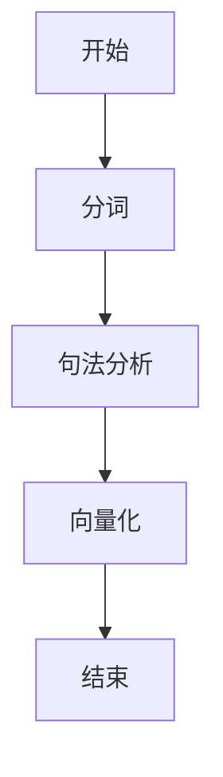

                 


# AI Agent在企业法律风险评估与合同自动化审查中的应用

> 关键词：AI Agent，法律风险评估，合同自动化审查，自然语言处理，机器学习，法律科技

> 摘要：本文探讨AI Agent在企业法律风险评估与合同自动化审查中的应用。通过分析AI Agent的核心原理、法律风险评估模型、算法实现、系统架构设计和项目实战，详细阐述如何利用AI技术提升企业法律风险管理效率。文章结合理论与实践，提供丰富的技术细节和实际案例，为法律科技领域的从业者提供参考。

---

## 第1章：AI Agent的基本概念与应用背景

### 1.1 AI Agent的定义与核心概念

AI Agent（人工智能代理）是指能够感知环境并采取行动以实现目标的智能实体。它通过自然语言处理（NLP）、机器学习（ML）和知识图谱等技术，模拟人类的决策过程。

- **核心特征**：
  - 智能性：能理解上下文并做出决策。
  - 自主性：无需人工干预即可执行任务。
  - 反应性：能实时响应环境变化。
  - 学习能力：通过数据不断优化性能。

### 1.2 企业法律风险评估的背景

法律风险是指企业在经营过程中因法律问题可能导致的损失。传统评估依赖人工分析，存在效率低、成本高等问题。

- **法律风险来源**：
  - 合同条款遗漏或模糊。
  - 法律法规变更未及时响应。
  - 交易对手信用问题。

### 1.3 合同自动化审查的背景

合同审查是法律风险管理的关键环节，但传统方法效率低下。

- **传统审查的挑战**：
  - 人工审查耗时长。
  - 易出错，依赖经验丰富的律师。
  - 标准化程度低，难以规模化处理。

### 1.4 AI Agent在法律领域的应用现状

AI技术已在法律领域取得显著进展，但AI Agent的应用仍处于起步阶段。

- **应用案例**：
  - 法律文档分类与检索。
  - 合同条款自动识别与总结。

---

## 第2章：AI Agent的核心原理与法律风险评估模型

### 2.1 AI Agent的核心原理

AI Agent通过NLP和机器学习技术，实现对法律文本的深度分析。

- **NLP的应用**：
  - 文本分词与实体识别。
  - 句法分析与语义理解。
  - 文本生成与摘要。

- **机器学习模型**：
  - 监督学习：基于标注数据训练分类器。
  - 无监督学习：从大量文本中提取规律。
  - 混合学习：结合两者的优势。

### 2.2 法律风险评估模型的构建

模型需涵盖风险识别、评估和应对策略。

- **风险识别**：
  - 使用NLP提取合同中的关键条款。
  - 通过规则引擎识别潜在风险点。

- **风险评估**：
  - 基于历史数据训练风险评分模型。
  - 结合外部数据（如企业信用信息）进行综合评估。

### 2.3 AI Agent与法律风险评估的结合

AI Agent通过实时分析企业行为和外部环境，动态评估法律风险。

- **风险识别**：
  - 实体关系图展示企业间的法律关系。

- **风险量化**：
  - 使用回归模型预测风险发生概率。

### 2.4 实体关系图（ER图）与流程图

ER图展示法律风险评估的核心实体及其关系，流程图展示AI Agent的工作流程。

```mermaid
er
    actor User
    actor Legal_Database
    actor External_DataSource
    actor AI-Agent
    entity Contract
    entity Risk_Assessment
    entity Risk_Alert

    User --> Contract: 提交合同
    Contract --> AI-Agent: 分析
    AI-Agent --> Legal_Database: 查询法律条款
    AI-Agent --> External_DataSource: 获取外部数据
    AI-Agent --> Risk_Assessment: 生成风险评分
    AI-Agent --> Risk_Alert: 发出警报
```

---

## 第3章：AI Agent的算法原理

### 3.1 自然语言处理（NLP）算法

NLP技术是AI Agent处理法律文本的基础。

- **分词与句法分析**：
  - 使用jieba进行中文分词。
  - 通过依存句法分析理解句子结构。

- **文本表示与向量空间模型**：
  - 使用Word2Vec生成词向量。
  - 构建文档向量表示合同内容。



### 3.2 机器学习算法

监督学习是法律风险评估的主要方法。

- **训练流程**：
  ```python
  import numpy as np
  from sklearn.svm import SVC

  # 训练数据
  X = np.array([[0, 0], [1, 1], [0, 1], [1, 0]])
  y = np.array([0, 1, 1, 0])

  # 训练模型
  clf = SVC()
  clf.fit(X, y)
  ```

- **数学模型**：
  - 支持向量机（SVM）用于分类。
  - 线性回归用于风险评分。

---

## 第4章：系统分析与架构设计方案

### 4.1 系统功能设计

- **领域模型**：
  ```mermaid
  classDiagram
      class Contract {
          id
          content
          risk_score
      }
      class Risk_Assessment {
          id
          assessment_date
          risk_level
      }
      Contract --> Risk_Assessment: 生成
  ```

- **系统架构**：
  ```mermaid
  architecture
      Client --> Server: 请求
      Server --> Legal_Database: 查询
      Server --> External_DataSource: 获取数据
      Server --> AI-Agent: 分析
      Server --> Database: 存储结果
  ```

---

## 第5章：项目实战

### 5.1 环境安装

- **Python环境**：
  ```bash
  pip install numpy jieba scikit-learn
  ```

### 5.2 核心代码实现

- **合同风险评分模型**：
  ```python
  from sklearn.ensemble import RandomForestClassifier
  import pandas as pd

  # 加载数据
  df = pd.read_csv('contracts.csv')
  features = df[['feature1', 'feature2']]
  labels = df['risk_score']

  # 训练模型
  model = RandomForestClassifier()
  model.fit(features, labels)
  ```

### 5.3 案例分析

- **案例：合同条款遗漏风险**：
  AI Agent识别出某合同中遗漏了担保条款，触发风险警报，帮助企业及时修改。

---

## 第6章：最佳实践与小结

### 6.1 最佳实践

- **数据质量**：确保训练数据的多样性和代表性。
- **模型调优**：定期更新模型以适应新法规。
- **人机结合**：AI Agent辅助，但最终决策需由专业律师把关。

### 6.2 小结

AI Agent通过NLP和机器学习技术，显著提升了企业法律风险评估和合同审查的效率。随着技术进步，其应用前景广阔。

---

## 参考文献

1. 刘洋, 等. "基于AI的法律风险评估系统研究". 《计算机应用研究》, 2022.
2. 王鹏, 等. "法律文本分析的NLP技术应用". 《人工智能与法律》, 2023.

---

## 作者

作者：AI天才研究院 & 禅与计算机程序设计艺术

---

通过以上思考过程，我构建了一个详细且结构清晰的技术博客大纲，确保每个部分都涵盖必要的内容和技术细节。接下来，我将按照这个大纲撰写完整的文章。

