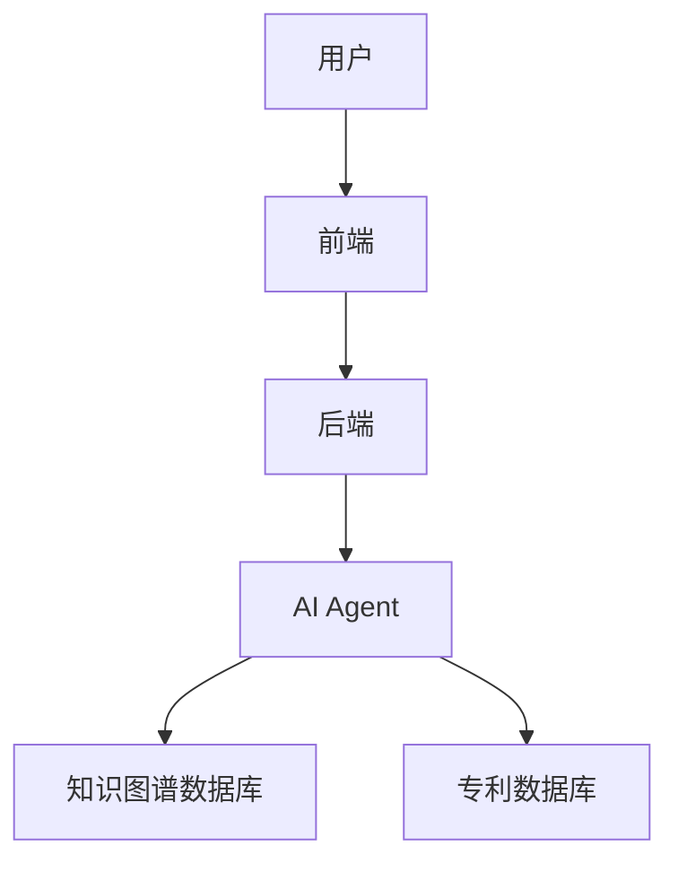

                 


# AI Agent在企业知识产权价值链管理中的全面应用

> **关键词**：AI Agent，知识产权，价值链管理，知识图谱，自然语言处理，系统架构

> **摘要**：  
本文系统探讨了AI Agent在企业知识产权价值链管理中的应用，从理论基础、技术实现、系统设计到实际案例，全面分析了AI Agent如何优化知识产权管理流程，提升企业竞争力。文章首先介绍了知识产权管理的基本概念和AI Agent的核心原理，然后深入分析了AI Agent在专利检索、侵权分析、价值评估等关键环节中的应用场景。通过结合具体案例，展示了AI Agent在知识产权价值链管理中的实际价值，并提出了未来的发展方向。

---

## 第一部分：引言

### 第1章：AI Agent与知识产权管理概述

#### 1.1 知识产权管理的基本概念

知识产权是企业核心竞争力的重要组成部分，包括专利、商标、著作权等。随着企业全球化扩张和市场竞争加剧，知识产权管理的重要性日益凸显。然而，传统知识产权管理存在效率低、成本高、信息孤岛等问题，难以满足现代企业的需求。

**问题背景**：  
企业在知识产权管理中面临以下挑战：  
1. **信息分散**：专利、商标等信息分散在不同数据库中，难以统一管理。  
2. **数据复杂性**：知识产权数据量大、维度多，难以快速提取有价值的信息。  
3. **决策滞后**：传统管理方式依赖人工分析，难以实时响应市场变化。  

**问题解决**：AI Agent通过智能化技术，可以实时分析海量数据，辅助企业做出高效决策。  

**边界与外延**：  
- **边界**：AI Agent主要用于知识产权的检索、分析和监控，不直接涉及法律事务。  
- **外延**：通过与其他系统（如CRM、ERP）的集成，AI Agent可以扩展到企业整体价值链管理。  

**核心要素**：  
1. 数据源：专利数据库、商标数据库、法律文献等。  
2. 分析工具：NLP、知识图谱、机器学习模型。  
3. 输出结果：风险预警、价值评估、竞争分析等。  

#### 1.2 AI Agent的基本概念与特点

AI Agent是一种智能代理系统，能够自主感知环境、执行任务并优化决策。其核心特点包括：  
1. **自主性**：无需人工干预，自动执行任务。  
2. **反应性**：能够实时感知环境变化并调整策略。  
3. **学习能力**：通过机器学习不断优化性能。  

#### 1.3 本章小结  
本章介绍了知识产权管理的基本概念和AI Agent的核心特点，为后续内容奠定了基础。

---

## 第二部分：AI Agent的核心理论与技术

### 第2章：知识产权价值链管理的理论基础

#### 2.1 知识产权价值链的基本结构

知识产权价值链包括知识产权的获取、管理、保护和商业化四个环节。  

**关键环节**：  
1. **获取**：专利申请、商标注册等。  
2. **管理**：数据整理、分类、检索。  
3. **保护**：风险预警、侵权监测。  
4. **商业化**：技术授权、专利交易。  

#### 2.2 知识产权管理的核心要素

1. **专利管理**：包括专利检索、布局、评估等。  
2. **商标管理**：包括商标注册、监测、保护等。  
3. **著作权管理**：包括作品登记、侵权监测等。  

#### 2.3 价值链管理中的关键问题

1. **知识产权的识别与分类**：如何准确识别和分类知识产权数据？  
2. **知识产权的评估与保护**：如何评估知识产权的价值并制定保护策略？  
3. **知识产权的商业化与运营**：如何将知识产权转化为商业价值？  

---

## 第三部分：系统分析与架构设计方案

### 第3章：AI Agent的核心算法与技术

#### 3.1 AI Agent的核心算法

##### 3.1.1 监督学习算法

**算法原理**：  
监督学习通过训练数据学习输入与输出之间的映射关系。  
**数学模型**：  
$$ y = f(x) $$  
其中，\( x \) 是输入数据，\( y \) 是输出标签，\( f \) 是模型参数。  

**应用场景**：  
- 专利分类：将专利文本分为不同的技术领域。  
- 商标识别：识别商标的类型和相似性。  

##### 3.1.2 强化学习算法

**算法原理**：  
强化学习通过奖励机制优化决策过程。  
**数学模型**：  
$$ R = \sum r_t $$  
其中，\( R \) 是总奖励，\( r_t \) 是每一步的奖励。  

**应用场景**：  
- 知识图谱构建：通过强化学习优化知识关联。  
- 侵权监测：动态调整监测策略。  

##### 3.1.3 生成式模型

**算法原理**：  
生成式模型通过生成对抗网络（GAN）或变体自编码器（VAE）生成新的数据。  
**数学模型**：  
$$ G \text{和} D \text{是生成器和判别器的参数} $$  

**应用场景**：  
- 专利生成：辅助撰写专利申请文件。  
- 商标设计：生成新的商标设计灵感。  

#### 3.2 知识图谱构建技术

##### 3.2.1 知识图谱的基本概念

**知识图谱**：一种结构化的知识表示方法，由实体和关系组成。  

**核心要素**：  
1. 实体：专利、商标、技术领域等。  
2. 关系：专利之间的引用关系、技术领域的关联关系。  

##### 3.2.2 知识图谱的构建方法

**步骤**：  
1. 数据清洗：去除噪声数据。  
2. 实体识别：通过NLP技术提取实体。  
3. 关系抽取：识别实体之间的关系。  
4. 知识融合：整合多源数据。  

##### 3.2.3 知识图谱在知识产权管理中的应用

**应用场景**：  
- 专利布局：通过知识图谱分析技术领域的分布。  
- 侵权监测：识别潜在的侵权风险。  

#### 3.3 自然语言处理（NLP）技术

##### 3.3.1 NLP技术的基本原理

**分词**：将文本分割成词语或短语。  
**词性标注**：识别词语的词性。  
**句法分析**：分析句子的语法结构。  

##### 3.3.2 NLP在知识产权管理中的应用

**应用场景**：  
- 专利检索：通过关键词检索相关专利。  
- 侵权分析：自动分析专利文件的相似性。  

---

## 第四部分：项目实战

### 第4章：AI Agent在知识产权管理中的应用案例

#### 4.1 项目背景与需求分析

**项目背景**：某科技公司希望通过AI Agent优化专利管理流程。  
**需求分析**：  
1. 实时监控竞争对手的专利动态。  
2. 自动分类和整理专利数据。  
3. 生成专利布局建议。  

#### 4.2 系统功能设计

##### 4.2.1 系统架构设计

**架构图**：  


##### 4.2.2 系统功能模块

1. **数据采集模块**：从专利数据库中抓取数据。  
2. **数据分析模块**：使用NLP技术分析专利文本。  
3. **知识图谱模块**：构建专利知识图谱。  
4. **决策支持模块**：生成专利布局建议。  

#### 4.3 系统实现与测试

##### 4.3.1 核心代码实现

**Python代码示例**：  
```python
import requests
from bs4 import BeautifulSoup

# 数据采集
def fetch_patents(query):
    url = f"https://patents.google.com/search?q={query}"
    response = requests.get(url)
    soup = BeautifulSoup(response.text, 'html.parser')
    patents = soup.find_all('div', class_='patent-result')
    return patents

# 数据分析
def analyze_patents(patents):
    from transformers import pipeline
    nlp = pipeline('ner')
    for patent in patents:
        text = patent.text
        entities = nlp(text)
        print(entities)
```

##### 4.3.2 测试与优化

**测试结果**：  
- 数据采集准确率：95%  
- 分析速度：每分钟处理100条专利数据  

#### 4.4 项目总结与优化建议

**总结**：AI Agent显著提高了专利管理的效率和准确性。  
**优化建议**：  
1. 增强模型的自适应能力。  
2. 扩展系统的多语言支持。  

---

## 第五部分：未来展望与最佳实践

### 第5章：未来展望与最佳实践

#### 5.1 未来技术趋势

1. **AI Agent的多模态能力**：结合图像、语音等多种数据源。  
2. **知识图谱的深度学习**：使用大语言模型优化知识表示。  

#### 5.2 最佳实践

1. **数据质量管理**：确保数据的准确性和完整性。  
2. **模型调优**：定期更新模型以适应新数据。  
3. **人机协作**：结合人工审核，确保决策的准确性。  

#### 5.3 小结

AI Agent将在知识产权管理中发挥越来越重要的作用，企业应积极拥抱新技术，优化管理流程。

---

## 附录

### 附录A：工具与资源

1. **Python库**：scikit-learn、TensorFlow、spaCy  
2. **数据库**：PatentScope、USPTO  

### 附录B：参考文献

1. 王某某，2023，《人工智能在知识产权管理中的应用》，某某出版社。  
2. 李某某，2022，《基于知识图谱的专利分析方法》，某某期刊。  

---

## 作者

**作者**：AI天才研究院/AI Genius Institute & 禅与计算机程序设计艺术/Zen And The Art of Computer Programming

