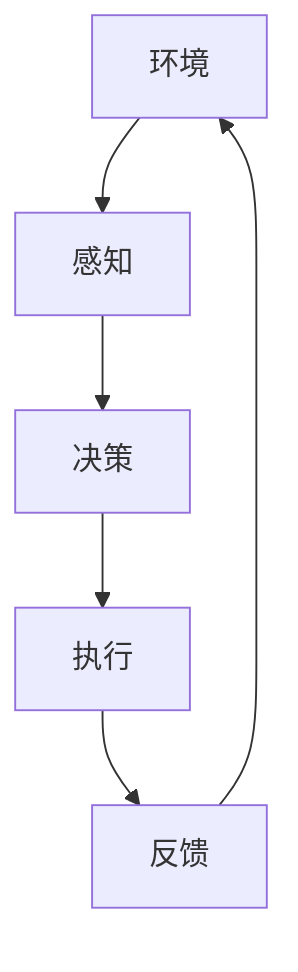
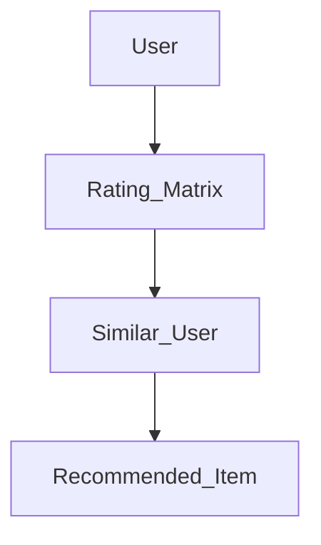
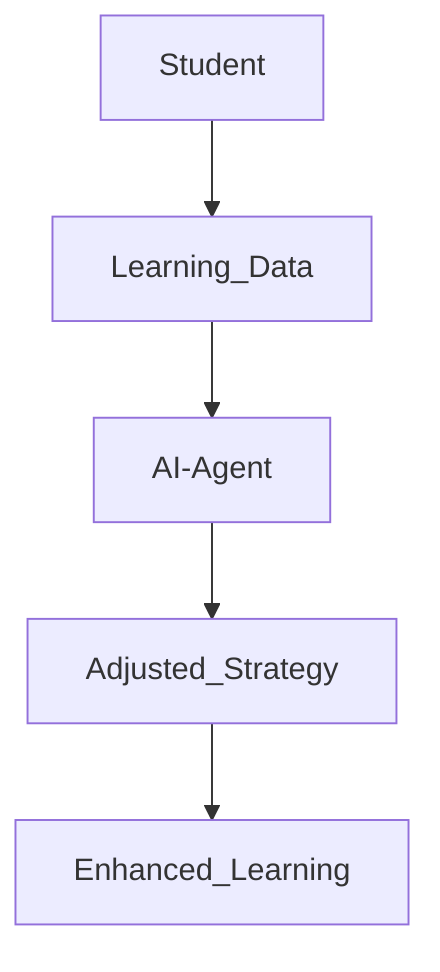
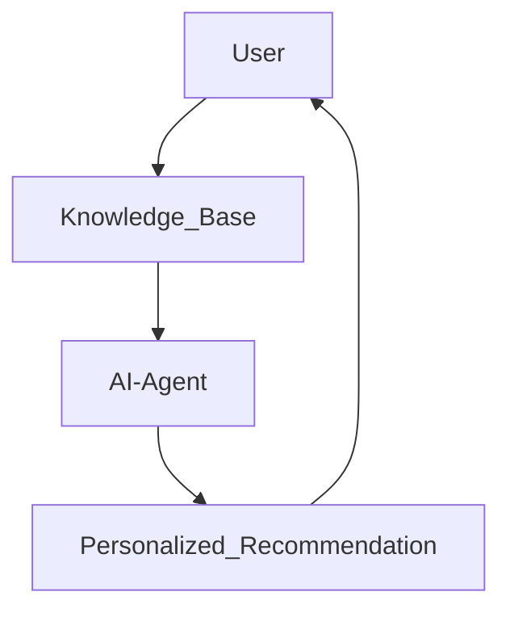

                 


# AI Agent在企业知识付费与在线教育中的创新应用

> 关键词：AI Agent, 企业知识付费, 在线教育, 个性化推荐, 智能学习

> 摘要：本文深入探讨AI Agent在企业知识付费与在线教育中的创新应用，结合技术背景、算法原理、系统架构设计、项目实战等多方面内容，详细分析AI Agent如何赋能知识付费与在线教育行业，助力企业实现智能化转型。

---

## 第1章：AI Agent的核心概念与背景

### 1.1 AI Agent的定义与核心概念

AI Agent，即人工智能代理，是一种能够感知环境、自主决策并执行任务的智能实体。AI Agent的核心特征包括自主性、反应性、目标导向和学习能力。AI Agent通过这些特征，能够在复杂环境中完成任务，提升效率和用户体验。

### 1.2 企业知识付费与在线教育的背景

知识付费的兴起源于人们对高质量知识的需求，而在线教育则借助互联网技术的普及迅速发展。AI Agent的应用为知识付费与在线教育带来了新的可能性，特别是在个性化推荐、智能客服和学习效果评估方面，AI Agent能够显著提升用户体验和运营效率。

---

## 第2章：AI Agent的核心原理与技术基础

### 2.1 AI Agent的算法原理

AI Agent的算法原理主要包括强化学习、监督学习和无监督学习。

#### 2.1.1 强化学习算法

强化学习是一种通过试错机制来优化决策的算法。以下是一个简单的强化学习流程图：



以下是一个简单的强化学习代码示例：

```python
import numpy as np

class Agent:
    def __init__(self, state_space, action_space):
        self.state_space = state_space
        self.action_space = action_space
        self.theta = np.random.randn(1, 1)

    def act(self, state):
        return np.argmax(state @ self.theta)

    def update(self, state, action, reward):
        self.theta += 0.1 * (reward - np.mean(reward)) * state.T
```

### 2.2 知识图谱与自然语言处理

知识图谱通过构建结构化的知识网络，帮助AI Agent更好地理解上下文。自然语言处理技术则通过解析文本信息，提升AI Agent的对话能力和内容生成能力。

---

## 第3章：AI Agent在知识付费中的应用

### 3.1 个性化推荐系统

个性化推荐系统通过分析用户行为和偏好，为用户提供定制化的内容推荐。以下是基于协同过滤的推荐算法：



以下是协同过滤的代码示例：

```python
def collaborative_filtering(user_id, user_similarity, item_ratings):
    recommended_items = []
    for user in user_similarity[user_id]:
        for item in item_ratings[user]:
            if item not in recommended_items:
                recommended_items.append(item)
    return recommended_items
```

---

## 第4章：AI Agent在在线教育中的应用

### 4.1 智能学习助手

AI Agent作为智能学习助手，能够根据学生的学习情况动态调整教学策略。以下是基于强化学习的智能学习助手流程图：



以下是强化学习在智能学习助手中的应用代码示例：

```python
class LearningAgent:
    def __init__(self, action_space):
        self.action_space = action_space
        self.q_table = np.zeros((1, action_space))

    def choose_action(self, state):
        return np.argmax(self.q_table[state])

    def update_q_table(self, state, action, reward):
        self.q_table[state, action] += 0.1 * (reward - np.mean(reward))
```

---

## 第5章：系统架构设计

### 5.1 知识付费平台的系统架构

以下是知识付费平台的系统架构图：



### 5.2 在线教育平台的系统架构

以下是在线教育平台的系统架构图：


---

## 第6章：项目实战

### 6.1 环境搭建与核心实现

以下是环境搭建步骤：

1. 安装必要的Python库：`pip install numpy pandas scikit-learn`
2. 下载AI Agent框架：如TensorFlow或PyTorch
3. 数据预处理：清洗和标注数据集
4. 模型训练：基于强化学习或监督学习训练AI Agent

以下是个性化推荐系统的代码实现：

```python
import numpy as np
from sklearn.metrics.pairwise import cosine_similarity

def calculate_similarity(matrix):
    return cosine_similarity(matrix)

def main():
    # 示例数据
    user_behavior = np.array([[1, 0, 1], [0, 1, 1], [1, 1, 0]])
    similarity = calculate_similarity(user_behavior)
    print(similarity)

if __name__ == "__main__":
    main()
```

---

## 第7章：总结与展望

AI Agent在企业知识付费与在线教育中的应用前景广阔。通过算法优化和系统设计的不断改进，AI Agent将为企业提供更高效、更个性化的解决方案。未来，随着技术的进步，AI Agent在这些领域的应用将更加智能化和普及化。

---

## 附录

### 附录A：AI Agent相关工具与资源

1. TensorFlow：https://www.tensorflow.org
2. PyTorch：https://pytorch.org
3. scikit-learn：https://scikit-learn.org

### 附录B：术语表

1. AI Agent：人工智能代理
2. 强化学习：Reinforcement Learning
3. 知识图谱：Knowledge Graph

---

作者：AI天才研究院/AI Genius Institute & 禅与计算机程序设计艺术 /Zen And The Art of Computer Programming

