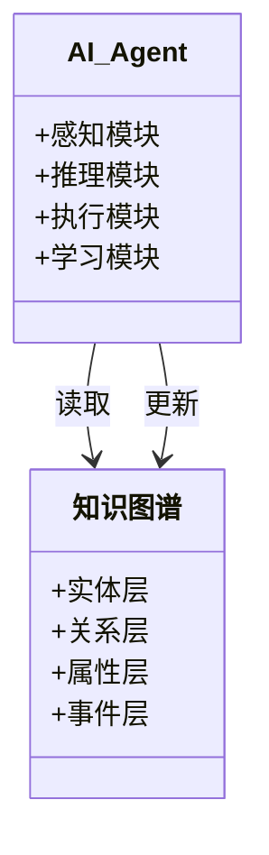
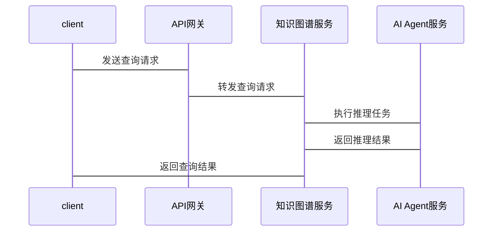

                 


# AI Agent在企业知识图谱构建与应用中的作用

## 关键词：
AI Agent, 企业知识图谱, 知识抽取, 实体识别, 关系抽取, 知识推理, 企业智能应用

## 摘要：
本文深入探讨了AI Agent在企业知识图谱构建与应用中的核心作用。通过分析AI Agent如何利用自然语言处理、知识表示与推理等技术，构建和管理企业知识图谱，展示了其在提升企业智能化水平中的巨大潜力。文章结合理论与实践，详细阐述了构建企业知识图谱的关键算法、系统架构以及实际应用案例，为企业智能化转型提供了有价值的参考。

---

# 第一部分: AI Agent与企业知识图谱的背景介绍

## 第1章: 问题背景与概念解析

### 1.1 问题背景

#### 1.1.1 企业知识管理的现状与挑战
企业在信息爆炸的时代，面临着数据分散、知识孤岛、难以快速响应业务需求等挑战。传统知识管理系统难以高效处理海量异构数据，知识的提取、关联和应用能力有限。

#### 1.1.2 知识图谱在企业中的价值与意义
知识图谱通过构建语义网络，将企业内外部知识结构化、关联化，为企业提供统一的知识视图，支持智能检索、决策支持和自动化应用，提升企业竞争力。

#### 1.1.3 AI Agent在知识管理中的作用
AI Agent作为智能代理，能够自动化处理知识图谱中的数据，执行复杂推理任务，为企业的智能化应用提供强大的技术支持。

### 1.2 问题描述

#### 1.2.1 知识图谱构建的核心问题
知识图谱构建涉及数据抽取、实体识别、关系抽取、知识融合等关键问题，需要解决数据异构性、语义理解等挑战。

#### 1.2.2 AI Agent在知识图谱中的应用场景
AI Agent可以用于知识抽取、动态更新、智能问答、推荐系统等场景，提升知识图谱的构建效率和应用价值。

#### 1.2.3 问题解决的必要性与可行性
构建企业知识图谱是实现企业智能化转型的重要基础，AI Agent的引入能够显著提升知识处理的效率和智能化水平。

### 1.3 问题解决

#### 1.3.1 AI Agent在知识图谱构建中的解决方案
AI Agent通过自然语言处理技术，自动提取文本中的实体和关系，构建结构化的知识图谱。

#### 1.3.2 知识图谱构建的关键技术与方法
包括文本挖掘、信息抽取、知识融合、知识存储与管理等技术，结合AI Agent的智能化能力，构建高效的知识图谱。

#### 1.3.3 AI Agent的智能化优势
AI Agent能够实时更新知识图谱，支持动态推理，具备自我学习能力，显著提升了知识图谱的应用价值。

### 1.4 边界与外延

#### 1.4.1 知识图谱的边界定义
知识图谱的构建范围通常包括企业的核心业务领域，边界由企业的数据资源和应用场景决定。

#### 1.4.2 AI Agent的应用范围与限制
AI Agent的应用受到数据质量和模型性能的限制，目前主要适用于结构化数据处理和规则明确的任务。

#### 1.4.3 知识图谱与AI Agent的协同发展
知识图谱为AI Agent提供知识基础，AI Agent则推动知识图谱的动态更新和智能应用，两者相辅相成。

### 1.5 核心要素组成

#### 1.5.1 知识图谱的核心要素
包括实体、关系、属性、事件、概念等，构成知识图谱的基本单元。

#### 1.5.2 AI Agent的功能模块
包括感知模块、推理模块、执行模块、学习模块等，具备知识抽取、推理、决策等功能。

#### 1.5.3 两者结合的系统架构
知识图谱构建与AI Agent应用形成一个闭环系统，AI Agent通过知识图谱进行推理和决策，同时反馈数据更新知识图谱。

---

# 第二部分: 核心概念与联系

## 第2章: 核心概念原理

### 2.1 AI Agent的原理与机制

#### 2.1.1 AI Agent的基本原理
AI Agent通过感知环境、获取信息、进行推理和决策，执行相应操作，实现智能化任务处理。

#### 2.1.2 知识表示与推理机制
知识表示采用图结构，通过符号逻辑进行推理，支持语义理解与关联分析。

#### 2.1.3 自然语言处理在AI Agent中的应用
NLP技术用于文本理解、实体识别、关系抽取，为知识图谱构建提供基础数据。

### 2.2 知识图谱的构建与属性

#### 2.2.1 知识图谱的构建过程
包括数据收集、预处理、知识抽取、知识融合、存储与管理等步骤，构建完整的知识网络。

#### 2.2.2 实体识别与关系抽取
通过NLP技术，从文本中提取实体及其关系，构建结构化的知识表示。

#### 2.2.3 知识图谱的存储与管理
采用图数据库或知识库管理系统，支持高效查询与更新，确保知识图谱的动态维护。

### 2.3 AI Agent与知识图谱的关系

#### 2.3.1 AI Agent如何利用知识图谱
AI Agent通过知识图谱进行语义理解、关联推理，实现智能问答、推荐系统等应用。

#### 2.3.2 知识图谱如何赋能AI Agent
知识图谱为AI Agent提供丰富的知识库，支持其进行复杂推理和决策任务。

#### 2.3.3 两者结合的协同效应
知识图谱为AI Agent提供知识基础，AI Agent则推动知识图谱的动态更新和智能应用，实现知识与智能的协同进步。

## 第3章: 核心概念对比与ER图

### 3.1 核心概念对比

#### 3.1.1 AI Agent与传统知识管理系统的对比
| 特性           | AI Agent                     | 传统知识管理系统             |
|----------------|------------------------------|-----------------------------|
| 自动化能力     | 高                           | 低                           |
| 智能化水平     | 高                           | 中                           |
| 更新频率       | 高实时性                     | 低                           |
| 应用场景       | 智能问答、推荐系统            | 数据存储、检索               |

#### 3.1.2 知识图谱与传统数据库的对比
| 特性           | 知识图谱                     | 传统数据库               |
|----------------|------------------------------|---------------------------|
| 数据模型       | 图结构                     | 行列式                   |
| 关联性         | 强                           | 弱                           |
| 查询效率       | 中高                        | 高                         |
| 应用场景       | 智能推理、知识图谱构建        | 数据统计、事务处理          |

#### 3.1.3 AI Agent在知识图谱中的独特优势
AI Agent能够动态更新知识图谱，支持复杂推理任务，具备自我学习能力，显著提升了知识图谱的应用价值。

### 3.2 ER实体关系图

```mermaid
er
actor(AI Agent, "知识图谱构建者") 
entity(企业知识图谱)
a

属性: 实体(Entity)、关系(Relation)、属性(Attribute)、事件(Event)、概念(Concept)
```

---

# 第三部分: 算法原理讲解

## 第4章: 知识抽取与实体识别

### 4.1 知识抽取算法

#### 4.1.1 算法流程
1. 数据预处理：清洗文本数据，去除噪声。
2. 分句与分词：将文本分割为句子和词语。
3. 命名实体识别：识别文本中的实体。
4. 关系抽取：识别实体之间的关系。
5. 知识存储：将抽取的信息存储到知识图谱中。

#### 4.1.2 实现代码示例
```python
import spacy

# 加载模型
nlp = spacy.load("en_core_web_sm")

# 定义实体识别函数
def extract_entities(text):
    doc = nlp(text)
    entities = []
    for ent in doc.ents:
        entities.append((ent.start, ent.end, ent.label_, ent.text))
    return entities

# 示例文本
text = "Apple was founded by Steve Jobs in 1971."
entities = extract_entities(text)
print(entities)
```

#### 4.1.3 算法原理与公式
命名实体识别（NER）算法通过条件随机场（CRF）模型进行训练，公式如下：
$$ P(Y|X) = \frac{1}{Z} \exp(\sum_{i=1}^n \theta Y_i) $$
其中，$Y$是标签序列，$X$是输入文本，$\theta$是模型参数。

---

## 第5章: 关系抽取与知识融合

### 5.1 关系抽取算法

#### 5.1.1 算法流程
1. 文本预处理：分句和分词。
2. 关系模式匹配：基于模板或深度学习模型识别关系。
3. 关系抽取：提取实体对及其关系。

#### 5.1.2 实现代码示例
```python
from spacy.lang.en import English

# 定义关系抽取函数
def extract_relations(text):
    nlp = English()
    doc = nlp(text)
    relations = []
    for i, token in enumerate(doc):
        if token.dep_ == "ROOT":
            for child in token.children:
                if child.dep_ == "dobj":
                    relations.append((token.text, child.text))
    return relations

# 示例文本
text = "Apple collaborates with Google on Android."
relations = extract_relations(text)
print(relations)
```

#### 5.1.3 算法原理与公式
关系抽取基于依存句法分析，公式如下：
$$ R(e1, e2) = \text{argmax}(P(e1, e2 | \text{context})) $$
其中，$P$是概率分布函数，$e1$和$e2$是实体。

---

## 第6章: 知识推理与应用

### 6.1 知识推理算法

#### 6.1.1 算法流程
1. 构建知识图谱：存储实体、关系和属性。
2. 推理任务定义：定义推理规则或查询模板。
3. 推理执行：基于图结构进行路径搜索或逻辑推理。

#### 6.1.2 实现代码示例
```python
from rdflib import Graph, Literal, BNode, Namespace, RDF

# 定义知识图谱
kg = Namespace("http://example.org/kg/")

# 创建三元组
g = Graph()
g.add((kg.Company, kg.foundationYear, Literal("1971")))
g.add((kg.Company, kg.founder, Literal("Steve Jobs")))

# 查询示例
query = """
    SELECT ?x ?y
    WHERE {
        ?x kg:foundationYear ?y
    }
"""
results = g.query(query)
for row in results:
    print(row)
```

#### 6.1.3 算法原理与公式
知识推理基于图遍历算法，公式如下：
$$ path = \text{BFS}(start, end, graph) $$
其中，$start$是起始节点，$end$是目标节点，$graph$是知识图谱。

---

# 第四部分: 系统分析与架构设计方案

## 第7章: 系统功能设计

### 7.1 领域模型设计



### 7.2 系统架构设计


### 7.3 系统接口设计

#### 7.3.1 API接口
- GET /kg/query: 根据查询条件返回知识图谱数据。
- POST /kg/update: 更新知识图谱数据。

#### 7.3.2 数据格式
- 输入：JSON格式的查询或更新请求。
- 输出：JSON格式的数据结果。

### 7.4 系统交互流程



---

# 第五部分: 项目实战

## 第8章: 项目实战与案例分析

### 8.1 项目环境安装

```bash
pip install spacy
pip install rdflib
pip install mermaid
```

### 8.2 核心代码实现

#### 8.2.1 知识抽取代码
```python
import spacy

nlp = spacy.load("en_core_web_sm")

def extract_entities(text):
    doc = nlp(text)
    entities = []
    for ent in doc.ents:
        entities.append((ent.start, ent.end, ent.label_, ent.text))
    return entities
```

#### 8.2.2 知识图谱构建
```python
from rdflib import Graph, Literal, BNode, Namespace, RDF

kg = Namespace("http://example.org/kg/")

g = Graph()
g.add((kg.Company, kg.foundationYear, Literal("1971")))
g.add((kg.Company, kg.founder, Literal("Steve Jobs")))
```

#### 8.2.3 智能问答实现
```python
from spacy.lang.en import English

nlp = English()

def answer_question(text, question):
    doc = nlp(text)
    for token in doc:
        if token.dep_ == "ROOT":
            for child in token.children:
                if child.dep_ == "dobj":
                    return f"{token.text} {child.text}"
    return "Not found"
```

### 8.3 案例分析

#### 8.3.1 案例背景
企业希望通过构建知识图谱，实现智能问答、推荐系统等应用。

#### 8.3.2 实施步骤
1. 数据收集：收集企业内部文档和外部数据。
2. 数据预处理：清洗和标注数据。
3. 知识抽取：提取实体和关系。
4. 知识图谱构建：存储知识图谱。
5. 应用开发：实现智能问答功能。

#### 8.3.3 实施效果
- 提升了知识检索效率。
- 实现了智能问答功能，提高了用户体验。
- 支持知识图谱的动态更新，提升了系统的可维护性。

---

# 第六部分: 最佳实践与总结

## 第9章: 最佳实践与经验总结

### 9.1 最佳实践

#### 9.1.1 数据质量管理
确保数据的准确性和完整性，选择合适的数据预处理方法。

#### 9.1.2 模型优化
根据实际需求选择合适的NLP模型，进行参数调优和模型评估。

#### 9.1.3 系统架构设计
合理设计系统架构，确保系统的可扩展性和可维护性。

### 9.2 经验总结

#### 9.2.1 AI Agent的优势
- 提高了知识处理的效率。
- 支持复杂推理任务，提升了系统的智能化水平。

#### 9.2.2 实施中的注意事项
- 注意数据隐私和安全问题。
- 确保系统的可解释性和透明性。

### 9.3 未来展望

知识图谱与AI Agent的结合将更加紧密，应用场景将更加广泛，为企业智能化转型提供更强有力的支持。

---

# 作者：AI天才研究院/AI Genius Institute & 禅与计算机程序设计艺术 /Zen And The Art of Computer Programming

