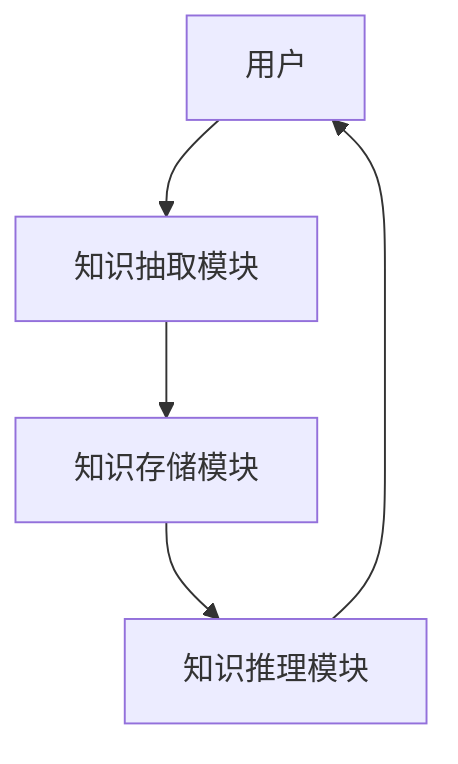
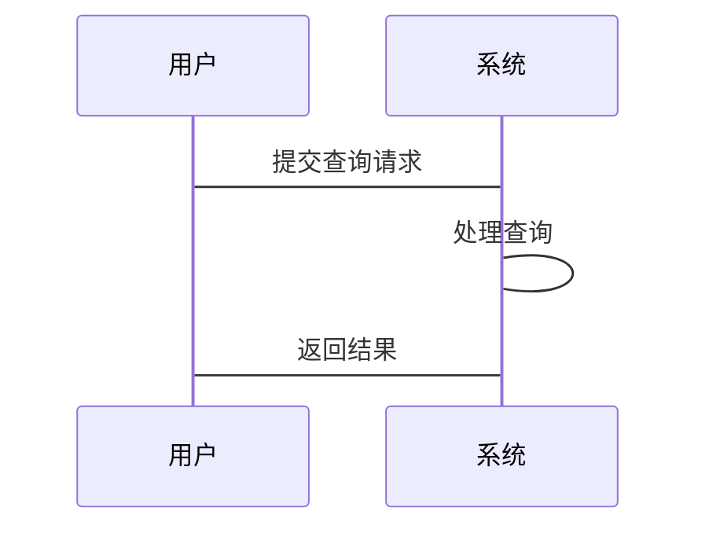

                 


# AI Agent在企业知识管理中的应用

> 关键词：AI Agent, 企业知识管理, 知识图谱, 自然语言处理, 系统架构设计

> 摘要：随着人工智能技术的快速发展，AI Agent（人工智能代理）在企业知识管理中的应用逐渐成为研究热点。本文从AI Agent的基本概念出发，结合知识图谱和自然语言处理技术，详细探讨了AI Agent在企业知识管理中的核心算法、系统架构设计以及实际应用案例。通过分析AI Agent的优势与挑战，本文为企业的知识管理提供了新的思路和解决方案。

---

## 第1章: AI Agent的基本概念与背景

### 1.1 什么是AI Agent

AI Agent（人工智能代理）是指具有感知环境、自主决策和执行任务能力的智能实体。与传统软件不同，AI Agent能够通过传感器或接口获取外部信息，并通过学习和推理做出决策。AI Agent的核心特征包括：

1. **自主性**：能够在没有外部干预的情况下执行任务。
2. **反应性**：能够根据环境变化动态调整行为。
3. **目标导向**：具有明确的目标，并能够优化行动以实现目标。
4. **学习能力**：能够通过数据和经验不断优化自身的性能。

### 1.2 企业知识管理的挑战

企业知识管理（Knowledge Management）是指对企业内外部知识的获取、整理、存储、共享和应用的过程。传统知识管理面临以下挑战：

1. **知识分散**：企业的知识可能分散在不同的部门、文档和系统中，难以统一管理和利用。
2. **知识孤岛**：各部门之间的知识共享不畅，导致知识无法有效流动和应用。
3. **知识更新**：知识的快速变化要求知识管理系统能够实时更新和维护。
4. **知识检索**：在海量知识中快速找到所需信息是一个难点。

### 1.3 AI Agent在企业知识管理中的应用前景

AI Agent通过其智能特性，能够有效解决企业知识管理中的痛点。AI Agent的优势包括：

1. **智能检索**：基于自然语言处理技术，能够准确理解用户需求，并快速检索相关信息。
2. **知识整合**：能够将分散在不同系统中的知识整合到统一的知识图谱中。
3. **动态更新**：通过机器学习算法，能够实时更新知识库，确保知识的准确性。
4. **自动化决策**：在面对复杂问题时，AI Agent能够快速分析并提供决策支持。

---

## 第2章: 知识图谱与自然语言处理

### 2.1 知识图谱的基础

知识图谱是一种以图结构形式表示知识的语义网络。它由节点和边组成，节点代表实体或概念，边代表实体之间的关系。知识图谱的构建过程包括：

1. **知识抽取**：从文本中提取实体、关系和属性。
2. **知识表示**：将抽取的知识表示为结构化的数据，如三元组（头实体，关系，尾实体）。
3. **知识存储**：将知识存储到图数据库中，如Neo4j。

### 2.2 自然语言处理的核心技术

自然语言处理（NLP）是AI Agent实现智能交互的基础技术。其核心技术包括：

1. **分词与词性标注**：将文本分割成词语，并标注词语的词性。
2. **命名实体识别**：识别文本中的专有名词，如人名、地名、组织名。
3. **文本相似度计算**：通过计算文本之间的相似度，实现语义理解。

### 2.3 知识图谱与NLP的结合

知识图谱与NLP的结合能够实现更智能的知识管理。例如，基于知识图谱的问答系统可以通过语义理解快速定位相关信息，并返回准确的答案。

---

## 第3章: AI Agent的算法原理

### 3.1 向量空间模型

向量空间模型是一种基于向量的文本表示方法。其核心思想是将文本表示为向量空间中的点。常用的向量空间模型包括：

1. **词袋模型**：将文本表示为词语的集合，不考虑词语顺序。
2. **TF-IDF**：计算词语在文本中的重要性，用于信息检索。
3. **余弦相似度**：通过计算两个向量的夹角余弦值来衡量文本的相似度。

公式：
$$\text{相似度} = \frac{\vec{A} \cdot \vec{B}}{|\vec{A}| |\vec{B}|}$$

### 3.2 聚类算法

聚类算法是一种无监督学习算法，用于将数据分成若干簇。常用的聚类算法包括：

1. **K-means算法**：将数据分成K个簇，使簇内数据点的相似度最大化。
2. **层次聚类算法**：通过层次化的方式将数据分成簇。
3. **DBSCAN算法**：基于密度的聚类算法，能够发现任意形状的簇。

### 3.3 分类算法

分类算法是一种监督学习算法，用于将数据分类到不同的类别中。常用的分类算法包括：

1. **支持向量机（SVM）**：通过构建超平面将数据分成两类。
2. **随机森林**：通过构建多个决策树，进行投票或平均预测。
3. **神经网络分类**：通过多层感知机进行分类。

---

## 第4章: 系统架构与设计

### 4.1 系统功能设计

AI Agent在企业知识管理中的功能设计包括：

1. **知识抽取模块**：从企业文档中提取实体、关系和属性。
2. **知识存储模块**：将抽取的知识存储到知识图谱中。
3. **知识推理模块**：基于知识图谱进行推理和问答。

### 4.2 系统架构设计

系统架构设计包括：

1. **分层架构设计**：将系统划分为数据层、业务逻辑层和表现层。
2. **微服务架构设计**：将系统功能分解为多个微服务，通过API进行通信。
3. **系统交互流程图**：


### 4.3 接口设计与交互流程

1. **API接口定义**：定义RESTful API接口，如`GET /api/knowledge`。
2. **交互序列图**：


---

## 第5章: 项目实战

### 5.1 环境搭建

1. **安装Python环境**：安装Python 3.8及以上版本。
2. **安装必要的库**：如numpy、scikit-learn、networkx。
3. **配置知识图谱工具**：如Neo4j。

### 5.2 核心代码实现

1. **知识抽取模块实现**：
```python
import spacy

nlp = spacy.load("en_core_web_sm")

def extract_entities(text):
    doc = nlp(text)
    entities = [(ent.text, ent.label_) for ent in doc.ents]
    return entities
```

2. **知识图谱构建**：
```python
from neo4j import GraphDatabase

def create_knowledge_graph(neo4j_uri, neo4j_user, neo4j_password):
    driver = GraphDatabase.driver(neo4j_uri, auth=(neo4j_user, neo4j_password))
    session = driver.session()
    
    # 创建节点和关系
    session.run("CREATE (a:Person {name: 'Alice'})")
    session.run("CREATE (b:Person {name: 'Bob'})")
    session.run("CREATE (a)-[:KNOWS]->(b)")
    
    session.close()
    driver.close()
```

3. **知识推理模块实现**：
```python
import spacy

nlp = spacy.load("en_core_web_sm")

def infer_relationship(text):
    doc = nlp(text)
    relationships = []
    for token in doc:
        if token.dep_ == 'ROOT':
            relationships.append(f"{token.text} {token.lemma_}")
    return relationships
```

---

## 第6章: 总结与最佳实践

### 6.1 总结

AI Agent通过其智能特性，能够有效解决企业知识管理中的痛点。通过知识图谱和自然语言处理技术，AI Agent能够实现知识的智能抽取、存储和推理。

### 6.2 最佳实践

1. **选择合适的工具和框架**：如使用Neo4j构建知识图谱，使用spaCy进行自然语言处理。
2. **注重数据质量**：确保知识抽取的准确性。
3. **优化系统性能**：通过分层架构设计和微服务架构设计，提升系统的可扩展性。

### 6.3 小结

AI Agent在企业知识管理中的应用前景广阔。通过不断的技术创新和实践积累，AI Agent将为企业知识管理提供更智能、更高效的解决方案。

---

作者：AI天才研究院/AI Genius Institute & 禅与计算机程序设计艺术 /Zen And The Art of Computer Programming

