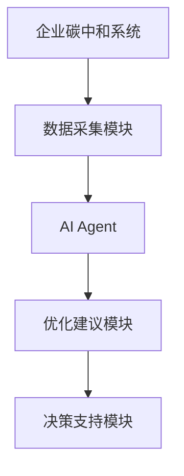

                 


# AI Agent在企业碳中和战略规划与实施中的全面应用

> 关键词：AI Agent，企业碳中和，战略规划，碳排放优化，智能决策支持

> 摘要：随着全球对碳中和目标的广泛关注，企业需要通过智能化手段优化其碳排放策略。本文详细探讨了AI Agent在企业碳中和战略规划与实施中的应用，从核心概念、算法原理、系统架构到实际案例，全面分析了AI Agent如何助力企业实现碳中和目标。文章结构清晰，内容详实，旨在为企业提供理论支持和实践指导。

---

# 第一部分: AI Agent与企业碳中和战略概述

# 第1章: 企业碳中和与AI Agent的背景介绍

## 1.1 什么是碳中和
### 1.1.1 碳中和的定义
碳中和是指通过减少温室气体排放、增加碳汇等方式，使企业在一定时期内产生的二氧化碳排放量与被抵消的碳汇量相等，从而实现净零排放的目标。

### 1.1.2 企业碳中和的目标与意义
企业碳中和的目标是通过优化生产和运营流程，减少碳排放，同时探索绿色能源和可持续发展路径。其意义在于响应全球气候变化挑战，提升企业社会责任形象，同时降低运营成本。

### 1.1.3 碳中和的实现路径与挑战
碳中和的实现路径包括能源结构调整、技术升级、碳交易、碳汇等。然而，企业面临的主要挑战是复杂的碳排放源、动态变化的环境条件以及多目标优化的难度。

## 1.2 AI Agent的基本概念
### 1.2.1 AI Agent的定义
AI Agent是一种能够感知环境、自主决策并采取行动的智能实体，能够在复杂环境中优化目标实现。

### 1.2.2 AI Agent的核心特征
- **智能性**：能够通过学习和推理做出决策。
- **自主性**：无需外部干预，自主执行任务。
- **适应性**：能够根据环境变化调整策略。

### 1.2.3 AI Agent与传统IT系统的主要区别
| 特性       | 传统IT系统                | AI Agent                      |
|------------|---------------------------|-------------------------------|
| 智能性     | 无自主决策能力            | 具备自主决策能力              |
| 学习能力   | 无法自主学习              | 能够通过数据学习和优化        |
| 环境适应性 | 固定功能，无法动态调整     | 能够根据环境变化动态调整策略  |

## 1.3 企业碳中和与AI Agent的结合
### 1.3.1 碳中和战略的复杂性与AI Agent的优势
碳中和战略涉及多部门协作、多目标优化，AI Agent能够通过实时数据处理和智能决策提供最优解决方案。

### 1.3.2 AI Agent在碳中和中的应用场景
- **能源管理**：优化能源使用，减少碳排放。
- **供应链优化**：降低供应链中的碳排放。
- **碳交易支持**：协助企业进行碳交易和碳汇抵消。

### 1.3.3 企业碳中和与AI Agent的未来发展趋势
随着AI技术的不断进步，AI Agent将在企业碳中和中发挥越来越重要的作用，成为企业实现可持续发展的重要工具。

---

# 第2章: 企业碳中和与AI Agent的核心概念与联系

## 2.1 核心概念原理
### 2.1.1 碳中和战略的系统性分析
碳中和战略需要从企业整体运营的角度出发，涵盖生产、供应链、能源使用等多个方面。

### 2.1.2 AI Agent在碳中和中的功能定位
AI Agent作为碳中和战略的执行者，负责实时监控碳排放数据，优化策略并提供决策支持。

### 2.1.3 企业碳中和与AI Agent的协同机制
通过数据共享和实时交互，AI Agent与企业系统协同工作，实现碳排放的动态优化。

## 2.2 核心概念属性特征对比表格
| 概念       | 属性特征                     |
|------------|------------------------------|
| 碳中和战略 | 系统性、长期性、全局性         |
| AI Agent   | 智能性、自主性、适应性         |

## 2.3 ER实体关系图（Mermaid）
```mermaid
erDiagram
    actor 企业碳中和战略规划系统{}{
        id 碳中和目标
        string 碳排放数据
        string 优化策略
    }
    actor AI Agent{}{
        id 系统ID
        string 状态
        string 行动策略
    }
    企业碳中和战略规划系统 --> AI Agent: 提供碳排放数据
    AI Agent --> 企业碳中和战略规划系统: 提供优化建议
```

---

# 第3章: AI Agent在企业碳中和中的算法原理

## 3.1 强化学习算法
### 3.1.1 强化学习的基本原理
强化学习通过智能体与环境的交互，学习最优策略以最大化累积奖励。

### 3.1.2 在碳中和优化中的应用
AI Agent通过强化学习优化能源使用策略，减少碳排放。

### 3.1.3 算法数学模型
$$
Q(s, a) = r + \gamma \max_{a'} Q(s', a')
$$
其中，$Q$ 是价值函数，$s$ 是状态，$a$ 是动作，$\gamma$ 是折扣因子。

---

## 3.2 图神经网络
### 3.2.1 图神经网络的基本原理
图神经网络通过处理图结构数据，发现复杂关系。

### 3.2.2 在碳中和中的应用
用于优化供应链网络，减少碳排放。

### 3.2.3 算法数学模型
$$
Z = G \cdot A \cdot G^T
$$
其中，$G$ 是图的邻接矩阵，$A$ 是节点特征矩阵。

---

## 3.3 优化算法
### 3.3.1 优化算法的基本原理
通过数学优化方法寻找最优解。

### 3.3.2 在碳中和中的应用
优化能源分配，降低碳排放。

### 3.3.3 算法数学模型
$$
\min_{x} f(x) \quad \text{subject to} \quad g(x) \leq 0
$$

---

# 第4章: 系统分析与架构设计

## 4.1 系统分析
### 4.1.1 问题场景介绍
企业需要优化碳排放，同时平衡成本和效率。

## 4.2 系统功能设计
### 4.2.1 功能模块
- 数据采集模块
- 优化建议模块
- 决策支持模块

## 4.3 系统架构设计
### 4.3.1 系统架构图（Mermaid）


---

# 第5章: 项目实战

## 5.1 环境配置
### 5.1.1 环境要求
- Python 3.8+
- TensorFlow 2.0+

## 5.2 核心实现代码
### 5.2.1 强化学习代码实现
```python
import numpy as np

class AI_Agent:
    def __init__(self, state_space, action_space):
        self.state_space = state_space
        self.action_space = action_space
        self.Q = np.zeros((state_space, action_space))

    def take_action(self, state):
        return np.argmax(self.Q[state, :])
```

---

# 第6章: 最佳实践与总结

## 6.1 最佳实践
- 定期更新模型
- 结合企业实际需求

## 6.2 总结
AI Agent在企业碳中和中的应用前景广阔，能够显著提升企业的碳管理能力。

---

作者：AI天才研究院/AI Genius Institute & 禅与计算机程序设计艺术 /Zen And The Art of Computer Programming

