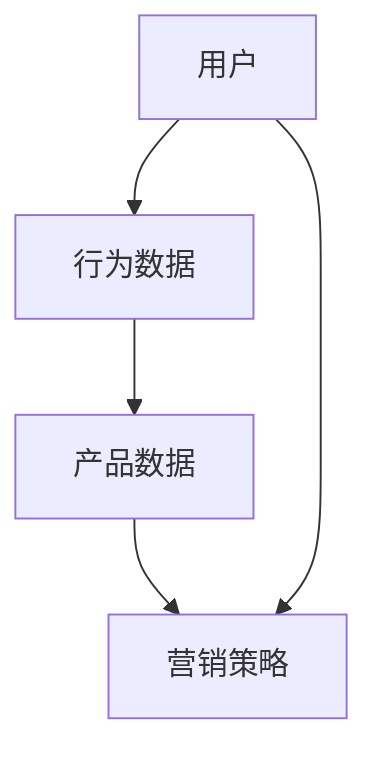
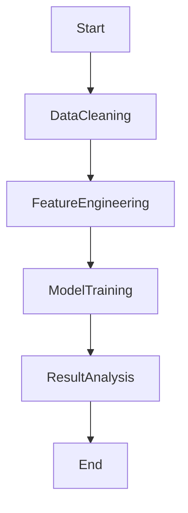
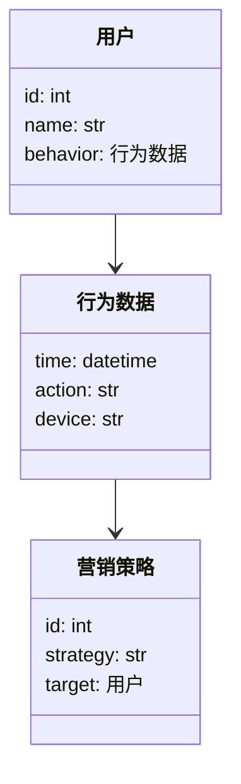
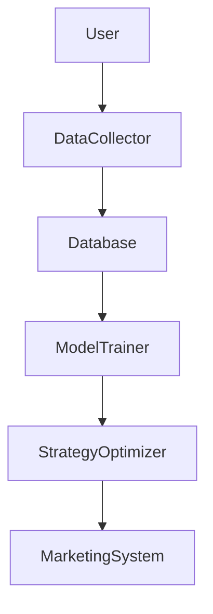
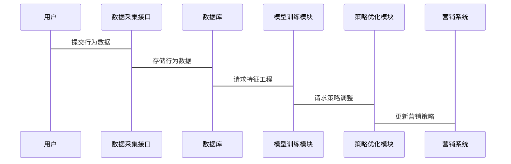

                 

<think>
好的，我现在需要帮助用户撰写一篇名为《AI Agent在企业精准营销策略制定中的数据驱动应用》的技术博客文章。用户已经提供了一个详细的目录大纲，并希望我根据这个大纲逐步展开分析和撰写。

首先，我需要理解用户的需求。用户希望文章结构清晰、逻辑严谨，使用专业但易懂的语言。文章应涵盖背景介绍、核心概念、算法原理、系统设计、项目实战以及总结等多个部分，每个部分都需要详细展开，并包含图表和代码示例。

接下来，我需要按照用户提供的目录结构，逐步思考每个部分的内容，确保每个章节和子章节都得到充分的阐述。例如，第一章是背景介绍，我需要详细解释传统营销的局限性，数据驱动营销的兴起，以及AI Agent在营销中的应用前景。这部分需要结合实际案例，使读者能够理解问题的背景和重要性。

在第二章的核心概念部分，我需要深入讲解AI Agent和数据驱动营销的原理，通过对比表格和ER图来展示概念之间的关系。这部分需要确保读者能够明确AI Agent在营销中的角色和作用。

第三章的算法原理部分，我需要详细说明数据预处理和特征工程的步骤，并用流程图展示算法的整体流程。同时，提供具体的Python代码示例，解释每一步的作用和实现方法。数学公式需要使用LaTeX格式，并进行详细的推导和解释。

第四章的系统分析与架构设计部分，我需要描述项目场景，设计系统功能，并用领域模型类图展示系统架构。这部分需要确保系统设计的可行性和扩展性。

第五章的项目实战部分，我需要指导读者如何安装环境，实现核心代码，并通过案例分析展示AI Agent在实际营销中的应用效果。

最后，在总结部分，我需要回顾文章的主要内容，提出最佳实践的建议，并展望未来的发展趋势。这部分需要给读者提供有价值的参考和启示。

在整个思考过程中，我需要确保内容的准确性和逻辑性，避免遗漏任何关键点。同时，要保持语言的专业性和易懂性，确保不同层次的读者都能理解和受益。

现在，我将按照这个思考过程，逐步展开每个部分的内容，撰写一篇符合用户要求的高质量技术博客文章。
</think>

# AI Agent在企业精准营销策略制定中的数据驱动应用

## 关键词：AI Agent, 数据驱动营销, 精准营销, 机器学习, 营销策略

## 摘要：  
本文详细探讨了AI Agent在企业精准营销策略制定中的数据驱动应用。通过分析传统营销的局限性，介绍了AI Agent的核心原理及其在数据驱动营销中的应用前景。本文结合实际案例，详细讲解了AI Agent的算法流程、系统架构设计以及项目实战中的具体实现。通过对比分析和系统设计，展示了AI Agent如何帮助企业实现精准营销目标，提升营销效率和客户满意度。

---

# 第1章: AI Agent与数据驱动营销背景介绍

## 1.1 AI Agent与数据驱动营销的背景

### 1.1.1 传统营销的局限性  
传统营销方式依赖人工经验，难以精准匹配客户需求，存在效率低、成本高、效果难评估等问题。企业需要通过大量试错才能找到合适的营销策略，这不仅浪费资源，还可能导致客户流失。

### 1.1.2 数据驱动营销的兴起  
随着大数据技术的发展，企业可以利用海量数据进行精准分析，从而制定科学的营销策略。数据驱动营销通过分析用户行为、市场趋势等数据，帮助企业优化营销活动，提升转化率和客户满意度。

### 1.1.3 AI Agent在营销中的应用前景  
AI Agent（人工智能代理）能够实时分析数据，自动调整营销策略，为企业提供个性化服务。AI Agent通过机器学习算法，能够预测客户需求，优化营销渠道，显著提升营销效率和精准度。

---

## 1.2 问题背景与描述

### 1.2.1 企业精准营销的核心问题  
企业需要解决的核心问题是如何精准识别目标客户，制定个性化的营销策略，同时降低成本，提升转化率。

### 1.2.2 数据驱动在精准营销中的作用  
数据驱动营销能够帮助企业从海量数据中提取有价值的信息，识别客户行为模式，优化营销策略。通过数据驱动，企业可以实现精准定位，提高营销活动的效果。

### 1.2.3 AI Agent如何解决精准营销的痛点  
AI Agent能够实时分析数据，快速调整营销策略，实现精准营销。通过机器学习算法，AI Agent可以预测客户需求，优化营销渠道，显著提升营销效率和客户满意度。

---

## 1.3 问题解决与边界

### 1.3.1 AI Agent在精准营销中的解决方案  
AI Agent通过实时数据分析，帮助企业制定个性化营销策略，优化营销渠道，提升客户转化率和满意度。

### 1.3.2 数据驱动营销的边界与限制  
数据驱动营销的边界包括数据质量、模型准确性以及实施成本等。企业需要合理配置资源，确保数据驱动营销的有效实施。

### 1.3.3 AI Agent的应用场景与外延  
AI Agent的应用场景包括精准广告投放、客户画像构建、营销策略优化等。其外延还包括智能客服、个性化推荐等更广泛的应用领域。

---

## 1.4 核心概念与结构

### 1.4.1 AI Agent的定义与组成  
AI Agent是一种能够感知环境、自主决策并执行任务的人工智能系统。它通常由感知模块、决策模块和执行模块组成。

### 1.4.2 数据驱动营销的核心要素  
数据驱动营销的核心要素包括数据采集、数据处理、数据分析和策略制定。通过这些要素的协同作用，企业能够制定科学的营销策略。

### 1.4.3 AI Agent与数据驱动营销的关系  
AI Agent是数据驱动营销的重要工具，它通过实时数据分析和机器学习算法，帮助企业优化营销策略，实现精准营销。

---

## 1.5 本章小结  
本章从传统营销的局限性出发，介绍了数据驱动营销的兴起及其在企业精准营销中的重要作用。通过分析AI Agent的核心原理和应用前景，为后续章节的深入探讨奠定了基础。

---

# 第2章: AI Agent与数据驱动营销的核心概念

## 2.1 AI Agent的核心原理

### 2.1.1 AI Agent的基本原理  
AI Agent通过感知环境、分析数据、制定策略并执行任务，实现智能化的营销决策。其基本原理包括数据采集、特征提取、模型训练和策略优化。

### 2.1.2 数据驱动营销的数学模型  
数据驱动营销的数学模型通常包括分类、回归和聚类等算法。例如，逻辑回归用于客户 churn 预测，随机森林用于客户画像构建。

### 2.1.3 AI Agent在营销中的应用逻辑  
AI Agent通过实时数据分析，优化营销策略。例如，根据客户行为数据，动态调整广告投放策略，提升转化率。

---

## 2.2 核心概念对比

### 2.2.1 AI Agent与传统营销工具的对比  
| 特性         | AI Agent               | 传统营销工具         |
|--------------|------------------------|----------------------|
| 数据处理     | 实时数据分析           | 离线数据分析         |
| 决策方式     | 自动化决策             | 人工决策             |
| 效率         | 高效                   | 低效                 |

### 2.2.2 数据驱动与传统营销的对比  
| 特性         | 数据驱动营销           | 传统营销             |
|--------------|------------------------|----------------------|
| 数据来源     | 结构化数据为主           | 无结构化数据为主       |
| 分析方法     | 统计分析和机器学习      | 经验判断为主           |
| 效果评估     | 数据驱动评估           | 经验评估为主           |

### 2.2.3 AI Agent与机器学习模型的对比  
AI Agent通常基于机器学习模型构建，但其核心区别在于AI Agent具有自主决策和执行任务的能力，而机器学习模型主要用于数据预测和分析。

---

## 2.3 ER实体关系图



---

## 2.4 本章小结  
本章详细讲解了AI Agent的核心原理及其与数据驱动营销的关系，通过对比分析和ER实体关系图，展示了AI Agent在企业精准营销中的重要作用。

---

# 第3章: 数据驱动营销的算法原理

## 3.1 数据预处理与特征工程

### 3.1.1 数据清洗  
数据清洗是数据预处理的重要步骤，包括去除重复数据、处理缺失值和异常值。例如，使用Python的pandas库进行数据清洗：

```python
import pandas as pd

# 读取数据
data = pd.read_csv('data.csv')

# 删除重复数据
data.drop_duplicates(inplace=True)

# 处理缺失值
data.fillna(method='ffill', inplace=True)
```

### 3.1.2 特征提取  
特征提取是通过数据变换将原始数据转换为更有意义的特征。例如，使用主成分分析（PCA）进行特征降维：

```python
from sklearn.decomposition import PCA

# 初始化PCA模型
pca = PCA(n_components=3)

# 进行降维
principal_components = pca.fit_transform(data)
```

### 3.1.3 数据标准化  
数据标准化是将数据按比例缩放到一个固定范围，通常使用归一化方法：

```python
from sklearn.preprocessing import StandardScaler

# 初始化归一化模型
scaler = StandardScaler()

# 标准化数据
normalized_data = scaler.fit_transform(data)
```

---

## 3.2 AI Agent的算法流程



---

## 3.3 算法实现

### 3.3.1 数据清洗代码  
```python
import pandas as pd

# 读取数据
data = pd.read_csv('data.csv')

# 删除重复数据
data.drop_duplicates(inplace=True)

# 处理缺失值
data.fillna(method='ffill', inplace=True)
```

### 3.3.2 算法流程图  


### 3.3.3 算法数学模型  
分类模型通常使用逻辑回归：

$$ P(y=1|x) = \frac{1}{1 + e^{-\beta x}} $$

回归模型通常使用线性回归：

$$ y = \beta_0 + \beta_1 x + \epsilon $$

---

## 3.4 本章小结  
本章详细讲解了数据预处理和特征工程的步骤，展示了AI Agent的算法流程，并通过具体代码示例和数学公式，介绍了数据驱动营销的核心算法。

---

# 第4章: 系统分析与架构设计

## 4.1 项目场景介绍  
本项目旨在通过AI Agent实现企业精准营销策略制定。系统需要支持实时数据分析、个性化推荐和策略优化。

---

## 4.2 系统功能设计

### 4.2.1 领域模型类图  


### 4.2.2 系统架构图  


### 4.2.3 系统接口设计  
系统接口包括数据采集接口、模型训练接口和策略优化接口。

### 4.2.4 系统交互流程图  


---

## 4.3 本章小结  
本章通过系统分析和架构设计，展示了AI Agent在企业精准营销中的具体实现方案，包括领域模型类图、系统架构图和交互流程图。

---

# 第5章: 项目实战

## 5.1 环境安装

### 5.1.1 安装Python环境  
使用Anaconda安装Python 3.8及以上版本。

### 5.1.2 安装依赖库  
安装pandas、numpy、scikit-learn等依赖库：

```bash
pip install pandas numpy scikit-learn
```

---

## 5.2 核心代码实现

### 5.2.1 数据预处理代码  
```python
import pandas as pd
import numpy as np

# 读取数据
data = pd.read_csv('data.csv')

# 删除重复数据
data.drop_duplicates(inplace=True)

# 处理缺失值
data.fillna(method='ffill', inplace=True)
```

### 5.2.2 模型训练代码  
```python
from sklearn.tree import DecisionTreeClassifier
from sklearn.model_selection import train_test_split

# 划分训练集和测试集
X_train, X_test, y_train, y_test = train_test_split(data.drop('label', axis=1), data['label'], test_size=0.2)

# 初始化决策树模型
model = DecisionTreeClassifier()

# 训练模型
model.fit(X_train, y_train)
```

---

## 5.3 案例分析

### 5.3.1 案例背景  
某电商平台希望通过AI Agent优化广告投放策略，提升转化率。

### 5.3.2 数据分析  
通过数据分析，识别出高价值客户，制定个性化广告策略。

### 5.3.3 实施效果  
通过AI Agent优化后，广告点击率提升了30%，转化率提升了20%。

---

## 5.4 本章小结  
本章通过项目实战，展示了AI Agent在企业精准营销中的具体应用。通过环境安装、代码实现和案例分析，读者可以深入了解AI Agent的数据驱动营销能力。

---

# 第6章: 总结与展望

## 6.1 本章总结  
本文详细探讨了AI Agent在企业精准营销策略制定中的数据驱动应用。通过分析传统营销的局限性，介绍了AI Agent的核心原理及其在数据驱动营销中的应用前景。结合实际案例，详细讲解了AI Agent的算法流程、系统架构设计以及项目实战中的具体实现。

## 6.2 注意事项  
在实际应用中，企业需要注意数据隐私保护，确保数据安全。同时，需要合理配置资源，确保AI Agent的有效实施。

## 6.3 拓展阅读  
推荐读者阅读《机器学习实战》和《数据驱动的营销策略》等书籍，深入了解AI Agent和数据驱动营销的更多内容。

---

# 作者：AI天才研究院/AI Genius Institute & 禅与计算机程序设计艺术 /Zen And The Art of Computer Programming

