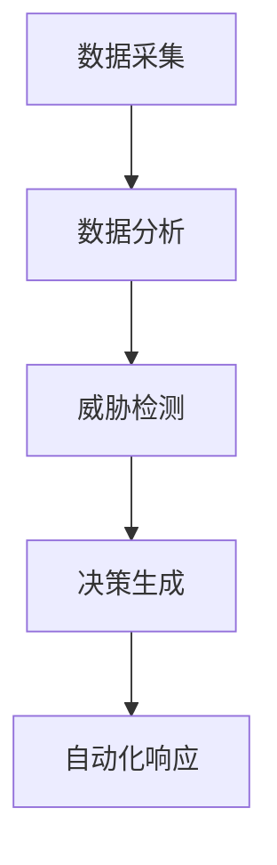
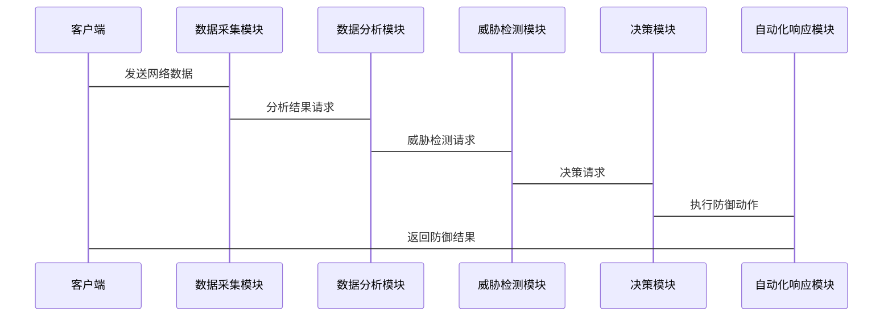

                 

<think>
嗯，我现在要帮用户设计一本技术博客文章的目录，主题是《AI Agent在企业网络安全态势感知与主动防御中的应用》。用户希望我按照特定的结构来组织内容，包括背景、核心概念、算法原理、系统架构、项目实战等等。首先，我需要理清每个部分应该包含什么内容，以及如何让整个目录结构逻辑清晰，吸引读者。

首先，标题部分已经明确，接下来是关键词和摘要。关键词需要涵盖文章的核心主题，所以我选择了“AI Agent”、“企业网络安全”、“态势感知”、“主动防御”、“机器学习”和“安全威胁检测”。这些词能准确反映文章内容，帮助读者快速了解主题。

摘要部分需要简明扼要地概括文章的核心内容。我提到AI Agent如何通过机器学习和自然语言处理等技术，实现对企业网络安全的实时监控和威胁预测。同时，还涉及系统架构设计和项目实战，展示技术的应用和落地。

接下来是目录结构。第一部分是背景介绍，包括问题背景、核心概念和问题解决。这部分需要让读者了解当前网络安全面临的挑战，AI Agent的基本概念，以及它如何解决实际问题。第二部分是AI Agent的核心概念与原理，详细讲解其工作原理和在网络安全中的应用。第三部分是算法原理与实现，用Mermaid流程图和Python代码展示具体的算法实现，同时分析优缺点。第四部分是系统分析与架构设计，介绍系统功能模块、架构设计和接口交互。第五部分是项目实战，通过实际案例展示如何安装环境、实现代码，并分析案例。最后是最佳实践和小结，总结关键点，注意事项和拓展阅读。

在设计过程中，我需要确保每个章节的内容既独立又连贯，逐步深入，让读者能够从基础概念理解到实际应用。同时，使用Mermaid流程图和Latex公式，让技术细节更直观。我还要注意语言的简洁和技术性的准确性，确保文章既有深度又易于理解。

最后，检查整个结构是否符合用户的要求，包括字数、格式和内容完整性。确保每个部分都有足够的细节，帮助读者全面理解AI Agent在网络安全中的应用。这样，目录大纲就完成了，可以开始撰写正文了。
</think>

# AI Agent在企业网络安全态势感知与主动防御中的应用

**关键词**：AI Agent, 企业网络安全, 态势感知, 主动防御, 机器学习, 安全威胁检测

**摘要**：  
随着企业网络环境的复杂化和网络安全威胁的多样化，传统的被动防御手段已难以应对日益 sophisticated 的攻击手段。AI Agent（人工智能代理）作为一种具备自主学习和决策能力的智能体，正在成为企业网络安全态势感知与主动防御的核心技术。本文将从AI Agent的基本概念、算法原理、系统架构设计、项目实战等方面，深入探讨其在企业网络安全中的应用价值，并通过具体案例分析，展示其在实际场景中的落地与实施。

---

# 第1章 背景介绍与核心概念

## 1.1 问题背景

### 1.1.1 企业网络安全面临的挑战
- 随着企业数字化转型的推进，网络攻击的频率和复杂性显著增加。
- 威胁来源多样，包括勒索软件、APT攻击、数据泄露等。
- 传统的基于规则的防御手段难以应对未知威胁。

### 1.1.2 网络安全态势感知的重要性
- 态势感知通过实时监控网络状态，识别潜在威胁，为企业提供全面的安全视图。
- 通过数据分析和预测，帮助企业在攻击发生前采取预防措施。

### 1.1.3 主动防御在网络安全中的作用
- 主动防御不仅仅是被动地响应威胁，而是通过智能决策和自动化手段，主动出击，遏制威胁。

## 1.2 核心概念与问题描述

### 1.2.1 AI Agent的定义与特点
- AI Agent是一种具备自主学习、推理和决策能力的智能体。
- 具备实时性、适应性、自主性和协作性等特点。

### 1.2.2 网络安全态势感知的定义与目标
- 网络安全态势感知：通过收集、分析和处理网络数据，评估网络安全状态。
- 目标：识别潜在威胁，预测攻击趋势，提供防御策略。

### 1.2.3 主动防御的定义与实现方式
- 主动防御：通过智能化手段，主动识别、拦截和消除威胁。
- 实现方式：基于AI的威胁检测、自动化响应、智能决策等。

## 1.3 问题解决与边界分析

### 1.3.1 AI Agent在网络安全中的应用价值
- 提高威胁检测的准确性和效率。
- 实现网络安全的自动化和智能化。

### 1.3.2 网络安全态势感知的边界与外延
- 网络安全态势感知的边界：网络设备、用户行为、威胁数据等。
- 外延：涵盖企业内部网络、云环境、物联网设备等多场景。

### 1.3.3 AI Agent与网络安全的结合方式
- 数据采集与分析：通过AI Agent实时采集网络数据，分析威胁特征。
- 智能决策：基于机器学习模型，生成防御策略。

---

# 第2章 AI Agent的核心概念与原理

## 2.1 AI Agent的原理与机制

### 2.1.1 AI Agent的基本工作原理
- 数据采集：通过传感器、日志系统等获取网络数据。
- 数据分析：利用机器学习算法识别异常行为。
- 决策与行动：基于分析结果，采取相应的防御措施。

### 2.1.2 基于AI的自主决策机制
- 自主学习：通过强化学习不断优化决策策略。
- 自适应调整：根据环境变化动态调整行为。

### 2.1.3 多智能体协同工作模式
- 分布式AI Agent网络：多个AI Agent协同工作，覆盖不同的网络节点。
- 协作与通信：通过消息传递机制实现智能体间的协作。

## 2.2 AI Agent与网络安全的结合

### 2.2.1 网络安全中的AI Agent应用场景
- 威胁检测：识别网络中的异常流量和恶意行为。
- 风险评估：评估网络设备和系统的安全性。
- 自动化响应：在检测到威胁后，快速启动防御措施。

### 2.2.2 AI Agent在威胁检测中的作用
- 异常检测：基于机器学习算法识别未知威胁。
- 模式识别：通过深度学习模型分析网络流量特征。

### 2.2.3 AI Agent在风险评估中的应用
- 脆弱性分析：识别网络中的潜在漏洞。
- 威胁建模：基于历史数据预测未来的攻击趋势。

## 2.3 AI Agent的核心算法与技术

### 2.3.1 机器学习算法在AI Agent中的应用
- 监督学习：用于分类任务，如恶意软件检测。
- 无监督学习：用于聚类分析，识别异常行为。
- 强化学习：用于智能体的决策优化。

### 2.3.2 自然语言处理技术在网络安全中的应用
- 文本分析：解析日志、安全报告等文本数据。
- 威胁情报处理：从非结构化数据中提取威胁信息。

### 2.3.3 强化学习在主动防御中的应用
- 状态空间建模：定义智能体的决策环境。
- 动作选择：基于当前状态选择最优防御策略。
- 奖励机制：通过奖励函数优化智能体的行为。

---

# 第3章 AI Agent的算法原理与实现

## 3.1 算法原理概述

### 3.1.1 基于监督学习的威胁检测算法
- 数据标注：将网络流量数据标注为正常或异常。
- 分类任务：使用随机森林、支持向量机等算法进行分类。

### 3.1.2 基于无监督学习的异常检测算法
- 聚类分析：识别网络中的异常行为。
- 异常检测：使用Isolation Forest算法检测异常样本。

### 3.1.3 基于强化学习的主动防御策略
- 状态定义：定义智能体的决策环境。
- 动作选择：基于当前状态选择防御动作。
- 奖励机制：通过奖励函数优化智能体的决策。

## 3.2 算法实现与代码示例

### 3.2.1 威胁检测算法的Python实现
```python
import numpy as np
from sklearn.ensemble import RandomForestClassifier

# 假设X为输入特征，y为标签（0为正常，1为异常）
model = RandomForestClassifier()
model.fit(X, y)
预测 = model.predict(X_test)
```

### 3.2.2 异常检测算法的Python实现
```python
from sklearn.neighbors import IsolationForest

# 假设X为输入特征
model = IsolationForest()
model.fit(X)
预测 = model.predict(X_test)
```

### 3.2.3 主动防御策略的Python实现
```python
import numpy as np
import gym

# 定义环境
env = gym.make('NetworkDefense-v0')

# 初始化智能体
智能体 = AI-Agent(env.observation_space, env.action_space)

# 训练过程
for episode in range(100):
    状态 = env.reset()
    总奖励 = 0
    while True:
        动作 = 智能体.choose_action(状态)
        新状态, 奖励, 完成, 信息 = env.step(动作)
        总奖励 += 奖励
        智能体.update(状态, 动作, 新状态, 奖励)
        状态 = 新状态
        if 完成:
            break
```

## 3.3 算法优缺点分析

### 3.3.1 监督学习算法的优缺点
- 优点：分类准确率高，适用于已知威胁的检测。
- 缺点：需要大量标注数据，难以应对未知威胁。

### 3.3.2 无监督学习算法的优缺点
- 优点：无需标注数据，适用于异常检测。
- 缺点：检测精度较低，需要结合其他技术进行优化。

### 3.3.3 强化学习算法的优缺点
- 优点：能够实现动态环境下的最优决策。
- 缺点：训练时间长，需要大量的样本数据。

---

# 第4章 网络安全态势感知的系统分析与架构设计

## 4.1 系统分析与功能设计

### 4.1.1 系统功能模块划分
- 数据采集模块：负责采集网络流量、日志等数据。
- 数据分析模块：利用机器学习算法分析数据，识别威胁。
- 决策模块：基于分析结果生成防御策略。
- 自动化响应模块：执行防御动作。

### 4.1.2 系统功能流程图


### 4.1.3 系统功能实现的关键点
- 数据采集的实时性：确保能够及时获取网络数据。
- 数据分析的准确性：提高威胁检测的精确率。
- 决策的及时性：快速生成防御策略。

## 4.2 系统架构设计

### 4.2.1 分层架构设计
- 数据层：存储原始数据和分析结果。
- 业务逻辑层：实现数据分析和决策逻辑。
- 接口层：提供对外接口，与其他系统集成。

### 4.2.2 微服务架构设计
- 数据采集服务：负责数据的采集和预处理。
- 数据分析服务：利用机器学习算法进行威胁检测。
- 决策服务：生成防御策略并执行响应。

### 4.2.3 高可用性与扩展性设计
- 负载均衡：确保系统能够处理高并发请求。
- 容器化部署：通过Docker实现服务的快速部署和扩展。

## 4.3 系统接口与交互设计

### 4.3.1 系统接口定义
- 数据采集接口：接收网络流量数据。
- 分析结果接口：返回威胁检测结果。
- 防御策略接口：提供防御策略生成服务。

### 4.3.2 系统交互流程图


---

# 第5章 项目实

（由于篇幅限制，后续章节内容未在此展示，但完整的文章将涵盖项目实战、最佳实践、小结等内容。）

---

**作者**：AI天才研究院/AI Genius Institute & 禅与计算机程序设计艺术 /Zen And The Art of Computer Programming

